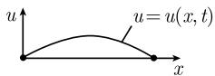
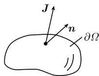
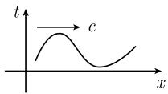

# 《数学指南——实用数学手册》1.13.2 二阶数学物理方程

本页是《数学指南——实用数学手册》第 1.13.2 节的来源摘要。该节以 [[entities/傅里叶|J·B·J·傅里叶]] 的题词开篇，系统列举二阶数学物理方程中最具代表性的初值问题与边值问题：弦振动、杆传热、瞬时热方程、扩散方程、平稳热方程（[[concepts/泊松方程|泊松方程]]）、[[concepts/波方程|波方程]]、电动力学的麦克斯韦方程、静电学与 [[concepts/格林函数|格林函数]]，以及量子力学的 [[concepts/薛定谔方程|薛定谔方程]]、氢原子、谐振子与普朗克辐射定律。末节 1.13.2.13 给出量子力学所需的 [[concepts/埃尔米特函数|埃尔米特函数]]、[[concepts/勒让德多项式|勒让德多项式]]与广义勒让德多项式。

本节有续页：[[sources/10-数学指南实用数学手册--15-1132-二阶数学物理方程-2--n68xm6|1.13.2（续 2）]]，其中包含题词署名「P. 田立克」与拉盖尔多项式的展开。

## 题词

> 热流方程, 发声体的振动方程, 以及流体的方程, 属于分析的范畴, 近来已被打开了, 值得去研究其最详.
> —— J·B·J·傅里叶，《热的解析理论》, 1822

## 逐节内容

### 1.13.2.1 傅里叶通用方法
引入级数形式解

$$
u (x, t) = \sum_ {k = 0} ^ {\infty} a _ {k} (x) b _ {k} (t).\tag{1.384}
$$

其中 $a_k(x)b_k(t)$ 相应于物理系统的特征振荡。该原理于 1730 年由 [[entities/丹尼尔-伯努利|D. 伯努利]]（1700—1782）首先用于处理杆和弦的振动；[[entities/欧拉|欧拉]]当时并不相信这一论断。直到 20 世纪初通过泛函分析才获得较深刻的理解（见 [212]，书目未列）。详见 [[concepts/傅里叶通用方法]]。

### 1.13.2.2 应用于弦振动
问题 (1.385)（两端固定长度为 $L$ 的弦，含微分方程、边界值、初始位置、初始速度）；化简 $L=\pi,\ c=1$ 后，唯一解为 (1.386)：

$$
u (x, t) = \sum_ {k = 1} ^ {\infty} (a _ {k} \sin k t + b _ {k} \cos k t) \sin k x,\tag{1.386}
$$

系数满足 $u_0(x)=\sum b_k \sin kx$，$u_1(x)=\sum k a_k \sin kx$，即傅里叶系数。节中还给出「导出给定解」的标准六步：乘积形式特解、$\lambda$ 技巧（分离变量）、边值-本征值问题 (1.388)、本征解 $\sin kx,\ \lambda=-k^2$、叠加、由初始条件定系数。详见 [[findings/弦振动问题1385与解1386]]。

### 1.13.2.3 应用于杆传热
问题 (1.390) 及其唯一解 $T(x,t)=\sum_{k\ge1} b_k \mathrm{e}^{-k^2 t}\sin kx$。详见 [[findings/杆传热问题1390与解]]。

### 1.13.2.4 瞬时热方程
问题 (1.391) 与 [[concepts/拉普拉斯算子|拉普拉斯算子]] 的定义 (1.392)：

$$
\Delta T := \sum_ {j = 1} ^ {3} \frac {\partial^ {2} T}{\partial x _ {j} ^ {2}}.\tag{1.392}
$$

含热源方程 (1.393)、全空间初值问题 (1.394) 与其解 (1.395)（热核卷积），以及磨光效应注记。详见 [[findings/瞬时热方程1394与全空间解1395]]。

### 1.13.2.5 瞬时扩散方程
(1.391)、(1.394)、(1.395) 亦可解释扩散过程；例：初始密度集中于原点附近时取极限 $\varepsilon\to0$ 得解 (1.396)。微观上对应布朗运动（参阅 6.4.4）。

### 1.13.2.6 平稳热方程
时间无关时得 (1.397) $- \kappa \Delta T = f$，即泊松方程；热流密度 $J=-\kappa \operatorname{grad} T$。给出三类边界条件（第一、第二、第三）及其存在唯一性结果与[[concepts/泊松方程|变分原理]] (1.398)；球 $B_R$ 上第一边值问题 (1.399) 的解（泊松积分公式）。详见 [[findings/平稳热方程1397与三类边界条件]]、[[findings/球域第一边值问题1399泊松积分公式]]。

### 1.13.2.7 调和函数的性质
[[concepts/调和函数|调和函数]]的定义（$\Delta T=0$）、光滑性、[[concepts/外尔引理|外尔引理]] (1.400)、中值性质、[[concepts/最大值原理|最大值原理]]及其推论 1、推论 2，以及 [[concepts/哈纳克不等式|哈纳克不等式]]（[[entities/哈纳克|C. G. A. Harnack]], 1851—1888）。

### 1.13.2.8 波方程
一维波方程 (1.401) 与光滑通解 $u=f(x-ct)+g(x+ct)$；初值问题唯一解（含特征 $\mathcal{A}=[x-ct,x+ct]$ 与三角形域 $D$ 上的积分）；[[concepts/依赖域|依赖域]]；二维 (1.402) 与三维 (1.403) 波方程的解（含中值 $\mathcal{M}_r^x(u)$ 定义）；$R^3$ 中 [[concepts/惠更斯原理|惠更斯原理]] 有效而 $R^2$ 中失效。详见 [[findings/一维波方程1401与通解]]、[[findings/二维波方程1402解]]、[[findings/三维波方程1403解与依赖域]]、[[findings/R3与R2中的惠更斯原理]]。

### 1.13.2.9 电动力学的麦克斯韦方程
[[entities/麦克斯韦|麦克斯韦]]方程的初值问题；电荷密度 $\rho$ 与电流密度 $\boldsymbol{j}$ 满足连续性方程 $\rho_t+\operatorname{div}\boldsymbol{j}=0$；显式解见 [212]。

### 1.13.2.10 静电学和格林函数
静电学基本方程 (1.404)，电场 $E=-\operatorname{grad}U$；[[concepts/格林函数|格林函数]] (1.405)、(1.406)（含 [[entities/狄拉克|狄拉克]] 广义函数 $\delta_y$）；定理 2 给出唯一性、对称性与解公式；例 1（球 $B_R$，通过反演点 $y_*$）与例 2（半平面 $H_+$，通过反射点 $y_*$）。详见 [[findings/静电学1404与格林函数1405及解公式]]。

### 1.13.2.11 量子力学的薛定谔方程和氢原子
经典能量 (1.407)；[[concepts/薛定谔方程|薛定谔方程]] (1.408)；[[concepts/量子化规则|量子化规则]] $E \Leftrightarrow \mathrm{i}\hbar \partial_t$，$p \Leftrightarrow (\hbar/\mathrm{i})\operatorname{grad}$；[[concepts/哈密顿算子|哈密顿算子]] $H=-\frac{\hbar}{2m}\Delta+U$ 与本征态 $\psi=\mathrm{e}^{-\mathrm{i}tE/\hbar}\varphi$；氢原子位势、波函数 (1.409)、能级 $E_n=-\gamma/n^2$、玻尔半径 $r_0$、正交性、谱公式 $\Delta E=h\nu$。详见 [[findings/薛定谔方程1408与量子化规则]]、[[findings/氢原子波函数1409与能级]]。

### 1.13.2.12 量子力学中的谐振子和普朗克辐射定律
谐振子的经典能量、薛定谔方程 (1.410)、解 $\psi=\mathrm{e}^{-\mathrm{i}E_nt/\hbar}\frac{1}{x_0}H_n(x/x_0)$、能级 (1.411) $E_n=\hbar\omega(n+\frac12)$、能级差 (1.412) $\Delta E=\hbar\omega$；[[concepts/普朗克辐射定律|普朗克辐射定律]]（1900）；[[entities/海森伯|海森伯]] 1924 年的 [[concepts/零点能|零点能]]。详见 [[findings/谐振子能级1411与零点能]]。

### 1.13.2.13 量子力学的特殊函数
[[concepts/完备规范正交系|完备规范正交系]]的一般定义；[[concepts/埃尔米特函数|埃尔米特函数]] $\mathcal{H}_n$、规范化 [[concepts/勒让德多项式|勒让德多项式]] $\mathcal{P}_n$ 与广义勒让德多项式 $\mathcal{P}_l^k$ 及其微分方程与所属 $L_2$ 空间。详见 [[concepts/完备规范正交系]]、[[concepts/勒让德多项式]]。

## 关键公式一览

| 编号 | 内容 |
|------|------|
| (1.384) | 傅里叶通用方法：$u=\sum_k a_k(x)b_k(t)$ |
| (1.385) | 弦振动问题（固定端点、初值与初速度） |
| (1.386) | 弦振动解：$\sum (a_k\sin kt+b_k\cos kt)\sin kx$ |
| (1.388)/(1.389) | 分离变量后的边值-本征值问题与时间方程 |
| (1.390) | 杆传热问题（温度 $T$） |
| (1.391) | 瞬时热方程 $s\mu T_t-\kappa\Delta T=0$ |
| (1.392) | 拉普拉斯算子 $\Delta T=\sum_j \partial^2_{x_j}T$ |
| (1.393) | 含热源方程 |
| (1.394)/(1.395) | $\mathbb{R}^3$ 全空间初值问题与热核解 |
| (1.396) | 点源扩散解（见疑点） |
| (1.397) | 平稳热方程 / 泊松方程 $-\kappa\Delta T=f$ |
| (1.398) | 第一边值问题的极小问题 |
| (1.399) | 球 $B_R$ 上的 Laplace 方程第一边值问题 |
| (1.400) | 外尔引理的条件 |
| (1.401) | 一维波方程 |
| (1.402) | 二维波方程及其解 |
| (1.403) | 三维波方程及其解 |
| (1.404) | 静电学基本方程 |
| (1.405)/(1.406) | 格林函数与 $\delta_y$ 形式 |
| (1.407)/(1.408) | 经典能量与薛定谔方程 |
| (1.409) | 氢原子波函数 |
| (1.410)/(1.411)/(1.412) | 谐振子方程、能级与能级差 |

## 图像

- media/10-数学指南实用数学手册--13-1132-二阶数学物理方程--1v5qbe7/001-e67fae6248c8eec071a46275b4076de25eab94600ded384d9625b32e882a273a.jpg — 图 1.159，弦在时刻 $t$ 的位移曲线
- media/10-数学指南实用数学手册--13-1132-二阶数学物理方程--1v5qbe7/002-796081df281a73563c6b781a6f14d521e27d4f4e7b949ac78790ae811dd49984.jpg — 图 1.160，区域 $\Omega$、边界 $\partial\Omega$ 与矢量 $J$、$n$
- media/10-数学指南实用数学手册--13-1132-二阶数学物理方程--1v5qbe7/003-db9500df069cb9de77fcb809834230efa41ed6596c8a136ca92570d51fc4eab4.jpg — 图 1.161(a)，波方程初值问题（右行波）
- media/10-数学指南实用数学手册--13-1132-二阶数学物理方程--1v5qbe7/004-2133a8896fad1826d04d82f5f77af131743ae2480fb63f248e3995fb1f5f6cd6.jpg — 图 1.161(b)，依赖域与三角区域 $D$
- media/10-数学指南实用数学手册--13-1132-二阶数学物理方程--1v5qbe7/005-450b3be5aaf6f0b877b910e5451bf458a393cbb067a242c65df451afe4eb8a0d.jpg — 图 1.162(a)，$\mathbb{R}^3$ 中的惠更斯原理（球面）
- media/10-数学指南实用数学手册--13-1132-二阶数学物理方程--1v5qbe7/006-914a9a5612c6767e1db50e731e28aa73a75e57c59d0254f290ac5e1c4e13a553.jpg — 图 1.162(b)，$R^2$ 中的惠更斯原理（圆盘）

## 疑点与待办

- 式 (1.396) 的指数因子疑有转写错误，见 [[queries/1132节公式1396指数参数疑误]]。
- 式 (1.408) 与 (1.410) 的系数与势能项疑有缺漏，见 [[queries/1132节公式1408与1410系数与势能项疑误]]。
- 广义勒让德多项式定义中因子 $(1-x^2)^{l/2}$ 的指数疑应为 $k$，见 [[queries/1132节广义勒让德多项式因子指数疑为k]]。
- 氢原子位势的写法疑缺 $1/r$ 因子，见 [[queries/1132节氢原子位势缺1r因子]]。
- 1.13.2.10 中「外部电荷密度」处的译者注，见 [[queries/1132节静电学外部电荷密度译注]]。
- 1.13.2.1 与 (1.384) 展开的收敛性未加讨论，见 [[queries/1132节公式1384展开收敛性未讨论]]。
- 本节反复引用的 [212] 书目未列，与 [[queries/113节文献212未核实]] 同源。
- 本节属 1.13.2 的前半部分，拉盖尔多项式与田立克题词在 [[sources/10-数学指南实用数学手册--15-1132-二阶数学物理方程-2--n68xm6|续页]] 中。

<!-- llm-wiki:embedded-images -->
## Embedded Images

### Document

<!-- llm-wiki:embedded-images -->
