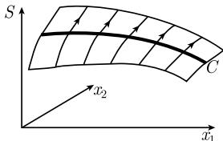

# 《数学指南——实用数学手册》1.13.5 一般的存在性结果

## 本节定位

本节汇总偏微分方程解的存在性方面的经典结果，包含四条主线：柯西-柯瓦列夫斯卡娅定理（解析解）、一阶偏微分方程的柯西定理（特征组构造）、弗罗贝尼乌斯定理与可积性条件、以及作为总体框架的嘉当-凯勒定理（微分形式与积分流形）。文中反复指出，现代的存在性结果可以在文献 [212] 中找到；数学物理中的应用细节则推荐专著 [129]。

## 1.13.5.1 柯西-柯瓦列夫斯卡娅定理

考虑初值问题

$$
\boxed { \begin{array}{l} u _ {t} (x, t) = f (x, t, u), \\ u (x, t _ {0}) = \varphi (x) \quad (\text {初始值}). \end{array} }\tag{1.429}
$$

记号：$\boldsymbol{x}=(x_{1},\cdots,x_{n})$，$\boldsymbol{u}=(u_{1},\cdots,u_{m})$，$\boldsymbol{f}=(f_{1},\cdots,f_{m})$。所有的量 $t,x_{j}$ 和 $f_{k}$ 都被假定为是复的，解是复值函数 $u_{k}$。所谓解析函数，指它可以被展开为其所有变量的一个绝对收敛的幂级数。

假设 $f$ 在 $(\pmb{x}_0, t_0, u_0)$ 的一个邻域中解析，且 $\varphi$ 在满足 $\varphi(\pmb{x}_0) = u_0$ 的点 $\pmb{x}_0$ 的一个邻域中解析。

**柯西-柯瓦列夫斯卡娅定理**：初值问题 (1.429) 在点 $(x_0, t_0)$ 的一个邻域中有一个唯一的解，并且这个解是解析的。可以利用比较系数来求得解的幂级数展开。

文中给出的说明性算例为

$$
\boxed {u _ {t} = u, \quad u (x, 0) = x.}
$$

取 $P := (0,0)$。由初始条件得 $u(P) = 0$，$u_x(P) = 1$，$u_{xx}(P) = 0$ 等；微分方程给出 $u_t(P) = u(P) = 0$，$u_{tt}(P) = u_t(P) = 0$，$u_{tx}(P) = u_x(P) = 1$。于是在 $P$ 的邻域中

$$
\begin{array}{c} u (\boldsymbol {x}, t) = u (\boldsymbol {P}) + u _ {x} (\boldsymbol {P}) x + u _ {t} (\boldsymbol {P}) t + \frac {1}{2} (u _ {x x} (\boldsymbol {P}) x ^ {2} + 2 u _ {t x} (\boldsymbol {P}) x t + u _ {t t} (\boldsymbol {P}) t ^ {2}) + \dots \\ = x + x t + \dots . \end{array}
$$

## 1.13.5.2 关于一阶偏微分方程的柯西定理

考察

$$
\begin{array}{r l} & {F (x, S, S _ {x}) = 0,} \\ & {S (x _ {0} (\sigma)) = S _ {0} (\sigma), \quad \text {在} U \text {上} (\text {对} S \text {的初始条件}),} \\ & {S _ {x} (x _ {0} (\sigma)) = p _ {0} (\sigma), \quad \text {在} U \text {上} (\text {对} S _ {x} \text {的初始条件}).} \end{array}\tag{1.430}
$$

解是实变量 $\boldsymbol{x} = (x_{1}, \cdots, x_{n})$ 的实函数 $S = S(\boldsymbol{x})$，$\boldsymbol{p} = (p_{1}, \cdots, p_{n})$；$\boldsymbol{\sigma} = (\sigma_{1}, \cdots, \sigma_{n-1})$ 在 $R^{n-1}$ 原点的一个邻域中变动。

**例 1（哈密顿-雅可比微分方程）**：

$$
S _ {t} + H (q, S _ {q}) = 0
$$

是 (1.430) 的特殊情形，其中 $x_{1} = q$，$x_{2} = t$。

**假设**：给定光滑函数 $x = x _ {0} (\sigma)$，$p = p _ {0} (\sigma)$，$S = S _ {0} (\sigma)$（在 $U$ 上），并假设相容性条件

$$
\boxed {S _ {0} ^ {\prime} (\sigma) = \boldsymbol {p} _ {0} (\sigma) \boldsymbol {x} _ {0} ^ {\prime} (\sigma), \quad \text {在} U \text {上},}\tag{1.431}
$$

与正则性条件

$$
\det \left(\boldsymbol {x} _ {0} ^ {\prime} (0), \boldsymbol {F} _ {p} (\boldsymbol {P})\right) \neq 0
$$

成立，其中 $P := (\boldsymbol{x}_{0}(0), S_{0}(0), \boldsymbol{p}_{0}(0))$。

**几何解释**（$n = 2$）：要找通过曲线 $C \colon \boldsymbol {x} = \boldsymbol {x} (\sigma), S = S _ {0} (\sigma)$ 的曲面 $S = S(\pmb{x})$（图 1.166）。引进附加量 $p = S_{\pmb{x}}$ 后，链规则给出 $S _ {0} ^ {\prime} (\sigma) = S _ {\boldsymbol {x}} (\boldsymbol {x} _ {0} (\sigma)) \boldsymbol {x} _ {0} ^ {\prime} (\sigma) = \boldsymbol {p} _ {0} (\sigma) \boldsymbol {x} _ {0} ^ {\prime} (\sigma)$，即相容性条件 (1.431)。

**柯西定理**：在点 $\boldsymbol{x}_{0}(0)$ 的一个充分小的邻域里，初值问题 (1.430) 有一个唯一解 $S = S(x)$，这个解是光滑的。

**解的构造**：解曲面 $S = S(\boldsymbol{x})$ 作为具有参数 $t$ 和附加参数 $\sigma$ 的曲线的并 $\boldsymbol {x} = \boldsymbol {x} (t; \sigma)$，$\boldsymbol {p} = \boldsymbol {p} (t; \sigma)$，$S = \mathcal {S} (t; \sigma)$ 被构造。这些曲线满足常微分方程组

$$
\boxed { \begin{array}{l} \boldsymbol {x} ^ {\prime} = F _ {p}, \quad \boldsymbol {S} ^ {\prime} = \boldsymbol {p} F _ {p}, \quad \boldsymbol {p} ^ {\prime} = - \boldsymbol {F} _ {x} - p \boldsymbol {F} _ {S}, \\ \boldsymbol {x} (0) = \boldsymbol {x} _ {0} (\sigma), \quad \boldsymbol {S} (0) = \boldsymbol {S} _ {0} (\sigma), \quad \boldsymbol {p} (0) = \boldsymbol {p} _ {0} (\sigma), \end{array} }\tag{1.432}
$$

称为属于偏微分方程 (1.430) 的**特征组**。正则性条件等价于可以在 $(t, \sigma)$ 邻域中解出 $\boldsymbol {x} = \boldsymbol {x} (t; \sigma)$，进而得到 $t = t (\boldsymbol {x})$，$\sigma = \sigma (\boldsymbol {x})$，于是所求的解为

$$
\boxed {S (\boldsymbol {x}) := \mathcal {S} (t (\boldsymbol {x}), \sigma (\boldsymbol {x})).}
$$

**例 2**：对于 $S _ {t} + H (\boldsymbol {q}, t, S _ {\boldsymbol {q}}) = 0$，其特征组为 $\boldsymbol {q} ^ {\prime} = H _ {\boldsymbol {p}} (\boldsymbol {q}, \boldsymbol {p}, t)$，$\boldsymbol {p} ^ {\prime} = - H _ {\boldsymbol {q}} (\boldsymbol {q}, \boldsymbol {p}, t)$，即典范哈密顿方程；此外 $S ^ {\prime} = \boldsymbol {p} \boldsymbol {q} ^ {\prime} + P$，$P ^ {\prime} = - H _ {t} (\boldsymbol {q}, \boldsymbol {p}, t)$ 也属于特征组。

**脚注 1)**（关于记号）：由于指标太多，这个主题的经典文献充满了又长又复杂的公式；现代分析较喜欢采用弗雷歇导数的记号，因而叙述得既简单又漂亮。到分量的过渡由

$$
\boldsymbol {x} ^ {\prime} (\sigma) = \left(\frac {\partial \boldsymbol {x}}{\partial \sigma_ {j}}\right), S _ {\boldsymbol {x}} = \left(\frac {\partial S}{\partial x _ {k}}\right), \boldsymbol {F} _ {\boldsymbol {p}} = \left(\frac {\partial \boldsymbol {F}}{\partial p _ {k}}\right)
$$

给出，相容性条件显式地为 $\frac {\partial S _ {0}}{\partial \sigma_ {j}} = \sum_ {k = 1} ^ {n} p _ {0 k} \frac {\partial x _ {0 k}}{\partial \sigma_ {j}}$。

**脚注 1)（特征组处）**：为简化记号，写成 $\pmb{x} = \pmb{x}(t)$，$\pmb{p} = \pmb{p}(t)$ 和 $S = S(t)$ 以代替 $\pmb{x} = \pmb{x}(t; \sigma)$，$\pmb{p} = \pmb{p}(t; \sigma)$ 和 $S = S(x, t)$。

**译者注**：（1.433）式下方关于 $K$ 的求和式中，原文将求和号误为 $\sum_{j=1}^{n}$。

## 1.13.5.3 弗罗贝尼乌斯定理和可积性条件

考察

$$
\boxed { \begin{array}{l l} {\frac {\partial u}{\partial x _ {j}} (x) = K _ {j} (x, u (x)),} & {j = 1, \dots , N,} \\ {u (\pmb {a}) = b} & {(\text {初始值}).} \end{array} }\tag{1.433}
$$

其中给定点 $a \in R^{N}$、实数 $b$，以及在点 $(a, b)$ 于 $R^{N+1}$ 中的一个邻域中的光滑函数 $K_{j}, j = 1, \cdots, N$；所求的解是实值函数 $u = u(x)$。问题 (1.433) 等价于方程 $\mathrm{d} u = K$，其中 $K=\sum_{j=1}^{N}K_{j}(x,u)\mathrm{d}x_{j}$。

**弗罗贝尼乌斯（F. G. Frobenius, 1849—1917）定理**：初值问题 (1.433) 在点 $a$ 的一个充分小的邻域中有一个唯一解，当且仅当对于所有的 $j, m = 1, \cdots, N$ 在 $(a, b)$ 的一个邻域中可积性条件

$$
\boxed {\frac {\partial K _ {j} (P)}{\partial x _ {m}} + \frac {\partial K _ {j} (P)}{\partial u} \frac {\partial u (x)}{\partial x _ {m}} = \frac {\partial K _ {m} (P)}{\partial x _ {j}} + \frac {\partial K _ {m} (P)}{\partial u} \frac {\partial u (x)}{\partial x _ {j}}}\tag{1.434}
$$

满足，其中 $P := (\boldsymbol{x}, u)$。

**注**：从关系式 $\frac {\partial^ {2} u}{\partial x _ {j} \partial x _ {m}} = \frac {\partial^ {2} u}{\partial x _ {m} \partial x _ {j}}$ 和 (1.433) 即得可积性条件 (1.434)。对于 $\boldsymbol{u} = (u_{1}, \cdots, u_{M})$ 时的 (1.433)，一个类似的结果成立。

**应用**：弗罗贝尼乌斯定理在构造曲面（或更一般地，流形）时是一个重要的工具。

- (i) 在 3.6.3.3 中曲面论主要定理的证明中以本质的方式利用了它；可积性条件蕴涵了著名的高斯绝妙定理。
- (ii) 从其李代数构造李群基于弗罗贝尼乌斯定理。
- (iii) 若 $N = 3$ 且 $K_{j}$ 与 $u$ 无关，则 (1.433) 相应于向量方程 $\operatorname{grad} u = \boldsymbol {F}$，$u (\boldsymbol {a}) = b$；此时可积性条件是 $\operatorname{curl} F = 0$。
- (iv) 弗罗贝尼乌斯定理用流形上微分形式语言的一般性叙述可在 [212] 中找到。

## 1.13.5.4 嘉当-凯勒定理

**基本思想**：一个任意的偏微分方程组可以被描述为一个微分形式的方程组。嘉当-凯勒的基本定理保证了对这种类型组的正则初值问题的唯一解，为此需要假设出现在表述中的诸函数是解析的。这是柯西-柯瓦列夫斯卡娅定理的一个推广；事实上嘉当-凯勒定理是柯西-柯瓦列夫斯卡娅定理的一个推论——证明后者的思想是引进适当的局部坐标并解出一阶偏导数，导致一个一阶组，再对此一阶组应用柯西-柯瓦列夫斯卡娅定理。

**例 1**：一阶偏微分方程

$$
F (x, y, u, u _ {x}, u _ {y}) = 0.\tag{1.435}
$$

令 $p := u_{x}$，$q := u_{y}$，得到等价方程组

$$
\begin{array}{l} F (x, y, u, p, q) = 0, \\ \mathrm{d} u - p \mathrm{d} x - q \mathrm{d} y = 0. \end{array}\tag{1.436}
$$

这是一个微分形式的方程组，其中把函数看作零阶的微分形式。

**例 2**：通过代换 $p := u_{x}, q := u_{y}, a := u_{xx}, b := u_{xy}, c := u_{yy}$，二阶偏微分方程 $F (x, y, u, u _ {x}, u _ {y}, u _ {x x}, u _ {x y}, u _ {y y}) = 0$ 变为等价组

$$
\begin{array}{c} F (x, y, u, p, q, a, b, c) = 0, \\ \mathrm{d} u - p \mathrm{d} x - q \mathrm{d} y = 0, \\ \mathrm{d} p - a \mathrm{d} x - b \mathrm{d} y = 0, \\ \mathrm{d} q - b \mathrm{d} x - c \mathrm{d} y = 0. \end{array}
$$

用类似的方法可以处理任意的偏微分方程组。

**历史**：原始的理论源自 19 世纪末里基耶（Charles Riquier, 1853—1929；法国数学家）的工作，此原始理论用到了微分方程，非常复杂，难以理解。在 1904 年和 1908 年之间，É. 嘉当发现微分形式运算对应用于这类问题非常有用。最后，在 1934 年由 E. 凯勒提供了非常简洁的叙述形式。

**闭包的形成过程**：给定微分形式组 $\omega_{j} = 0$（$j = 1, \dots, J$），通过附加上嘉当导数 $\mathrm{d} \omega_{j} = 0$ 就形成了闭包。用这种方式处理了系数函数偏导数之间的所有相关性（可积性条件）。由于 $\mathrm{dd}\omega = 0$（庞加莱引理），再一次施以嘉当导数不能得到任何新信息，因此形成完备化的过程在一步之后即完成。

**例 3**：方程 $a (x, y) \mathrm{d} x + b (x, y) \mathrm{d} y$ 的闭包导致 $\mathrm{da} \wedge \mathrm{dx} + \mathrm{db} \wedge \mathrm{dy} = 0$，因而

$$
\begin{array}{l} a \mathrm{d} x + b \mathrm{d} y = 0, \\ (a _ {y} - b _ {x}) \mathrm{d} y \wedge \mathrm{d} x = 0. \end{array}
$$

**积分流形**：微分形式组的解被称为积分流形，可以通过尝试法并应用适当的代换来得到解。

**例 4**：考虑闭形式组

$$
\boxed { \begin{array}{l} y + f (x) = 0, \\ \mathrm{d} y + f ^ {\prime} (x) \mathrm{d} x = 0, \\ \mathrm{d} x \wedge \mathrm{d} y = 0. \end{array} }\tag{1.437}
$$

- 零维积分流形：点 $(x_{0},y_{0})$ 是 (1.437) 的解，当且仅当 $y_{0}+f(x_{0})=0$。
- 一维积分流形：曲线 $x = x(t)$，$y = y(t)$ 是 (1.437) 的解，如果

$$
\begin{array}{l} y (t) + f (x (t)) = 0, \\ \{y ^ {\prime} (t) + f ^ {\prime} (x (t)) x ^ {\prime} (t) \} \mathrm{d} t = 0, \\ x ^ {\prime} (t) y ^ {\prime} (t) \mathrm{d} t \wedge \mathrm{d} t = 0. \end{array}\tag{1.438}
$$

作代换 $\mathrm{d}x = x'(t)\mathrm{d}t$，$\mathrm{dy} = y'(t)\mathrm{dt}$ 即得 (1.438)；其中第 3 个方程因 $\mathrm{d}t \wedge \mathrm{d}t = 0$ 而自动满足。一般地，为了寻找 $r$ 维积分流形，考虑所有直到 $r$ 阶的微分形式就足够了。

- 二维积分流形：曲面 $x = x (t, s)$，$y = y (t, s)$ 是 (1.437) 的解，如果

$$
\begin{array}{l} y (P) + f (x (P)) = 0, \\ y _ {t} (P) \mathrm{d} t + y _ {s} (P) \mathrm{d} s + f ^ {\prime} (x (P)) \{x _ {t} (P) \mathrm{d} t + x _ {s} (P) \mathrm{d} s \} = 0, \\ \{x _ {t} (P) y _ {s} (P) - x _ {s} (P) y _ {t} (P) \} \mathrm{d} t \wedge \mathrm{d} s = 0. \end{array}\tag{1.439}
$$

其中 $P := (t, s)$。等价地（把 (1.439) 中 $\mathrm{dt}, \mathrm{ds}$ 和 $\mathrm{dt} \wedge \mathrm{ds}$ 的系数置为零）：

$$
\begin{array}{l} y (P) + f (x (P)) = 0, \\ y _ {t} (P) + f ^ {\prime} (x (P)) x _ {t} (P) = 0, \\ y _ {s} (P) + f ^ {\prime} (x (P)) x _ {s} (P) = 0, \\ x _ {t} (P) y _ {s} (P) - x _ {s} (P) y _ {t} (P) = 0. \end{array}
$$

**微分形式 $\omega$ 的拉回 $g^{*}\omega$**：令 $\boldsymbol{y}=(y_{1},\cdots,y_{n})$，$\boldsymbol{t}=(t_{1},\cdots,t_{m})$，开集 $U\subset R^{m}$。方程 $\boldsymbol {y} = g (\boldsymbol {t})$（$\boldsymbol {t} \in U$）描述了一个由 $\boxed {\omega = 0}$ 给出的积分流形，当且仅当

$$
\boxed {g ^ {*} \omega (\boldsymbol {t}) = 0, \quad \boldsymbol {t} \in U.}\tag{1.440}
$$

以 $R^{m}$ 的典范基 $\boldsymbol {e} _ {1} := (1, 0, \dots , 0), \dots, \boldsymbol {e} _ {m} := (0, 0, \dots , 1)$ 表示时（$\mathrm{d}t_{j}(\boldsymbol{e}_{k}) = \delta_{jk}$），方程 (1.440) 等价于

$$
g ^ {*} \omega (t) (\boldsymbol {e} _ {1}, \dots , \boldsymbol {e} _ {m}) = 0, \quad t \in U.\tag{1.441}
$$

**例 5**：令方程 $\omega = 0$ 由形式 $\mathrm{d} y _ {1} \wedge \mathrm{d} y _ {2} = 0$（(1.442)）给出，并令 $y _ {j} = g _ {j} (t _ {1}, t _ {2})$（$j = 1, 2$，(1.443)）。记 $\partial_j := \partial / \partial t_j$，由 $\mathrm{d}y_j = \partial_1 g_j \mathrm{d}t_1 + \partial_2 g_j \mathrm{d}t_2$，条件 (1.440) 相应于

$$
(\partial_ {1} g _ {1} \partial_ {2} g _ {2} - \partial_ {2} g _ {1} \partial_ {1} g _ {2}) \mathrm{d} t _ {1} \wedge \mathrm{d} t _ {2} = 0.
$$

考虑到 $(\mathrm{dt}_1\wedge \mathrm{dt}_2)(e_1,e_2) = \mathrm{dt}_1(e_1)\mathrm{dt}_2(e_2) - \mathrm{dt}_1(e_2)\mathrm{dt}_2(e_1) = 1$，(1.441) 等价于

$$
\partial_ {1} g _ {1} \partial_ {2} g _ {2} - \partial_ {2} g _ {1} \partial_ {1} g _ {2} = 0.\tag{1.444}
$$

因而函数 (1.443) 是 (1.442) 的解，当且仅当 (1.444) 成立。

### 嘉当-凯勒的局部存在性和唯一性定理

研究初值问题

$$
\boxed { \begin{array}{l l} {\omega_ {k} = 0, \quad k = 1, \dots , K,} \\ {g (t _ {1}, \dots , t _ {p}, 0) = a (t _ {1}, \dots , t _ {p}), \quad \text {在} W _ {0} \text {上}} & {(\text {初始值}).} \end{array} }\tag{1.445}
$$

要确定的对象是积分流形 $y = g (t _ {1}, \dots , t _ {p + 1})$（在 $W$ 上），其中坐标 $t_{1},\cdots,t_{p+1}$ 在 $R^{p+1}$ 的一个开邻域 $W$ 中变动；$W_{0}$ 表示 $W$ 中满足 $t_{p+1}=0$ 的所有点的集合；固定的整数 $p$ 满足 $1\leqslant p<n$。

**注**：考虑关于固定 $y$ 坐标系的微分形式 $\omega$，其中 $\boldsymbol{y} = (y_{1}, \cdots, y_{n})$，$y \in R^{n}$。变换 $\boldsymbol {y} = \varphi (\boldsymbol {t})$（$\boldsymbol {t} \in U$）引进新的 $t$ 坐标，其中 $\boldsymbol{t} = (t_{1}, \cdots, t_{n})$，$t \in R^{n}$，$U$ 是原点的一个开邻域，$\varphi: U \to V$ 是从 $U$ 到点 $y_{0}$ 在 $R^{n}$ 中一个开邻域 $V$ 上的微分同胚。假设 $\varphi$ 解析，即其分量可以被展开为（绝对收敛的）幂级数。用 $e_{1}, \cdots, e_{n}$ 表示 $t$ 坐标中的典范基，并假设在 $W_{0}$ 上 $a (t _ {1}, \dots , t _ {p}) = \varphi (t _ {1}, \dots , t _ {p}, 0, \dots , 0)$。

**对偶极空间**：选取固定点 $t \in U$，以 $P(t)$ 表示极空间，它是满足

$$
\boxed {\omega_ {k} ^ {*} (\boldsymbol {t}) (\boldsymbol {e} _ {1}, \dots , \boldsymbol {e} _ {p}, \boldsymbol {v}) = 0, \quad k = 1, \dots , K}
$$

的所有向量 $v \in R^{n}$ 的集合，其中 $\omega_{k}^{*}(t)$ 表示变换到 $t$ 坐标后的微分形式，即 $\omega_{k}^{*} := \varphi^{*}\omega_{k}$。

**初值问题的正则性**：称一个初值问题为正则的，如果有下述条件：

- (a) 存在一个固定的数 $r$，使得所有 $r$ 个向量 $e_{n-r+1}, \cdots, e_n$ 与 $e_1, \cdots, e_p$ 一起，对每个在 $t = 0$ 的一个充分小的邻域里的点 $t \in R^n$，形成极空间 $P(t)$ 的一个基。这里需要 $1 \leqslant r < n - p$。
- (b) 其元为一阶偏导数

$$
\boxed {\frac {\partial}{\partial t _ {j}} a ^ {*} \omega_ {k} (t) (e _ {1}, \dots , e _ {p}), \quad k = 1, \dots , K, j = 1, \dots , p}
$$

的矩阵在点 $(t_{1},\cdots,t_{p})=\mathbf{0}$ 于 $R^{p}$ 的一个邻域中有常数秩 $n-p$。这里 $a^{*}\omega_{k}(t)$ 是 $\omega_{k}$ 在应用从 $\boldsymbol{y}=a(t_{1},\cdots,t_{p})$ 到坐标 $t_{1},\cdots,t_{p}$ 的变换后的拉回。

**注**：条件 (b) 保证了组 (1.445) 沿着 $p$ 维初始曲面

$$
I _ {p} \colon \boldsymbol {y} = a (t _ {1}, \dots , t _ {p})
$$

是正则的。如果条件 (b) 不被满足，那么存在某种奇异性状，通常这种奇异性与 $I_{p}$ 表示一个特征这一事实相关；在这种情形，通过 $I_{p}$ 可以存在无穷多个解曲面。所求的 $p + 1$ 维解曲面由 $I _ {p + 1} \colon \boldsymbol {y} = a (t _ {1}, \dots , t _ {p + 1})$ 表示。对于唯一性的陈述，需要 $n - r$ 维曲面

$$
F \colon \boldsymbol {y} = \varphi (t _ {1}, \dots , t _ {p}, t _ {p + 1}, \dots , t _ {n - r}, 0, \dots , 0),
$$

其中 $t_{1},\cdots,t_{n-r}$ 在原点在 $R^{n-r}$ 中的一个邻域里变动。为过渡到整体陈述，还引进原点的 $n$ 维开邻域 $M \colon \boldsymbol {y} = \varphi (t _ {1}, \dots , t _ {n})$。此时

$$
\boxed {I _ {p} \subset I _ {p + 1} \subseteq F \subseteq M.}\tag{1.446}
$$

**局部存在性和唯一性结果**：作下述假设。

- (i) 闭性：初始组 (1.445) 是闭的，即对于 (1.445) 中的每个微分形式 $\omega_{k}$，其嘉当导数 $\mathrm{d}\omega_{k}$ 也属于 (1.445)。
- (ii) 解析性：组 (1.445) 是解析的，即微分形式的诸系数和初值函数 $a(.)$ 都可以被展开为具有实系数的幂级数。
- (iii) 正则性：初值问题是正则的。

那么，初值问题 (1.445) 在原点在 $\mathbb{R}^n$ 中的一个充分小的邻域里有一个解析解。

### 嘉当-凯勒的整体存在性和唯一性定理

考虑一个在 $n(\geqslant 1)$ 维流形 $\mathcal{M}$ 上任意阶 $(\geqslant 0)$ 的解析微分形式组

$$
\boxed {\omega_ {k}, \quad k = 1, \dots , K.}\tag{1.447}
$$

此时

$$
\boxed {\mathcal {I} _ {p} \subset \mathcal {I} _ {p + 1} \subseteq \mathcal {F} \subseteq \mathcal {M}.}\tag{1.448}
$$

**整体存在性和唯一性结果**：作下述假设：

- (i) 给定一个 $p$ 维子流形 $\mathcal{I}_p \subset \mathcal{M}$，其中 $1 \leqslant p < n$。
- (ii) $I_{p}$ 是初始组 (1.447) 的一个正则积分流形。
- (iii) $\mathcal{I}_p$ 的极空间在 $\mathcal{I}_p$ 的每个点处有维数 $r + p$，这里 $1 \leqslant r < n - p$。
- (iv) 在 $\mathcal{M}$ 中存在一个 $n - r$ 维的子空间 $\mathcal{F}$，满足 $\mathcal{I}_p \subset \mathcal{F}$，并且 $\mathcal{F}$ 的切空间在 $\mathcal{I}_p$ 的每个点处横截于极空间。

此时，组 (1.447) 恰有 $\mathcal{M}$ 的一个 $p + 1$ 维子空间 $\mathcal{I}_{p+1}$ 是积分流形，且满足性质 (1.448)。

**对读者有用的注**：整体的结构经常在现代数学中以简洁的流形语言叙述，其细节在 [212] 中被提出。然而上述定理的内容可以被每一位读者所理解，即使他不懂流形的语言——只需想象在 $\mathcal{M}$ 的每个点处可以引进局部 $t$ 坐标，这样对问题 (1.445) 有局部存在性和唯一性定理；由于命题 (1.446)，(1.448) 就被局部地实现了。

**证明概略**：为了得到整体定理，首先借助于柯西-柯瓦列夫斯卡娅定理证明局部命题，然后借助于解析延拓把这个局部解延拓为一个整体解。这就是解析性假设的由来。

**应用**：柯西-柯瓦列夫斯卡娅定理在微分几何中（具有给定性质流形的构造）和数学物理中有众多的应用，细节推荐专著 [129]。关于流形的弗罗贝尼乌斯定理是嘉当-凯勒定理的一个特殊情形。弗罗贝尼乌斯定理在热力学中的应用在文献 [212] 中被讨论。

## 微分理想

到目前为止考虑的是微分形式的有限组

$$
\omega_ {k}, \quad k = 1, \dots , K.\tag{1.449}
$$

诸形式 $\omega_{k}$ 的不同选取可以导致等价组。为了消除不确定性，考虑形式组

$$
\boxed {\omega = 0, \quad \omega \in J.}\tag{1.450}
$$

这里 $J$ 是所谓的**微分理想**，即有

- (i) $J$ 是微分形式的一个实线性空间。
- (ii) 从 $\omega \in J$ 即得对每个微分形式 $\mu$ 有 $\omega \wedge \mu = 0$。
- (iii) 从 $\omega \in J$ 即得 $\mathrm{d}\omega = 0$。

每个这种类型的理想都具有一个有限基 $\omega_{1},\cdots,\omega_{K}$。因而 (1.450) 等价于 (1.449)，这里与基的具体选取无关。此过程相应于现代代数几何的一般方法，即用对象组代替方程组，这些对象可由一个理想零化。

## 相关页面

- [[concepts/柯西-柯瓦列夫斯卡娅定理]]
- [[concepts/一阶偏微分方程的柯西定理]]
- [[concepts/弗罗贝尼乌斯定理]]
- [[concepts/嘉当-凯勒定理]]
- [[concepts/积分流形]]
- [[concepts/微分理想]]
- [[concepts/特征组-偏微分方程]]
- [[concepts/哈密顿-雅可比微分方程]]
- [[concepts/相容性条件]]
- [[concepts/正则性条件]]
- [[concepts/可积性条件]]
- [[entities/柯西]]
- [[entities/柯瓦列夫斯卡娅]]
- [[entities/弗罗贝尼乌斯]]
- [[entities/嘉当]]
- [[entities/凯勒]]
- [[entities/里基耶]]
- [[queries/1135节文献129推荐专著未核实]]
- [[queries/1135节嘉当-凯勒定理解析性条件脚注未转录]]

<!-- llm-wiki:embedded-images -->
## Embedded Images

### Document

<!-- llm-wiki:embedded-images -->
