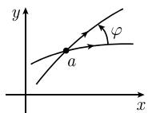
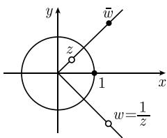
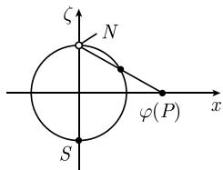
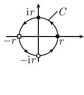
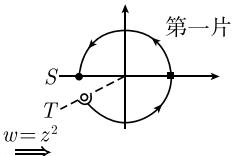
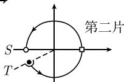
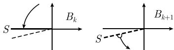
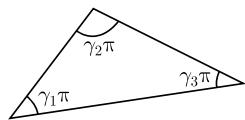

# 《数学指南——实用数学手册》1.14.11 共形映射的例子

## 概览

本节是第 1.14 节（复变函数）的第 11 小节，把全纯函数 $f: U \subseteq \mathbb{C} \to \mathbb{C}$ 中的方程 $\boxed{w = f(z)}$ 解释为 $z$ 平面到 $w$ 平面的**映射**，并给出一系列具体的共形映射例子。内容从共形性定义出发，依次讨论相似变换群（1.14.11.1）、单位圆上的反演（1.14.11.2）、复平面的闭包 $\overline{\mathbb{C}}$（1.14.11.3）、黎曼球面 $S^2$（1.14.11.4）、默比乌斯变换群（1.14.11.5）、平方根的黎曼面（1.14.11.6）、对数的黎曼面（1.14.11.7），最后以施瓦茨-克里斯托费尔映射公式（1.14.11.8）收尾。文中反复引用文献 [212] 作为拓扑学、复流形与黎曼面严格构造的出处。

## 共形映射的定义与判定定理

共形映射（保角映射）：由 $f$ 定义的映射称为在点 $z = a$ 处是保角的或共形的，如果在这个映射下过点 $a$ 的两条 $C^1$ 曲线的夹角（包括方向）保持不变；若在定义域每个点处都如此，则称该映射为保角的或共形的。

> **定理** 定义在点 $a$ 的某个邻域 $U$ 上的全纯函数 $f: U \subseteq \mathbb{C} \to \mathbb{C}$ 确定了一个在点 $a$ 处的共形映射，当且仅当 $f'(a) \neq 0$。
>
> 每个双全纯映射 $f: U \to V$ 是共形的。

该断言与 [[findings/局部反函数定理fa非零蕴含局部双全纯]] 中的局部反函数定理直接衔接：$f'(a) \neq 0$ 既保证局部双全纯，也保证共形。

## 1.14.11.1 相似变换群

令 $a, b$ 为固定复数且 $a \neq 0$，则

$$
w = a z + b \quad \text{对所有} z \in \mathbb{C} \tag{1.469}
$$

确定了一个从复平面 $\mathbb{C}$ 映到自身的双全纯（因而是共形的）映射。

- 例 1：$a = 1$ 时 (1.469) 是平移变换。
- 例 2：令 $z = r\mathrm{e}^{\mathrm{i}\varphi}$，$b = 0$，$a = |a|\mathrm{e}^{\mathrm{i}\alpha}$，则 $w = |a| r \mathrm{e}^{\mathrm{i}(\varphi + \alpha)}$，即 $w = az$ 是角度旋转 $\alpha$、长度乘以 $|a|$ 的旋转。
- 当 $b = 0$、$a > 0$ 时得到正常相似变换（长度乘以 $a$）。

所有形如 (1.469) 的变换构成从 $\mathbb{C}$ 映到自身的**保定向的相似变换群**。

本小节还插入了一段关于单值化定理的叙述：自 1907 年起，庞加莱与克贝的单值化定理把黎曼映射定理推广为——每个单连通黎曼面恰可双全纯地映射到单位圆内部、复平面本身或闭的复平面 $\overline{\mathbb{C}}$（黎曼球面）之一；详见 [212]。该断言同时链接到 [[单值化定理]]、[[黎曼映射定理]]、[[entities/庞加莱]] 与 [[entities/克贝]]。

## 1.14.11.2 单位圆上的反演

$$
w = \frac{1}{z} \quad \text{对所有满足} z \neq 0 \text{的} z \in \mathbb{C}
$$

该映射是双全纯的，因而是从有孔复平面 $\mathbb{C} - \{0\}$ 到自身的共形映射。令 $z = r\mathrm{e}^{\mathrm{i}\varphi}$，则 $w = \frac{1}{r}\mathrm{e}^{-\mathrm{i}\varphi}$。由于 $|w| = 1/|z|$，点 $w$ 由「点 $z$ 关于单位圆周的反演点，再关于实轴反射」得到（图 1.181）。

## 1.14.11.3 复平面的闭包

$$
\overline{\mathbb{C}} := \mathbb{C} \cup \{\infty\}
$$

把点 $\infty$ 加到复平面 $\mathbb{C}$ 上，称 $\overline{\mathbb{C}}$ 为**完备的复平面**。为构造复流形结构，需要给出 $\overline{\mathbb{C}}$ 上的**局部坐标**：

1. 对每个点 $a \in \mathbb{C}$，把邻域 $U := \mathbb{C}$ 作为邻域，对 $z \in \mathbb{C}$ 其坐标为 $\zeta := z$。
2. 把 $V := \overline{\mathbb{C}} - \{0\}$ 取作点 $\infty$ 的邻域，其局部坐标是
   $$
   \zeta' := \begin{cases} \dfrac{1}{z}, & \text{对满足 } z \neq 0 \text{ 的 } z \in \mathbb{C}, \\ 0, & \text{对 } z = \infty. \end{cases}
   $$

这样对每个点 $z \in \overline{\mathbb{C}} - \{0\}$ 有两个局部坐标 $\zeta = z$ 与 $\zeta' = 1/z$，满足 $\zeta = 1/\zeta'$；点 $0$ 只有局部坐标 $\zeta = 0$，点 $\infty$ 的局部坐标是 $\zeta' = 0$。这就给出记号 $0 = 1/\infty$ 的严格表达。

完备复平面上的映射：通过过渡到局部坐标定义 $f: U \subseteq \overline{\mathbb{C}} \to \overline{\mathbb{C}}$ 的性质，例如 $f$ 全纯当且仅当过渡到局部坐标后仍全纯。

**例 1**：$f(z) = z^n$（$z \in \mathbb{C}$），$f(\infty) = \infty$ 是全纯映射 $f: \overline{\mathbb{C}} \to \overline{\mathbb{C}}$。过渡到局部坐标 $\zeta = 1/z$、$\mu = 1/w$ 得

$$
\mu = \zeta^{n} \tag{1.470}
$$

在 $V = \overline{\mathbb{C}} - \{0\}$ 上全纯，因而 $f$ 在 $z = \infty$ 处有 $n$ 阶无穷（极点）。

**例 2**：$f(z) = z$（$z \in \mathbb{C}$），$f(\infty) = \infty$ 是双全纯映射 $f: \overline{\mathbb{C}} \to \overline{\mathbb{C}}$。

**例 3**：$w = p(z)$ 为 $n$ 次多项式，令 $p(\infty) := \infty$，则 $p: \overline{\mathbb{C}} \to \overline{\mathbb{C}}$ 是全纯函数且在 $z = \infty$ 处有 $n$ 阶极点。

**例 4**：$f(z) = 1/z^n$（$z \neq 0$），$f(0) = \infty$，$f(\infty) = 0$，则 $f: \overline{\mathbb{C}} \to \overline{\mathbb{C}}$ 全纯，在 $z = 0$ 处有 $n$ 阶极点、在 $z = \infty$ 处有 $n$ 阶零点；$n = 1$ 时 $f$ 双全纯。

邻域与开集：

$$
U_{\varepsilon}(p) := \{z \in \mathbb{C}: |z - p| < \varepsilon\}, \quad \text{当} p \in \mathbb{C} \text{时},
$$

并令 $U_{\varepsilon}(\infty)$ 为所有满足 $|z| > \varepsilon^{-1}$ 的复数 $z$ 及点 $\infty$ 构成的集合。子集合 $U \subseteq \overline{\mathbb{C}}$ 称为开集，若其中每个点都至少被 $U$ 包含一个 $\varepsilon$ 邻域。

注：(i) 借助这些开集，$\overline{\mathbb{C}}$ 获得拓扑空间结构，可应用拓扑空间的一切概念（参看 [212]），特别地 $\overline{\mathbb{C}}$ 是紧集、连通集；(ii) 对已引入的局部坐标，$\overline{\mathbb{C}}$ 成为一维复流形；(iii) 由定义一维复流形是黎曼面，因而 $\overline{\mathbb{C}}$ 也是紧黎曼面。

历史上，19 世纪中期黎曼研究黎曼面的直观概念；对「黎曼面」概念严格化的努力为拓扑学与流形理论作出巨大贡献，决定性一步是 H. 外尔（Hermann Weyl）1913 年的著作《黎曼面的思想》。

## 1.14.11.4 黎曼球面

令 $(x, y, \zeta)$ 为笛卡儿坐标系，球面

$$
S^2 := \{(x, y, \zeta) \in \mathbb{R}^3 \mid x^2 + y^2 + \zeta^2 = 1\}
$$

称为**黎曼球面**。令 $N$ 为北极 $(0, 0, 1)$。**球极平面投影**

$$
\varphi: S^2 - \{N\} \to \mathbb{C}
$$

把 $S^2 - \{N\}$ 的给定点 $P$ 映射为直线 $NP$ 与 $(x, y)$ 平面的交点 $z = \varphi(P)$；把 $N$ 映射到点 $\infty$ 可扩充为 $\varphi: S^2 \to \overline{\mathbb{C}}$。

- 例：南极 $S$（坐标 $(0, 0, -1)$）被 $\varphi$ 映到 $\mathbb{C}$ 的原点，赤道被映到单位圆周。
- **定理**：$\varphi: S^2 \to \overline{\mathbb{C}}$ 是同胚映射，即它把 $S^2 - \{N\}$ 共形地映射到 $\mathbb{C}$。
- **推论**：把局部坐标从 $\overline{\mathbb{C}}$ 变换到 $S^2$，则黎曼球面 $S^2$ 成为一维复流形，且 $\varphi: S^2 \to \overline{\mathbb{C}}$ 是双全纯的；更确切地说，$S^2$ 是紧的黎曼面。

## 1.14.11.5 默比乌斯变换群

所有双全纯映射 $f: \overline{\mathbb{C}} \to \overline{\mathbb{C}}$ 的集合构成一个群，称为 $\overline{\mathbb{C}}$ 的**自同构群** $\operatorname{Aut}(\overline{\mathbb{C}})$。该群确定了 $\overline{\mathbb{C}}$ 上的**共形对称**概念：在群 $\operatorname{Aut}(\overline{\mathbb{C}})$ 的所有变换下保持不变的性质，按定义属于 $\overline{\mathbb{C}}$ 的共形几何学。

例 1：$\overline{\mathbb{C}}$ 上的**广义圆**是 $\mathbb{C}$ 中的一个圆（在 $\overline{\mathbb{C}}$ 中的象）或 $\mathbb{C}$ 中一条含有 $\infty$ 的直线。$\operatorname{Aut}(\overline{\mathbb{C}})$ 的元素把广义圆映射到广义圆。

**默比乌斯变换**：若 $a, b, c, d$ 为复数且 $ad - bc \neq 0$，则变换

$$
f(z) := \frac{a z + b}{c z + d} \tag{1.471}
$$

称为默比乌斯变换，其中约定：(i) 对 $c = 0$，令 $f(\infty) := \infty$；(ii) 对 $c \neq 0$，令 $f(\infty) := a/c$ 且 $f(-d/c) := \infty$。默比乌斯（August Ferdinand Möbius, 1790–1868）首先研究了这些变换。

> **定理 1** $\overline{\mathbb{C}}$ 的自同构群 $\operatorname{Aut}(\overline{\mathbb{C}})$ 恰由默比乌斯变换构成。

例 2：把上半平面 $H_+ := \{z \in \mathbb{C} \mid \operatorname{Im} z > 0\}$ 共形映射到自身的默比乌斯变换，是形如 (1.471) 的变换，其中 $a, b, c, d$ 为实数且 $ad - bc > 0$。

例 3：把上半平面共形映射到单位圆盘（单位圆周的内部）的默比乌斯变换是形如

$$
a \frac{z - p}{z - \overline{p}}
$$

的变换，其中 $a, p$ 为复数，$|a| = 1$，$\operatorname{Im} p > 0$。

例 4：把单位圆盘的内部共形映射到自身的所有默比乌斯变换由

$$
a \frac{z - p}{\overline{p} z - 1}
$$

给出，其中 $a, p$ 为复数，$|a| = 1$，$|p| < 1$。

**默比乌斯变换的性质** 对默比乌斯变换 $f$：

(i) $f$ 可由平移、旋转、正常相似变换及关于单位圆周的反演复合而成；反之，每个这样的映射的复合是默比乌斯变换。
(ii) $f$ 是共形的，把广义圆映到广义圆。
(iii) $f$ 保持 $\overline{\mathbb{C}}$ 中四个点的**交比**

$$
\frac{z_4 - z_3}{z_4 - z_2} : \frac{z_1 - z_3}{z_1 - z_2}
$$

不变。
(iv) 每个不是恒等变换的默比乌斯变换至少有一个、至多有两个不动点（满足 $f(P) = P$ 的点 $P$）。

令 $GL(2, \mathbb{C})$ 为所有 $2 \times 2$ 复可逆矩阵的群，$D$ 为其中所有形如 $\lambda I$（$\lambda \neq 0$）的矩阵构成的子群，$I = \begin{pmatrix} 1 & 0 \\ 0 & 1 \end{pmatrix}$。

> **定理 2** 映射
> $$
> \begin{pmatrix} a & b \\ c & d \end{pmatrix} \mapsto \frac{a z + b}{c z + d}
> $$
> 是从 $GL(2, \mathbb{C})$ 到 $\operatorname{Aut}(\overline{\mathbb{C}})$ 的群同态，其核为 $D$。因而有群同构
> $$
> GL(2, \mathbb{C}) / D \cong \operatorname{Aut}(\overline{\mathbb{C}}),
> $$
> 即 $\operatorname{Aut}(\overline{\mathbb{C}})$ 同构于复射影群 $PGL(2, \mathbb{C})$。

## 1.14.11.6 平方根的黎曼面

黎曼的天才思想：把定义在 $\mathbb{C}$ 上的多值复函数（如 $z = \sqrt{w}$）通过把定义域换成比 $\mathbb{C}$ 更复杂的对象 $D$ 而变成单值函数。在简单情形中，沿某些线段切割几个复平面再沿割线粘起来即得 $D$。

映射 $w = z^2$：令 $z = r\mathrm{e}^{\mathrm{i}\varphi}$（$-\pi < \varphi \leqslant \pi$），则

$$
w = r^{2} \mathrm{e}^{2 \mathrm{i} \varphi}.
$$

它把 $z$ 到原点的距离 $r$ 自乘、把辐角 $\varphi$ 加倍。沿 $z$ 平面中以原点为心、半径为 $r$ 的正定向圆周 $C$ 绕一圈，$w$ 平面中的象是绕原点两次的、半径为 $r^2$ 的圆周。为研究逆映射 $z = \sqrt{w}$，沿负实轴切割两个 $w$ 平面（图 1.183）：

(i) 沿 $C$ 从 $z = r$ 到 $z = \mathrm{i}r$，象点在黎曼面第一片从 $r^2$ 到 $-r^2$；
(ii) 继续从 $\mathrm{i}r$ 到 $-\mathrm{i}r$，象点在第二片从 $-r^2$ 经 $r^2$ 到 $-r^2$；
(iii) 最后从 $-\mathrm{i}r$ 到 $r$，象点回到第一片，从 $-r^2$ 到 $r^2$。

重要观察：对两片 $w$ 平面任一片上每个点 $w \neq 0$，恰有 $z$ 平面上一个点 $z$ 使 $w = z^2$；因此并集上的 $z = \sqrt{w}$ 单值。对 $w = R\mathrm{e}^{\mathrm{i}\psi}$（$-\pi < \psi \leqslant \pi$）：

$$
\sqrt{w} := \begin{cases} \sqrt{R}\,\mathrm{e}^{\mathrm{i}\psi/2}, \\ -\sqrt{R}\,\mathrm{e}^{\mathrm{i}\psi/2}, \end{cases} \quad \sqrt{R} \geqslant 0,
$$

第一片上的值称为 $\sqrt{w}$ 的**主值**，记作 $+\sqrt{w}$。

把两片按图 1.183(b) 所示粘起来（$T$ 与 $T$、$S$ 与 $S$）即得 $z = \sqrt{w}$ 的直观黎曼面 $\mathcal{F}$。若用两个黎曼球面代替两个 $w$ 平面，沿南极到北极的曲线切割再按图 1.184 粘合，所得物体可「吹」成一个球面：**二值函数 $z = \sqrt{w}$ 的直观黎曼面 $\mathcal{F}$ 同胚于黎曼球面**。对 $w = z^n$（$n = 3, 4, \cdots$）类似处理，需要 $n$ 个 $w$ 平面得到 $z = \sqrt[n]{w}$ 的直观黎曼面。

注：用纸、剪刀和胶水表现黎曼面在简单情形中具有启发性，但对较复杂函数受限；对任意解析函数从数学上构造令人满意的黎曼面可见 [212]。

## 1.14.11.7 对数的黎曼面

方程 $w = \mathrm{e}^{z}$ 有多值反函数 $z = \operatorname{Ln} w$。对每个整数 $k$ 取一个 $w$ 平面 $B_k$ 并沿负实轴切割；当 $w = R\mathrm{e}^{\mathrm{i}\psi}$（$-\pi < \psi \leqslant \pi$，$w \neq 0$）时令

$$
\operatorname{Ln} w := \ln R + \mathrm{i}\psi + 2k\pi\mathrm{i}, \quad \text{在} B_k \text{上}, \; k = 0, \pm 1, \pm 2, \dots
$$

沿图 1.185 中记为 $S$ 的切口把 $B_k$ 与 $B_{k+1}$ 粘起来并让 $k$ 取遍所有整数，得到「无穷圈楼梯」$F$，$z = \ln w$ 在 $F$ 上唯一定义，称 $F$ 为对数的直观黎曼面。

**分支点**：称 $w = 0$ 为黎曼面 $\mathcal{F}$ 的无穷阶分支点；对 $z = \sqrt{w}$，点 $w = 0$ 称为二阶分支点。

**对数的主值**：令 $w = R\mathrm{e}^{\mathrm{i}\psi}$（$-\pi < \psi \leqslant \pi$，$w \neq 0$），令

$$
\ln w := \ln R + \mathrm{i}\psi,
$$

称 $\ln w$ 为 $w$ 的对数的主值，它对应 $B_0$ 上的 $\operatorname{Ln} w$（要点是 $-\pi < \psi \leqslant \pi$）。

例 1：对所有满足 $|z| < 1$ 的 $z \in \mathbb{C}$，

$$
\ln(1 + z) = z - \frac{z^{3}}{3} + \frac{z^{5}}{5} - \dots
$$

（原文如此，级数各项指数与系数疑有误，见 [[queries/11411节例1与例2级数展开式疑有误]]。）

对于 $w = R\mathrm{e}^{\mathrm{i}\psi}$（$-\pi < \psi \leqslant \pi$）、$n = 2, 3, \cdots$，$\sqrt[n]{w}$ 的主值定义为 $\sqrt[n]{R}\,\mathrm{e}^{\mathrm{i}\psi/n}$。

例 2：对所有满足 $|z| < 1$ 的 $z \in \mathbb{C}$，

$$
\sqrt[n]{1 + z} = 1 + \alpha z + (\alpha/2) z^{2} + (\alpha/3) z^{3} + \dots,
$$

在 $n$ 次根主值的意义下 $\alpha = 1/n$。（原文如此，二项级数系数疑有误。）

## 1.14.11.8 施瓦茨-克里斯托费尔映射公式

$$
w = \int_{\mathrm{i}}^{z} (\zeta - z_1)^{\gamma_1 - 1} (\zeta - z_2)^{\gamma_2 - 1} \dots (\zeta - z_n)^{\gamma_n - 1} \,\mathrm{d}\zeta.
$$

该函数把上半平面 $\{z \in \mathbb{C} \mid \operatorname{Im} z > 0\}$ 双全纯（因而是共形）地映射到内角为 $\gamma_j\pi$（$j = 1, \cdots, n$）的 $n$ 边形内部（图 1.186 给出 $n = 3$ 的情形）。假设所有 $z_j$ 为实数且 $z_1 < z_2 < \cdots < z_n$，对所有 $j$ 有 $0 < \gamma_j\pi < 2\pi$，且 $\gamma_1\pi + \cdots + \gamma_n\pi = (n-2)\pi$（$n$ 边形所有角之和）。点 $z_1, \cdots, z_n$ 被映射为 $n$ 边形的角点（顶点）。

## 关键结构索引

| 编号 | 内容 | 所在小节 |
|------|------|----------|
| (1.469) | $w = az + b$，相似变换群 | 1.14.11.1 |
| — | $w = 1/z$，单位圆上的反演 | 1.14.11.2 |
| (1.470) | $\mu = \zeta^{n}$，$\overline{\mathbb{C}}$ 上 $z^n$ 的局部坐标表达 | 1.14.11.3 |
| (1.471) | $f(z) = (az + b)/(cz + d)$，默比乌斯变换 | 1.14.11.5 |
| — | 施瓦茨-克里斯托费尔积分公式 | 1.14.11.8 |

## 图像

本节包含图 1.180–1.186，覆盖共形映射示意（图 1.180）、$w = 1/z$ 的几何构造（图 1.181）、球极平面投影（图 1.182）、$z = \sqrt{w}$ 的黎曼面（图 1.183、图 1.184）、对数 $\operatorname{Ln}$ 的黎曼面（图 1.185）、施瓦茨-克里斯托费尔映射（图 1.186）。原始插图位于 `media/10-数学指南实用数学手册--13-11411-共形映射的例子--18583k5/` 目录下，其中多数图像在转录时不可读取，见 [[queries/11411节图180至186多数不可辨识]]。

## 与已有 wiki 的关联

- 共形性判定定理承接 [[findings/局部反函数定理fa非零蕴含局部双全纯]] 与 [[双全纯映射]]。
- $\overline{\mathbb{C}}$ 的构造与已有的 [[扩充复平面]] 高度重叠，术语与内容差异见 [[queries/完备复平面与扩充复平面是否重复]]。
- 一维复流形的讨论与 [[复流形]]、[[黎曼面]] 相关；黎曼球面与球极平面投影是 [[黎曼面]] 的紧化模型。
- 单值化定理、黎曼映射定理、庞加莱、克贝在本节被引用为推广脉络。
- 默比乌斯变换可分解为平移、旋转、相似与反演的复合，与 1.14.11.1、1.14.11.2 的两个具体变换群衔接。

## 参考文献与待查

文中多次引用文献 [212]（单值化定理细节、局部坐标、复流形、开集拓扑概念、任意解析函数的黎曼面构造），该文献在 wiki 中无对应页面：[[queries/11411节引用212未入库]]。

<!-- llm-wiki:embedded-images -->
## Embedded Images

### Document

<!-- llm-wiki:embedded-images -->
