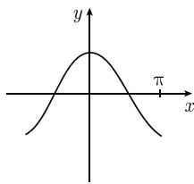
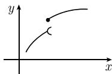

# 《数学指南——实用数学手册》1.4.3 递增函数和递减函数

本节是 1.4「一个实变量函数的微分法」的第三个子节，收录三项彼此独立的数学陈述：**递增（递减）判别法**（用导数的符号判定单调性）、两个直接应用该判别法的例子，以及微分学中最著名的**中值定理**；随后在实分析层面补充**勒贝格定理**（单调函数的正则性）。全节不含证明，只给出陈述与几何直观说明。

## 递增（递减）判别法

原文表述（含方框公式）的完整转录：

> **递增（或递减）判别法** 设 $-\infty \leqslant a < b \leqslant \infty$，并令 $f:]a, b[ \to R$ 是可导的.
>
> (i) $f$ 是非递减的（相应地，非递增的），如果
>
> $$
> \boxed{f^{\prime}(x) \geqslant 0, \quad \text{对所有的} \quad x \in ]a, b[}
> $$
>
> （相应地 $f'(x) \leqslant 0$，对所有的 $x \in ]a, b[$）.
>
> (ii) 如果对所有的 $x \in ]a, b[$ 有 $f'(x) > 0$，则 $f$ 在 $]a, b[$ 上是递增的 $^{1)}$.
>
> (iii) 如果对所有的 $x \in ]a, b[$ 有 $f'(x) < 0$，则 $f$ 在 $]a, b[$ 上是递减的.

要点：

- 判别法的前提是 $f$ 在**开区间** $]a, b[$ 上可导，端点允许取无穷（$a = -\infty$ 或 $b = \infty$）。
- 三条判据中，(i) 与严格性的分离是本节的术语关键：非递减对应 $f' \geqslant 0$，而「递增」对应 $f' > 0$，即中文「递增」在此指**严格递增**。参见 [[concepts/单调函数与严格单调性]]。
- (ii) 带脚注 1)，该脚注在源文件中未给出正文。
- 判别法本身只以「如果」陈述；事实上 (i) 对区间上的可导函数是充要条件，而 (ii)(iii) 的严格判据并非必要（详见 [[concepts/递增与递减判别法]]）。

## 例 1 与例 2

**例 1** 令 $f(x) := \mathrm{e}^{x}$。由 $f'(x) = \mathrm{e}^{x} > 0$（其中 $x \in \mathbb{R}$）即得，函数 $f$ 在 $\mathbb{R}$ 上是递增的（图 1.32(a)）。

**例 2** 令 $f(x) := \cos x$。因为 $f'(x) = -\sin x < 0$（其中 $x \in ]0, \pi[$），由此即得 $f$ 在这个区间 $]0, \pi[$ 上是递减的（图 1.32(b)）。

例 2 所使用的导数 $(\cos x)' = -\sin x$ 属于 0.8.1 节重要导数表的内容，见 [[entities/表081重要导数表]]。

图 1.32 的两个子图分别对应：

| 子图 | 函数 | 原文题注 |
|---|---|---|
| (a) | $y = e^{x}$ | 递增函数与递减函数（图 1.32） |
| (b) | $y = \cos x$ | 同上 |

## 中值定理

> **中值定理** 令 $-\infty < a < b < \infty$。如果 $f: [a, b] \to \mathbb{R}$ 在开区间 $]a, b[$ 上是可导的，则存在一个数 $\xi \in ]a, b[$，使得
>
> $$
> \boxed{\frac{f(b) - f(a)}{b - a} = f^{\prime}(\xi).}
> $$
>
> 直观上这意味着，图 1.33 中割线的斜率与曲线在某一点 $\xi$ 处切线的斜率一样.

要点：

- 与判别法不同，中值定理**要求端点有限**（$-\infty < a < b < \infty$），且函数定义在**闭区间** $[a, b]$ 上、仅在**开区间** $]a, b[$ 上可导。
- 公式左端是区间上的平均变化率，即差商，见 [[concepts/差商]]；右端是某内点的切线斜率，见 [[concepts/切线与切线方程]]。
- 图 1.33 给出几何图示：曲线在 $\xi$ 处的切线与两端点连线（割线）平行。
- 该定理在本 wiki 中尚无同名页面；须注意与已有的 [[concepts/中值定理-介值定理]]（连续函数的**介值定理**）区分，二者是不同定理，参见 [[queries/143节中值定理与介值定理同名冲突]]。

## 勒贝格定理

> **勒贝格（Lebesgue）定理** 令 $-\infty \leqslant a < b \leqslant \infty$。对一个严格递增函数 $f:]a, b[ \to \mathbb{R}$，有：
>
> (i) 除有限个点外，$f$ 都是连续的，其中 $f$ 在有限个不连续点处的左极限和右极限存在.
>
> (ii) $f$ 几乎处处可导 $^{2)}$（图 1.34）.

要点：

- 勒贝格定理的自由度最大：区间端点重新允许取无穷（$-\infty \leqslant a < b \leqslant \infty$），但函数被限定为**严格递增**。
- (i) 说明单调函数的间断点只能是跳跃型的，且至多有限个——这是 [[concepts/连续函数]] 与 [[concepts/单侧极限]] 语境下的正则性结论。
- (ii) 的「几乎处处可导」由脚注 2) 引入，该脚注在源文件中未给出正文，见 [[queries/143节脚注1与脚注2内容未录]]。
- 图 1.34 在本节图片资源中**加载失败**，仅标题可见，见 [[queries/143节图134未能加载]]。

## 图片资源状态

源文件引用 4 张本地图片，其中图号与内容的对应关系如下：

| 引用序号 | 原文题注 | 加载状态 | 说明 |
|---|---|---|---|
| 1 | (a) $y = e^{x}$ | 成功 | 图 1.32(a)，示意递增函数 |
| 2 | (b) $y = \cos x$ | 内容未能确认 | 图 1.32(b)，示意递减函数 |
| 3 | 图 1.33 中值定理 | 成功 | 割线与平行切线的几何图示 |
| 4 | 图1.34 | 失败 | 勒贝格定理附图 |

## 在全节中的位置

本节承接 [[sources/10-数学指南实用数学手册--6-141-导数--1th0aph]]（1.4.1 导数）与 [[sources/10-数学指南实用数学手册--8-142-链式法则--1lnjr5z]]（1.4.2 链式法则），是把导数符号「读出」函数单调性的第一个应用性子节，同时把讨论从初等内容推进到实分析（勒贝格定理）。父节 [[sources/10-数学指南实用数学手册--14-14-一个实变量函数的微分法--1b14tgz]] 的正文尚未入库。

## 相关页面

- [[concepts/递增与递减判别法]] — 本节第一条陈述
- [[concepts/单调函数与严格单调性]] — 非递减／递增的术语辨析
- [[concepts/中值定理-微分中值定理]] — 本节第二条陈述
- [[concepts/勒贝格定理-单调函数]] — 本节第三条陈述
- [[concepts/几乎处处可导]] — 勒贝格定理 (ii) 的核心限定词
- [[entities/勒贝格]] — 冠名人物
- [[concepts/导数]]、[[concepts/可导性与连续性]]、[[concepts/区间]]

<!-- llm-wiki:embedded-images -->
## Embedded Images

### Document

<!-- llm-wiki:embedded-images -->
