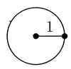
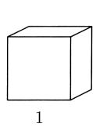
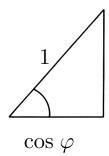
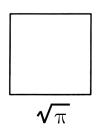
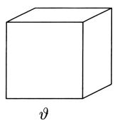
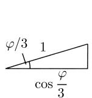
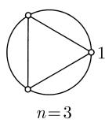

# 《数学指南——实用数学手册》2.6 伽罗瓦理论和代数方程

## 来源概述

本节是《数学指南——实用数学手册》第 2 章"代数"中紧接 [[sources/10-数学指南实用数学手册--7-25-代数结构--necedq]]、[[伽罗瓦理论]] 引文之后的正式章节，系统陈述 [[伽罗瓦]] 于 19 世纪 30 年代创立的域论—群论对应理论，并以其为工具解决三个著名古代作图问题。章首题词出自 D. J. 斯特罗伊克（Struik）；2.6.6 节引言出自青年 [[高斯]] 在 1796 年发表于 *Intelligenzblatt der allgemeinen Literaturzeitung* 的公告。

本节所依据的学科脉络：以 [[阿贝尔]]（1824 年，22 岁）关于一般五次方程根式不可解性的证明与伽罗瓦（1830 年，独立得到同一结果）的工作为核心，向上追溯至 [[拉格朗日]] 与 [[柯西]] 的先行工作，向下统摄高斯关于分圆域与正多边形作图的结果。

## 章节结构

| 小节 | 标题 | 主题 |
|------|------|------|
| 2.6.1 | 三个著名古代问题 | 化圆为方、倍立方体（第罗斯问题）、三等分任意角 |
| 2.6.2 | 伽罗瓦理论的主要定理 | 域扩张、次数、伽罗瓦群、伽罗瓦对应 |
| 2.6.3 | 广义代数学基本定理 | 代数元/超越元、代数闭包、分裂域 |
| 2.6.4 | 域扩张的分类 | 可分扩张、正规扩张、单扩张 |
| 2.6.5 | 根式可解方程的主定理 | 根式可解定义、阿贝尔-伽罗瓦定理 |
| 2.6.6 | 尺规作图 | 可作性判据、三大问题不可解性、高斯定理 |

## 2.6.1 三个著名古代问题

在经典希腊数学文化中，只允许用圆规和直尺作图，有三个直到 19 世纪才被证明不可解的问题：

- (i) 化圆为方；
- (ii) 倍立方体（第罗斯问题）；
- (iii) 三等分任意角。

除这些问题外，"用直尺和圆规作正多边形"在古代也是重要问题。它们最终都归结为代数方程可解性问题（见 2.6.6）。

## 2.6.2 伽罗瓦理论的主要定理

**域扩张**：域扩张 $K \subseteq E$（记作 $(E|K)$）是包含给定域 $K$ 作为子域的域 $E$。满足

$$
K \subseteq Z \subseteq E
$$

的子域 $Z$ 称为该扩张的**中间域**。域扩张链

$$
K_0 \subseteq K_1 \subseteq \dots \subseteq E
$$

是域 $E$ 的一组具有所指包含关系的子域。

**伽罗瓦理论的基本思想**：考虑一类重要的域扩张（伽罗瓦扩张），借助其对称群（伽罗瓦群）的全部子群确定出全部中间域，从而把（一般较难的）域论问题归结为（容易得多的）群论问题。文中明确将此类比为"拓扑问题归结为代数问题""连续李群的研究归结为李代数研究"。

**域扩张的次数**：将 $E$ 视为 $K$ 上的线性空间，其维数称为扩张的次数，记作 $[E:K]$；次数有限时称有限域扩张。

- 例 1：$\mathbb{Q} \subseteq \mathbb{R}$ 是无限扩张。
- 例 2：$\mathbb{R} \subseteq \mathbb{C}$ 是有限扩张，次数为 2，基为 $1, \mathrm{i}$（见 2.5.3）。$\mathbb{Q} \subseteq \mathbb{R}$ 是超越扩张，而 $\mathbb{R} \subseteq \mathbb{C}$ 是单代数扩张。

**次数定理**：若 $Z$ 是有限域扩张 $K \subseteq E$ 的中间域，则 $K \subseteq Z$ 也是有限扩张，且

$$
[E:K] = [Z:K]\,[E:Z].
$$

**伽罗瓦群**：扩张 $K \subseteq E$ 的伽罗瓦群 $G_K^E$（或记作 $\mathrm{Gal}(E|K)$）定义为域 $E$ 的全部"平凡地作用于 $K$ 的所有元素"的自同构组成的群。有限域扩张 $K \subseteq E$ 称为**伽罗瓦扩张**，如果

$$
\mathrm{ord}\,G_K^E = [E:K],
$$

即存在个数与扩张次数相同的 $E$ 在 $K$ 上的对称性。

**主要定理**：设 $K \subseteq E$ 是有限伽罗瓦扩张，则在中间域 $Z$ 与子群 $H \subset G_K^E$ 之间存在一一对应；对应到 $Z$ 的子群 $H$ 由所有使 $Z$ 的全部元素不变的自同构组成。中间域是 $K$ 上的伽罗瓦域，当且仅当对应于它的子群 $H$（同构于 $G_K^Z$）是 $G_K^E$ 的[[正规子群]]。

**推论**：有限伽罗瓦扩张 $K \subseteq E$ 没有中间伽罗瓦域扩张，当且仅当扩张的伽罗瓦群是[[单群]]。

**例 3（$\mathbb{R} \subseteq \mathbb{C}$）**：设 $\varphi$ 保持所有实数不变，由 $\mathrm{i}^2=-1$ 得 $\varphi(\mathrm{i})^2=-1$，故 $\varphi(\mathrm{i})=\mathrm{i}$ 或 $-\mathrm{i}$，分别对应单位自同构与复共轭

$$
\varphi(a + b\mathrm{i}) := a - b\mathrm{i}.
$$

因此 $G_{\mathbb{R}}^{\mathbb{C}} = \{\mathrm{id}, \varphi\}$，$\varphi^2 = \mathrm{id}$，且 $[\mathbb{C}:\mathbb{R}] = \mathrm{ord}\,G_{\mathbb{R}}^{\mathbb{C}} = 2$，故 $\mathbb{C}|\mathbb{R}$ 是伽罗瓦扩张，伽罗瓦群是 2 阶循环群，且无中间域扩张。

**例 4（$x^2-2=0$）**：令 $\vartheta := \sqrt{2}$，$\mathbb{Q}(\vartheta)$ 为含 $\mathbb{Q}$ 与 $\vartheta$ 的最小子域，则

$$
x^2 - 2 = (x-\vartheta)(x+\vartheta),
$$

即 $\mathbb{Q}(\vartheta)$ 是分裂域。其中元素形如

$$
a + b\vartheta,\quad a,b\in\mathbb{Q},
$$

扩张是 2 次伽罗瓦扩张，伽罗瓦群 $G_{\mathbb{Q}}^{\mathbb{Q}(\vartheta)} = \{\mathrm{id}, \varphi\}$（原文此处排版作 $\vartheta\mathrm{d}$，见待查问题），$\varphi(a+b\vartheta) := a-b\vartheta$ 由零点 $\vartheta,-\vartheta$ 的对换生成。

**例 5（分圆方程）**：$p$ 为素数时，$x^p-1=0$ 在 $\mathbb{Q}$ 中有解 $x=1$。令 $\vartheta := \mathrm{e}^{2k\pi\mathrm{i}/p}$，则

$$
x^p - 1 = (x-1)(x-\vartheta)\dots(x-\vartheta^{p-1}),
$$

$E := \mathbb{Q}(\vartheta)$ 是分裂域，其元素形如

$$
a_0 + a_1\vartheta + a_2\vartheta^2 + \dots + a_{p-1}\vartheta^{p-1},\quad a_j\in\mathbb{Q},
$$

且 $[\mathbb{Q}(\vartheta):\mathbb{Q}]=p$。伽罗瓦群 $G_{\mathbb{Q}}^{\mathbb{Q}(\vartheta)}=\{\varphi_0,\dots,\varphi_{p-1}\}$ 由

$$
\varphi_k(\vartheta) := \vartheta^k
$$

生成，是 $p$ 阶循环群，因而单，故扩张单。

## 2.6.3 广义代数学基本定理

- $K[x]$ 记 $K$ 上多项式环：$p(x) := a_0 + a_1x + \dots + a_nx^n$。
- $K(x)$ 记 $K$ 上有理函数域：$p(x)/q(x)$，$q \neq 0$。
- $\vartheta$ 在 $K$ 上**代数**：$\vartheta$ 是某个 $K$ 上多项式的零点；否则**超越**。
- 扩张 $E|K$ 代数/超越：$E$ 的每个元素在 $K$ 上代数/否则。
- **不可约多项式**：不能表示为两个 $K$ 上次数 $\geqslant 1$ 的多项式之积。
- **代数闭域**：每个 $K$ 上多项式都可分解为 $E$ 上线性因子之积。
- **代数闭包**：$K$ 的代数闭扩张 $E$，且没有非平凡（$\neq E$）子域具此性质。

**施泰尼茨广义代数学基本定理**：每个域 $K$ 都有唯一的（在保持 $K$ 的所有元素不变的同构意义下）代数闭包，记作 $\bar{K}$。

**分裂域**：使给定多项式 $p(x)$ 可在其中分解为线性因子之积的 $\bar{K}$ 的最小子域。

例：$\mathbb{C}$ 是 $\mathbb{R}$ 的代数闭包，且由

$$
x^2 + 1 = (x-\mathrm{i})(x+\mathrm{i})
$$

知 $\mathbb{C}$ 同时是 $x^2+1$ 的分裂域。

## 2.6.4 域扩张的分类

定义（$E|K$ 为域扩张）：

- (a) $K$ 上不可约多项式称为**可分多项式**，如果它没有重零点（零点在 $\bar{K}$ 中）。
- (b) $E|K$ 称为**可分扩张**，如果它是代数扩张，且 $E$ 的每个元素都是某个 $K$ 上不可约可分多项式的零点。
- (c) $E|K$ 称为**正规扩张**，如果它是代数扩张，且每个 $K$ 上不可约多项式或在 $E$ 中没有零点，或在 $E$ 中完全分解为线性因子之积。

定理：

1. 每个有限域扩张都是代数扩张。
2. 每个有限可分扩张是单扩张。
3. 特征 0 的域或有限域的每个代数扩张是可分的。

**伽罗瓦扩张的特征**：

1. $E|K$ 是伽罗瓦扩张，如果它是有限、可分和正规的。
2. $E|K$ 是伽罗瓦扩张，当且仅当 $E$ 是定义在 $K$ 上的某个不可约多项式的分裂域。
3. 若 $K$ 有特征 0 或是有限的，则 $E|K$ 是伽罗瓦扩张当且仅当 $E$ 是某个 $K$ 上多项式的分裂域。

**单超越域扩张**：域 $K$ 的每个单超越扩张同构于有理函数域 $K(x)$。

**单代数域扩张**：设 $p(x)$ 是 $K$ 上不可约多项式，考虑符号 $\vartheta$ 与所有

$$
a_0 + a_1\vartheta + \dots + a_m\vartheta^m,\quad a_j\in K \tag{2.62}
$$

形式表达式，按通常方式定义运算并注意 $p(\vartheta)=0$。所得域 $K(\vartheta)$ 是 $K$ 的单代数扩张且 $\vartheta$ 是 $p(x)$ 的零点，并有

$$
[E:K] = \deg p(x).
$$

若 $(p(x))$ 表示 $K[x]$ 中由 $p(x)$ 生成的理想，则商环 $K[x]/(p(x))$ 是同构于 $K(\vartheta)$ 的域。取遍所有 $K$ 上不可约多项式，即得 $K$ 的全部单代数扩张（同构意义下）。

例：$K=\mathbb{R}$，$p(x):=x^2+1$，则 $\vartheta^2=-1$，$\vartheta$ 对应虚数单位 $\mathrm{i}$，$K(\vartheta)=\mathbb{C}$，即 $\mathbb{C}=\mathbb{R}[x]/(x^2+1)$。

## 2.6.5 根式可解方程的主定理

考虑 $K$ 上不可约且可分的方程

$$
p(x) := a_0 + a_1x + \dots + a_{n-1}x^{n-1} + x^n = 0, \tag{2.63}
$$

$E$ 为其分裂域，$p(x)=(x-x_1)\dots(x-x_n)$，$x_j\in E$。

**目标**：用 $K$ 的元素及某些附加量 $\vartheta_1,\dots,\vartheta_k$ 表示零点 $x_1,\dots,x_n$。二次至四次方程的经典公式做到了这一点（$\vartheta_j$ 是系数的方根）。在拉格朗日（1736—1813）和柯西（1789—1857）工作的基础上，阿贝尔于 1824 年首先证明一般五次方程不存在此类公式；伽罗瓦于 1830 年独立得到同一结果。

**定义**：方程 (2.63) 称为**根式可解**的，如果分裂域 $E$ 可通过将数 $\vartheta_1,\dots,\vartheta_k$ 逐次添加到 $K$ 而得到，这些数满足

$$
\vartheta_j^{n_j} = c_j \tag{2.64}
$$

其中 $n_j \geqslant 2$，$c_j$ 在前一步构造的扩域中；若域 $K$ 的特征 $p$ 不为零，还要假设 $p$ 不是 $n_j$ 的因子。

等价地写作 $\vartheta_j = \sqrt[n_j]{c_j}$，对应扩张链

$$
K =: K_1 \subseteq K_2 \subseteq \dots \subseteq K_{k+1} =: E,
$$

其中 $K_{j+1}=K_j(\vartheta_j)$，$c_j\in K_j$。于是

$$
x_j = P_j(\vartheta_1,\dots,\vartheta_k),\quad j=1,\dots,n,
$$

$P_j$ 为系数在 $K$ 中的多项式。

**主定理**：代数方程 (2.63) 根式可解，当且仅当扩张 $E|K$ 的伽罗瓦群 $G_K^E$ 是[[可解群]]。

**定义（$n$ 次一般方程）**：$K := \mathbb{Z}(a_0,\dots,a_{n-1})$（原文如此书写，应为有理函数域，见待查问题）上的方程 (2.63)，其中 $K$ 由所有有理函数 $p(a_0,\dots,a_{n-1})/q(a_0,\dots,a_{n-1})$ 组成，$p,q$ 为整系数多项式且 $q$ 非零。

**阿贝尔-伽罗瓦定理**：当 $n \geqslant 5$ 时 $n$ 次一般方程不是根式可解的。

**证明概要**：将 $x_1,\dots,x_n$ 看作变量，考虑所有整系数有理函数

$$
\frac{P(x_1,\dots,x_n)}{Q(x_1,\dots,x_n)} \tag{2.65}
$$

的域 $E := \mathbb{Z}(x_1,\dots,x_n)$。由

$$
p(x) = (x-x_1)(x-x_2)\dots(x-x_n) = a_0 + a_1x + \dots + a_{n-1}x^{n-1} + x^n
$$

比较系数可知 $a_0,\dots,a_{n-1}$（除符号外）是 $x_1,\dots,x_n$ 的初等对称函数，例如 $-a_{n-1}=x_1+\dots+x_n$。所有 (2.65) 形式且 $P,Q$ 关于 $x_1,\dots,x_n$ 对称的表达式构成 $E$ 的一个子域，同构于 $K$，故可与 $K$ 等同。$p(x)$ 不可约且在 $K$ 上可分，$E$ 是它的分裂域，因而 $E|K$ 是伽罗瓦扩张；$x_1,\dots,x_n$ 的置换给出保持 $K$ 不变的 $E$ 的自同构，且不同置换对应不同自同构，于是

$$
\mathrm{Gal}(E|K) \cong \mathcal{S}_n.
$$

$n=2,3,4$ 时 $\mathcal{S}_n$ 可解，$n\geqslant 5$ 时不可解（见 2.5.1.4），故阿贝尔-伽罗瓦定理是主定理的推论。

## 2.6.6 尺规作图

**主定理**：点 $(x,y)$ 可以借助直尺和圆规由点 $P_1,\dots,P_n$ 作出，当且仅当 $x$ 和 $y$ 属于 $K$ 的次数为

$$
[E:K] = 2^m \tag{2.66}
$$

的伽罗瓦域扩张 $E$（$m$ 为某自然数），其中 $K$ 是实数域中含所有 $x_j,y_j$ 的最小子域。

线段版本：线段 $\vartheta$ 可由长为 $y$ 的线段及单位线段用直尺和圆规作出，当且仅当 $\vartheta$ 属于 $K := \mathbb{Q}(y)$ 的伽罗瓦域扩张 $E$ 且 (2.66) 成立。

**化圆为方不可解**：设正方形边长 $\vartheta$，则

$$
\vartheta^2 = \pi.
$$

F. 林德曼（希尔伯特的老师）于 1882 年（时年 30 岁）证明 $\pi$ 在 $\mathbb{Q}$ 上超越，故 $\pi$（因而 $\vartheta$）不可能是 $\mathbb{Q}$ 的任何代数扩张的元素。

**倍立方体不可解**：体积为 2 的立方体边长 $\vartheta$ 满足

$$
x^3 - 2 = 0.
$$

$x^3-2$ 在 $\mathbb{Q}$ 上不可约，故

$$
\mathbb{Q} \subset \mathbb{Q}(\vartheta) \subseteq E,\quad [\mathbb{Q}(\vartheta):\mathbb{Q}]=3,
$$

由次数定理 $[E:\mathbb{Q}] = 3\,[E:\mathbb{Q}(\vartheta)]$，不可能等于 $2^m$。

**三等分任意角不可解**：归约为由长 $\cos\varphi$ 的线段与单位线段作出 $\vartheta=\cos\frac{\varphi}{3}$，即

$$
4x^3 - 3x - \cos\varphi = 0. \tag{2.67}
$$

取 $\varphi = 60^\circ$，$\cos\varphi = \frac{1}{2}$，(2.67) 左边的多项式在 $\mathbb{Q}$ 上不可约，同样推理给出 $\vartheta$ 不属任何次数为 $2^m$ 的扩域，故 $60^\circ$ 角不能三等分。

**分圆方程**：$x^n - 1 = 0$ 的复数解将单位圆 $n$ 等分。由此得

**高斯定理**：正 $n$ 边形可用直尺和圆规作出，当且仅当

$$
n = 2^m p_1p_2\dots p_r, \tag{2.68}
$$

其中 $m$ 为自然数，$p_j$ 是两两互异的形如

$$
2^{2^k} + 1,\quad k = 0,1,\dots \tag{2.69}
$$

的素数（$2^{2^k}$ 理解为 $2^{(2^k)}$）。已知 $k=0,1,2,3,4$ 时为素数，对应素数

$$
2,\quad 3,\quad 5,\quad 17,\quad 257,\quad 65537.
$$

$n \leqslant 20$ 时可作的正 $n$ 边形为

$$
n = 3,4,5,6,8,10,12,15,16,17,20.
$$

脚注：[[费马]]（1601—1665）曾猜测 (2.69) 中的数都是素数，但[[欧拉]]发现 $k=5$ 时该数是合数 $641\cdot6700417$。

## 插图

图 2.4 汇总了 (a) 化圆为方、(b) 倍立方体、(c) 三等分一个角、(d) 圆的等分四类作图问题。

## 相关页面

- 核心理论：[[伽罗瓦理论]]、[[伽罗瓦群]]、[[伽罗瓦扩张]]、[[分裂域]]
- 人物：[[伽罗瓦]]、[[阿贝尔]]、[[高斯]]、[[林德曼]]、[[费马]]、[[欧拉]]、[[柯西]]、[[拉格朗日]]、[[施泰尼茨]]
- 群论工具：[[可解群]]、[[单群]]、[[正规子群]]、[[置换群-对称群]]
- 域论基础：[[域与体]]、[[多项式环]]、[[理想与商环]]、[[有理函数域]]、[[复数域的哈密顿构造]]
- 应用：[[尺规作图可作性判据]]、[[高斯定理-正多边形作图]]

<!-- llm-wiki:embedded-images -->
## Embedded Images

### Document

<!-- llm-wiki:embedded-images -->
