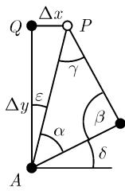

# 《数学指南——实用数学手册》3.2.2 对大地测量学的应用

## 概述

本节属于《数学指南——实用数学手册》3.2「初等几何学」的平面三角学应用部分，用测量地面上的三角形来说明平面三角学的实用性，并给出大地测量中三个经典基本问题的完整计算公式。

## 平面近似的前提

大地测量学是一门度量地球表面的科学，其手段是**三角剖分**——用三角形网络覆盖并度量地面。严格地说，这些三角形是球面三角形；但如果它们相对于球面足够小，就可当作平面三角形，从而应用平面三角学的公式。本节明确断言：**大地测量学的大多数应用都属于这种情形**。只有当大海和空中旅行所使用的三角形大到一定程度时，才必须改用球面三角学（参看 3.2.4）的公式。这一近似边界是本节全部平面公式成立的前提。

## 塔高与到塔的距离（互为反解的两例）

**塔的高度**：被测量的量是测量点到塔的距离 $d$ 与倾角 $\alpha$，计算为

```
h = d · tan α
```

**到一个塔的距离**：已知塔高 $h$，被测量的量是倾角 $\alpha$，计算为

```
d = h · cot α
```

两式互为反解，直接来自直角三角形的边角关系。

## 大地测量学的基本公式

设已知笛卡儿坐标 $(x_A, y_A)$ 与 $(x_B, y_B)$ 给出的两点 $A$、$B$，并假定 $x_A < x_B$（图 3.11），则距离 $d = AB$ 与角 $\alpha$ 为

```
d = √((x_A − x_B)² + (y_A − y_B)²)
α = arctan((y_B − y_A) / (x_B − x_A))
```

图 3.11(a) 对应 $y_B > y_A$，$\alpha > 0$；图 3.11(b) 对应 $y_B < y_A$，$\alpha < 0$。

## 3.2.2.1 第一基本问题（前向切割）

已知 $A$、$B$ 两点的坐标，被测量的量是图 3.12 中的角 $\alpha$ 与 $\beta$，要求第三点 $P$ 的笛卡儿坐标 $(x, y)$。计算由下式确定 $c$、$b$ 与 $\delta$：

```
c = √((x_B − x_A)² + (y_B − y_A)²)
b = c · sin β / sin(α + β)
δ = arctan((y_B − y_A) / (x_B − x_A))
```

进而得到

```
x = x_A + b · cos(α + δ)
y = y_A + b · sin(α + δ)
```

**源文件给出的证明**：利用图 3.12 中的直角三角形 $APQ$，有

```
x = x_A + Δx = x_A + b · sin ε
y = y_A + Δy = y_A + b · cos ε
```

由 $\varepsilon = \pi/2 - \alpha - \delta$ 得到 $\sin\varepsilon = \cos(\alpha+\delta)$、$\cos\varepsilon = \sin(\alpha+\delta)$；由正弦定律得到 $b = c\,\sin\beta/\sin\gamma$；最后对 $\gamma = \pi - \alpha - \beta$（三角形的和角）得到 $\sin\gamma = \sin(\alpha+\beta)$。

## 3.2.2.2 第二基本问题（后向切割）

已知具笛卡儿坐标 $(x_A, y_A)$、$(x_B, y_B)$、$(x_C, y_C)$ 的三点 $A$、$B$、$C$，被测量的量是图 3.13 中在 $P$ 处测得的角 $\alpha$ 与 $\beta$，要求 $P$ 的坐标 $(x, y)$。**这个问题只能在这四点不共圆时才有解。**

计算先由辅助量出发：

```
x₁ = x_A + (y_C − y_A) · cot α
y₁ = y_A + (x_C − x_A) · cot α

x₂ = x_B + (y_B − y_C) · cot β
y₂ = y_B + (x_B − x_C) · cot β
```

再计算 $\mu$ 与 $\eta$：

```
μ = (y₂ − y₁) / (x₂ − x₁)
η = 1 / μ
```

最终得到

```
y = y₁ + (x_C − x₁ + (y_C − y₁) · μ) / (μ + η)

x = { x_C − (y − y_C) · μ,   当 μ < η
    { x₁ + (y − y₁) · η,     当 η < μ
```

源文件未给出该公式的证明，仅列出计算步骤。

## 3.2.2.3 第三基本问题（对不能直接测量的距离的计算）

要求出图 3.14 中两点 $P$、$Q$ 之间的距离 $\overline{PQ}$，例如它们被一个湖分隔而无法直接测量。被测量的量是距离 $c = \overline{AB}$（另外两点 $A$、$B$ 之间的基线）以及四个角 $\alpha$、$\beta$、$\gamma$、$\delta$。

计算由辅助量

```
ρ = 1 / (cot α + cot δ)
σ = 1 / (cot β + cot γ)
```

以及

```
x = σ · cot β − ρ · cot α
y = σ − ρ
```

得到

```
d = √(x² + y²)
```

源文件同样未给出该公式的证明。

## 图像资源

```
media/10-数学指南实用数学手册--13-322-对大地测量学的应用--1rq43fu/001-034a8ca9fc8a44785c6b6277a7456ac4476e376272ef9d44ace3d3e7d468e5c8.jpg
media/10-数学指南实用数学手册--13-322-对大地测量学的应用--1rq43fu/002-5cb5a4835064372c3482a49d1eec0544358c09c4eb031c33045155b91951fa5e.jpg
media/10-数学指南实用数学手册--13-322-对大地测量学的应用--1rq43fu/003-e4903d3b2b6d4ab89c1d249768b7a8d06ae0ed6c89b38290efdb58499d806ae5.jpg
media/10-数学指南实用数学手册--13-322-对大地测量学的应用--1rq43fu/004-aba9460ea1e2e2baf9a8c96c2e4fe0ff059058ad15dd98e861d3a168af5f2dc5.jpg
media/10-数学指南实用数学手册--13-322-对大地测量学的应用--1rq43fu/005-2916f516f91c40b25283d91491348c2d5da64bd2322e6619da4a29acb6c2088d.jpg
media/10-数学指南实用数学手册--13-322-对大地测量学的应用--1rq43fu/006-0f72be3beddd3583387e645dc7bac28d6a72bc88722d8c182f1ed82716ccf3a4.jpg
media/10-数学指南实用数学手册--13-322-对大地测量学的应用--1rq43fu/007-2e890c04f84a0269bcf973a8ef3b7907e7057a63cb659cf28b1329c9f63f07ae.jpg
```

图 3.10 对应塔高示意；图 3.11(a)(b) 对应大地测量基本思想（距离与方向角）；图 3.12(a)(b) 对应前向切割；图 3.13 对应后向切割（$A$、$B$、$C$ 与 $P$ 的关系）；图 3.14 对应跨湖基线与四角测量。其中 005 号图像在源文件中位于 004 与 006 之间，未被正文图注直接引用。

## 与现有 wiki 的联系

- 节主题与 [[concepts/对大地测量学的应用]]、[[concepts/大地测量学]] 直接对应。
- 证明用到的定理已在 [[concepts/正弦定律]]、[[concepts/和角定律]]、[[concepts/笛卡儿坐标]] 中记录。
- 平面近似的失效边界指向 [[concepts/球面三角形]] 与 [[concepts/球面几何学]]，对应尚未录入的 3.2.4 节。
- 上级纲目见 [[sources/10-数学指南实用数学手册--8-32-初等几何学--hrjbm1]]。

## 存疑之处

- 第二基本问题的辅助量公式中，$x$ 方向使用 $(y_C - y_A)\cot\alpha$、$y$ 方向使用 $(x_C - x_A)\cot\alpha$，两式的对称性可疑，且 $\mu < \eta$ 与 $\eta < \mu$ 的分支条件是否与取解式自洽，源文件未给证明。详见 [[queries/322节第二基本问题公式对称性与分支条件存疑]]。
- 正文「对于大地测量学而言. 大多数的应用都是这种情形」一句使用了句号而非逗号，疑为排印或 OCR 问题。

## 相关页面

- [[findings/大地测量学平面近似与球面三角学适用边界]]
- [[findings/塔高与塔距互反两例公式]]
- [[findings/大地测量学基本公式由笛卡儿坐标求距离与方位角]]
- [[findings/第一基本问题前向切割公式与证明]]
- [[findings/第二基本问题后向切割公式与不共圆可解条件]]
- [[findings/第三基本问题跨湖距离公式]]

<!-- llm-wiki:embedded-images -->
## Embedded Images

### Document





<!-- llm-wiki:embedded-images -->
