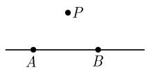
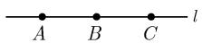
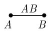
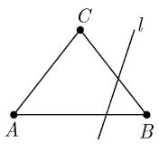
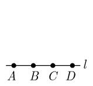
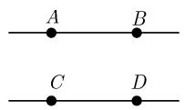
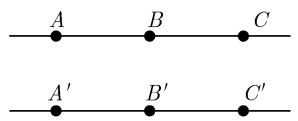
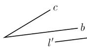
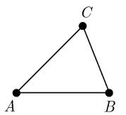
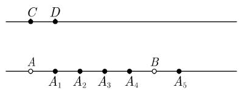

# 《数学指南——实用数学手册》3.2.5 几何的希尔伯特公理

## 题记与引文

本节以两句题记开篇：

> 人类的所有知识始于感性, 而后过渡到知性, 最后终结于理性.
> —— I. 康德 (1724—1804), *Kritik der reinen Vernunft, Elementarlehre* $^{1)}$

> 恰如数对于算术那样, 几何需要被置于只由几个简单原理组成的严格基础之上. 称这些原理为几何公理. 从这些公理进行的推演以及对其中的内在联系的研究是一项艰巨的工作, 它从欧几里得以来一直催生了许多杰出的数学专著. …… 这项工作其意义等于是对我们的空间感觉的逻辑分析.
> —— D. 希尔伯特 (1862—1943), 《几何原理》

## 主旨

本节给出**平面几何的希尔伯特公理体系**（1899）。其叙述顺序为：

1. 几何公理化的两次历史节点（欧几里得《几何原本》与希尔伯特《几何基础》）；
2. 平面几何的**基本概念**（不加定义的原始概念）；
3. 关联公理、次序公理，以及由公理定义的概念（线段、射线、角）与帕施公理；
4. 由直线对平面的分解定理；
5. 线段与角的全等公理；
6. 阿基米德公理与完全性公理；
7. 希尔伯特定理（相容性结论）。

源文声明「为使叙述清晰, 我们将只限于论及平面几何的公理」，并提示公理与欧几里得平行公理紧密相关，后者在 3.2.6 讨论；进一步内容参看 3.2.6 到 3.2.8。

## 两次公理化表述

- **第一个系统表述**：欧几里得《几何原本》（公元前 365—前 300），「被一成不变地教授了两千多年」。
- **第一个完全严格的、以现代观点的公理化表述**：希尔伯特《几何基础》，发表于 **1899 年**；「在 1987 年又由 Teubner-Verlag 出版社推出了它的第十三版」。

源文评价这些公理「相当形式，又似乎枯燥」，但它们是「一个冗长又单调的认识论道路的成果，而这条道路上充斥着错误，沿着这条道路处处是误解」。

## 平面几何的基本概念

> 点, 线, 关联$^{2)}$, 之间, 全等.

源文强调：在构建几何的基础中，这些概念**是不能被描述的**。此观点「正如希尔伯特第一个所指出的」，是「数学中每个现代公理化处理的基础」。源文承认这种「没有上下文字解释的现代数学形式」是「一个显见的哲学上的弱点」，但「事实上, 它却是这种方式的强大活力之一, 并且是数学思考的典型方式」。

## 公理原文

### 关联公理（图 3.21(a)）

(i) 对于两个不同的点 A 和 B, 恰好有一条直线既通过 A 也通过 B.

(ii) 在一条直线上至少有两个点.

(iii) 存在三个点, 它们不全在同一条直线上.

### 次序公理（图 3.21(b)）

(i) 若一点 B 位于点 A 和点 C 之间, 则 A, B 和 C 是在同一条直线上的三个不同的点, 并且点 B 也在 C 和 A 之间.

(ii) 对每两个不同的点 A 和 C, 存在一点 B 位于 C 和 A 之间.

(iii) 若三个不同的点在一条直线上, 则正好只有它们中的一个点位于其他两点之间.

### 线段的定义（图 3.21(c)）

设 A 和 B 为直线 $l$ 上的两个不同点. 线段 $AB$ 是 $l$ 上所有位于 A 和 B 之间的点的集合. 点 A 和 B 在此情形也被计算在内.

### 帕施公理（图 3.21(d)）

设 A, B 和 C 为三个不在一条直线上的不同点. 另外, 设 $l$ 为一条直线, 在它之上没有这三个点中任何一个点. 若直线 $l$ 与线段 $AB$ 相交, 则 $l$ 也与线段 $BC$ 或线段 $AC$ 相交.

### 射线的定义（图 3.21(e), (f)）

设 A, B, C 和 D 为在一条直线 $l$ 上的四个不同点，其中 C 在 A 和 D 之间但不在 A 与 B 之间，我们则说点 A 和 B 位于 C 的同一边，而 A 和 D 在 C 的不同边.

在 C 的一边的所有点的集合被称为一条射线.

### 角的定义（图 3.21(g)）

角 $\angle(b, c)$ 是两条射线 $b$ 和 $c$ 的集合 $\{b, c\}$，它们属于不同的直线并由一个公共点 $A$ 出发. 也可用记号 $\angle(c, b)$ 代替 $\angle(b, c)^{1)}$。若 $B$（分别地，$C$）是射线 $b$（分别地，$c$）上的一个点，这里的 $B$ 和 $C$ 都不同于点 $A$，则我们记 $\angle BAC$ 或 $\angle CAB$ 以代替 $\angle(b,c)$。

### 关于由一条直线对平面的分解定理（图 3.22）

若 $l$ 是一条直线, 则所有点或是在直线 $l$ 上或是在两个集合 $\mathcal{A}$ 和 $\mathcal{B}$ 之一, 这两个集合具下面的性质:

(i) 如果点 $A$ 在 $\mathcal{A}$ 中, 而点 $B$ 在 $\mathcal{B}$ 中, 则线段 $AB$ 与直线 $l$ 相交.

(ii) 若两个点 $A$ 和 $A'$（分别地，$B$ 和 $B'$）位于 $\mathcal{A}$（分别地，$\mathcal{B}$），则线段 $AA'$（分别地，$BB'$）与直线 $l$ 不相交.

定义 $\mathcal{A}$（分别地，$\mathcal{B}$）中的点位于直线 $l$ 的一侧（分别地，另一侧）。

### 全等的记号

线段和角的全等仍然是没有给出一个更为精确定义的概念. 直观地说, 全等的对象是可由一个运动把一个变到另一个. 符号

$$
\boxed{A B \simeq C D}
$$

表示线段 $AB$ 全等于线段 $CD$，又 $\angle ABC \simeq \angle EFG$，表示角 $\angle ABC$ 全等于角 $\angle EFG$。

### 线段的全等公理（图 3.23(a), (b)）

(i) 假设点 $A$ 和 $B$ 在一条直线 $l$ 上, 点 $C$ 在直线 $m$ 上. 则存在 $m$ 上的一个点 $D$ 使得

$$
A B \simeq C D.
$$

(ii) 若两条线段与第三条线段全等, 则它们也相互全等.

(iii) 设 $AB$ 和 $BC$ 为直线 $l$ 上的两条线段, 它们除 $B$ 外没有其他的公共点. 另外设 $A'B'$ 和 $B'C'$ 为线段 $l'$ 上的两条线段, 它们除去 $B'$ 外没有公共点, 则关系

$$
AB \simeq A'B', \quad BC \simeq B'C'
$$

总有

$$
AC \simeq A'C'.
$$

### 三角形的定义

三角形 $ABC$ 由三个不在一条的直线的三个点 $A, B$ 和 $C$ 组成.

### 角的全等公理（图 3.23(c), (d)）

(i) 每个角与自身全等, 即 $\angle(b, c) \simeq \angle(b, c)$.

(ii) 设 $\angle(b, c)$ 为一个角，且设 $b'$ 为直线 $l'$ 上的一条射线。于是存在射线 $c'$ 使

$$
\angle(b, c) \simeq \angle(b', c')
$$

并且 $\angle(b', c')$ 的所有内点在直线 $l'$ 的一边.

(iii) 设给定两个三角形 $ABC$ 和 $A'B'C'$。于是由

$$
AB \simeq A'B', \quad AC \simeq A'C', \quad \angle BAC \simeq \angle B'A'C'
$$

得出

$$
\angle ABC \simeq \angle A'B'C'.
$$

### 阿基米德公理（图 3.24）

若 $AB$ 和 $CD$ 为两条线段, 则在通过 $A$ 和 $B$ 的直线上存在点

$$
A_1, A_2, \dots, A_n
$$

使得线段 $AA_1, A_1A_2, \cdots, A_{n-1}A_n$ 全都全等于线段 $CD$ 而 $B$ 位于 $A$ 和 $A_n$ 之间$^{1)}$.

### 完全性公理

不可能以加进点或直线来扩张这个系统使得这些公理继续成立.

### 希尔伯特定理（1899）

若实数理论中没有矛盾, 则由这些公理定义的几何也不会出现矛盾.

## 图与脚注

本节含图 3.21（(a)–(g) 七幅子图，依次对应关联、次序、线段、帕施、射线两边、射线、角）、图 3.22（直线对平面的分解）、图 3.23（(a)–(d) 对线段和角的全等公理）与图 3.24（阿基米德公理）。

脚注标记 $^{1)}$ 出现在康德题记的 *Elementarlehre* 之后、角的定义中 $\angle(c, b)$ 记号处、以及阿基米德公理的结尾；脚注标记 $^{2)}$ 出现在基本概念列表中的「关联」处。源文未给出这些脚注的正文内容。

## 相关图像

（图像与图号的对应关系依据源文中图注的出现顺序推定；部分图像的视觉细节未能加载。）

## 相关页面

- [[concepts/希尔伯特公理体系]] — 本节即该体系的原始出处
- [[entities/希尔伯特]] — 体系提出者
- [[entities/欧几里得]] — 《几何原本》作者
- [[concepts/欧几里得平行公理]] — 源文提示在 3.2.6 讨论
- [[findings/希尔伯特公理的五组公理清单]] — 公理清单汇总
- [[findings/希尔伯特定理1899]] — 相容性结论
- [[queries/325节脚注标记1与2未落地]] — 脚注未落地问题
- [[queries/325节几何原理与几何基础译名不一致]] — 题记与正文书名不一致

<!-- llm-wiki:embedded-images -->
## Embedded Images

### Document

<!-- llm-wiki:embedded-images -->
