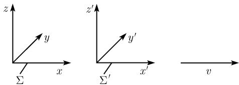

# 《数学指南——实用数学手册》3.9.5 对狭义相对论的应用

本页是《数学指南——实用数学手册》3.9 节「现代物理的几何」下属第 3.9.5 节的源文档摘要，位于原书约第 395 页。该节接续 [[闵可夫斯基几何]]，把 3.9.4 建立的闵可夫斯基空间 $M_4$ 几何语言落地到 [[狭义相对论]] 与经典电动力学，是「[[现代物理的几何]]」这一主题的应用性小节。

## 爱因斯坦相对性原理与惯性系

全节的出发点是爱因斯坦的相对性原理 (1905)：

$$
\text{在任意两个具有完全相同的初始条件和边界条件的惯性系中, 所有的物理过程被认定具有完全相同的性态.}\tag{3.89}
$$

源文把「惯性系」定义为：一个具有法正交基 $\boldsymbol{i}, \boldsymbol{j}, \boldsymbol{k}$ 的笛卡儿坐标系 $(x,y,z)$，使得关于时间 $t$，一个没有外力的物体处于静止状态或者沿直线匀速运动。

例 1 指出：在每个惯性系中的真空中，光速是常值，记为常数 $c$。

例 2 设 $\Sigma$ 与 $\Sigma'$ 为两个惯性系、轴相互平行，$\Sigma$ 中的观察者观察到 $\Sigma'$ 的原点运动方程为 $x = vt$（图 3.95）。源文由此引出 [[伽利略变换]] 与 [[特殊洛伦兹变换]] 的对比。

## 伽利略变换的失效与特殊洛伦兹变换

按伽利略的原理，坐标变换为

$$
x' = x - vt, \quad y' = y, \quad z = z', \quad t = t'.\tag{3.90}
$$

在 $\Sigma$ 中的光线 $x = ct$，在 $\Sigma'$ 中成为 $x' = (c - v)t'$：若在 $\Sigma$ 中光速为 $c$，则在 $\Sigma'$ 中为 $c - v$，例 1 的论述不成立。这正是爱因斯坦把伽利略变换换作特殊洛伦兹变换的原因：

$$
\boxed{x' = \frac{x - vt}{\sqrt{1 - v^{2}/c^{2}}}, \quad y' = y, \quad z' = z, \quad t' = \frac{t - vx/c^{2}}{\sqrt{1 - v^{2}/c^{2}}}.}\tag{3.91}
$$

由 $x = ct$ 得到 $x' = ct'$，例 1 的论述现在实际有效。当 $v$ 相对光速 $c$ 非常小时，(3.91) 近似于 (3.90)；更精确地，当 $c \to \infty$ 时 (3.91) 的极限是 (3.90)。一般地有：**当 $c \to \infty$ 时相对论的极限是经典物理**。源文同时强调：不存在绝对世界时这样的东西，每个惯性系有自己的时间概念；只允许 $|v| < c$；爱因斯坦还假定了更强的论述——在一个给定的惯性系中，任意一个物理作用最多以速度 $c$ 传递。

例 3：若惯性系 $\Sigma'$ 不平行于 $\Sigma$，可先用一个旋转 $\mathcal{D}$ 把 $\Sigma'$ 的轴转到与 $\Sigma$ 平行，再应用洛伦兹变换 (3.91)，最后施加逆旋转 $\mathcal{D}^{-1}$。

特殊洛伦兹变换 (3.91) 可用双曲函数特别简洁地写成

$$
\boxed{x' = x \cosh \alpha - ct \sinh \alpha, \quad y = y', \quad z = z', \quad ct' = ct \cosh \alpha - x \sinh \alpha,}
$$

其中

$$
\tanh \alpha = \frac{v}{c}, \quad \text{即} \quad \alpha := \operatorname{arctanh} \frac{v}{c}, \quad \text{且} \quad |v| < c.
$$

## 洛伦兹群与庞加莱群

源文考虑变换

$$
\begin{pmatrix} x' \\ y' \\ z' \\ ct' \end{pmatrix} = \mathcal{A} \begin{pmatrix} x \\ y \\ z \\ ct \end{pmatrix} + \begin{pmatrix} x_{0} \\ y_{0} \\ z_{0} \\ ct_{0} \end{pmatrix}\tag{3.92}
$$

并令

$$
\mathcal{L}_{v} := \begin{pmatrix} \beta & 0 & 0 & -\beta v/c \\ 0 & 1 & 0 & 0 \\ 0 & 0 & 1 & 0 \\ -\beta v/c & 0 & 0 & \beta \end{pmatrix}, \quad
\mathcal{D} := \begin{pmatrix} d_{11} & d_{12} & d_{13} & 0 \\ d_{21} & d_{22} & d_{23} & 0 \\ d_{31} & d_{32} & d_{33} & 0 \\ 0 & 0 & 0 & 1 \end{pmatrix},
$$

$$
\mathcal{S} := \begin{pmatrix} s_{1} & 0 & 0 & 1 \\ 0 & s_{2} & 0 & 0 \\ 0 & 0 & s_{3} & 0 \\ 0 & 0 & 0 & s_{4} \end{pmatrix},
$$

其中 $\beta := 1/\sqrt{1 - v^{2}/c^{2}}$，$s_{j} = \pm 1$ 对所有 $j$ 成立。$\mathcal{D}$ 是一个旋转，即 $\mathcal{D}\mathcal{D}^{\mathrm{T}} = \mathcal{D}^{\mathrm{T}}\mathcal{D} = E$ 且 $\det \mathcal{D} = 1$；矩阵 $\mathcal{S}$ 当 $s_{4} = 1$ 时描述恒同映射或空间中的一个反射，当 $s_{4} = -1$ 时得到对时间的反射。

**定义** 洛伦兹群 $O(3,1)$ 由形如

$$
\boxed{\mathcal{A} = \mathcal{S} \mathcal{D}_{1} \mathcal{L}_{v} \mathcal{D}_{2}}
$$

的所有矩阵 $\mathcal{A}$ 组成。由此 $\det \mathcal{A} = \det \mathcal{S} = \pm 1$。群 $SO(3,1)$（分别地 $SO^{+}(3,1)$）由所有满足 $\det \mathcal{S} = 1$ 的矩阵 $\mathcal{A} \in O(3,1)$（分别地 $\mathcal{S} = E$）组成。若 $\mathcal{A} \in O(3,1)$，则 (3.92) 被称作庞加莱变换，所有这些庞加莱映射的集合按定义组成庞加莱群。对 $\mathcal{A} \in SO^{+}(3,1)$ 的洛伦兹变换被称为正常的，即不允许有空间和时间的反射。对于基本粒子理论，需要整个庞加莱群$^{1)}$。

源文脚注 1)：庞加莱群 $\mathcal{P}$ 是个 10 维实李群；在 $\mathcal{P}$ 的李代数中可以找到 10 个基本算子，它在量子场论中对应于能量守恒、动量和角动量。

## 几何解释与同构定理

在 [[闵可夫斯基空间M4]] 中取伪法正交基 $\boldsymbol{e}_{1}, \boldsymbol{e}_{2}, \boldsymbol{e}_{3}, \boldsymbol{e}_{4}$ 及分解$^{2)}$

$$
\boldsymbol{u} = x_{1}\boldsymbol{e}_{1} + x_{2}\boldsymbol{e}_{2} + x_{3}\boldsymbol{e}_{3} + x_{4}\boldsymbol{e}_{4},\tag{3.93}
$$

对应于笛卡儿坐标 $x = x_{1}$，$y = x_{2}$，$z = x_{3}$ 和 $x_{4} = ct$，并且 $\boldsymbol{e}_{1} = \boldsymbol{i}$，$\boldsymbol{e}_{2} = \boldsymbol{j}$，$\boldsymbol{e}_{3} = \boldsymbol{k}$。由此得到

$$
\boldsymbol{u} = \boldsymbol{x} + ct\,\boldsymbol{e}_{4}, \quad \text{其中} \quad \boldsymbol{x} = x\boldsymbol{i} + y\boldsymbol{j} + z\boldsymbol{k}.
$$

**定理** 庞加莱变换 (3.92) 的群 $\mathcal{P}$ 同构于 $M_{4}$ 上庞加莱变换

$$
\boxed{\boldsymbol{u}' = \boldsymbol{A}\boldsymbol{u} + \boldsymbol{a}}
$$

的群 $P(M_{4})$。这个同构由

$$
\boldsymbol{u}' = x_{1}'\boldsymbol{e}_{1} + x_{2}'\boldsymbol{e}_{2} + x_{3}'\boldsymbol{e}_{3} + x_{4}'\boldsymbol{e}_{4}, \quad \boldsymbol{a} = x_{0}\boldsymbol{e}_{1} + y_{0}\boldsymbol{e}_{2} + z_{0}\boldsymbol{e}_{3} + ct_{0}\boldsymbol{e}_{4}
$$

并利用公式 (3.92) 计算 $x_{j}'$ 给出。源文脚注 2)：代替 $x_{j}$ 此处也写作 $x^{j}$。

## 固有时与爱因斯坦孪生佯谬

考虑在一个惯性系中以小于 $c$ 的速度运动的质点，$\boldsymbol{x} = \boldsymbol{x}(t)$，则曲线

$$
\boldsymbol{u} = \boldsymbol{u}(t) = \boldsymbol{x}(t) + ct\,\boldsymbol{e}_{4}
$$

属于 $M_{4}$。由 $\boldsymbol{u}'(t) = \boldsymbol{x}'(t) + c\boldsymbol{e}_{4}$ 及 $\boldsymbol{u}'(t)^{2} = \boldsymbol{x}'(t)^{2} - c^{2}$，固有时为

$$
\boxed{\tau = \int_{t_{0}}^{t} \sqrt{1 - \boldsymbol{x}'(\sigma)^{2}/c^{2}}\,\mathrm{d}\sigma.}\tag{3.94}
$$

这个时间是固定在运动质点上的时钟所显示的。孪生佯谬的设定：在惯性系原点 $x = 0$、时刻 $t_{0} = 0$ 诞生一对孪生的 $Z$ 与 $Z'$；$Z'$ 留在原点，$Z$ 以太空船旅行并在时刻 $t$ 返回。于是 $Z$ 经历了固有时 $\tau$ 而 $Z'$ 经历 $\tau' = t$，由 (3.94) 得

$$
\boxed{\tau < t,}
$$

即 $Z$ 返回后比 $Z'$ 年轻；旅行速度 $|\boldsymbol{x}'(t)|$ 越大，年龄差异越大（图 3.96）。

## 电动力学的麦克斯韦方程

在任意惯性系中考虑电场强度向量 $\boldsymbol{E}$、磁场强度向量 $\boldsymbol{B}$、电荷密度 $\varrho$、电流密度向量 $\boldsymbol{J}$。这些量相伴于 $M_{4}$ 上下列几何对象：

$$
F = \boldsymbol{E} \wedge \boldsymbol{e}_{4} - \operatorname{Alt}(\boldsymbol{B}), \quad J = \boldsymbol{J} + \varrho \boldsymbol{e}_{4}.\tag{3.95}
$$

由此得到

$$
{}*F = -\boldsymbol{B} \wedge \boldsymbol{e}_{4} - \operatorname{Alt}(\boldsymbol{E}).\tag{3.96}
$$

称 $F$ 为电磁场张量。麦克斯韦电动力学方程变成极简单、漂亮的形式

$$
\boxed{\operatorname{Div} F = J, \quad \operatorname{Div} {}*F = 0.}\tag{3.97}
$$

第一式 $\operatorname{Div} F = J$ 表达电荷和电流是电磁场张量的源头；第二式 $\operatorname{Div} {}*F = 0$ 反映电场与磁场之间的对偶性，同时也反映由于没有齐次项而产生的某种非对称性——原因是在经典电动力学中没有孤立磁负荷（磁单极子）这样的东西。这种非对称性使狄拉克感到困惑，他为此假定了磁单极子的存在性；在现代规范场的各种理论中，磁单极子的存在性纯粹地来自数学。

显式地，在任一惯性系中有

$$
\boxed{\begin{array}{cc} \operatorname{div} \boldsymbol{E} = \varrho, & \operatorname{div} \boldsymbol{B} = 0, \\ \operatorname{rot} \boldsymbol{B} = \boldsymbol{E}_{t} + \boldsymbol{J}, & \operatorname{rot} \boldsymbol{E} = -\boldsymbol{B}_{t}. \end{array}}\tag{3.98}
$$

从一个惯性系 $\Sigma$ 到另一个惯性系 $\Sigma'$ 的转移借助特殊洛伦兹变换 (3.91) 实现，其中电磁场、电荷与电流作如下变换：

$$
\begin{array}{ll} \varrho' = \beta(\varrho - \boldsymbol{v}\boldsymbol{J}), & \boldsymbol{J}' = \beta(\boldsymbol{J} - \boldsymbol{v}\varrho), \quad Q' = Q, \\ \boldsymbol{E}' = \beta(\boldsymbol{E}_{*} + \boldsymbol{v} \times \boldsymbol{B}_{*}), & \boldsymbol{B}' = \beta(\boldsymbol{B}_{*} + \boldsymbol{E}_{*} \times \boldsymbol{v}). \end{array}
$$

这里 $v := v\boldsymbol{i}$，$\boldsymbol{E} = E_{1}\boldsymbol{i} + E_{2}\boldsymbol{j} + E_{3}\boldsymbol{k}$，$\boldsymbol{E}_{*} = \beta^{-1}(E_{1}\boldsymbol{i} + E_{2}\boldsymbol{j} + E_{3}\boldsymbol{k})$，$\beta^{-1} := \sqrt{1 - v^{2}}$。这些量均写成无量纲的量。

源文脚注 1)：一个静电荷只能生成一个电场；但一个运动中的观察者看到的是一个运动的电荷，它对应了一个产生磁场的电场。源文另指出：1900 年左右运动的介质电动力学是物理学中重要的未解决问题；爱因斯坦在 1906 年认识到只需将伽利略变换替换为洛伦兹变换而麦克斯韦方程可以不变。

源文脚注 2)：上述分式化描述由于不包含物理常数而非常引人注目，这是由过渡到国际 MKSA 单位制下的无量纲量并用表 1.5 的替换得到的：

$$
\boldsymbol{x} \Rightarrow r_{e}\boldsymbol{x}, \quad t \Rightarrow r_{e}t/c, \quad m_{0} \Rightarrow m_{e}m_{0}, \quad Q \Rightarrow eQ, \quad \boldsymbol{v} \Rightarrow c\boldsymbol{v},
$$

$$
\boldsymbol{E} \Rightarrow \frac{e}{4\pi\varepsilon_{0}r_{e}^{2}}\boldsymbol{E}, \quad \boldsymbol{B} \Rightarrow \frac{1}{4\pi\varepsilon_{0}r_{e}^{2}c}\boldsymbol{B}, \quad \boldsymbol{J} \Rightarrow \frac{ec}{4\pi r_{e}^{3}}\boldsymbol{J}, \quad \varrho \Rightarrow \frac{e}{4\pi\varepsilon_{0}r_{e}^{3}c}\varrho,
$$

其中 $e$ 是电子的电荷，$m_{e}$ 为其质量，$r_{e}$ 为其半径，$\varepsilon_{0}$ 是真空中的介电常数。

## 对偶对称性与带电粒子的运动方程

由于 ${}*{}*F = -F$，麦克斯韦方程 (3.97) 具有一种对偶性，它由 (3.95)、(3.96) 在 $\rho = 0$ 与 $j = 0$ 时以及替换 $\boldsymbol{E} \Rightarrow -\boldsymbol{B}$，$\boldsymbol{B} \Rightarrow \boldsymbol{E}$ 产生。

在电磁场中，一个静止态粒子（质量 $m$、电荷 $Q$）的运动 $\boldsymbol{u} = \boldsymbol{u}(\tau)$ 由方程$^{1)}$

$$
\boxed{m_{0}\boldsymbol{u}''(\tau) = QF(\boldsymbol{u}(\tau))\boldsymbol{u}'(\tau).}\tag{3.99}
$$

给出，对应于微分方程

$$
\boxed{\boldsymbol{p}'(t) = Q\boldsymbol{E}(\boldsymbol{x}(t), t) + Q\boldsymbol{x}'(t) \times \boldsymbol{B}(\boldsymbol{x}(t), t),}
$$

其中 $\boldsymbol{x} = \boldsymbol{x}(t)$ 为任一惯性系中的轨线，$\boldsymbol{p} := m\boldsymbol{x}'$ 是动量向量，并称量

$$
m = \frac{m_{0}}{\sqrt{1 - \boldsymbol{x}'(t)^{2}/c^{2}}}
$$

为该粒子的[[相对论质量]]，当粒子速度 $|\boldsymbol{x}'(t)|$ 趋向光速 $c$ 时增大。运动方程 (3.99) 的第四个分量在一个惯性系中为

$$
\boxed{E'(t) = Q\boldsymbol{E}(\boldsymbol{x}(t), t)\boldsymbol{x}'(t).}
$$

这表明能量

$$
\boxed{E = mc^{2}}
$$

随时间的变化等于电力 $F = Q\boldsymbol{E}$ 施于运动粒子时的功率。若粒子处于静止态，则 $m = m_{0}$，得到爱因斯坦著名质能方程的特殊情形

$$
\boxed{E_{0} = m_{0}c^{2},}
$$

这是处于静止态的相对论粒子的能量，也是在促使太阳产生能量的聚变过程中释放出来的能量。

源文脚注 1)：若 $b_{1}, b_{2}, b_{3}, b_{4}$ 是 $M_{4}$ 的一组基，则

$$
F = F^{jk}b_{j} \wedge b_{k}, \quad u = x^{j}b_{j}, \quad Fu = (F^{jk}x_{k})b_{j},
$$

其中 $x_{k} = g_{kr}x^{r}$，$g_{kr} = b_{k}b_{r}$；这里对出现在上、下的同一指标按 1 到 4 求和（爱因斯坦约定），$Fu$ 的定义与基选取无关。

## 注记与推广

源文末尾的「注」指出：除 (3.97) 中用到的四维向量分析的语言外，麦克斯韦方程也能以一般张量分析的语言、微分形式的语言以及主纤维丛的语言进行阐述，这在文献 [212] 中有详细讨论；那里也可以找到速度的相对论加法定理、长度的相对论收缩和时间的相对论膨胀。

麦克斯韦方程显著推动了物理和数学的发展。特别地，可以在 $U(1)$ [[规范场论]] 的背景下阐述麦克斯韦方程；如果把阿贝尔群 $U(1)$ 替换成其他李群（例如 $U(2)$ 或 $U(3)$），便得到[[非阿贝尔规范场论]]，它已被用到基本粒子理论中的标准模型（参看 [212]）。

## 图像

- 图 3.95 参照标架：`media/10-数学指南实用数学手册--13-395-对狭义相对论的应用--1jlhyfu/001-ac861c9e9c7ccdce7715fc7f47a1eb5b8141f681d1d986faa98d42a876c4fbdf.jpg`（图像内容未能解析，仅保留位置）
- 图 3.96 孪生佯谬：`media/10-数学指南实用数学手册--13-395-对狭义相对论的应用--1jlhyfu/002-795a288bc2bd3c0c9b38db5ba2ca33e935f400325e43a4d8b0b94624406be496.jpg`，为一三维坐标系示意图：$z$ 轴竖直向上，$x$ 轴水平向右，$y$ 轴斜向右上方，原点处实心黑点标注 $Z'$；一条曲线从原点出发向右上方延伸并弯成一个大环，环末端有指向原点方向的箭头，曲线上加粗段标注 $Z$ 并附沿曲线方向的箭头，表示该处的方向或切向量。

## 关联页面

- 前置小节：[[闵可夫斯基几何]]（3.9.4）、[[现代物理的几何]]（3.9 节导言）
- 相关概念：[[狭义相对论]]、[[洛伦兹变换]]、[[庞加莱群]]、[[闵可夫斯基空间M4]]、[[固有时与弧长]]、[[霍奇星算子]]、[[发散量算子Div]]、[[Alt算子]]
- 本节粘贴的细节结论：[[395节伽利略变换下光速不变性失效]]、[[395节特殊洛伦兹变换双曲函数形式与经典极限]]、[[395节洛伦兹群矩阵分解定义]]、[[395节庞加莱群同构定理]]、[[395节固有时公式与孪生佯谬]]、[[395节电磁场张量与麦克斯韦方程四维形式]]、[[395节麦克斯韦方程对偶对称性与磁单极子]]、[[395节相对论质量质能方程与运动方程]]、[[395节电磁量无量纲化替换]]

<!-- llm-wiki:embedded-images -->
## Embedded Images

### Document

<!-- llm-wiki:embedded-images -->

## Related
- [[sources/10-数学指南实用数学手册--11-394-闵可夫斯基几何--xoijqq]]
