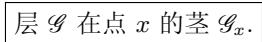

# 《数学指南——实用数学手册》3.8.9 现代代数几何的代数化

本节是《数学指南——实用数学手册》第 3.8 节「代数几何学」的第 9 个小节，题为**现代代数几何的代数化**，署名 R. 哈特肖恩（Robin Hartshorne），1977 年，于伯克利的加州大学。全文篇幅不长，以极压缩的方式回顾了代数几何的历史分期，并给出从「域论—理想论—局部环—层—概形」这一条代数化路径上的核心定义与定理。

## 历史分期（导言部分）

导言把代数几何描述为「波浪式地向前发展，每一波都有自己的语言和观点」，并给出如下分期：

| 时期 | 代表人物 | 特征 |
|---|---|---|
| 19 世纪后期 | 黎曼 | 函数论式的处理方法 |
| 19 世纪后期 | 布里尔（Brill）、诺特（Noether） | 更为几何的方式 |
| 19 世纪后期 | 克罗内克（Kronecker）、戴德金（Dedekind）、韦伯（Weber） | 纯代数方式 |
| 随后 | 卡斯泰尔诺沃（Castelnuovo）、恩里克斯（Enriques）、塞韦里（Severi） | 意大利学派，到达代数曲面分类问题的顶点 |
| 20 世纪 | 周炜良（Chow）、韦伊（Weil）、扎里斯基（Zariski） | 「美国」学派，给予意大利学派的直观以坚实的代数基础 |
| 最近代 | 塞尔（Serre）、格罗腾狄克（Grothendieck） | 法兰西学派，利用[[概形]]和上同调重新改写代数几何的基础 |

导言接着叙述代数风格的形成：库默尔（1810—1893）为处理数域中可除性理论并试图证明费马大定理，发展了被称为「理想数」的理论，这引起戴德金（1831—1916）对[[齐次理想|理想]]理论的发展；此后戴德金与韦伯（1843—1913）发现了对深刻的[[黎曼-罗赫定理]]的纯域论式阐述，揭示了该几何定理的代数基础。希尔伯特（1862—1943）在 19 世纪末提出纲领：把已充分发展的分析中连续数学的方法改造成可应用于离散问题（特别是数论问题）以及代数几何中奇点正常存在情形的方法。20 世纪为实施该纲领的核心概念之一是[[概形]]，由格罗腾狄克于 1960 年设计；概形又基于[[层]]，由勒雷（Jean Leray）于 1945 年发明。现代代数几何书籍多用概形语言写成，唯一的例外是格里菲斯（Griffiths）与哈里斯（Harris）的《[[代数几何原理]]》，它使用多复变分析和复微分几何的语言。

## 3.8.9.1 与域论的联系

设平面代数曲线 $C: p(x,y)=0$，其中 $p$ 为 $\mathbb{C}[x,y]$ 中的不可约多项式。构造「模 $p$ 的商域」：$a \equiv b \bmod p$ 意为 $a-b$ 被 $p$ 除尽。

**定义**（源文件原文）：考虑商 $\frac{f}{g}$，其中 $f,g \in \mathbb{C}[x,y]$，假设 $g \not\equiv 0 \bmod p$，并写 $\frac{f_1}{g_1} \sim \frac{f_2}{g_2}$ 当且仅当 $f_1g_2 \equiv f_2g_1 \bmod p$。

**定理**：该等价关系的等价类集合构成一个域 $K(C)$，称为曲线 $C$ 上的[[曲线上的有理函数域|有理函数域]]。

**有理曲线**：称曲线 $C$ 为有理的，如果它具有参数化表示 $x=X(t),\ y=Y(t),\ t\in\mathbb{C}$，其中 $X,Y$ 是复有理函数。

**主定理**：曲线 $C$ 为有理的，当且仅当域 $K(C)$ 同构于变量 $x$ 的复系数有理函数域 $\mathbb{C}(x)$ 的一个子域。

**例**：对由 $C: y=0$ 定义的直线，有 $K(C)=\mathbb{C}(x)$。

## 3.8.9.2 与理想理论的关联以及广中定理

设 $\mathcal{R} := \mathbb{C}[x_1,\dots,x_{n+1}]$。若 $\mathcal{R}$ 的一个理想有一个由齐次元组成的基，则称它为[[齐次理想]]。

**定义**：称点 $P \in \mathbb{CP}^n$ 零化多项式 $p \in \mathcal{R}$，如果对每个代表 $P$ 的齐次坐标 $(x_1,\dots,x_{n+1})$ 有 $p(x_1,\dots,x_{n+1})=0$。

**代数集**：射影空间 $\mathbb{CP}^n$ 中一个集合是[[代数集]]，当且仅当它是 $\mathcal{R}$ 中齐次多项式的一个有限集合的零点集。

**例**：$\mathbb{CP}^2$ 中的每条代数曲线是代数集。

**定理**：设 $\mathcal{I}_X$ 为所有在 $X$ 上完全为零的多项式的集合，它构成 $\mathcal{R}$ 中的一个理想；设 $Z(\mathcal{I})$ 为 $\mathcal{I}$ 的零点集。则映射
$$X \mapsto \mathcal{I}_X,\qquad \mathcal{I} \mapsto Z(\mathcal{I})$$
定义了 $\mathbb{CP}^n$ 中代数子集 $X$ 的集合与 $\mathcal{R}$ 中齐次理想集之间的双射对应。译者注指出：**此处叙述不妥，应为与根式齐次理想集之间的双射对应**，参见 R. Hartshorne《代数几何》第 1 章或后面的希尔伯特零点定理。

**注**（反包含）：$X \cap Y \mapsto \mathcal{I}_X \cup \mathcal{I}_Y$，即 $\mathcal{I}_{X\cap Y}=\mathcal{I}_X\cup\mathcal{I}_Y$；相似地 $\mathcal{I}_{X\cup Y}=\mathcal{I}_X\cap\mathcal{I}_Y$。又 $\mathcal{Z}(\mathcal{I}\cap\mathcal{J})=Z(\mathcal{I})\cap Z(\mathcal{J})$；「以同样方式有 $Z(\mathcal{I}\cup\mathcal{J})=Z(\mathcal{I})\cap Z(\mathcal{I})$」（源文件如此，见 [[389节代数集与理想并交对应多处讹误]]）。

**希尔伯特关于理想的有限生成性的定理（1893）**：在多项式环 $\mathcal{R}$ 中每个理想 $\mathcal{I}$ 为有限生成，即具有一个有限基。

**希尔伯特零点定理（Nullstellensatz，1893）**：设 $\mathcal{I}$ 为 $\mathcal{R}$ 中的一个理想。如果多项式 $p \in \mathcal{R}$ 在 $\mathcal{I}$ 中所有多项式零点集的每个点为零，则 $p$ 的某个幂属于 $\mathcal{I}$。换句话说，如果 $p \in \mathcal{I}_{Z(\mathcal{I})}$，则 $p^k \in \mathcal{I}$，其中 $k$ 为某个正整数。

**贝祖的更一般的定理**：设 $p_1,\dots,p_k$ 为齐次多项式，则满足
$$p_1(x_1,\dots,x_{n+1})=0,\ \dots,\ p_{n+1}(x_1,\dots,x_{n+1})=0$$
的点 $x=(x_1,\dots,x_{n+1})$ 的个数或者无穷，或者最多等于 $p_j$ 的次数的乘积。

**射影空间上的扎里斯基拓扑**：称 $\mathbb{CP}^n$ 的一个子集为闭的，如果它是代数集；开集定义为闭集的补。定理：如此定义的开集给出了 $\mathbb{CP}^n$ 上的一个拓扑，称为[[扎里斯基拓扑]]。

**射影簇**：称 $\mathbb{CP}^n$ 中的一个不可约代数集为[[射影簇]]。

**有理映射**：$X,Y$ 为 $\mathbb{CP}^n$ 中的两个射影集，则[[有理映射与双有理映射|有理映射]] $\varphi: X \to Y$ 形如 $x'_j = P_j(x_1,\dots,x_{n+1}),\ j=1,\dots,n+1$，其中所有 $P_j$ 为同次齐次多项式。若 $\varphi$ 为双射且 $\varphi$ 与 $\varphi^{-1}$ 均为有理映射，则称 $\varphi$ 为**双有理映射**。

**射影簇的范畴**：对象是射影簇，态射是簇之间的有理映射；此范畴中的同构为双有理的。

**广中整体单值化定理（1964）**：设 $X$ 为一个射影簇，其奇点集 $S \subset X$。则存在一个满映射 $\pi: \mathcal{T} \to X$，满足：

- (i) $\mathcal{T}$ 为非异射影簇；
- (ii) $\pi$ 为态射；
- (iii) 设 $\mathcal{S}:=\pi^{-1}(S)$，则 $\pi: \mathcal{T}\backslash\mathcal{S} \to X\backslash S$ 为同构。

称由此定理存在的空间 $\mathcal{T}$ 为 $X$ 的[[奇点分解]]。

## 3.8.9.3 局部环

局部环是通过代数工具利用可能类似于「在一点附近的」这类概念。设 $\mathcal{I}$ 是环 $\mathcal{R}$ 的一个理想，称 $\mathcal{I}$ 是**平凡的**，如果 $\mathcal{I}=\{0\}$ 或 $\mathcal{I}=\mathcal{R}$。称理想 $\mathcal{I}$ 为**极大的**，如果它不能被扩张为更大的理想。

**基本想法**：设 $C(X)_{\mathbb{C}}$ 代表复连续函数 $f: X \to \mathbb{C}$ 的环，其中 $X$ 为一个非空的紧拓扑空间（例如 $\mathbb{R}^n$ 中的紧子集）。对每个点 $P \in X$ 配上集合 $\mathcal{I}_P := \{f \in C(X): f(P)=0\}$。$C(X)_{\mathbb{C}}$ 中的一个 **\* 理想**是指：包含了每个函数 $f$ 时也包含了它的共轭函数 $\bar{f}$ 的理想。

**定理**：$\mathcal{I}_P$ 是 $C(X)_{\mathbb{C}}$ 中的一个极大 \* 理想；映射
$$P \mapsto \mathcal{I}_P$$
给出了从拓扑空间 $X$ 到 $C(X)_{\mathbb{C}}$ 中极大 \* 理想集合之间的双射映射。由此可以把几何对象中的点相伴于一个对应的代数对象，即极大 \* 理想。

**局部环**（源文件原文）：一个局部环是一个诺特环，它有一个包含了 $\mathcal{R}$ 的全部非平凡理想的非平凡理想。（该表述疑似讹误，见 [[389节局部环定义疑似讹误]]。）

**在代数曲线上一点 $P$ 的局部环**：设曲线 $C: p(x,y)=0$，$p$ 为 $\mathbb{C}[x,y]$ 中不可约多项式。

- (i) 函数 $f: C \to \mathbb{C}$ 称为**正则的**，如果它是 $\mathbb{C}[x,y]$ 中一个多项式在曲线 $C$ 上的限制；
- (ii) 取曲线上固定点 $P$，若两个正则函数 $f,g$ 满足 $f \sim g \bmod P$（当且仅当它们在 $P$ 的某个邻域中相等），这是一个等价关系；等价类 $[f]$ 的集合带有自然的环结构，记为 $\mathcal{K}_P$，称为在 $P$ 点的[[正则函数芽环]]。

**定理**：$\mathcal{K}_P$ 是个[[局部环]]。这个环是点 $P$ 的一个代数替代或代表。

**环的局部化**：如果 $\mathcal{P}$ 是诺特环 $\mathcal{R}$ 的一个非平凡素理想，则商环 $R_P$ 是个局部环。这个环由所有形如 $\frac{r}{s}$ 的元素组成，其中 $r,s$ 属于 $\mathcal{R}$，通常的分式运算可用，且要求分母 $s$ 不在素理想 $\mathcal{P}$ 中。

## 3.8.9.4 概形

**环层空间**：一个[[环层空间]]由一个拓扑空间 $X$（例如度量空间）和一个层 $\mathcal{G}$ 组成，这个层对于 $X$ 的每个开集 $U \leqslant X$ 对应于环 $R(U)$。

**标准例 1**：每个拓扑空间 $X$ 连同它的连续函数层构成一个环层空间。对于每个开集 $U \leqslant X$，层对应于由所有连续函数 $f: U \to \mathbb{R}$ 组成的环 $R(U)$。为得到点 $x \in X$ 的局部化，记 $f \sim g \bmod x$ 当且仅当实连续函数 $f$ 和 $g$ 在点 $x$ 的某个邻域中重合；对应于等价类 $[f]$ 的集合构成一个环，即所谓的「[[层]] $\mathcal{G}$ 在点 $x$ 的**茎** $\mathcal{G}_x$」（源文件此处为一张图像，见 [[389节层茎图像与局部化概形段落缺失]]）。

**概形的基本概念**：一个环层空间
$$(X, \mathcal{G})$$
被称为一个[[概形]]，如果它局部地像一个已知的环层空间 $(X_0,\mathcal{G}_0)$。显式表达地，这表明对每个开集 $U \leqslant X$，限制 $(U,\mathcal{G})$ 同构于 $(X_0,\mathcal{G}_0)$。

以 $C^\infty(U)$ 代表 $C^\infty$ 函数 $f: U \to \mathbb{R}$ 的环。

**标准例 2**：每个 $n$ 维 $C^\infty$ 流形 $X$ 定义了一个概形。

- (i) 取 $\mathcal{G}$ 为所有 $X$ 上的光滑函数层时，$X$ 成为一个环层空间；对 $X$ 的每个开集 $U$，该层对应于环 $C^\infty(U)$；
- (ii) 作为「比较环」$(X_0,\mathcal{G}_0)$，选取 $X_0:=\mathbb{R}^n$，其层 $\mathcal{G}_0$ 为 $\mathbb{R}^n$ 上的光滑函数，有
$$(U, C^\infty(U)) \text{ 同构于 } (\mathbb{R}^n, C^\infty(\mathbb{R}^n)).$$

## 3.8.9.5 仿射概形

**定义**：称一个概形为**仿射的**，如果所给「比较环」$(X_0,\mathcal{G}_0)$ 为[[素谱]] $(\operatorname{Spec} R, \mathcal{G}_0)$，其中 $R$ 为一环。

假定 $R$ 是个具单位元的交换环。素谱的底空间 $\operatorname{Spec} R$ 代表 $R$ 的所有素理想的集合。

**例**：整数环 $\mathbb{Z}$ 的空间 $\operatorname{Spec}\mathbb{Z}$ 由所有主理想 $(p)$ 组成，另外零理想 $(0)$ 也属于 $\operatorname{Spec}\mathbb{Z}$。（源文件写作「由所有主理想组成」，记号缺失，见 [[389节SpecZ主理想记号缺失]]。）

**$\operatorname{Spec} R$ 的拓扑**：如果 $\mathcal{I}$ 是 $R$ 的一个理想，则以 $V(\mathcal{I})$ 表示所有包含 $\mathcal{I}$ 的 $R$ 中素理想的集合。形如 $V(\mathcal{I})$ 的集合被定义为闭集，其补集被定义为开集。它们定义了 $\operatorname{Spec} R$ 上的一个拓扑。

**$\operatorname{Spec} R$ 上的层 $\mathcal{G}_0$**：如果 $P \in \operatorname{Spec} R$，以 $R_P$ 记环 $R$ 对于素理想 $P$ 的局部化（参看 3.8.9.3）。设已知 $\operatorname{Spec} R$ 中一个开集 $U$，对 $U$ 相伴所有 $U$ 上满足
$$f(\mathcal{P}) \in R \quad \text{对所有 } \mathcal{P} \in U$$
的函数 $f$ 的环 $\mathcal{R}(U)$。这些函数均被假定局部地是原来的环中元素的商，即对每个 $\mathcal{P} \in U$ 存在一个 $\mathcal{P}$ 的邻域 $V$ 及环元素 $r,s \in R$，使得对每个 $\mathcal{Q} \in V$ 有
$$f(\mathcal{Q}) = \frac{r}{s}, \quad \text{其中 } s \notin \mathcal{Q}.$$

**局部化的概形**：因为局部环对于代数几何的极端重要性，我们常常在概形的上面定义中加上条件，即在[[环层空间]] $(X,\mathcal{G})$ 上层 $\mathcal{G}$ 的茎 $\mathcal{G}_x$ 对每个 $x \in X$ 是个[[局部环]]。（源文件此段似未完，见 [[389节层茎图像与局部化概形段落缺失]]。）

## 相关页面

- 主线概念：[[代数几何的代数化]]、[[概形]]、[[仿射概形]]、[[素谱]]、[[层]]、[[环层空间]]、[[局部环]]
- 定理与结果：[[广中整体单值化定理三性质]]、[[两个希尔伯特定理陈述]]、[[代数集与齐次理想的双射对应]]、[[有理曲线主定理]]、[[紧空间极大理想与点双射]]、[[正则函数芽环是局部环]]、[[局部化为局部环]]、[[概形定义与两个标准例]]、[[仿射概形与素谱拓扑及层]]、[[贝祖定理次数乘积上界]]
- 人物与学派：[[格罗腾狄克]]、[[扎里斯基]]、[[塞尔]]、[[希尔伯特]]、[[戴德金]]、[[库默尔]]、[[韦伯]]、[[勒雷]]、[[哈特肖恩]]、[[意大利代数几何学派]]、[[美国代数几何学派]]、[[广中平佑]]
- 待核问题：见页面末尾所列各条 [[389节代数集与理想并交对应多处讹误]] 等 query 页面

<!-- llm-wiki:embedded-images -->
## Embedded Images

### Document

<!-- llm-wiki:embedded-images -->
