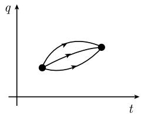
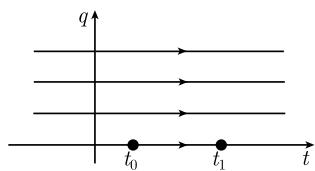

# 《数学指南——实用数学手册》5.1.5 局部极小值的充分条件

本节讨论单变量变分问题 (5.33) 取得弱局部极小、强局部极小与全局极小的**充分条件**。全书在 5.1.1 中给出的只是必要条件（极小值必为欧拉-拉格朗日方程的解），本节补足充分性：依次给出欧拉-拉格朗日方程 (5.34)、雅可比本征值问题 (5.35)、雅可比初值问题 (5.36)、共轭点定义、极值定义、魏尔斯特拉斯 E 函数与 L 关于 q′ 的凸性，随后分两条路线给出充分条件——5.1.5.1 的雅可比充分条件（弱局部极小）与 5.1.5.2 的魏尔斯特拉斯充分条件（强局部极小／全局极小），最后给出几何光学解释。

## 源文核心公式（逐字保留）

变分问题与相关方程：

$$
\boxed { \begin{array}{c} \int_ {t _ {0}} ^ {t _ {1}} L (q (t) q ^ {\prime} (t), t) \mathrm{d} t \stackrel {!} {=} \min, \\ q (t _ {0}) = a, \quad q (t _ {1}) = b, \end{array} }\tag{5.33}
$$

$$
\frac {\mathrm{d}}{\mathrm{d} t} L _ {q ^ {\prime}} - L _ {q} = 0\tag{5.34}
$$

$$
\boxed { \begin{array}{c} - (R h ^ {\prime}) ^ {\prime} + P h = \lambda h, \quad t _ {0} \leqslant t \leqslant t _ {1}, \\ h (t _ {0}) = h (t _ {1}) = 0, \end{array} }\tag{5.35}
$$

这里 $Q := (q(t), q'(t), t)$，而

$$
R (t) := L _ {q ^ {\prime} q ^ {\prime}} (Q), \quad P (t) := L _ {q q} - \frac {\mathrm{d}}{\mathrm{d} t} L _ {q q ^ {\prime}} (Q).
$$

$$
\boxed { \begin{array}{c} - (R h ^ {\prime}) ^ {\prime} + P h = 0, t _ {0} \leqslant t \leqslant t _ {1}, \\ h (t _ {0}) = 0, \quad h (t _ {1}) = 1. \end{array} }\tag{5.36}
$$

魏尔斯特拉斯 E 函数：

$$
\boxed {E (q, q ^ {\prime}, u, t) := L (q, u, t) - L (q, q ^ {\prime}, t) - (u - q ^ {\prime}) L _ {q ^ {\prime}} (q, q ^ {\prime}, t).}
$$

拉格朗日函数 L 关于 $q'$ 的凸性，只需假定下列两条件之一：

$$
(i)\ L_{q'q'}(q,q',t) \geqslant 0,\quad \forall q,q' \in \mathbb{R},\quad \forall t \in [t_0,t_1].
$$

$$
(ii)\ E(q, q', u, t) \geqslant 0, \forall q, q', u \in \mathbb{R}, \forall t \in [t_0, t_1].
$$

勒让德条件（1788）：

$$
\boxed {L _ {q ^ {\prime} q ^ {\prime}} (q (t), q ^ {\prime} (t), t) \geqslant 0, \forall t \in [ t _ {0}, t _ {1} ].}
$$

严格勒让德条件（源文原样）：

$$
\left| L _ {q ^ {\prime} q ^ {\prime}} (q (t), q ^ {\prime} (t), t) > 0, \forall t \in [ t _ {0}, t _ {1} ]. \right.
$$

最短路径问题 (5.37)：

$$
\begin{array}{l} \int_ {t _ {0}} ^ {t _ {1}} \sqrt {1 + q ^ {\prime} (t) ^ {2}} \mathrm{d} t \stackrel {!} {=} \min, \\ q (t _ {0}) = q (t _ {1}) = 0 \end{array}\tag{5.37}
$$

## 正文结构

### 基本设定与工具

- **光滑性**：假设拉格朗日函数 L 充分光滑（例如属于 $C^3$ 型）。
- **极值**：欧拉-拉格朗日方程 (5.34) 的每一个 $C^2$ 解都称为一个极值。但极值未必对应 (5.33) 的局部极小，正如函数情形一样；为存在极小需要附加条件。
- **魏尔斯特拉斯 E 函数**：定义见上，用于判别凸性与构造充分条件。
- **共轭点**：设 $h = h(t)$ 是 (5.35) 的解（注意：源文此处描述与 (5.36) 的解混用，见「疑点」），把 $h(t)$ 满足 $t_* > t_0$ 的最小的零点 $t_*$ 称为 $t_0$ 的共轭点。
- **本征值**：实数 $\lambda$ 是 (5.35) 的一个本征值，是指该方程有非平凡（不恒等于零）解 $h$。

### 5.1.5.1 雅可比充分条件

**勒让德充分条件 (1788)**：如果 $q = q(t)$ 是 $C^2$ 函数，并且是 (5.33) 的一个弱局部极小，那么它满足勒让德条件 $L_{q'q'}(q(t),q'(t),t)\ge 0$。

**雅可比条件 (1837)**：设 $q = q(t)$ 是 (5.33) 的极小，满足 $q(t_0)=a$、$q(t_1)=b$ 以及严格勒让德条件 $L_{q'q'}>0$。如果满足如下两附加条件之一：

1. 雅可比本征方程 (5.35) 的所有本征值都正；
2. 雅可比初值问题 (5.36) 的解在区间 $[t_0,t_1]$ 中无零点，即该区间不含 $t_0$ 的共轭点；

则 q 是 (5.33) 的一个弱局部极小。

#### 例：(5.37) 最短路径问题

(a) 函数 $q(t)\equiv 0$ 是 (5.37) 的一个弱局部极小。
证明：$L=\sqrt{1+q'^2}$，由此得

$$
L _ {q ^ {\prime} q ^ {\prime}} = \frac {1}{\sqrt {(1 + q ^ {\prime} (t) ^ {2}) ^ {3}}} \geqslant 0, L _ {q q ^ {\prime}} = L _ {q q} = 0.
$$

雅可比初值问题

$$
- h ^ {\prime \prime} = 0 \text {在} [ t _ {0}, t _ {1} ] \text{上}, \quad h (t _ {0}) = 0, \quad h ^ {\prime} (t _ {0}) = 1
$$

的解 $h(t) = -t - t_{0}$ 仅有单个零点在 $t_{0}$。

雅可比本征值问题

$$
- h ^ {\prime \prime} = \lambda h \text{在} [ t _ {0}, t _ {1} ] \text{上}, \quad h (t _ {0}) = h (t _ {1}) = 0
$$

的本征函数为

$$
h (t) = \sin {\frac {n \pi (t - t _ {0})}{t _ {1} - t _ {0}}}, \quad \lambda = \frac {n ^ {2} \pi^ {2}}{(t _ {1} - t _ {0}) ^ {2}}, \quad n = 1, 2, \dots ,
$$

即所有本征值都是正的。

(b) 直线 $q(t)\equiv 0$ 是 (5.37) 的一个全局极小。
证明：把极值曲线 $q(t)\equiv 0$ 嵌入到由 $q(t)=$ 常数组成的极值曲线族。从 $L_{q'q'}\ge 0$ 可知 L 关于 $q'$ 是凸的，从而所需结论从 5.1.5.2 推出。

### 5.1.5.2 魏尔斯特拉斯充分条件

假定给一族含参数 $\alpha$ 的光滑极值曲线 $q = q(t,\alpha)$，它按正则方式覆盖 $(t,q)$ 空间中的区域 D，即各极值曲线之间没有交点或接触点。作如下假设：

1. 这族曲线中含有一条通过点 $(t_0,a)$ 和 $(t_1,b)$ 的极值曲线 $q_*$（图 5.11(a)）；
2. 拉格朗日函数 L 相对于 $q'$ 是凸的。

那么 $q_*$ 是 (5.33) 的**强局部极小**。

**推论**：若存在一族覆盖整个 $(t,q)$ 空间（意指 $D=\mathbb{R}^2$）的极值曲线 $q=q(t,\alpha)$，则 $q_*$ 是 (5.33) 的全局极小。

### 几何光学中的解释

极值曲线族对应于几何光学中的光线族。交点（焦点）和接触点（焦散线）表示奇异行为。在图 5.11 中我们看到两个焦点。特殊情形是这里不一定每一条光线都是两点之间的最短路径。若极值曲线通过两个焦点，则 5.1.5.1 的雅可比条件未必成立；于是这些焦点也称为共轭点。

## 图像

- 图 5.11(a)：通过 $(t_0,a)$ 与 $(t_1,b)$ 的极值曲线 $q_*$（media/10-数学指南实用数学手册--14-515-局部极小值的充分条件--nhmfmq/001-4c5502cb1a381a6bc3b967d4f052df16b6ce4787485243ad84fbb328185bf2e3.jpg）
- 图 5.11(b)：第二幅子图未能成功加载（media/10-数学指南实用数学手册--14-515-局部极小值的充分条件--nhmfmq/002-a39c88412633bbd42c04333dbcba0ab4883a6c4b2d309cc7ba4e93e4f050728d.jpg）
- 水平直线族示意图（media/10-数学指南实用数学手册--14-515-局部极小值的充分条件--nhmfmq/003-d9bb83f9da50e4ef759637af93ab789652fa126d314b51e9712340eaf7623468.jpg）

## 与既有条目的关系

本节正是既有概念页 [[变分问题的局部极小值充分条件]] 与 [[强弱局部极小值]] 的直接出处；[[欧拉-拉格朗日方程]]、[[拉格朗日函数]]、[[一阶变分与二阶变分]] 为前置基础。本节新增的概念包括 [[雅可比充分条件]]、[[魏尔斯特拉斯充分条件]]、[[共轭点]]、[[魏尔斯特拉斯E函数]]、[[勒让德条件]]、[[雅可比本征值问题]]、[[雅可比初值问题]]、[[极值曲线]]、[[拉格朗日函数凸性]]。

## 待核查疑点

- 源文在定义共轭点时写「设 $h=h(t)$ 是 (5.35) 的解」，而按上下文逻辑应为 (5.36)（雅可比**初值**问题）的解。
- 「勒让德充分条件 (1788)」小标题下陈述的却是必要条件（弱局部极小 ⇒ 勒让德条件）。
- 例 (a) 中雅可比初值问题的解写作 $h(t) = -t - t_{0}$，与初值 $h(t_0)=0, h'(t_0)=1$ 不合，疑为 $h(t)=t-t_0$。
- 严格勒让德条件被竖线 $\left| \cdots \right.$ 包围，疑为排版讹误。
- 雅可比条件正文写「$t_{0}, t_{1}$ [中无零点」，括号位置疑有讹误。
- 图 5.11(b) 未能加载。

<!-- llm-wiki:embedded-images -->
## Embedded Images

### Document

<!-- llm-wiki:embedded-images -->
