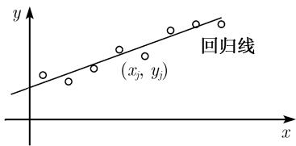

# 《数学指南——实用数学手册》0.4.5 两个测量序列的统计比较

本页是手册 0.4「数理统计表与标准过程」的第五节，紧接 [[sources/10-数学指南实用数学手册--13-044-测量序列的统计计算--onnmc5]]（0.4.4 测量序列的统计计算）。它把单个测量序列的统计计算推广到两个测量序列的比较，围绕两个基本问题组织：**(i) 两个测量序列之间是否存在相关性；(ii) 两个随机变量之间是否存在重要差别。**

## 问题的提法

假设已知随机变量 $X$ 和 $Y$ 的两个试验序列

$$
\boxed{x_{1}, \dots, x_{n_{1}} \text{ 和 } y_{1}, \dots, y_{n_{2}}.}\tag{0.49}
$$

存在两个基本问题：

- (i) 两个测量序列之间存在相关性吗？
- (ii) 两个随机变量之间存在重要差别吗？

为了研究 (i)，采用相关系数；为了回答 (ii)，引入 $F$ 检验、$t$ 检验和威尔科克森检验。

## 0.4.5.1 经验相关系数

当 $n_1 = n_2 = n$ 时，(0.49) 这两个测量序列的经验相关系数由下面的数给出：

$$
\rho = \frac{(x_{1} - \bar{x})(y_{1} - \bar{y}) + (x_{2} - \bar{x})(y_{2} - \bar{y}) + \cdots + (x_{n} - \bar{x})(y_{n} - \bar{y})}{(n - 1)\Delta x \Delta y}.
$$

$$-1 \leqslant \rho \leqslant 1.$$

当 $\rho = 0$ 时，这两个序列没有相关性。两个序列的相关性越强，量 $\rho^{2}$ 越大。

### 回归线

如果在笛卡儿坐标系中描出测量值对 $(x_{j}, y_{j})$，那么所谓的回归线

$$
\boxed{y = \bar{y} + \rho \frac{\Delta y}{\Delta x}(x - \bar{x})}
$$

是与所描出的那些点最接近的线（图 0.45），即这条线是极小问题

$$
\sum_{j=1}^{n}(y_{j} - a - b x_{j})^{2} \stackrel{!}{=} \min
$$

的一个解。极小值等于 $(\Delta y)^{2}(1 - \rho^{2})$。因此当 $\rho^{2} = 1$ 时，回归线关于测量值的拟合是最优拟合。

### 表 0.30（例 1 的两个测量序列）

| $x_{1}$ | $x_{2}$ | $x_{3}$ | $x_{4}$ | $x_{5}$ | $x_{6}$ | $x_{7}$ | $x_{8}$ | $\bar{x}$ | $\Delta x$ |
|---|---|---|---|---|---|---|---|---|---|
| 168 | 170 | 172 | 175 | 176 | 177 | 180 | 182 | 175 | 5 |

| $y_{1}$ | $y_{2}$ | $y_{3}$ | $y_{4}$ | $y_{5}$ | $y_{6}$ | $y_{7}$ | $y_{8}$ | $\bar{y}$ | $\Delta y$ |
|---|---|---|---|---|---|---|---|---|---|
| 157 | 160 | 163 | 165 | 167 | 167 | 168 | 173 | 165 | 5 |

**例**：对表 0.30 中的两个测量序列，其相关系数为

$$
\rho = 0.96,
$$

回归线为

$$
y = \bar{y} + 0.96(x - \bar{x}).\tag{0.50}
$$

这两个测量序列之间存在强相关性。回归线 (0.50) 与测量值相当接近。

## 0.4.5.2 t 检验对两均值的比较

在实际应用中，常常借助 t 检验判断两个试验序列是否在本质上互不相同。

1. 考虑随机变量 $X$ 和 $Y$ 的两个序列 $x_{1}, \cdots, x_{n_{1}}$ 和 $y_{1}, \cdots, y_{n_{2}}$，假定它们服从正态分布。此外，假设 $X$ 和 $Y$ 的标准差相同，借助 0.4.5.3 的 F 检验可以验证这个假设。
2. 计算

$$
t = \frac{\bar{x} - \bar{y}}{\sqrt{(n_{1} - 1)(\Delta x)^{2} + (n_{2} - 1)(\Delta y)^{2}}} \sqrt{\frac{n_{1} n_{2} (n_{1} + n_{2} - 2)}{n_{1} + n_{2}}}.
$$

3. 对已知的 $\alpha$ 和 $m = n_{1} + n_{2} - 1$，根据 0.4.6.3 中的表确定 $t_{\alpha, m}$ 的值。

**情形 1：**

$$
\boxed{|t| > t_{\alpha, m}.}
$$

此时 $X$ 和 $Y$ 的均值不同，即测量的经验均值 $\bar{x}$ 和 $\bar{y}$ 的差别并不是任意的，需要作出说明。在这种情况下我们也说随机变量 $X$ 和 $Y$ 存在重要差别。

**情形 2：**

$$
\boxed{|t| < t_{\alpha, m}.}
$$

此时 $X$ 和 $Y$ 的均值之间并没有很大差别。

这两种说法都有误差概率 $\alpha$，意思就是说，若我们对 100 种不同的情况进行检验，有 $100 \cdot \alpha$ 种情况会产生错误结论。

- 例 1：当 $\alpha = 0.01$ 时，在 100 次试验中有一次试验会产生错误结论。
- 例 2：患同样病的人服用 A 和 B 两种药物，服用 A（B）药物的人治愈时间的随机变量是 $X$（$Y$）天。表 0.31 列出了一些测量值。例如，服用 A 药物的平均治愈时间是 20 天。

### 表 0.31（例 2 的两组治愈时间摘要）

| 组 | 均值 | 经验标准差 | 样本量 |
|---|---|---|---|
| 药物 A | $\bar{x} = 20$ | $\Delta x = 5$ | $n_1 = 15$ 个病人 |
| 药物 B | $\bar{y} = 26$ | $\Delta y = 4$ | $n_2 = 15$ 个病人 |

我们得到

$$
t = \frac{26 - 20}{\sqrt{14 \cdot 25 + 14 \cdot 16}} \cdot \sqrt{\frac{15 \cdot 15 (30 - 2)}{15 + 15}} = 3.6.
$$

当 $\alpha = 0.01$，$m = 15 + 15 - 1 = 29$ 时，由 0.4.6.3 中的表，有 $t_{\alpha, m} = 2.8$。

因为 $t > t_{\alpha, m}$，所以这两种药物之间存在重要差别，也就是药物 A 比药物 B 好。

## 0.4.5.3 F 检验

这个检验用来验证两个服从正态分布的随机变量的标准差彼此是否相同。

1. 考虑随机变量 $X$ 和 $Y$ 的两个测量序列 $x_{1}, \cdots, x_{n_{1}}$ 和 $y_{1}, \cdots, y_{n_{2}}$，假设它们服从正态分布。
2. 有商

$$
F := \begin{cases} \left(\dfrac{\Delta x}{\Delta y}\right)^{2}, & \text{若 } \Delta x > \Delta y, \\ \left(\dfrac{\Delta y}{\Delta x}\right)^{2}, & \text{若 } \Delta x \leqslant \Delta y. \end{cases}
$$

3. 当 $m_{1} := n_{1} - 1$，$m_{2} := n_{2} - 1$ 时，在 0.4.6.5 中查找粗体字 $F_{0.01; m_{1} m_{2}}$。

**情形 1：**

$$
\boxed{F > F_{0.01; m_{1} m_{2}}.}
$$

在这种情况下，$X$ 和 $Y$ 的标准差不同，即测量的经验标准差 $\Delta x$ 和 $\Delta y$ 的差别并不是随机变量，而是有着某种更深层的含义。

**情形 2：**

$$
\boxed{F \leqslant F_{0.01; m_{1} m_{2}}.}
$$

此时，假设 $X$ 和 $Y$ 的标准差实质上相同。

这两种说法的误差概率都是 0.02。意思就是说，如果我们对 100 种不同的情况进行检验，有 2 种情况会产生错误结论。

**例**：再次考虑表 0.31 中的数据，有 $F = (\Delta x / \Delta y)^{2} = 1.6$。由 0.4.6.5 中的表，当 $m_{1} = m_{2} = 14$ 时，有 $F_{0.01; m_{1} m_{2}} = 3.7$。因为 $F < F_{0.01; m_{1} m_{2}}$，所以可以断定 $X$ 和 $Y$ 有相同的标准差。

## 0.4.5.4 威尔科克森（Wilcoxon）检验

t 检验只能应用到服从正态分布的量中，威尔科克森检验更具一般性，我们能利用它检验两个试验序列是否来自于具有不同分布的随机变量，即验证这些量是否在本质上互不相同。6.3.4.5 中讲述了这一检验。

## 本节的开放问题

- 步骤 (iii) 中的自由度写作 $m = n_1 + n_2 - 1$，而 $t$ 统计量中的自由度因子却是 $n_1 + n_2 - 2$，两者的关系见 [[queries/t检验自由度m为何取n1加n2减1]]。
- $t$ 表（0.4.6.3）与 $F$ 表（0.4.6.5）在本 wiki 中尚无对应页面，见 [[queries/0.4.6.3与0.4.6.5表格引用在本wiki中缺失]]。
- 威尔科克森检验的全部内容外链到 6.3.4.5，本 wiki 中尚无该小节，见 [[queries/威尔科克森检验内容依赖6.3.4.5]]。
- F 检验两种说法的误差概率均写作 0.02，其来源见 [[queries/f检验误差概率为002的来源]]。

<!-- llm-wiki:embedded-images -->
## Embedded Images

### Document

<!-- llm-wiki:embedded-images -->
