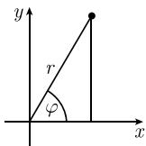

# 《数学指南——实用数学手册》1.5.4 对微分算子的变换的应用

本节属于《数学指南——实用数学手册》1.5 节「多元实变函数的导数」。它用极坐标变换为例，说明如何通过坐标变换简化微分方程，并给出拉普拉斯算子在极坐标下的两种独立推导。原文明确称「同样的想法可以用到任意坐标变换」。

## 极坐标的引入

不用笛卡儿坐标的 $x, y$，引进

```
x = r cos φ,  y = r sin φ,  -π < φ ≤ π          (1.60)
```

它称为极坐标 $r, \varphi$（图 1.47）。令

```
α := arctan(y/x),  x ≠ 0
```

那么，这个坐标变换的逆变换是

```
r = √(x² + y²)                                    (1.61)

        ⎧ α,              x > 0, y ∈ ℝ
        ⎪ ±π + α,         x < 0, y ≷ 0
φ =     ⎨ ±π/2,           x = 0, y ≷ 0
        ⎪ π,              x < 0, y = 0
```

## 函数变换与拉普拉斯算子

把函数变换到极坐标：设

```
f(r, φ) := F(x(r, φ), y(r, φ))                    (1.62)
```

它把函数 $F = F(x, y)$ 从笛卡儿坐标变换到极坐标。

假设函数 $F: \mathbb{R}^2 \to \mathbb{R}$ 是 $C^2$ 类型的，那么通常的拉普拉斯（Laplace）算子

```
ΔF := F_xx + F_yy,  (x, y) ∈ ℝ²                   (1.63)
```

被变换为表达式

```
Δf := f_rr + (1/r²) f_φφ + (1/r) f_r,  r > 0      (1.64)
```

## 推论

关系式 (1.64) 直接蕴涵着函数

```
f(r) := ln r,  r > 0
```

是偏微分方程 $\Delta f = 0$ 的一个解。再变换回去，看出

```
F(x, y) = ln √(x² + y²),  x² + y² ≠ 0
```

是拉普拉斯方程 $\Delta F = 0$ 的一个解，但是在 $x, y$ 坐标下很难看出这个结论。

## 符号约定

符号 $F$ 常常用来替换 (1.64) 中的 $f$。虽然符号不一样，但是在物理学和技术的应用中十分方便。

## 第一个方法：从 $F(x,y) = f(r(x,y), \varphi(x,y))$ 出发

从恒等式 $F(x, y) = f(r(x, y), \varphi(x, y))$ 开始。借助链式法则，求关于 $x, y$ 的导数：

```
F_x(x, y) = f_r(r(x, y), φ(x, y)) r_x(x, y) + f_φ(r(x, y), φ(x, y)) φ_x(x, y)
F_y(x, y) = f_r(r(x, y), φ(x, y)) r_y(x, y) + f_φ(r(x, y), φ(x, y)) φ_y(x, y)
```

接下来用乘法法则和链式法则第二次求导：

```
F_xx = (f_rr r_x + f_rφ φ_x) r_x + f_r r_xx + (f_φr r_x + f_φφ φ_x) φ_x + f_φ φ_xx
F_yy = (f_rr r_y + f_rφ φ_y) r_y + f_r r_yy + (f_φr r_y + f_φφ φ_y) φ_y + f_φ φ_yy
```

因此，有

```
F_xx + F_yy = f_rr (r_x² + r_y²) + f_φφ (φ_x² + φ_y²)
            + 2 f_rφ (φ_x r_x + φ_y r_y)
            + f_r (r_xx + r_yy) + f_φ (φ_xx + φ_yy)        (1.65)
```

首先假设 $x \neq 0$。那么由 (1.61) 推出

```
r_x = x / √(x² + y²) = cos φ,     r_y = y / √(x² + y²) = sin φ
φ_x = -y / (x² + y²)  = -sin φ / r,  φ_y = x / (x² + y²) = cos φ / r
```

用链式法则再次对 $x, y$ 求导，得

```
r_xx = (-sin φ) φ_x = sin²φ / r,   r_yy = (cos φ) φ_y = cos²φ / r
φ_xx = 2 cos φ sin φ / r² = -φ_yy
```

这些关系式与 (1.65) 一起推出 $x \neq 0$ 时的公式 (1.64)。通过取极限 $x \to 0$，从 (1.64) 即得 $x = 0, y \neq 0$ 时的情形。

## 第二个方法：从 $f(r,\varphi) = F(x(r,\varphi), y(r,\varphi))$ 出发

利用恒等式 $f(r, \varphi) = F(x(r, \varphi), y(r, \varphi))$。为了简化符号，用 $f$ 代替 $F$。使用链式法则，对 $r, \varphi$ 求导，得

```
f_r = f_x x_r + f_y y_r = f_x cos φ + f_y sin φ
f_φ = f_x x_φ + f_y y_φ = -f_x r sin φ + f_y · r cos φ
```

在这个方程组中求解 $f_x, f_y$，得

```
f_x = A f_r + B f_φ,   f_y = C f_r + D f_φ        (1.66)
A = cos φ,  B = -sin φ / r,  C = sin φ,  D = cos φ / r
```

记 $\partial_x = \partial/\partial x$，等等。那么 (1.66) 等价于下面的重要公式：

```
∂_x = A ∂_r + B ∂_φ,   ∂_y = C ∂_r + D ∂_φ
```

由此得到

```
∂_x² = (A ∂_r + B ∂_φ)(A ∂_r + B ∂_φ)
     = A ∂_r(A ∂_r) + B ∂_φ(A ∂_r) + A ∂_r(B ∂_φ) + B ∂_φ(B ∂_φ)
```

由乘法法则得 $\partial_r(A \partial_r) = (\partial_r A)\partial_r + A \partial_r^2$，等。所以

```
∂_x² = A A_r ∂_r + A² ∂_r² + B A_φ ∂_r + 2 A B ∂_φ ∂_r
      + A B_r ∂_φ + B B_φ ∂_φ + B² ∂_φ²
```

交换 $A$ 和 $C$ 以及 $B$ 和 $D$，类似可得

```
∂_y² = C C_r ∂_r + C² ∂_r² + D C_φ ∂_r + 2 C D ∂_φ ∂_r
      + C D_r ∂_φ + D D_φ ∂_φ + D² ∂_φ²
```

因为

```
A_r = C_r = 0,  A_φ = -sin φ,  C_φ = cos φ
B_r = sin φ / r²,  B_φ = -cos φ / r,  D_r = -cos φ / r²,  D_φ = -sin φ / r
```

所以最后得到

```
Δ = ∂_x² + ∂_y² = ∂_r² + (1/r²) ∂_φ² + (1/r) ∂r
```

这就是变换后的公式 (1.64)。

第二个方法不用逆公式 (1.61)，这极大地简化了计算的复杂性。

## 插图

- 图 1.47（极坐标示意图）：`media/10-数学指南实用数学手册--15-154-对微分算子的变换的应用--1vp6yi7/001-da6426f4b9d55a634c6ed3f3e91c0d2767c0f1e3ffb6c07df9ffd6d3d6fdf1cc.jpg`。该图像在源文件中未能正常加载，具体视觉细节无法确认。

## 相关页面

- [[concepts/极坐标变换]]
- [[concepts/拉普拉斯算子]]
- [[concepts/拉普拉斯方程]]
- [[concepts/微分算子]]
- [[concepts/调和函数]]
- [[concepts/多元链式法则]]
- [[concepts/莱布尼茨积法则]]
- [[entities/拉普拉斯]]
- [[queries/154节末算子公式右端缺少微分算子符号]]

<!-- llm-wiki:embedded-images -->
## Embedded Images

### Document


<!-- llm-wiki:embedded-images -->
