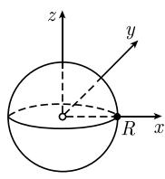
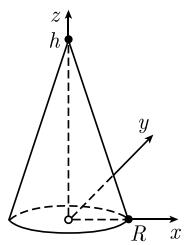

# 《数学指南——实用数学手册》1.7.10 应用到质心和惯性中点

## 本节位置与内容概要

本节是 1.7 节（多实变量函数的积分）的应用性小节，承接 1.7.9 节的曲线坐标（[[曲线坐标]]、[[球面坐标]]、[[柱面坐标]]）。它先以表 1.3 给出在曲线坐标下计算**质量、质心向量与关于 z 轴的惯性中心**的统一公式，再用这些公式处理三个标准立体（实心球、圆柱体、圆锥体），最后给出两条古尔丁法则并用环面为例演示。

全节结构：

1. 表 1.3「曲线坐标下的积分量」——曲线、曲面、立体三类几何对象的统一公式；
2. 例 1（球）——以球面坐标计算体积、质心、关于 z 轴的惯性中心；
3. 例 2（圆柱体）——以柱面坐标计算体积、质心、关于 z 轴的惯性中心；
4. 例 3（圆锥体）——以卡瓦列里原理计算体积与质心、惯性中心；
5. 第一、第二古尔丁法则；
6. 例 4（环面）——用古尔丁法则求环面的体积与表面积。

## 表 1.3 曲线坐标下的积分量（原文照录）

表 1.3 曲线坐标下的积分量

| | 质量 $M$（$\rho$ 为密度） | 质心向量 $(\boldsymbol{r} = x\boldsymbol{i} + y\boldsymbol{j} + z\boldsymbol{k})$ | 关于 $z$ 轴的惯性中心 |
|---|---|---|---|
| 曲线 $\mathcal{C}$ | $M = \int_{\mathcal{C}} \rho \mathrm{d}s$（$\rho = 1$ 时为 $\mathcal{C}$ 的弧长） | $\boldsymbol{r}_{\mathrm{cm}} = \frac{1}{M} \int_{\mathcal{C}} \boldsymbol{r} \rho \mathrm{d}s$ | $\Theta_z = \int_{\mathcal{C}} (x^2 + y^2) \rho \mathrm{d}s$ |
| 曲面 $\mathcal{F}$ | $M = \int_{\mathcal{F}} \rho \mathrm{d}F$（$\rho = 1$ 时为曲面 $\mathcal{F}$ 的面积） | $\boldsymbol{r}_{\mathrm{cm}} = \frac{1}{M} \int_{\mathcal{F}} \boldsymbol{r} \rho \mathrm{d}F$ | $\Theta_z = \int_{\mathcal{F}} (x^2 + y^2) \rho \mathrm{d}F$ |
| 立体 $\mathcal{F}$ (dV = dxdydz) | $M = \int_{\mathcal{F}} \rho \mathrm{d}V$（$\rho = 1$ 时为 $\mathcal{F}$ 的体积） | $\boldsymbol{r}_{\mathrm{cm}} = \frac{1}{M} \int_{\mathcal{F}} \boldsymbol{r} \rho \mathrm{d}V$ | $\Theta_z = \int_{\mathcal{G}} (x^2 + y^2) \rho \mathrm{d}V$ |

原文说明：求质量、质心和惯性中心的公式可见表 1.3。

要点：

- 三行的质量公式分别以弧长元素 $\mathrm{d}s$、面积元素 $\mathrm{d}F$、体积元素 $\mathrm{d}V = \mathrm{d}x\mathrm{d}y\mathrm{d}z$ 为基础；当密度 $\rho = 1$ 时，质量分别退化为弧长、面积、体积。相关元素见 [[体积形式]]、[[曲面面积元]]。
- 质心向量由 $\boldsymbol{r}_{\mathrm{cm}} = \frac{1}{M}\int \boldsymbol{r} \rho \,\mathrm{d}(\cdot)$ 给出，即一阶矩除以质量。
- 「关于 $z$ 轴的惯性中心」由 $(x^2 + y^2)$ 加权的积分给出，即绕 $z$ 轴（垂直轴）的转动惯量型量；注意表中立体行的被积区域记作 $\mathcal{G}$ 而不是 $\mathcal{F}$（见 [[queries/1710节表13立体行惯性中心积分域是否应为F]]）。

## 例 1（球）

考虑笛卡儿坐标系 $(x,y,z)$ 下中心在原点、半径为 $R$ 的实心球（图 1.79(a)）。

体积

$$
M = \int r^{2} \cos \theta \,\mathrm{d}\theta\,\mathrm{d}\varphi\,\mathrm{d}r
= \int_{0}^{R} r^{2} \mathrm{d}r \int_{-\pi}^{\pi} \mathrm{d}\varphi \int_{-\frac{\pi}{2}}^{\frac{\pi}{2}} \cos \theta \,\mathrm{d}\theta
= \frac{4\pi R^{3}}{3},
$$

其中用了球面坐标（参看表 1.2，即 [[表12曲线坐标]]）。

质心：它位于球的中心，即原点。

惯性中心（关于 $z$ 轴的）

$$
\Theta_z = \int (r\cos\theta)^{2} r^{2} \cos\theta \,\mathrm{d}\theta\,\mathrm{d}\varphi\,\mathrm{d}r
= \int_{0}^{R} r^{4} \mathrm{d}r \int_{-\pi}^{\pi} \mathrm{d}\varphi \int_{-\frac{\pi}{2}}^{\frac{\pi}{2}} \cos^{3}\theta \,\mathrm{d}\theta
= \frac{2}{5} R^{2} M .
$$

## 例 2（圆柱体）

考虑半径为 $R$、高为 $h$ 的圆柱体（图 1.79(b)）。体积

$$
M = \int r \,\mathrm{d}r\,\mathrm{d}\varphi\,\mathrm{d}z
= \int_{0}^{R} r \,\mathrm{d}r \int_{-\pi}^{\pi} \mathrm{d}\varphi \int_{0}^{h} \mathrm{d}z
= \pi R^{2} h,
$$

其中用了柱面坐标（参看表 1.2，即 [[表12曲线坐标]]）。

质心：

$$
z_{\mathrm{cm}} = \frac{h}{2},\qquad x_{\mathrm{cm}} = y_{\mathrm{cm}} = 0 .
$$

关于 $z$ 轴的惯性中心：

$$
\Theta_z = \int r^{2} \cdot r \,\mathrm{d}\varphi\,\mathrm{d}r\,\mathrm{d}z
= \int_{0}^{R} r^{3} \mathrm{d}r \int_{-\pi}^{\pi} \mathrm{d}\varphi \int_{0}^{h} \mathrm{d}z
= \frac{1}{2} R^{2} M .
$$

## 例 3（圆锥体）

考虑以半径为 $R$ 的圆做底、高为 $h$ 的圆锥体（图 1.79(c)）。

$$
M = \int_{z=0}^{h} \left(\int_{D_z} \mathrm{d}x\,\mathrm{d}y\,\mathrm{d}z\right)
= \int_{0}^{h} \pi R_z^{2} \,\mathrm{d}z
= \frac{1}{3}\pi R^{2} h,
$$

这里应用了卡瓦列里原理（见 [[卡瓦列里原理-富比尼定理]]）。根据 1.7.1 中的例 3，有

$$
R_z = \frac{(h - z)R}{h}.
$$

质点（原文用语，见 [[queries/1710节例3中质点一词是否应为质心]]）：

$$
z_{\mathrm{cm}} = \frac{1}{M} \int_{z=0}^{h} \left(\int_{D_z} z \,\mathrm{d}x\,\mathrm{d}y\right) \mathrm{d}z
= \frac{1}{M} \int_{0}^{h} z \pi R_z^{2} \,\mathrm{d}z
= \frac{h}{4},\qquad x_{\mathrm{cm}} = y_{\mathrm{cm}} = 0 .
$$

关于 $z$ 轴的惯性中心：

$$
\begin{aligned}
\Theta_z &= \int (x^{2} + y^{2}) \,\mathrm{d}x\,\mathrm{d}y\,\mathrm{d}z
= \int_{0}^{h} \left(\int_{D_z} r^{3} \,\mathrm{d}r\,\mathrm{d}\varphi\right) \mathrm{d}z
= \int_{0}^{h} \left(\int_{0}^{R_z} r^{3} \,\mathrm{d}r\right)\left(\int_{-\pi}^{\pi} \mathrm{d}\varphi\right) \mathrm{d}z \\
&= \int_{0}^{h} \frac{\pi}{2} R_z^{4} \,\mathrm{d}z = \frac{3}{10} M R^{2}.
\end{aligned}
$$

## 古尔丁法则

**第一古尔丁（Guldinian）法则**\*：旋转体的体积等于，过旋转轴平面与它的截面 $S$ 的面积 $F$ 与在一次旋转中 $S$ 的质心的轨道长度的乘积。

**第二古尔丁法则**：旋转体的表面积等于，截面 $S$ 的边界 $\partial S$ 的长度与在一次旋转中边界 $\partial S$ 的质心的轨道长度的乘积。

原文在此处带有一个脚注标记（\*），脚注正文未见于本文转写内容（见 [[queries/1710节古尔丁法则脚注未录]]）。

## 例 4（环面）

环面的子午截面 $S$ 是半径为 $r$ 的圆周，它的面积是 $F = \pi r^{2}$，周长是 $U = 2\pi r$（图 1.80）。$S$ 和 $\partial S$ 的质心都是圆的中心，它与 $z$ 轴的距离是 $R$。根据古尔丁法则，有

$$
\text{环面的体积} = 2\pi R F = 2\pi^{2} R r^{2},
$$

$$
\text{环面的表面积} = 2\pi R U = 4\pi^{2} R r .
$$

## 插图

## 相关页面

- 数据表实体：[[表13曲线坐标下的积分量]]、[[表12曲线坐标]]
- 人物：[[古尔丁]]
- 概念：[[古尔丁法则]]、[[环面]]、[[质心与转动惯量]]、[[惯性中点]]、[[球面坐标]]、[[柱面坐标]]、[[卡瓦列里原理-富比尼定理]]
- 结论：[[表13曲线曲面立体的质量质心与惯性中心公式]]、[[实心球的体积与关于z轴惯性中心]]、[[圆柱体的体积质心与关于z轴惯性中心]]、[[圆锥体的体积质心与关于z轴惯性中心]]、[[古尔丁法则给出环面体积与表面积]]
- 待考：[[queries/1710节表13立体行惯性中心积分域是否应为F]]、[[queries/1710节表13曲面与立体同用符号F是否记号冲突]]、[[queries/1710节古尔丁法则脚注未录]]、[[queries/1710节例3中质点一词是否应为质心]]、[[queries/1710节图180图像无法加载]]

<!-- llm-wiki:embedded-images -->
## Embedded Images

### Document

<!-- llm-wiki:embedded-images -->
