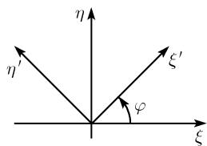

# 《数学指南——实用数学手册》3.4 欧氏几何学（运动的几何学）

## 概述

本节是《数学指南——实用数学手册》第 3 章中"由变换群刻画几何"框架在欧氏几何上的具体展开。开篇即援引 [[concepts/埃尔兰根纲领]]：根据克莱因的埃尔兰根纲领，[[concepts/欧氏几何]] 正好是在 [[concepts/欧几里得运动]] 下不变的性质（例如线段的长）。

全节分三小节，主线是同一套工具的三次应用——**用正交矩阵作旋转（主轴化）消去二次交叉项，用平移消去一次项**：

1. **3.4.1 欧几里得运动群**：定义 $x' = Dx + a$（$D$ 正交），给出平移、旋转、旋转反射、正常运动四类分类，以及 [[concepts/旋转群]]、[[concepts/平移群]]、正常欧氏运动群等子群与两条结构定理。
2. **3.4.2 圆锥截线**：以 [[concepts/主轴定理]] 把二次型 $x^{\mathrm{T}}Ax = b$ 旋转化为法式 $\lambda x^2 + \mu y^2 = b$，再按 $\det A \neq 0$（有中心）与 $\det A = 0$（无中心）两种主要情形给出 [[concepts/圆锥截线]] 的完整分类（表 3.3、表 3.4）。
3. **3.4.3 二次曲面**：把同一方法平移到三维，给出 [[concepts/二次曲面]] 的旋转标准化与两张法式表（表 3.5、表 3.6）。

数学内容上，本节是"二次型主轴定理 + 平移消去一次项"的标准处理，核心代数工具是实对称矩阵的正交对角化。

## 3.4.1 欧几里得运动群

以 $x_{1}, x_{2}, x_{3}$ 和 $x_{1}', x_{2}', x_{3}'$ 为两个笛卡儿坐标系。一个欧几里得运动是一个变换

$$
\boldsymbol{x}' = \boldsymbol{D}\boldsymbol{x} + \boldsymbol{a},
$$

其中 $\boldsymbol{a}=(a_{1},a_{2},a_{3})^{\mathrm{T}}$ 为常值列向量，$D$ 为正交 $(3\times3)$ 矩阵，即 $DD^{T}=D^{T}D=E$（其中 $E$ 为单位矩阵）。显式地这些变换由下面方程给出：

$$
x_{j}' = d_{j1}x_{1} + d_{j2}x_{2} + d_{j3}x_{3} + a_{j}, \quad j = 1, 2, 3.
$$

分类：

- (i) 平移：$D = E$。
- (ii) 旋转：$\det D = 1,\ a = 0$。
- (iii) 旋转反射：$\det D = -1,\ a = 0$。
- (iv) 正常运动：$\det D = 1$。

**定义** 所有运动的集合在复合下构成一个群，称其为欧几里得运动群。

所有的旋转构成一个子群，称其为旋转群$^{1)}$。所有的平移（分别地，所有的正常运动）构成了欧几里得运动群的一个子群，称其为平移群（分别地，正常欧氏运动群）。

**例 1**：绕 $\zeta$ 轴以旋转角 $\varphi$ 的旋转（取正的数学定向）在笛卡儿 $(\xi, \eta, \zeta)$ 系下为

$$
\begin{array}{ll}
\xi' = \xi \cos\varphi + \eta \sin\varphi, & \zeta' = \zeta, \\
\eta' = -\xi \sin\varphi + \xi \cos\varphi.
\end{array}
$$

图 3.35 表示了在 $(\xi,\eta)$ 平面中的旋转。

**例 2**：对于 $(\xi, \eta)$ 平面的一个反射由下面的关系给出：

$$
\xi' = \xi, \quad \eta' = \eta, \quad \zeta' = -\zeta.
$$

**结构定理**

- (i) 每个旋转可以在一个适当的笛卡儿坐标系下化为绕 $\zeta$ 轴的旋转。
- (ii) 每个旋转反射可在一个适当选取的 $(\xi, \eta, \zeta)$ 坐标系下表示为绕 $\zeta$ 轴的旋转与对 $(\xi, \eta)$ 平面的反射的复合。

## 3.4.2 圆锥截线

圆锥截线的初等理论已在 0.1.7 中表述过了（外部引用）。

### 二次型

考虑方程

$$
\boldsymbol{x}^{\mathrm{T}}\boldsymbol{A}\boldsymbol{x} = b.
$$

显式地，此方程为

$$
a_{11}x_{1}^{2} + 2a_{12}x_{1}x_{2} + a_{22}x_{2}^{2} = b,\tag{3.17}
$$

它具有实对称矩阵 $A = \begin{pmatrix} a_{11} & a_{12} \\ a_{21} & a_{22} \end{pmatrix}$。设 $A \neq O$。于是，有 $\det A = a_{11}a_{22} - a_{12}a_{21}$，且 $\operatorname{tr}A = a_{11} + a_{22}$。

**定理** 应用在笛卡儿坐标系 $(x_{1}, x_{2}, x_{3})$ 下的一个旋转总可以把方程 (3.17) 化为法式

$$
\lambda x^{2} + \mu y^{2} = b.\tag{3.18}
$$

这里的 $\lambda$ 和 $\mu$ 是 $A$ 的特征值，即有

$$
\begin{vmatrix} a_{11} - \zeta & a_{12} \\ a_{21} & a_{22} - \zeta \end{vmatrix} = 0,
$$

其中 $\zeta = \lambda, \mu$。有 $\det A = \lambda\mu$，$\operatorname{tr}A = \lambda + \mu$。

**证明**：我们来确定矩阵 $A$ 的两个特征向量 $u$ 和 $v$，即使得 $\boldsymbol{A}\boldsymbol{u} = \lambda\boldsymbol{u}$ 和 $\boldsymbol{A}\boldsymbol{v} = \mu\boldsymbol{v}$（原文此处第二个等式的左端排印为 $\boldsymbol{A}\boldsymbol{u}$）。在这里可以选取 $u$ 和 $v$ 使得 $u^{T}v = 0$ 而 $u^{T}u = v^{T}v = 1$。令 $D := (u, v)$。于是 $\boldsymbol{x} = D\boldsymbol{x}'$ 是一个旋转。由 (3.17) 得到

$$
b = \boldsymbol{x}^{\mathrm{T}}\boldsymbol{A}\boldsymbol{x} = \boldsymbol{x}'^{\mathrm{T}}(\boldsymbol{D}^{\mathrm{T}}\boldsymbol{A}\boldsymbol{D})\boldsymbol{x}' = \boldsymbol{x}'^{\mathrm{T}}\begin{pmatrix} \lambda & 0 \\ 0 & \mu \end{pmatrix}\boldsymbol{x}' = \lambda x_{1}'^{2} + \mu x_{2}'^{2}.
$$

### 一般圆锥截线

$$
\boldsymbol{x}^{\mathrm{T}}\boldsymbol{A}\boldsymbol{x} + \boldsymbol{x}^{\mathrm{T}}\boldsymbol{a} + a_{33} = 0,
$$

其中 $\boldsymbol{a}=(a_{13},a_{23})^{\mathrm{T}}$，即

$$
a_{11}x_{1}^{2} + 2a_{12}x_{1}x_{2} + a_{22}x_{2}^{2} + a_{13}x_{1} + a_{23}x_{2} + a_{33} = 0.\tag{3.19}
$$

它具有实对称矩阵

$$
\boldsymbol{A} = \begin{pmatrix} a_{11} & a_{12} \\ a_{21} & a_{22} \end{pmatrix}, \quad
\mathcal{A} = \begin{pmatrix} a_{11} & a_{12} & a_{13} \\ a_{21} & a_{22} & a_{23} \\ a_{31} & a_{32} & a_{33} \end{pmatrix}.
$$

**第一种主要情形：有中心方程。** 如果 $\det A \neq 0$，则线性方程组

$$
\begin{array}{r}
a_{11}\alpha_{1} + a_{12}\alpha_{2} + a_{13} = 0, \\
a_{21}\alpha_{1} + a_{22}\alpha_{2} + a_{23} = 0
\end{array}
$$

有唯一的解 $(\alpha_{1},\alpha_{2})$。利用平移 $X_{j} := x_{j} - \alpha_{j},\ j=1,2$，方程 (3.19) 被变换为

$$
a_{11}X_{1}^{2} + 2a_{12}X_{1}X_{2} + a_{22}X_{2}^{2} = -\frac{\det\mathcal{A}}{\det A}.
$$

与 (3.17) 中的情形相似，由此通过旋转得到

$$
\lambda x^{2} + \mu y^{2} = -\frac{\det\mathcal{A}}{\det A}.
$$

因为 $\det A = \lambda\mu$，$\operatorname{tr}A = \lambda + \mu$，于是可得表 3.3 中的法式。

**表 3.3 中心圆锥截线**

（原表另含"图示"列，此处从略；表头两列在原文中均排印为 $\det A$。）

| det A | det 𝒜 | 法式 (a>0, b>0, c>0) | 名称 |
|-------|-------|----------------------|------|
| >0 | < 0 | $\frac{x^{2}}{a^{2}}+\frac{y^{2}}{b^{2}}=1$ | 椭圆 |
| >0 | >0 | $\frac{x^{2}}{a^{2}}+\frac{y^{2}}{b^{2}}=-1$ | 虚椭圆 |
| >0 | =0 | $\frac{x^{2}}{a^{2}}+\frac{y^{2}}{b^{2}}=0$ | 二重点 |
| <0 | < 0 | $\frac{x^{2}}{a^{2}}-\frac{y^{2}}{b^{2}}=1$ | 双曲线 |
| <0 | >0 | $\frac{y^{2}}{b^{2}}-\frac{x^{2}}{a^{2}}=1$ | 双曲线 |
| <0 | =0 | $\frac{x^{2}}{a^{2}}-\frac{y^{2}}{b^{2}}=0$ | 二重直线 |

**第二种主要情形：无中心方程（表 3.4）。** 这时有 $\det A = 0$，从而 $\lambda \neq 0$ 且 $\mu = 0$。对 (3.19) 应用一个旋转得到

$$
\lambda x^{2} + 2qx + py + c = 0.
$$

对它配完全平方得到

$$
\lambda\left(x + \frac{q}{\lambda}\right)^{2} + py + c - \frac{q^{2}}{\lambda} = 0.
$$

**表 3.4 非中心曲线（$\det A = 0$）**

（原表另含"图示"列，此处从略。）

| 法式 (a>0) | 名称 |
|-----------|------|
| $y = ax^{2}$ | 抛物线 |
| $y^{2} = 0$ | 二重直线 |
| $y^{2} = a^{2}$ | 两条直线 $y = \pm a$ |
| $y^{2} = -a^{2}$ | 两条虚直线 |

## 3.4.3 二次曲面

### 二次型

考虑方程

$$
\boldsymbol{x}^{\mathrm{T}}\boldsymbol{A}\boldsymbol{x} = b.
$$

显式表达，此方程为

$$
a_{11}x_{1}^{2} + 2a_{12}x_{1}x_{2} + 2a_{13}x_{1}x_{3} + 2a_{23}x_{2}x_{3} + a_{22}x_{2}^{2} + a_{33}x_{3}^{2} = b\tag{3.20}
$$

具有一个实矩阵 $\boldsymbol{A}=(a_{jk})$。假设 $\det\boldsymbol{A}\neq0$。于是其迹为 $\operatorname{tr}\boldsymbol{A}=a_{11}+a_{22}+a_{33}$。

**定理** 对笛卡儿坐标系 $(x_{1}, x_{2}, x_{3})$ 应用一个旋转可将上面的方程化为下面的法式：

$$
\lambda x^{2} + \mu y^{2} + \zeta z^{2} = b.
$$

这里的 $\lambda, \mu$ 和 $\zeta$ 是 $A$ 的特征值，即有 $\det(A - \gamma E) = 0$，其中 $\nu = \lambda, \mu$ 或 $\zeta$（原文此处特征值记号 $\gamma$ 与 $\nu$ 混用）。又有 $\det A = \lambda\mu\zeta$，$\operatorname{tr}A = \lambda + \mu + \zeta$。

**证明**：我们来确定矩阵 $A$ 的三个特征向量 $u, v$ 和 $w$，即向量使得

$$
\boldsymbol{A}\boldsymbol{u} = \lambda\boldsymbol{u}, \quad \boldsymbol{A}\boldsymbol{v} = \mu\boldsymbol{v}, \quad \boldsymbol{A}\boldsymbol{w} = \zeta\boldsymbol{w}.
$$

在这里可选取 $u, v$ 和 $w$ 使得 $u^{T}v = u^{T}w = v^{T}w = 0$ 以及 $u^{T}u = v^{T}v = w^{T}w = 1$。令 $D := (u, v, w)$，变换 $\boldsymbol{x} = D\boldsymbol{x}'$ 是一个旋转。由 (3.20) 得到了

$$
b = \boldsymbol{x}^{\mathrm{T}}\boldsymbol{A}\boldsymbol{x} = \boldsymbol{x}'^{\mathrm{T}}(\boldsymbol{D}^{\mathrm{T}}\boldsymbol{A}\boldsymbol{D})\boldsymbol{x}' = \boldsymbol{x}'^{\mathrm{T}}\begin{pmatrix} \lambda & 0 & 0 \\ 0 & \mu & 0 \\ 0 & 0 & \zeta \end{pmatrix}\boldsymbol{x}' = \lambda x_{1}'^{2} + \mu x_{2}'^{2} + \zeta x_{3}'^{2}.
$$

证毕。

### 一般二次曲面

$$
\boldsymbol{x}^{\mathrm{T}}\boldsymbol{A}\boldsymbol{x} + \boldsymbol{x}^{\mathrm{T}}\boldsymbol{a} + a_{44} = 0,
$$

其中 $\boldsymbol{a}=(a_{14},a_{24},a_{34})^{\mathrm{T}}$。此方程的显式表达为

$$
\begin{array}{c}
a_{11}x_{1}^{2} + 2a_{12}x_{1}x_{2} + 2a_{13}x_{1}x_{3} + 2a_{23}x_{2}x_{3} + a_{22}x_{2}^{2} + a_{33}x_{3}^{2} \\
+ a_{14}x_{1} + a_{24}x_{2} + a_{34}x_{3} + a_{44} = 0
\end{array}\tag{3.21}
$$

它具有实对称矩阵

$$
\boldsymbol{A} = \begin{pmatrix} a_{11} & a_{12} & a_{13} \\ a_{21} & a_{22} & a_{23} \\ a_{31} & a_{32} & a_{33} \end{pmatrix}, \quad
\mathcal{A} = \begin{pmatrix} a_{11} & a_{12} & a_{13} & a_{14} \\ a_{21} & a_{22} & a_{23} & a_{24} \\ a_{31} & a_{32} & a_{33} & a_{34} \\ a_{41} & a_{42} & a_{43} & a_{44} \end{pmatrix}.
$$

**第一种主要情形：有中心的方程（表 3.5）。** 如果 $\det A \neq 0$，则线性方程组

$$
\begin{array}{l}
a_{11}\alpha_{1} + a_{12}\alpha_{2} + a_{13}\alpha_{3} + a_{14} = 0, \\
a_{21}\alpha_{1} + a_{22}\alpha_{2} + a_{23}\alpha_{3} + a_{24} = 0, \\
a_{31}\alpha_{1} + a_{32}\alpha_{2} + a_{33}\alpha_{3} + a_{34} = 0
\end{array}
$$

有一个唯一的解 $(\alpha_{1},\alpha_{2},\alpha_{3})$。通过平移 $X_{j} := x_{j} - \alpha_{j},\ j=1,2,3$，(3.21) 变成了方程

$$
a_{11}X_{1}^{2} + 2a_{12}X_{1}X_{2} + 2a_{13}X_{1}X_{3} + 2a_{23}X_{2}X_{3} + a_{22}X_{2}^{2} + a_{33}X_{3}^{2} = -\frac{\det\mathcal{A}}{\det\boldsymbol{A}}.
$$

类似于在 (3.20) 中那样，以旋转由此得到

$$
\lambda x^{2} + \mu y^{2} + \zeta z^{2} = -\frac{\det\mathcal{A}}{\det\boldsymbol{A}}.
$$

**第二种主要情形：无中心的方程。** 这发生在 $\det A = 0$ 时的情形。将旋转用于 (3.21) 得到了这种情形下的

$$
\lambda x^{2} + \mu y^{2} + px + ry + sz + c = 0.
$$

经完全配平方和平移于是给出了在表 3.6 中列出的不同法式。

**表 3.5 中心曲面**

（原表另含"图示"列，此处从略。）

| 法式 (a>0, b>0, c>0) | 名称 |
|----------------------|------|
| $\frac{x^{2}}{a^{2}}+\frac{y^{2}}{b^{2}}+\frac{z^{2}}{c^{2}}=1$ | 椭球面 |
| $\frac{x^{2}}{a^{2}}+\frac{y^{2}}{b^{2}}+\frac{z^{2}}{c^{2}}=-1$ | 虚椭球面 |
| $\frac{x^{2}}{a^{2}}+\frac{y^{2}}{b^{2}}+\frac{z^{2}}{c^{2}}=0$ | 原点 |
| $\frac{x^{2}}{a^{2}}+\frac{y^{2}}{b^{2}}-\frac{z^{2}}{c^{2}}=1$ | 单叶双曲面 |
| $\frac{x^{2}}{a^{2}}+\frac{y^{2}}{b^{2}}-\frac{z^{2}}{c^{2}}=0$ | 双锥面 |
| $\frac{z^{2}}{c^{2}}-\frac{x^{2}}{a^{2}}-\frac{y^{2}}{b^{2}}=1$ | 双叶双曲面 |

**表 3.6 非中心曲面（$\det A = 0$）**

（原表另含"图示"列，此处从略。）

| 法式 (a > 0, b > 0, c > 0) | 名称 |
|---------------------------|------|
| $\frac{x^{2}}{a^{2}} + \frac{y^{2}}{b^{2}} = 2cz$ | 椭圆抛物面 |
| $\frac{x^{2}}{a^{2}} - \frac{y^{2}}{b^{2}} = 2cz$ | 双曲抛物面（鞍面） |
| $\frac{x^{2}}{a^{2}} + \frac{y^{2}}{b^{2}} = 1$ | 椭圆柱面 |
| $\frac{x^{2}}{a^{2}} - \frac{y^{2}}{b^{2}} = 1$ | 双曲柱面 |
| $\frac{x^{2}}{a^{2}} - \frac{y^{2}}{b^{2}} = 0$ | 两个相交平面 |
| $x = 2cy^{2}$ | 抛物柱面 |
| $x^{2} = a^{2}$ | 两个平行平面 (x=±a) |
| $x^{2} = 0$ | 二重平面 |
| $\frac{x^{2}}{a^{2}} + \frac{y^{2}}{b^{2}} = -1$ | 虚椭圆柱面 |
| $\frac{x^{2}}{a^{2}} + \frac{y^{2}}{b^{2}} = 0$ | 退化椭圆柱面 (z 轴) |

## 与 wiki 其他页面的关系

- 上位框架：[[concepts/埃尔兰根纲领]]、[[concepts/G几何]]、[[concepts/变换群]]；本节的欧几里得运动群是 3.1 节抽象"[[concepts/运动]]"在欧氏空间上的具体矩阵实现。
- 与 3.1 节既有结论 [[findings/欧氏几何的运动群aut-e及全等定义]] 构成"抽象定义—具体分类"的对应关系。
- 坐标框架沿用 [[concepts/笛卡儿坐标]]。
- 命名来源：[[entities/欧几里得]]、[[entities/克莱因]]。

## 存疑点（供后续核对）

- 例 1 中 $\eta'$ 表达式第二项写为 $\xi\cos\varphi$，疑应为 $\eta\cos\varphi$。
- 表 3.3 表头两列在 OCR 结果中均显示为 `det A`，正文实际使用 $A$（二阶）与 $\mathcal{A}$（三阶）两个不同矩阵。
- 旋转群定义处的脚注标记 $^{1)}$ 在源文件中未见对应脚注正文。
- 3.4.3 定理中特征值记号在 $\det(A-\gamma E)=0$ 与 $\nu=\lambda,\mu,\zeta$ 之间混用；二次型证明中第二个特征向量等式左端排印为 $\boldsymbol{A}\boldsymbol{u}$。

<!-- llm-wiki:embedded-images -->
## Embedded Images

### Document

<!-- llm-wiki:embedded-images -->
