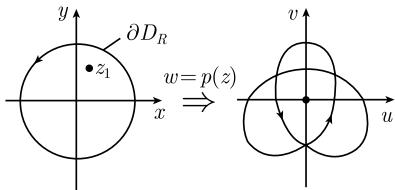

# 《数学指南——实用数学手册》1.14.9 在代数基本定理上的应用

## 节定位与作用

本节（1.14.9）是《数学指南——实用数学手册》1.14「复变函数」部分的应用小节，主题为**代数基本定理**。它不引入新的理论工具，而是把此前建立的两套工具——[[映射度]]／[[儒歇零点原理]]（1.14.8 节）与[[findings/刘维尔定理有界整函数为常数]]（1.14.6 节）——分别用于同一定理，给出两个独立的证明，随后给出多项式完全因式分解的推论。因此本节在整章中同时充当「工具的应用示例」与「复分析诸定理相互关联的证据」。

## 节首引文

节首以两段引文开篇，说明历史评价与工具的简化作用。

F. 克莱因（Felix Klein, 1849—1925）：

> 以现代观点来看，我们可以说，1799 年高斯给出的代数基本定理的证明原则上是正确的，但是不完善。

D. 希尔伯特（David Hilbert），巴黎讲座，1900：

> 然而，我们不禁要问：随着数学知识的不断扩展，单个的研究者想要了解这些知识的所有部门岂不是变得不可能了吗？为了回答这个问题，我想指出，数学中每一步真正的进展都与更有力的工具和更简单的方法的发现密切联系着，这些工具和方法同时会有助于理解已有的理论并把陈旧的、复杂的东西抛到一边。数学科学发展的这种特点是根深蒂固的。因此，对于个别的数学工作者来说，只要掌握了这些有力的工具和简单的方法，他就有可能在数学的各个分支中比其他学科更容易地找到前进的道路。\*

源文中该引文末尾带有星号脚注标记 `\*`，但源文档未给出脚注内容（见 [[queries/1149节希尔伯特引文脚注未转录]]）。

## 定理陈述

**代数基本定理**：每个次数 $\geqslant n$ 的具有复系数 $a_j$ 的多项式

$$
p(z) := z^n + a_{n-1}z^{n-1} + \dots + a_1 z + a_0
$$

有一个（复）零点。

## 高斯 1799 年方法的描述与评述

源文指出，[[高斯]]把 $p$ 分解成实部和虚部

$$
p(z) = u(x,y) + \mathrm{i}v(x,y),
$$

并研究平面代数曲线 $u(x,y) = 0,\ v(x,y) = 0$ 的性质。源文对此方法的评述是：这种类型的证明冗长乏味，并且需要代数曲线的工具才能简化，这一先进的工具在今天我们已经有了，而在高斯的时代还没有出现。

详细整理见 [[entities/高斯]] 与 [[entities/高斯]]。

## 第一个证明（映射度）

高斯直观上清晰的思想是：考虑半径为 $R$ 的圆盘

$$
D_R := \{z \in \mathbb{C} : |z| < R\}.
$$

多项式 $p$ 产生一个映射（也用 $p$ 表示）

$$
p: \overline{D}_R \to \mathbb{C},
$$

其中，数学意义上的正定向边界曲线 $\partial D_R$ 被映射到数学意义上正定向绕原点 $n$ 次的圆周 $p(\partial D_R)$（$n = 2$ 时的情形参看图 1.179）。因而一定存在一个点 $z_1 \in D_R$ 被映射到原点，即 $p(z_1) = 0$。

为证明象曲线 $p(\partial D_R)$ 绕原点 $n$ 次，考虑由 $f(z) := z^n$ 定义的多项式 $w = f(z)$。从关系式 $z = R\mathrm{e}^{\mathrm{i}\varphi}$ 即可得

$$
w = R^n \mathrm{e}^{\mathrm{i}n\varphi}, \quad 0 \leqslant \varphi \leqslant 2\pi.
$$

因而，半径为 $R$ 的圆周 $\partial D_R$ 被映射到半径为 $R^n$ 的圆周 $f(\partial D_R)$，它绕原点 $n$ 次。如果 $R$ 足够大，那么绕原点这一特性对 $p$ 也成立，因为 $p$ 与 $f$ 只有低阶项不一样。

严格阐述（源文标题为「代数基本定理的第一个证明（映射度）」）：记

$$
p(z) := f(z) + g(z),
$$

其中 $f(z) := z^n$。对所有满足 $|z| = R$ 的 $z$，有

$$
|f(z)| = R^n \quad \text{和} \quad |g(z)| \leqslant \text{常数} \cdot R^{n-1}.
$$

如果 $R$ 足够大，则有

$$
|g(z)| < |f(z)|, \quad \text{对所有满足 } |z| = R \text{ 的 } z.
$$

函数 $f$ 显然有一个零点。根据 1.14.8 中的儒歇定理即得函数 $f + g = p$ 也有一个零点。

见 [[concepts/代数基本定理]]。

## 第二个证明（刘维尔定理）

源文标题为「代数基本定理的第二个证明（刘维尔定理）」，并称该证明「更短一些」。

假设多项式 $p$ 没有零点，则其倒数 $1/p$ 是整函数，因为

$$
\lim_{|z| \to \infty} \left| \frac{1}{p(z)} \right| = 0,
$$

所以它也是有界函数。根据刘维尔定理，$1/p$ 一定是常数。这（与 $p$ 不是常数）是一个矛盾，因此证明 $p$ 有一个零点。$\square$

见 [[concepts/代数基本定理]] 与 [[整函数]]。

## 推论（完全因式分解）

由于 $p(z_1) = 0$，所以 $p$ 在点 $z_1$ 处的幂级数展开式为

$$
p(z_1) = a_1 (z - z_1) + a_2 (z - z_1)^2 + \dots,
$$

因而 $p(z) = (z - z_1)q(z)$。多项式 $q$ 有零点 $z_2$，因而 $q(z) = (z - z_2)r(z)$，诸如此类。把这些事实放在一起就得到一个因式分解

$$
\boxed{p(z) = (z - z_1)(z - z_2) \dots (z - z_n).}
$$

见 [[concepts/代数基本定理]]。展开式左端被印作 $p(z_1)$ 而右端以 $(z - z_1)$ 为因子，记号上存疑，见 [[queries/1149节推论幂级数展开左端记号疑误]]。

## 图像

源文图 1.179 用于示意 $n = 2$ 时边界曲线 $p(\partial D_R)$ 绕原点的情况：

该图像文件内容不可读取，无法确认其中的图形与坐标标注，见 [[queries/1147节图177不可读取]]。

## 相关页面

- 工具来源：[[映射度]]、[[儒歇零点原理]]、[[findings/刘维尔定理有界整函数为常数]]、[[零点重数]]
- 历史评述：[[高斯]]、[[克莱因]]、[[希尔伯特]]、[[entities/高斯]]
- 结论与证明：[[代数基本定理]]、[[concepts/代数基本定理]]、[[concepts/代数基本定理]]、[[concepts/代数基本定理]]

## 待核问题

- [[queries/1147节图177不可读取]]
- [[queries/1149节推论幂级数展开左端记号疑误]]
- [[queries/1149节希尔伯特引文脚注未转录]]

<!-- llm-wiki:embedded-images -->
## Embedded Images

### Document

<!-- llm-wiki:embedded-images -->
