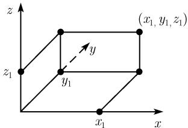

# 《数学指南——实用数学手册》0.1.8 空间解析几何学中的基本公式

本节是 [[数学指南-实用数学手册]] 第 0.1 节（初等数学中的基本公式）下的 0.1.8 小节，属于参考性数学内容，给出空间解析几何的三组标准公式：过两点的直线参数方程、三维两点间距离公式、平面的一般方程，并以右手系定义开篇。内容为经典数学定义，无争议。

## 原文要点

### 空间中的笛卡儿坐标

空间笛卡儿坐标系如图 0.19 所示：它有三个相互垂直的坐标轴——记为 x 轴、y 轴和 z 轴，分别与右手大拇指、食指和中指的方向相同（右手系）。空间一点的坐标 $(x_1, y_1, z_1)$ 由到轴的垂直投影确定。

详见 [[空间笛卡儿坐标系]]。

### 过两点 $(x_1, y_1, z_1)$ 和 $(x_2, y_2, z_2)$ 的直线方程

```latex
\boxed { \begin{array}{c} x = x _ {1} + t (x _ {2} - x _ {1}), y = y _ {1} + t (y _ {2} - y _ {1}), \\ z = z _ {1} + t (z _ {2} - z _ {1}), \end{array} }
```

参数 $t$ 遍及所有实数，可以理解为时间（图 0.20(a)）。

详见 [[空间直线的参数方程]]。

### 两点 $(x_1, y_1, z_1)$ 和 $(x_2, y_2, z_2)$ 间的距离 $d$

```latex
d = \sqrt {(x _ {1} - x _ {2}) ^ {2} + (y _ {1} - y _ {2}) ^ {2} + (z _ {1} - z _ {2}) ^ {2}}.
```

详见 [[三维两点间距离公式]]。

### 平面方程

```latex
\boxed {A x + B y + C z = D.}
```

实常数 $A, B, C$ 应满足条件 $A^{2} + B^{2} + C^{2} \neq 0$（图 0.20(b)）。

详见 [[平面的一般方程]]。

### 交叉引用

向量代数在三维空间中的直线和平面上的应用——见手册 3.3 节。

## 插图



图 0.19（坐标系示意）


图 0.20 三维空间中的直线与平面方程

## 录入备注

- **完整性依赖**：本节明确将向量代数工具外包给手册 3.3 节（"向量代数在三维空间中的直线和平面上的应用 见 3.3"），因此本节对直线与平面的刻画是不完整的——缺少法向量、方向向量、点法式等工具。该节尚未录入，相关链接暂以文字占位。
- **图片归属核对**：源文档中第一张插图（001）的说明文字指向 3.3 节的应用，但图内容实为坐标系示意（对应图 0.19）；第二张插图（002）对应图 0.20。录入时已按图号重新归属，建议人工复核原始排版。
- **适用范围**：非零条件 $A^2+B^2+C^2 \neq 0$ 仅是平面方程系数的约束，不应外推到直线方程；参数 $t$ 的时间解释只是直觉性注释，非形式定义。

## 与既有 wiki 的关联

- 本节应纳入合并参考页 [[初等几何公式]] 的覆盖范围（手册 0.1 节）。
- [[三维两点间距离公式]] 是 [[n维球的体积与表面积]] 所依赖的 n 维欧氏度量的三维特例，两页已建立双向链接。

<!-- llm-wiki:embedded-images -->
## Embedded Images

### Document


<!-- llm-wiki:embedded-images -->
