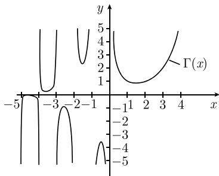

# 《数学指南——实用数学手册》1.14.16 在欧拉伽马函数上的应用

本节是《数学指南——实用数学手册》第 1.14 节（复分析）中的一个应用小节，主题是**欧拉伽马函数 Γ**：从阶乘的插值问题出发给出定义与函数方程，再用解析延拓把实变量函数扩展为复平面上的亚纯函数，最后列举乘积公式、乘法公式、互补定理、斯特林公式以及维兰特（Wielandt）的唯一性刻画。全节所有命题都以 Γ 为唯一对象。

## 定义与函数方程

定义取阶乘为出发点：

$$\Gamma(n+1) := n!, \quad n = 0, 1, 2, \dots$$

由此显然蕴含（源文以方框标出式 (1.480)）：

$$\boxed{\Gamma(z+1) = z\Gamma(z),}\tag{1.480}$$

其中先只对 $z = 1, 2, \cdots$ 成立。欧拉（1707—1783）提出的问题是：对 $z$ 的其他值，能否合理地定义 $n!$。为此他求出了函数方程 (1.480) 的一个解，即收敛积分

$$\Gamma(x) := \int_{0}^{\infty} \mathrm{e}^{-t} t^{x-1}\,\mathrm{d}t, \quad \text{对满足 } x > 0 \text{ 的所有 } x \in \mathbb{R}.\tag{1.481}$$

原文以代码块形式保留的关键公式如下（供逐字核对）：

```
Γ(n+1) := n!,  n = 0, 1, 2, ...

Γ(z+1) = z Γ(z)                                              (1.480)

Γ(x) := ∫_0^∞ e^{-t} t^{x-1} dt,  对满足 x > 0 的所有 x ∈ ℝ   (1.481)
```

## 解析延拓与极点结构

由 (1.481) 定义的实值函数 Γ 可以**唯一**扩展为复平面 $\mathbb{C}$ 上的一个亚纯函数。该函数的极点恰好是

$$z = 0, -1, -2, \cdots,$$

并且所有这些极点都是**一阶极点**。

对 $n = 0, 1, 2, \cdots$，函数在极点 $z = -n$ 邻域内的洛朗级数为

$$\Gamma(z) = \frac{(-1)^{n}}{n!\,(z+n)} + (z+n) \text{ 的幂级数}.$$

由恒等定理可知，对不是 Γ 极点的所有复自变量 $z$，函数方程 (1.480) 都成立。

实值 $x$ 的 Γ 函数图像见源文图 1.193（本地图像未能加载）。

## 高斯乘积公式

函数 Γ 没有零点，因而其反函数 $1/\Gamma$ 是整函数。对所有 $z \in \mathbb{C}$，有乘积公式（方框公式）

$$\boxed{\frac{1}{\Gamma(z)} = \lim_{n \to \infty} \frac{1}{n^{z} n!} z(z+1) \cdots (z+n).}$$

## 高斯乘法公式

对 $k = 1, 2, \cdots$ 以及不是 Γ 极点的所有 $z$，有

$$\Gamma\!\left(\frac{z}{k}\right)\Gamma\!\left(\frac{z+1}{k}\right)\cdots\Gamma\!\left(\frac{z+k-1}{k}\right) = \frac{(2\pi)^{(k-1)/2}}{k^{\,z-1/2}}\,\Gamma(z).$$

特别地，当 $k = 2$ 时得到源文所称的**拉格朗日加倍公式**：

$$\Gamma\!\left(\frac{z}{2}\right)\Gamma\!\left(\frac{z}{2}+\frac{1}{2}\right) = \frac{\sqrt{\pi}}{2^{\,z-1}}\,\Gamma(z).$$

## 欧拉互补定理与斯特林公式

**欧拉互补定理**：对所有不是整数的复数 $z$，

$$\Gamma(z)\Gamma(1-z) = \frac{\pi}{\sin \pi z}.$$

**斯特林公式**：对每个正实数 $x$，存在满足 $0 < \theta(x) < 1$ 的数 $\theta(x)$，使得

$$\Gamma(x+1) = \sqrt{2\pi}\, x^{\,x+1/2} \mathrm{e}^{-x} \mathrm{e}^{\,\theta(x)/12x}.$$

对满足 $\operatorname{Re} z > 0$ 的每个复数 $z$，有 $|\Gamma(z)| \leqslant |\Gamma(\operatorname{Re} z)|$。特别地（方框公式）

$$\boxed{n! = \sqrt{2\pi n}\left(\frac{n}{\mathrm{e}}\right)^{n} \mathrm{e}^{\,\theta(n)/12n}, \quad n = 1, 2, \dots.}$$

## 伽马函数更多的性质

- (i) 欧拉积分表示 (1.481) 对满足 $\operatorname{Re} z > 0$ 的所有复数 $z$ 都成立。
- (ii) $\Gamma(1) = 1$，$\Gamma\!\left(\frac{1}{2}\right) = \sqrt{\pi}$，$\Gamma(-1/2) = -2\sqrt{\pi}$。
- (iii) 对不是整数的所有复数 $z$，$\Gamma(z)\Gamma(-z) = -\dfrac{\pi}{z\sin(\pi z)}$。
- (iv) 对 $z + \frac{1}{2}$ 不是整数的所有复数 $z$，$\Gamma\!\left(\frac{1}{2}+z\right)\Gamma\!\left(\frac{1}{2}-z\right) = \dfrac{\pi}{\cos(\pi z)}$。

## 维兰特的唯一性结果（1939）

假设给定复平面 $\mathbb{C}$ 上的区域 $\Omega$，它包含垂直带域

$$S := \{z \in \mathbb{C} \mid 1 \leqslant \operatorname{Re} z < 2\}.$$

假设 $f\colon \Omega \to \mathbb{C}$ 是满足如下性质的全纯函数：

- (i) 对 $\Omega$ 中的所有复数 $z$，若 $z+1$ 也属于 $\Omega$，则 $f(z+1) = z f(z)$；
- (ii) $f$ 在 $S$ 上有界，且 $f(1) = 1$。

那么函数 $f$ 恒等于伽马函数 Γ。

## 图像与本地资源

源文包含图 1.193「欧拉 Γ 函数」，对应图片：

```
media/10-数学指南实用数学手册--17-11416-在欧拉伽马函数上的应用--5xx5su/001-f5178196b0139f2ca2574e6d8755a15496232dac92bc73abc8ca8ca2b96424c0.jpg
```

该图像在本环境中未能加载（系统提示 `unsupported content type: image_url`），因此无法核对图像内容。

<!-- llm-wiki:embedded-images -->
## Embedded Images

### Document


<!-- llm-wiki:embedded-images -->

## Related
- [[concepts/欧拉伽马函数]]
