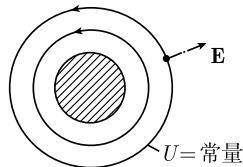

# 《数学指南——实用数学手册》1.14.14 在静电学和静磁学上的应用

## 概述

本节是《数学指南——实用数学手册》1.14 章「复变函数在物理中的应用」子系列的一节，紧接 [[sources/10-数学指南实用数学手册--14-11412-对调和函数的应用--xj3rdz]] 之后。全节的核心主张只有一句：**1.14.13 节关于平面（二维）流体（源流）的复变函数结果，可以通过一份「词典」整体翻译为平面静电场的结果**。源文档据此给出两个例证（点电荷、金属圆柱体），并仅用一句话把结论平移到静磁学。

本节不引入新的复变函数定理，属于既有数学结论的物理应用面，因此对 wiki 中已有的复分析结论（[[concepts/调和函数]]、[[concepts/对数主值]]、[[concepts/拉普拉斯算子]]、[[concepts/格林函数]]、[[concepts/黎曼映射定理]]）不构成任何加强或修改。

## 平面静电学基本方程

在没有电荷、电流以及磁场的情况下，静电场 $\boldsymbol{E}$ 的麦克斯韦方程组退化为（原文框式公式，照录）：

$$
\boxed {\operatorname{div} \boldsymbol {E} = 0, \quad \mathbf {c u r l} \boldsymbol {E} = \mathbf {0}, \quad \text {在} \Omega \text {上}.}\tag{1.477}
$$

源文档指出这是静电场 $\boldsymbol{E}$ 的麦克斯韦方程组在「无电荷、无电流、无磁场」情形下的形式。详见 [[concepts/平面静电学基本方程]] 与 [[findings/基本方程1477与静磁学基本方程]]。

## 类比词典（1.14.13 → 本节）

源文档的「类比原理」：1.14.13 中的每个流体对应一个静电场，使用如下词典翻译两种概念（原文照录）：

- 速度场 $\boldsymbol{v} \Rightarrow$ 电场 $\boldsymbol{E}$，
- 速度势 $U \Rightarrow$ 电势（电压）$U$，
- 积分曲线 $\Rightarrow \boldsymbol{E}$ 的电场线，
- 源强度 $Q(C) \Rightarrow C$ 的内部的面电荷 $q$，
- 环流 $Z(C) \Rightarrow$ 环流 $Z(C)$。

配套的物理陈述：

- 在电荷为 $Q$ 的点上，电场力 $Q\boldsymbol{E}$ 沿电力线方向；电场向量垂直于等势线。
- 电场中的导体（比如金属）对应于常值电势 $U$。
- 元陈述：「数学的一个优点在于同一个数学理论可以应用于自然界中完全不同的情形。」

词典的完整整理见 [[concepts/电学与流体力学的类比词典]]，其形式化陈述见 [[findings/类比词典流体到静电场的对应]]。**注意：词典中出现的「源流」「源强度」「环流」等术语全部定义在 1.14.13 节，而该节尚未入库**，见 [[queries/11414节引用的11413节未入库]]。

## 点电荷

1.14.13 中的纯源流

$$f(z) := -\frac{q}{2\pi} \ln z$$

相应于具有电势

$$U(z) = -\frac{q}{2\pi} \ln r$$

的一个电场 $\boldsymbol{E}$。由位于原点处的平面电荷 $q$ 所生成的场为

$$\boldsymbol{E}(z) = \frac{qz}{2\pi r^2}$$

（源文档标注为「图 1.187(c)」）。详见 [[concepts/点电荷的电场与电势]] 与 [[findings/点电荷的电场与电势公式]]。

## 半径为 $R$ 的金属圆柱体

一个圆柱体的电场，相应于在垂直于圆柱体轴的每个平面中具有静电势

$$U = -\frac{q}{2\pi} \ln r \quad (r \geqslant R)$$

的源流

$$f (z) = - \frac {q} {2 \pi} \ln z.$$

其等势曲线是同心圆。在圆柱体内部有 $U = \text{常数} = U(R)$（源文档标注为「图 1.190」）。详见 [[concepts/金属圆柱体的静电势]] 与 [[findings/金属圆柱体外部对数势内部常电势]]。

源文档附带的图：

（该图在本节中标记为「图 1.190」，与圆柱体等势线为同心圆、内部 $U = \text{常数} = U(R)$ 的描述相应；图像内容未能加载，见 [[queries/11414节图1187c与图1190内容不可辨识]]。）

## 静磁学

源文档仅有一句：**如果把 (1.477) 中的电场 $\boldsymbol{E}$ 替换为磁场 $\boldsymbol{B}$，就得到静磁学基本方程。** 该段无推导、无例子，信息量与前半节严重不对称。

## 要点与局限

1. 本节全部结论都限定在**平面（二维）**静电学/静磁学与 **1.14.13 的源流模型**之内，不可外推到三维静电学或其他复变函数结论。
2. (1.477) 要求在无电荷的区域 $\Omega$ 上成立，但正文并未说明原点（点电荷所在处）必须从 $\Omega$ 中排除，字面上存在张力，见 [[queries/11414节方程1477在点电荷处区域未排除原点]]。
3. 电势与源流都写作 $\ln z$ / $\ln r$，源文档未声明 $\ln$ 的分支（主值）选择，见 [[queries/11414节对数ln未声明分支]]。
4. 词典用 $q$ 表示 $C$ 的内部面电荷，正文「电场力 $Q\boldsymbol{E}$」用 $Q$ 表示电荷，两处符号未统一，见 [[queries/11414节电荷符号Q与q混用]]。
5. 电场表达式 $\boldsymbol{E}(z) = qz/(2\pi r^2)$ 同时使用复变量 $z$ 与模 $r = |z|$；若改写为 $q/(2\pi\bar z)$ 则其为反全纯（非全纯）函数，源文档用实向量语言回避了这一点，属表述混用而非错误。

## 与既有 wiki 内容的联系

- 对数势 $-\frac{q}{2\pi}\ln r$ 是二维拉普拉斯方程的基本解，与 [[concepts/调和函数]]、[[concepts/拉普拉斯算子]]、[[concepts/格林函数]]、[[concepts/泊松公式]] 直接相关。
- $f(z) = -\frac{q}{2\pi}\ln z$ 正是 [[concepts/对数主值]] 所讨论的对象，分支选择问题在此再次出现。
- 圆柱体的同心圆等势线可由 $\ln z$ 描述，与 [[concepts/黎曼映射定理]] 所刻画的共形等价思想一脉相承，但本节未引用该定理。
- 本节是 1.14.12（对调和函数的应用）之后的下一节；目录上位于两者之间的 1.14.13（流体力学/源流）缺失，构成本页最大的外部依赖缺口。

<!-- llm-wiki:embedded-images -->
## Embedded Images

### Document

<!-- llm-wiki:embedded-images -->
