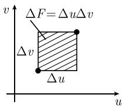
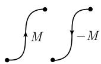

# 《数学指南——实用数学手册》1.7.6 微积分基本定理（高斯-斯托克斯定理）

本节是《数学指南——实用数学手册》1.7 节（多实变量函数的积分）的第六个子节，用来把 1.7.1 中提出的「微积分基本定理的微分式形式即高斯-斯托克斯定理」这一方向落实为具体的定理陈述与一系列经典应用。全节以 R. 托姆（René Thom, 1923—2002）的题记开篇，称斯托克斯定理是「最深刻的数学定理」。

## 题记

> 人们也许会问, 最深刻的数学定理 —— 毫无疑问, 它有明确的物理解释 —— 是什么? 对我而言, 这个定理自然是斯托克斯定理.
>
> R. 托姆 (René Thom, 1923—2002)

## 核心命题：斯托克斯一般定理 (1.143)

$$
\boxed{\int_{M} \mathrm{d}\omega = \int_{\partial M} w.} \tag{1.143}
$$

原文称这个公式是牛顿-莱布尼茨微积分基本定理

$$
\int_a^b F'(\pmb{x})\,\mathrm{d}\pmb{x} = F\big|_a^b
$$

「对高维的推广」。注意 (1.143) 右端在原文中印作 $w$，而定理陈述与后文应用处均写作 $\omega$。

**斯托克斯定理** 令 $M$ 为 $n$ 维定向紧的实流形（$n \geqslant 1$），其中边界 $\partial M$ 为协同定向的，并令 $\omega$ 为 $M$ 上 $C'$ 类的 $n-1$ 次微分式，那么公式 (1.143) 成立。

**注** 斯托克斯定理中出现的数学对象在文献 [212] 中被详细介绍。原文建议读者「从直觉上考虑基本公式 (1.143)，而不用担心精确的阐述」，即本节的定位是直观与应用，严格证明不在本节范围内。

原文给出的三条直观化建议：

(i) 把 $M$ 看作一条有界曲线，或有界的 $m$ 维曲面（$m=2,3,\cdots$），或 $R^N$ 中有界开集的闭包是有益的。

(ii) 参数：如果用局部坐标记积分，那么对 $M$ 及 $\partial M$，后者都是任意的。

(iii) **分解原理**：如果不能把 $M$（相应地 $\partial M$）描述成局部坐标（参数）的单个集，那么可以把 $M$（相应地 $\partial M$）分解成有限个部分的不相交并集，每个部分确有这样一个整体参数。那么每部分积分的和就是 $M$ 上所求积分。

> 原文此处插有「嘉当微分学完善.」与「这样我们有如下实用的事实：」两句，语序与衔接似有转写讹误。

只需注意的是，$M$ 上靠近边界点 $P$ 的局部坐标与在边界 $\partial M$ 上靠近 $P$ 的局部坐标是相容的（这是**协同定向**边界的概念）；在下面的例子中从直观上解释这一点。

## 1.7.6.1 经典高斯积分定理的应用

考虑 2 次微分式

$$
\omega = a\,\mathrm{d}y \wedge \mathrm{d}z + b\,\mathrm{d}z \wedge \mathrm{d}x + c\,\mathrm{d}x \wedge \mathrm{d}y.
$$

根据 1.5.10.4 的例 8，有

$$
\mathrm{d}\omega = (a_x + b_y + c_z)\,\mathrm{d}x \wedge \mathrm{d}y \wedge \mathrm{d}z.
$$

为使 $\int_{\partial M}\omega$ 有意义，$\partial M$ 必须是 2 维的。因此假设 $M$ 是 $\mathbb{R}^3$ 中具有充分光滑边界 $\partial M$ 的一个有界（非空）开集的闭包，它有参数表示

$$
x = x(u,v), \quad y = y(u,v), \quad z = z(u,v).
$$

把 $\omega$ 与参数 $u,v$ 联系起来，则

$$
\omega = \left(a\frac{\partial(y,z)}{\partial(u,v)} + b\frac{\partial(z,x)}{\partial(u,v)} + c\frac{\partial(x,y)}{\partial(u,v)}\right)\mathrm{d}u \wedge \mathrm{d}v
$$

（参看 1.5.10.4 中的例 12）。于是 $\int_M \mathrm{d}\omega = \int_{\partial M}\omega$ 导出 3 维区域 $M$ 的经典高斯定理：

$$
\boxed{\int_{M}(a_x + b_y + c_z)\,\mathrm{d}x\,\mathrm{d}y\,\mathrm{d}z = \int_{\partial M}\left(a\frac{\partial(y,z)}{\partial(u,v)} + b\frac{\partial(z,x)}{\partial(u,v)} + c\frac{\partial(x,y)}{\partial(u,v)}\right)\mathrm{d}u\,\mathrm{d}v} \tag{1.144}
$$

### 向量记号

引进坐标向量 $r := x\boldsymbol{i} + y\boldsymbol{j} + z\boldsymbol{k}$，则

$$
\boldsymbol{r}_u(u,v) = x_u(u,v)\boldsymbol{i} + y_u(u,v)\boldsymbol{j} + z_u(u,v)\boldsymbol{k}
$$

是过 $\partial M$ 上点 $P(u,v)$ 的坐标线 $v=$ 常数的切向量（图 1.70(b)）。类似地，$\boldsymbol{r}_v(u,v)$ 是过点 $P(u,v)$ 的坐标线 $u=$ 常数的切向量。点 $P(u,v)$ 处的切平面方程为

$$
\boxed{\boldsymbol{r} = \boldsymbol{r}(u,v) + p\,\boldsymbol{r}_u(u,v) + q\,\boldsymbol{r}_v(u,v),}
$$

其中 $p,q$ 是实参数。为使命题成立须假定 $\boldsymbol{r}_u(u,v) \times \boldsymbol{r}_v(u,v) \neq 0$（两向量不平行也不反平行）。单位法向量为

$$
\boxed{\boldsymbol{n} := \frac{\boldsymbol{r}_u(u,v) \times \boldsymbol{r}_v(u,v)}{|\boldsymbol{r}_u(u,v) \times \boldsymbol{r}_v(u,v)|}} \tag{1.145}
$$

它垂直于 $P(u,v)$ 处的切平面。$M$ 与 $\partial M$ 的协同定向说明这个法向量指向外部（图 1.70(a)）。

### 经典向量形式 (1.146)

引进向量场 $\boldsymbol{J} := a\boldsymbol{i} + b\boldsymbol{j} + c\boldsymbol{k}$，则 3 维区域的高斯定理可写成经典形式：

$$
\boxed{\int_{M}\operatorname{div}\boldsymbol{J}\,\mathrm{d}x = \int_{\partial M}\boldsymbol{J}\,\boldsymbol{n}\,\mathrm{d}F,} \tag{1.146}
$$

其中曲面面积元

$$
\mathrm{d}F = |\boldsymbol{r}_u \times \boldsymbol{r}_v|\,\mathrm{d}u\,\mathrm{d}v = \sqrt{\left(\frac{\partial(x,y)}{\partial(u,v)}\right)^2 + \left(\frac{\partial(y,z)}{\partial(u,v)}\right)^2 + \left(\frac{\partial(z,x)}{\partial(u,v)}\right)^2}\,\mathrm{d}u\,\mathrm{d}v.
$$

直观上，$\partial M$ 的曲面元素 $\Delta F$ 近似为

$$
\boxed{\Delta F = |\boldsymbol{r}_u(u,v) \times \boldsymbol{r}_v(u,v)|\,\Delta u\,\Delta v} \tag{1.147}
$$

（图 1.71(a)）。用简略形式写作

$$
\int_{\partial M} g\,\mathrm{d}F = \lim_{\Delta F \to 0}\sum g\,\Delta F \tag{1.148}
$$

(1.146) 的物理解释见 1.9.7。

### 三维空间中的曲面

上面关于切平面、单位法向量及曲面元素的公式对 $R^3$ 中的任意（足够光滑）曲面都成立。

## 1.7.6.2 应用到斯托克斯经典积分定理

考虑 1 次微分式

$$
\omega = a\,\mathrm{d}x + b\,\mathrm{d}y + c\,\mathrm{d}z.
$$

根据 1.5.10.4 的例 7，有

$$
\mathrm{d}\omega = (c_y - b_z)\,\mathrm{d}y \wedge \mathrm{d}z + (a_z - c_x)\,\mathrm{d}z \wedge \mathrm{d}x + (b_x - a_y)\,\mathrm{d}x \wedge \mathrm{d}y.
$$

为使 $\int_{\partial M}\omega$ 有意义，$\partial M$ 必须是 1 维的，即它一定是围成曲面 $M$ 的曲线（图 1.72）。曲面 $M$ 有参数表示 $x = x(u,v),\, y = y(u,v),\, z = z(u,v)$，并且边界曲线的参数表示为

$$
x = x(t), \quad y = y(t), \quad z = z(t), \quad \alpha \leqslant t \leqslant \beta.
$$

法向量 (1.145) 与定向曲线 $\partial M$ 在一起的定向关系，如右手的拇指与食指、中指的位置关系（**右手法则**），这个法则就确定了 $M$ 与 $\partial M$ 的协同定向。此时

$$
\omega = \left(a\frac{\mathrm{d}x}{\mathrm{d}t} + b\frac{\mathrm{d}y}{\mathrm{d}t} + c\frac{\mathrm{d}z}{\mathrm{d}t}\right)\mathrm{d}t,
$$

$$
\mathrm{d}\omega = \left((c_y - b_z)\frac{\partial(y,z)}{\partial(u,v)} + (a_z - c_x)\frac{\partial(z,x)}{\partial(u,v)} + (b_x - a_y)\frac{\partial(x,y)}{\partial(u,v)}\right)\mathrm{d}u \wedge \mathrm{d}v
$$

于是 $\int_M \mathrm{d}\omega = \int_{\partial M}\omega$ 给出 $R^3$ 中曲面的斯托克斯定理的经典形式：

$$
\begin{aligned}
&\int_{M}\left((c_y - b_z)\frac{\partial(y,z)}{\partial(u,v)} + (a_z - c_x)\frac{\partial(z,x)}{\partial(u,v)} + (b_x - a_y)\frac{\partial(x,y)}{\partial(u,v)}\right)\mathrm{d}u\,\mathrm{d}v \\
&= \int_{\partial M}(a x' + b y' + c z')\,\mathrm{d}t.
\end{aligned}
$$

记 $\boldsymbol{B} = a\boldsymbol{i} + b\boldsymbol{j} + c\boldsymbol{k}$，则

$$
\boxed{\int_{M}(\operatorname{curl}\boldsymbol{B})\,\boldsymbol{n}\,\mathrm{d}F = \int_{\alpha}^{\beta}\boldsymbol{B}(\boldsymbol{r}(t))\,\boldsymbol{r}'(t)\,\mathrm{d}t.} \tag{1.149}
$$

这个公式的物理解释见 1.9.8。

## 1.7.6.3 应用到曲线积分

### 位势公式

考虑 $\mathbb{R}^3$ 中的 0 次微分式 $\omega = U$，这里函数 $U = U(x,y,z)$。那么

$$
\mathrm{d}U = U_x\,\mathrm{d}x + U_y\,\mathrm{d}y + U_z\,\mathrm{d}z.
$$

选取参数表示为

$$
x = x(t),\quad y = y(t),\quad z = z(t), \quad \alpha \leqslant t \leqslant \beta \tag{1.150}
$$

的曲线 $M$。把 $U$ 用参数 $t$ 表示，就得到

$$
\mathrm{d}U = \left(U_x(P(t))\frac{\mathrm{d}x}{\mathrm{d}t} + U_y(P(t))\frac{\mathrm{d}y}{\mathrm{d}t} + U_z(P(t))\frac{\mathrm{d}z}{\mathrm{d}t}\right)\mathrm{d}t.
$$

这样，斯托克斯定理就给出所谓的**位势公式**：

$$
\boxed{\int_{M}\mathrm{d}U = U(P) - U(Q),} \tag{1.151}
$$

其中 $Q,P$ 分别是曲线 $M$ 的起点和终点。显然，位势公式是

$$
\boxed{\int_{\alpha}^{\beta}(U_x x' + U_y y' + U_z z')\,\mathrm{d}t = U(P) - U(Q).}
$$

用向量分析的语言，有 $\mathrm{d}U = \operatorname{grad}U \cdot \mathrm{d}\boldsymbol{r}$，并且

$$
\int_{M}\operatorname{grad}U\,\mathrm{d}\boldsymbol{r} = U(P) - U(Q),
$$

$$
\int_{\alpha}^{\beta}(\operatorname{grad}U)(\boldsymbol{r}(t))\,\boldsymbol{r}'(t)\,\mathrm{d}t = U(\boldsymbol{r}(\beta)) - U(\boldsymbol{r}(\alpha)),
$$

其中 $\boldsymbol{r}(t) = x(t)\boldsymbol{i} + y(t)\boldsymbol{j} + z(t)\boldsymbol{k}$。物理解释见 1.9.5。

### 1 次微分式上的积分（曲线积分）

给定 1 次微分式

$$
\omega = a\,\mathrm{d}x + b\,\mathrm{d}y + c\,\mathrm{d}z,
$$

以及具有参数表示 (1.150) 的曲线 $M$。积分

$$
\int_{M}\omega = \int_{\alpha}^{\beta}(a x' + b y' + c z')\,\mathrm{d}t
$$

称为**曲线积分**。脚注给出更精确的写法（$P(t) := (x(t), y(t), z(t))$）：

$$
\int_{M}\omega = \int_{\alpha}^{\beta}\left(a(P(t))x'(t) + b(P(t))y'(t) + c(P(t))z'(t)\right)\mathrm{d}t.
$$

### 与所选路径的无关性

令 $D$ 是 $\mathbb{R}^3$ 中的可缩区域（直观意义：$D$ 可以连续收缩到一个点；精确定义见 1.9.11），$M$ 为 $D$ 中具有 $C^1$ 类参数表示 (1.150) 的曲线，并且令 $\omega = a\,\mathrm{d}x + b\,\mathrm{d}y + c\,\mathrm{d}z$ 为 $C^2$ 类 1 次微分式，即 $a,b,c$ 是 $D$ 上的 $C^2$ 类实函数。那么有：

(i) 假设存在 $C^1$ 类函数 $U: D \to R$，使得

$$
\boxed{\omega = \mathrm{d}U, \quad \text{在 } D \text{ 上},} \tag{1.152}
$$

即 $a = U_x,\ b = U_y,\ c = U_z$。那么积分 $\int_M \omega$ 与路径无关，即由位势公式只依赖于曲线 $M$ 的起点与终点。

(ii) 方程 (1.152) 有唯一 $C^1$ 类解 $U$，如果满足可积性条件

$$
\boxed{\mathrm{d}\omega = 0, \quad \text{在 } D \text{ 上}.}
$$

根据 1.7.6.2，这等价于条件

$$
c_y = b_z, \quad a_z = c_x, \quad b_x = c_y, \quad \text{在 } D \text{ 上}.
$$

(iii) 方程 (1.152) 有一个 $C^1$ 类解 $U$，当且仅当，对 $D$ 中每个 $C^1$ 类曲线，积分 $\int_M \omega$ 与积分路径 $M$ 无关。

陈述 (ii) 是庞加莱引理（参看 1.9.11）的特殊情形；而 (iii) 是德拉姆定理的特殊情形。对这些结果的更深刻的理解可能在微分拓扑的内容中（德拉姆上同调），参看 [212]。

### 例

求 1 次微分式 $\omega = x\,\mathrm{d}x + y\,\mathrm{d}y + z\,\mathrm{d}z$ 沿直线 $M: x = t,\, y = t,\, z = t$（$0 \leqslant t \leqslant 1$）的积分。

$$
\omega = tx'\,\mathrm{d}t + ty'\,\mathrm{d}t + tz'\,\mathrm{d}t = 3t\,\mathrm{d}t,
$$

因此

$$
\int_{M}\omega = \int_{0}^{1}3t\,\mathrm{d}t = \left.\frac{3}{2}t^2\right|_0^1 = \frac{3}{2}.
$$

因为 $\mathrm{d}\omega = \mathrm{d}x \wedge \mathrm{d}x + \mathrm{d}y \wedge \mathrm{d}y + \mathrm{d}z \wedge \mathrm{d}z = 0$，所以 $\mathbb{R}^3$ 中这个积分与路径无关。事实上 $\omega = \mathrm{d}U$，其中 $U = \frac{1}{2}(x^2 + y^2 + z^2)$，从而

$$
\int_{M}\omega = \int_{M}\mathrm{d}U = U(1,1,1) - U(0,0,0) = \frac{3}{2}.
$$

### 曲线积分的性质

(i) 曲线的加法

$$
\boxed{\int_{A}\omega + \int_{B}\omega = \int_{A+B}\omega.}
$$

这里 $A+B$ 表示先通过 $A$、后通过 $B$ 的曲线（图 1.74(a)）。

(ii) 曲线的反向

$$
\boxed{\int_{-M}\omega = -\int_{M}\omega.}
$$

这里 $-M$ 表示与 $M$ 方向相反的曲线（图 1.74(b)）。

类似地，本节描述的围道积分的所有性质对 $R^N$ 中的曲线 $\boldsymbol{x}_j = \boldsymbol{x}_j(t)$ 成立，其中 $\alpha \leqslant t \leqslant \beta,\ j = 1,\cdots,N$。

## 引用的其他小节

- 1.5.10.4 例 7、例 8、例 12（微分式的外微分与参数化）：见 [[sources/10-数学指南实用数学手册--10-1510-弗雷歇微分--1325bnr]]
- 1.9.5、1.9.7、1.9.8、1.9.11（物理解释与可缩区域精确定义）：尚未入库
- 文献 [212]（斯托克斯定理中的数学对象、德拉姆上同调）：尚未入库

<!-- llm-wiki:embedded-images -->
## Embedded Images

### Document

<!-- llm-wiki:embedded-images -->
