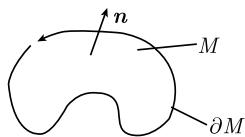
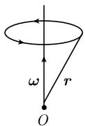

# 《数学指南——实用数学手册》1.9.8 环量、闭积分曲线与斯托克斯积分定理

## 本节定位

本节是《数学指南——实用数学手册》1.9「向量分析与物理学领域」中的第 8 个子节，紧接 [[sources/10-数学指南实用数学手册--15-197-流守恒律与高斯积分定理--pqc5jf]]（1.9.7 高斯积分定理）之后。它给出旋度 $\operatorname{curl} \boldsymbol{v}$ 的积分定理——**斯托克斯积分定理**（式 1.171），引入 [[concepts/环量]] 与 [[concepts/闭积分曲线]] 两个概念，用 $\operatorname{curl} \boldsymbol{v}$ 的为零/非零刻画闭积分曲线的存在性，最后以旋转速度场 $\boldsymbol{v}(\boldsymbol{r}) := \boldsymbol{\omega} \times \boldsymbol{r}$ 为例说明。

原文开篇即点明本节主题：

> 量 $\operatorname{curl} \boldsymbol{v}$ 的不为零与闭积分曲线的存在性密切相关。

## 斯托克斯积分定理（式 1.171）

$$
\boxed {\int_ {M} (\operatorname{curl} \boldsymbol {v}) \boldsymbol {n} \mathrm{d} F = \int_ {\partial M} \boldsymbol {v} \mathrm{d} \boldsymbol {r}.}\tag{1.171}
$$

原文给出的成立条件（逐字引述）：

> 这个公式在下列假设下成立：$\boldsymbol{v}$ 是 $\mathbb{R}^3$ 中足够光滑的有界曲面 $^{1)}M$ 上的 $C^1$ 类向量场，$M$ 的单位法向量为 $\boldsymbol{n}$，$\partial M$ 的协同定向如图1.104中描述.

相关页面：[[concepts/斯托克斯积分定理]]、[[concepts/协同定向]]、[[concepts/向量场]]、[[concepts/旋度]]。

## 环量

> 我们称表达式 $\int_{\partial M} v \mathrm{d}r$ 为向量场 $v$ 沿闭曲线 $\partial M$ 的环量. 例如可以把 $v$ 看作液体流的速度场.

相关页面：[[concepts/环量]]、[[findings/环量定义与流体速度场解释]]。

## 关于闭积分曲线的两条定理

原文以「定理 (i)」「(ii)」的形式给出：

> 定理 (i) 如果 $\partial M$ 是闭积分曲线, 则沿 $\partial M$ 的环量为零, 且 $\operatorname{curl} v$ 在 $D$ 上恒不为零.
>
> (ii) 如果在三维区域 $D$ 中 $\operatorname{curl} \boldsymbol{v} \equiv 0$, 则 $D$ 中不存在向量场 $\boldsymbol{v}$ 的闭积分曲线.

相关页面：[[concepts/闭积分曲线]]、[[findings/定理i闭积分曲线环量为零且curl恒不为零]]、[[findings/定理ii curl恒为零则不存在闭积分曲线]]。

## 例：旋转速度场

> 例: 给定向量 $\omega$. 速度场
>
> $$
> \boxed {\boldsymbol {v} (\boldsymbol {r}) := \boldsymbol {\omega} \times \boldsymbol {r}}
> $$
>
> 对应于液体粒子沿轴 $\omega$ (正向) 旋转, 其角速度为 $|\omega|$. 积分曲线是绕轴 $\omega$ 的同心圆 (图1.105). 另外, 有
>
> $$
> \boxed {\operatorname{curl} v = 2 \omega .}
> $$
>
> 这里, $\operatorname{curl} v$ 具有和旋转轴相同的方向, $\operatorname{curl} v$ 的长度等于粒子的角速度的两倍.

相关页面：[[findings/旋转速度场v等于omega叉乘r]]、[[findings/旋转速度场curl等于两倍omega]]、[[findings/旋转速度场积分曲线为绕轴同心圆]]、[[concepts/旋转向量]]。

## 图形

## 与相邻小节的关系

- **与 1.9.2（梯度、散度和旋度）**：本节处理的是 [[concepts/旋度]] 的积分定理，与 1.9.2 中旋度的微分定义互为对偶，参见 [[sources/10-数学指南实用数学手册--11-192-梯度散度和旋度--4afp9l]]。
- **与 1.9.7（流守恒律与高斯积分定理）**：结构平行。1.9.7 的高斯定理把散度的体积分化为边界曲面上的面积分（[[concepts/高斯定理]]），本节则把旋度的曲面积分化为边界曲线上的线积分；1.9.7 中的 [[concepts/容许区域]] 与其边界，对应本节的曲面 $M$ 与闭曲线 $\partial M$。
- **与 1.9.3（在形变上的应用）**：1.9.3 定理的几何解释指出旋度描述旋转（[[findings/形变定理旋度描述旋转散度描述体积相对变化]]），本节的旋转速度场例子（$\operatorname{curl} \boldsymbol{v} = 2\boldsymbol{\omega}$）与之呼应，并共用 [[concepts/旋转向量]] 这一记号。

## 待考与转录问题

- 本节的全部结论（式 1.171、定理 (i)(ii)、旋转速度场例子）均未给出证明与文献编号；本节正文内外均未见 [212] 之类引用。
- 定理 (i) 中出现了在前后文都未定义的区域记号 $D$（前文讨论的是曲面 $M$ 及其边界 $\partial M$），疑似指代不一致或转录讹误。
- 脚注 1) 讨论曲面 $M$ 的「足够光滑」条件，其内容未转录。
- 式 1.171 与环量定义中的向量乘积是否含点积符号，从转录文本无法判断。
- 图 1.104 与图 1.105 只能由图像描述还原，原图细节不全。

<!-- llm-wiki:embedded-images -->
## Embedded Images

### Document

<!-- llm-wiki:embedded-images -->
