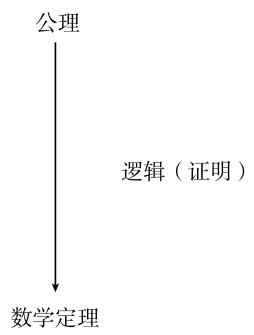

# 《数学指南——实用数学手册》4.5 公理方法及其与哲学认识论之关系的历史

本节是《数学指南——实用数学手册》中的一篇数学史与科学哲学性质的综述短文，主题聚焦数学史中「与哲学认识论的交互作用」这一趋势。全节以 H. 外尔（1885—1955）的名言开篇，随后沿「公理方法」的历史脉络展开：从欧几里得《几何原本》到希尔伯特的《几何基础》与现代公理方法，再到希尔伯特规划与哥德尔不完全性定理，最后收束于形式逻辑到数理逻辑的谱系以及多值逻辑、模糊集合论等现代发展。

源文档片段未标注出版年份（frontmatter 中 `year` 记为 0），且脚注 1)、2) 的正文在片段中未给出。文献 [212]、[349] 仅以编号形式出现，未给出完整书目信息。

## 主要论点

1. **数学史上存在两种基本交互趋势**：(i) 与其他自然科学的交互作用；(ii) 与哲学认识论的交互作用。本节只简要考察 (ii)，并指明 [212] 中有关于 (i) 的详细讨论，其中包括几何与现代物理（基本粒子理论与宇宙学）之间令人炫目的交互作用；本卷末尾另收录了一系列在数学史上产生影响的人名与事件。

2. **公理化表述的通用模式**：顶部是公设或公理，即公认的、不加证明的假设，构成演绎推理过程的基础；但它们并非任意陈述，其表述通常是长期艰难数学过程的结果。借助公理做出称为证明的逻辑推导，从而得到引理、命题、定理；其中尤为重要的是称为定理的结果。定义则赋予反复使用的概念以名称。文中指出：「做出可行的证明的关键常常是形成正确的定义。」

3. **欧几里得《几何原本》是公理方法的闪光范例**，大约写于公元前 325 年的亚历山大里亚，为其后 2000 年的科学活动树立了榜样，并以定义开篇：① 点是没有部分的某种东西；② 线是广延的长；③ …。

4. **平行公理 (P) 的独立性**直到 19 世纪才由波尔约、高斯和罗巴切夫斯基证明，意味着既存在 (P) 成立的几何，也存在 (P) 不成立的几何（见 3.2.7 节）。

5. **现代公理方法由希尔伯特在 1899 年的《几何基础》中创立**。他不去尝试定义点是什么，而把理论建立在「点」「线」「面」概念以及「通过」「全等」「位于」关系之上，但不赋予它们固定含义；例如第一条公理为「通过任何两点有一条线」。这允许考虑完全不同的模型，例如在庞加莱的双曲几何模型中，一条「线」是中心位于 x 轴上的圆（见 3.2.8 节）。

6. **希尔伯特关于几何相对无矛盾性的证明**：在代数和分析的某些部分无矛盾的假设下，利用笛卡儿坐标把几何命题翻译成代数与分析命题，从而证明几何的无矛盾性。

7. **希尔伯特规划（约 1920）**：目标是证明全部数学的无矛盾性；4.4.1.3 中命题逻辑的主要定理为这种证明充当样板。其基本思想是，人们能够以纯形式的方式，通过应用固定数目的推演规则，从固定数目的公理出发获得一个理论的全部「定理」。

8. **哥德尔不完全性定理（1931）**：论文《论〈数学原理〉及相关系统中的形式不可判定命题》证明了以公理为基础、足够丰富到包括数论系统在内的任何理论总存在着不能纯粹从这些公理推演出的定理，尽管它们肯定是真的并且能够被证明；而且证明这样一个公理系统无矛盾的唯一方法是把它传递给更大的系统。由此，寻求数学无矛盾性证明的希尔伯特规划原来是行不通的。按哥德尔的理解，数学远不止是由公理和做出推演的规则构成的形式系统。

9. **逻辑与数理逻辑的谱系**：形式逻辑（哲学的一个重要部分）产生自亚里士多德；「逻辑」一词由斯多葛学派的芝诺（公元前 336—前 264）引进，希腊词 logos 的含义是词语、演说、思维和理性；莱布尼茨表达过将数学符号引入逻辑的思想；第一个这样的系统由 G. 布尔创立；现代数理逻辑开始于弗雷格 1879 年出版的《概念文字》；罗素与怀特黑德三大卷《数学原理》的发表以一套精简的形式符号体系为此后所有数学提供了必需的数学工具；这一发展随希尔伯特与阿克曼《理论逻辑基础》（1928）以及希尔伯特与贝尔奈斯两卷本《数学基础》（1934、1939）的出版而达至顶点。

10. **现代逻辑的扩展**：受量子论和计算机科学需求的影响，人们建立了一种多值逻辑，除「真」和「假」外还允许更多的可能真值（例如「可能」）；与这种逻辑相应的集合论是模糊集合论。[349] 被推荐为一本极好的现代数理逻辑导论。

## 结构化数据（源文档逐字保留）

希尔伯特相对无矛盾性证明中的例证：对于给定的实数 $A, B, C, D, E, F$ 且 $AE - BD \neq 0$，方程组

$$
\left\{ \begin{array}{l l} A x + B y + C = 0, \\ D x + E y + F = 0 \end{array} \right.
$$

刚好有一组解 $(x,y)$。这对应欧几里得几何中的定理「两条不平行的直线恰好相交于一点」。

平行公理 (P) 的现代表述：

> (P) 如果点 $P$ 不在直线 $l$ 上，则在由 $P$ 和 $l$ 张成的平面上恰有一条直线通过 $P$ 而不与 $l$ 相交。

## 引用的图像

该图片位于公理化表述模式段落之中，本应用于图示「公设/公理 → 证明 → 引理、命题、定理」的结构，但在源文档中未能成功加载，无法确认其实际内容。

## 证据性质

本节属于史论性综述（教科书级别的二手权威陈述），而非原始研究报告。其证据形态包括：数学史事实陈述（欧几里得时代、平行公理的独立性、哥德尔定理）、具体可验证的数学例证（上述方程组对应关系）以及书目性指引（[212]、[349]）。文献引用不完整，个别表述受排版/OCR 影响存在歧义。各论断的归属清晰：平行公理独立性归于波尔约、高斯与罗巴切夫斯基；现代公理方法归于希尔伯特；不完全性定理归于哥德尔，不应交叉转移。

## 相关页面

- [[公理方法]]
- [[欧几里得]]
- [[希尔伯特]]
- [[希尔伯特规划]]
- [[哥德尔不完全性定理]]
- [[形式逻辑]]
- [[数理逻辑]]
- [[多值逻辑]]
- [[模糊集合论]]
- [[平行公理]]
- [[非欧几何]]
- [[相对无矛盾性证明]]
- [[矛盾律]]
- [[排中律]]
- [[数学指南实用数学手册]]

<!-- llm-wiki:embedded-images -->
## Embedded Images

### Document

<!-- llm-wiki:embedded-images -->
