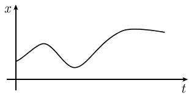

# 《数学指南——实用数学手册》6.4.5 关于一般随机过程的科尔莫戈罗夫主定理

## 概述

本节（6.4.5）是全章 6.4「随机过程」的收束小节，把此前较为直观的随机过程叙述提升到测度论层面：先给出随机过程的一般定义 (6.53)，再引入「实现（观测曲线）」的几何图像，随后列出实际应用中的几个重要量（期望、标准差、相关系数、分布函数、联合分布函数），并以联合分布函数族与相容性条件 (6.55) 为前提，陈述**科尔莫戈罗夫主定理（1933）**——一般随机过程的存在性定理。本节仅陈述定理，未给出证明或构造细节。

## 随机过程的一般定义 (6.53)

设 $E$ 是一个具有概率测度 $P$ 和 $\sigma$ 域 $\mathcal{S}$ 的概率空间。一个随机过程就是由随机变量 $X_t$ 构成的随机变量族

$$
\boxed {X _ {t}: E \to \mathbb {R}, \quad t \in T.}\tag{6.53}
$$

其中 $t$ 在一个非空指标集 $T$ 中变化。

若指标集 $T$ 至多是可数集，则称此过程为**离散过程**，否则称之为**连续过程**。

例 1：若 $T$ 是实数集，则可以把 $X_t$ 看成时刻 $t$ 的一个随机变量。例如 $X_t$ 可以是某个确定位置在时刻 $t$ 的温度 $^{1)}$。

（注：原文此处脚注标记 **1)** 后未见对应脚注正文，已记为 [[queries/645节温度脚注标记1缺失正文]]。）

## 随机过程的实现

设 $e$ 是 $E$ 的一个元素，即 $e$ 是一个基本事件。定义

$$
\boxed {x _ {e} (t) := X _ {t} (e), \quad t \in T,}
$$

则 $x_e: T \to \mathbb{R}$ 是时间 $t$ 的一个实函数，将之理解为一条观测曲线（图 6.22）。假设 $M$ 是 $E$ 的一个子集，它是一个事件，则有

> $P(M) = 指标\ e\in M\ 的一条观测曲线\ x = x_{e}(t)\ 得到实现的概率.$

因此，概率空间 $E$ 可以看作所有可能实现的观测曲线的指标集，而概率测度 $P$ 则可以看作是由所有观测曲线组成的空间上的一个测度。

## 实际应用时几个重要的量

随机过程的几个最重要的量是：

(i) 随机过程在时刻 $t$ 的随机变量 $X_t$ 的期望 $\overline{X}_t$ 和标准差 $\Delta X_t$。

(ii) 随机过程在时刻 $t$ 的随机变量 $X_t$ 与它在时刻 $s$ 的随机变量 $X_s$ 的相关系数

$$
r (t, s) := \frac {\operatorname {Cov} (X _ {t} , X _ {s})}{\Delta X _ {t} \Delta X _ {s}}.
$$

(iii) $X_t$ 的分布函数 $\Phi_t$。

(iv) 对于时刻 $t$ 和时刻 $s$，$t < s$，$X_t$ 与 $X_s$ 的联合分布函数 $\Phi_{t,s}$。

## 联合分布函数族与相容性条件

设 $\Phi_{t_1\cdots t_n}$ 表示随机变量 $X_{t_1},\cdots,X_{t_n}$ 的联合分布函数，其中时间点满足

$$
t _ {1} <   t _ {2} <   \dots <   t _ {n}.\tag{6.54}
$$

更明确地说，有

$$
\left| \Phi_ {t _ {1} \dots t _ {n}} (x _ {1}, \dots , x _ {n}) := P (X _ {t _ {1}} <   x _ {1}, \dots , X _ {t _ {n}} <   x _ {n}). \right|
$$

若 $t_{1}<\cdots<t_{n}<t_{n+1}<\cdots<t_{m}$，则对于所有的 $n$ 和 $m$，$1 \leqslant n < m$，以及所有的自变量 $x_{1}, \cdots, x_{n} \in R$，有如下合理的条件

$$
\Phi_ {t _ {1} \dots t _ {n}} (x _ {1}, \dots , x _ {n}) = \Phi_ {t _ {1} \dots t _ {m}} (x _ {1}, \dots , x _ {n}, + \infty , \dots , + \infty).\tag{6.55}
$$

（注：原文联合分布函数定义式两侧有成对的 `\left| ... \right|` 竖线包裹，疑为多余排版符，已记为 [[queries/645节联合分布函数定义式中竖线疑为多余排版符]]。）

## 高斯过程

若一个随机过程的联合分布函数都是高斯分布，则称该过程为一个**高斯过程**。

例 2：维纳过程 (6.48) 是一个高斯过程。

## 科尔莫戈罗夫主定理（1933）

设指标集 $T$ 是实数集的一个给定的非空子集。假定对于 $n = 1,2,\dots$ 和每个时间集 (6.54)，分布函数 $\Phi_{t_1\dots t_n}$ 给定，并且满足相容性条件 (6.55)。则存在一个形如 (6.53) 且以给定函数 $\Phi_{t_1\dots t_n}$ 为其联合分布函数的随机过程。

## 要点与边界

- 主定理的归属对象是**一般随机过程**，其结论为**存在性**断言，归于科尔莫戈罗夫（1933）。
- 维纳过程在本节仅作为**高斯过程**的示例（例 2，式号 6.48，来自 6.4.4 节）被引用；主定理的存在性结论不应转记为维纳过程自身的性质，见 [[concepts/维纳过程]] 与 [[concepts/维纳测度]]。
- 本节未给出证明、构造细节或所用测度论工具，属权威手册中的标准引述。
- 定理的陈述中未涉及唯一性，也未讨论「同一有限维分布族是否对应唯一过程」的常见追问，见 [[queries/科尔莫戈罗夫主定理是否保证唯一性]]。

## 相关页面

- [[concepts/随机过程]] —— 6.4 节对随机过程的直观界定；本节以 (6.53) 给出其测度论形式化。
- [[concepts/科尔莫戈罗夫主定理]] —— 本节核心结论的独立页面。
- [[concepts/相容性条件]] —— 主定理的前提条件 (6.55)。
- [[concepts/随机过程的实现]] —— 观测曲线 $x_e(t)$。
- [[concepts/随机过程的联合分布函数族]] —— $\Phi_{t_1\cdots t_n}$ 的记号与排序约定 (6.54)。
- [[concepts/高斯过程]] —— 例 2 的类别概念。
- [[entities/科尔莫戈罗夫]] —— 定理归属者。
- [[findings/645节随机过程一般定义与科尔莫戈罗夫主定理]] —— 本节的发现条目。

<!-- llm-wiki:embedded-images -->
## Embedded Images

### Document

<!-- llm-wiki:embedded-images -->
