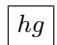
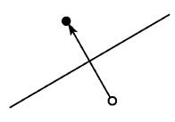
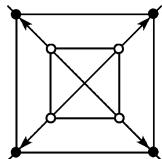
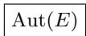

# 《数学指南——实用数学手册》3.1 由克莱因的埃尔兰根纲领所概括的几何学的基本思想

> 说明：本页 frontmatter 中的 `year` 与 `authors` 为中文版《数学指南——实用数学手册》的通行著录信息，源文本本身未给出出版年与编者署名，须与原书版权页核对。

## 概览

本节是《数学指南》几何学部分的开篇引论，用一节的篇幅交代整部几何学章节都将反复使用的分类原理——[[埃尔兰根纲领]]。文本先给出历史背景：古代所知道的几何学只有欧几里得几何，它在 2000 多年里一直处于数学中的支配地位；19 世纪关于非欧几何存在性的讨论导致了一系列不同几何的描述，于是"所有可能的几何的分类问题"自然浮现。

随后文本给出核心陈述：[[克莱因]]（Felix Klein）在他 23 岁时解决了这个问题，并在 1872 年以其埃尔兰根纲领表明**几何可以借助于群论方便地分类**。分类原理的表述为：

> 一种几何要求有一个[[变换群]] $G$。每个在此群 $G$ 作用下保持不变的性质或量是这个相关几何的性质，因而这个几何也被称为一个 [[G几何]]。

文本最后以两个例子解释这一基本思想：[[欧氏几何]]（运动的几何）与所谓的[[相似几何]]。

## 结构要点

### 1. 历史背景与问题提出

- 古代所知道的几何学是欧几里得几何，2000 多年来处于数学中的支配地位。
- 19 世纪关于非欧几何存在问题的讨论导致一系列不同几何的描述。
- 由此产生**所有可能的几何的分类问题**。

### 2. 埃尔兰根纲领（1872）

- 主角：F. 克莱因（Felix Klein）。
- 时间与年龄：1872 年；"在他 23 岁时"。
- 内容：以埃尔兰根纲领表明几何可以借助群论方便地分类。
- 判据：对每个几何，要求有一个变换群 $G$；在 $G$ 作用下保持不变的性质或量属于该几何；该几何称为 $G$ 几何。
- 声明："本章将不断地使用这个分类原理。"

### 3. 示例一：欧氏几何（运动的几何）

对平面 $E$，记 $\operatorname{Aut}(E)$ 为 $E$ 到自身的、由下列类型变换之复合构成的映射集合（是自同构的一个特殊情形，因此用此记号）：

(i) 平移；

(ii) 绕一点的旋转；

(iii) 对一固定直线的反射。（图 3.1）

称这些变换的复合即 $\operatorname{Aut}(E)$ 中的元素为 $E$ 的一个**运动**（原文此处带有未落地的上标脚注标记 `1)`）。

文本以一个图像（复合记号）表示 $g$ 和 $h$ 复合的变换，即**首先应用 $g$，然后用 $h$**。用此乘法，集合获得群的结构（自同构群的一个特殊情形）。该群的单位元是**恒同运动**（"根本不动"）。

在该群下不变的性质和量的集合属于此平面的欧氏几何，其例子是"线段的长"或者"一个圆的半径"。

### 4. 全等

该平面的两个子集（例如两个三角形）被称作**全等**，如果可由 $\operatorname{Aut}(E)$ 中的一个变换把它们相互映射成对方。平面三角形熟知的全等定理便是欧氏几何的结果（见 3.2.1.5）。

### 5. 示例二：相似几何

- 一个特殊的**相似变换**是平面 $E$ 的一个变换，它把通过一个选定点 $P$ 的所有直线映到自己，同时把从 $P$ 到其他某个点的距离乘以一个固定的（正）常数。
- $\operatorname{Sim}(E)$ 代表 $E$ 的所有上述运动与相似变换复合的集合；$\operatorname{Sim}(E)$ 以上面同样的乘法构成一个群，称为**相似变换群**。
- 关键区分：
  - "线段的长"的概念**不是**相似几何的一个概念；
  - "两条线段的比值"的概念**则是**相似几何的概念。
- **相似性**：称 $E$ 的两个子集（例如两个三角形）相似，如果它们由一个相似变换相关联，即存在一个相似变换把其中一个变到另一个；平面中熟知的三角形相似定理是这种几何的定理。
- 附注："每个技术性绘图都是对所透视对象的相似。"

## 图 3.1 与图示

图 3.1 为"平面的运动"，含四个子图，文本标注为 (a) 平移、(b) 绕一点的旋转、(c) 对固定直线的反射、(d) 相似变换。其对应的图像文件如下（子图编号与文件编号的对应关系存疑，见 [[31节图31子图编号与图片对应]]）：

## 证据强度与性质

本节为教科书式的纲要性引论：

- 所有主张均为几何学史与定义的陈述，**无经验数据、无形式证明**。
- "克莱因 23 岁解决该问题"与 1872 年相互自洽（克莱因生于 1849 年）。
- 两个示例（欧氏几何、相似几何）仅用于"解释此基本思想"。

## 与 wiki 其他内容的关联

本节所属学科（几何学）与本 wiki 已有的 2.7.x 数论系列（[[concepts/类域论]]、[[concepts/朗兰兹纲领]]、理想理论、超越数等）没有内容上的直接交集。可以注意的方法论呼应在于：**用群或群作用作为数学对象的分类工具**，这一思路在代数数论一侧同样以群（伽罗瓦群、类群）刻画对象，但该比较属于推断而非本源的陈述。

## 相关页面

- 人物：[[克莱因]]、[[欧几里得]]
- 纲领与分类原理：[[埃尔兰根纲领]]、[[G几何]]、[[变换群]]、[[自同构]]
- 示例一：[[欧氏几何]]、[[运动]]、[[全等]]
- 示例二：[[相似几何]]、[[相似变换]]、[[相似性]]
- 结果陈述：[[埃尔兰根纲领与G几何定义]]、[[欧氏几何的运动群aut-e及全等定义]]、[[相似几何与相似变换群sim-e]]
- 存疑问题：[[31节运动脚注标记1未落地]]、[[31节复合变换记号hg的ocr缺失]]、[[31节图31子图编号与图片对应]]

<!-- llm-wiki:embedded-images -->
## Embedded Images

### Document

<!-- llm-wiki:embedded-images -->
