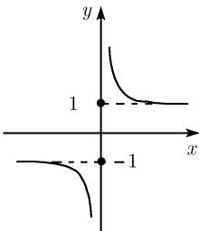

# 《数学指南——实用数学手册》0.2.11 双曲函数 tanh x 和 coth x

## 概述

本节是手册 0.2 节「初等函数」中双曲函数条目的第二部分，紧接 0.2.10（$\sinh x$ 与 $\cosh x$，见 [[双曲正弦]]、[[双曲余弦]]）。本节集中给出两个商型双曲函数——**双曲正切** $\tanh x$ 与**双曲余切** $\coth x$——的定义域、与三角函数的关系、导数、加法定理、倍角公式、半角公式、和公式与平方关系表，并以图 0.35 与表 0.20 作为图形与结构化数据支撑。幂级数展开本节不展开，仅指向 0.7.2（见 [[幂级数展开表]]）。

## 定义

对**所有复数** $x \neq \left(k\pi + \frac{\pi}{2}\right)\mathrm{i},\ k \in \mathbb{Z}$，定义函数

$$
\boxed{\tanh x := \frac{\sinh x}{\cosh x}.}
$$

对**所有复数** $x \neq k\pi \mathrm{i},\ k \in \mathbb{Z}$，定义函数

$$
\boxed{\coth x := \frac{\cosh x}{\sinh x}.}
$$

两式的定义域限制直接来自分母的零点：$\cosh x$ 的零点为 $\left(\pi k + \frac{\pi}{2}\right)\mathrm{i}$，$\sinh x$ 的零点为 $\pi k \mathrm{i}$（见 [[表020双曲函数与三角函数的零点与极点]]）。

对实变量 $x$，图 0.35 给出了这两个函数的图像。对于所有使函数没有极点的复变量 $x$ 和 $y$，下面各公式都成立（原书以脚注 1 说明记号约定）。

## 与三角函数的关系

（参见表 0.20，另见 [[双曲函数与三角函数的关系]]）

$$
\tanh x = -\mathrm{i}\tan \mathrm{i}x, \quad \coth x = \mathrm{i}\cot \mathrm{i}x.
$$

## 导数

$$
\boxed{\frac{\mathrm{d}\tanh x}{\mathrm{d}x} = \frac{1}{\cosh^{2} x}, \quad \frac{\mathrm{d}\coth x}{\mathrm{d}x} = -\frac{1}{\sinh^{2} x}.}
$$

## 加法定理

$$
\tanh (x \pm y) = \frac{\tanh x \pm \tanh y}{1 \pm \tanh x \tanh y}, \quad \coth (x \pm y) = \frac{1 \pm \coth x \coth y}{\coth x \pm \coth y}.
$$

（另见 [[双曲函数加法定理]]）

## 倍角公式

$$
\tanh 2x = \frac{2\tanh x}{1 + \tanh^{2} x}, \quad \coth 2x = \frac{1 + \coth^{2} x}{2\coth x}.
$$

## 半角公式

$$
\tanh \frac{x}{2} = \frac{\cosh x - 1}{\sinh x} = \frac{\sinh x}{\cosh x + 1},
$$

$$
\coth \frac{x}{2} = \frac{\sinh x}{\cosh x - 1} = \frac{\cosh x + 1}{\sinh x}.
$$

（倍角与半角公式另见 [[双曲函数倍角与半角公式]]）

## 和公式

$$
\tanh x \pm \tanh y = \frac{\sinh (x \pm y)}{\cosh x \cosh y}.
$$

## 平方关系表

表内各行给出 $\sinh^{2} x$、$\cosh^{2} x$、$\tanh^{2} x$、$\coth^{2} x$ 四个量两两互化的表达式（对角线上为自身的破折号占位）：

| | $\sinh^2 x$ | $\cosh^2 x$ | $\tanh^2 x$ | $\coth^2 x$ |
|---|---|---|---|---|
| $\sinh^2 x$ | — | $\cosh^2 x - 1$ | $\dfrac{\tanh^2 x}{1 - \tanh^2 x}$ | $\dfrac{1}{\coth^2 x - 1}$ |
| $\cosh^2 x$ | $\sinh^2 x + 1$ | — | $\dfrac{1}{1 - \tanh^2 x}$ | $\dfrac{\coth^2 x}{\coth^2 x - 1}$ |
| $\tanh^2 x$ | $\dfrac{\sinh^2 x}{\sinh^2 x + 1}$ | $\dfrac{\cosh^2 x - 1}{\cosh^2 x}$ | — | $\dfrac{1}{\coth^2 x}$ |
| $\coth^2 x$ | $\dfrac{\sinh^2 x + 1}{\sinh^2 x}$ | $\dfrac{\cosh^2 x}{\cosh^2 x - 1}$ | $\dfrac{1}{\tanh^2 x}$ | — |

（该表的推导仅依赖 $\cosh^2 x - \sinh^2 x = 1$ 与两个商型定义，另见 [[双曲函数的平方关系]]）

## 脚注 1：双曲正割与双曲余割

> 以前文献中也使用下面的函数（双曲正割和双曲余割）：

$$
\operatorname{cosech} x := \frac{1}{\sinh x} \quad (\text{双曲余割}),
$$

$$
\operatorname{sech} x := \frac{1}{\cosh x} \quad (\text{双曲正割}).
$$

注意手册采用的记法是 `cosech`（而非 `csch`），见 [[双曲正割与双曲余割]]、[[0211节cosech与csch记号差异]]。

## 表 0.20 双曲函数与三角函数的零点与极点

> 所有零点和极点都是单的。

| 函数 | 周期 | 零点 ($k \in \mathbb{Z}$) | 极点 ($k \in \mathbb{Z}$) | 奇偶性 |
|---|---|---|---|---|
| $\sinh x$ | $2\pi \mathrm{i}$ | $\pi k \mathrm{i}$ | — | 奇 |
| $\cosh x$ | $2\pi \mathrm{i}$ | $(\pi k + \pi/2)\mathrm{i}$ | — | 偶 |
| $\tanh x$ | $\pi \mathrm{i}$ | $\pi k \mathrm{i}$ | $(\pi k + \pi/2)\mathrm{i}$ | 奇 |
| $\coth x$ | $\pi \mathrm{i}$ | $(\pi k + \pi/2)\mathrm{i}$ | $\pi k \mathrm{i}$ | 奇 |
| $\sin x$ | $2\pi$ | $\pi k$ | — | 奇 |
| $\cos x$ | $2\pi$ | $\pi k + \pi/2$ | — | 偶 |
| $\tan x$ | $\pi$ | $\pi k$ | $\pi k + \pi/2$ | 奇 |
| $\cot x$ | $\pi$ | $\pi k + \pi/2$ | $\pi k$ | 奇 |

表 0.20 的内容与图 0.35 均整理为独立页面：[[表020双曲函数与三角函数的零点与极点]]、[[图0-35-双曲函数图像]]，其数学含义见 [[双曲函数与三角函数的零点与极点]]。

## 图 0.35 双曲函数

图 0.35 由两幅子图组成：图 0.35(a) $y = \tanh x$ 与图 0.35(b) $y = \coth x$。其中 (a) 对应的图像文件在本 wiki 中**未能加载**，(b) 已可读出两支曲线及水平渐近线 $y = \pm 1$。

## 幂级数展开

本节正文仅注明「幂级数展开 参看 0.7.2」，未给出具体级数。对应内容见 [[双曲函数的幂级数]] 与 [[幂级数展开表]]，交叉核对见 [[0211节幂级数参看072的展开式核对]]。

## 相关页面

- 定义主体：[[双曲正切]]、[[双曲余切]]
- 旧记号函数：[[双曲正割与双曲余割]]
- 结构化数据：[[表020双曲函数与三角函数的零点与极点]]、[[图0-35-双曲函数图像]]
- 恒等式体系：[[双曲函数的平方关系]]、[[双曲函数与三角函数的关系]]、[[双曲函数加法定理]]、[[双曲函数倍角与半角公式]]
- 所属手册：[[数学指南实用数学手册]]

<!-- llm-wiki:embedded-images -->
## Embedded Images

### Document

<!-- llm-wiki:embedded-images -->
