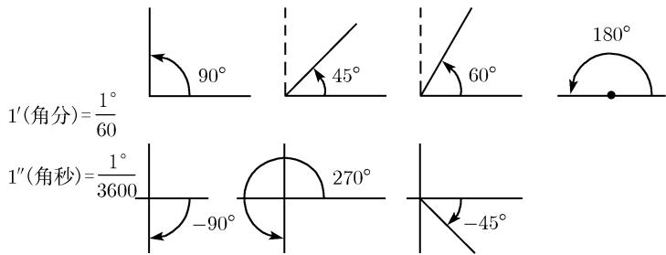
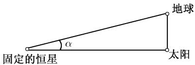
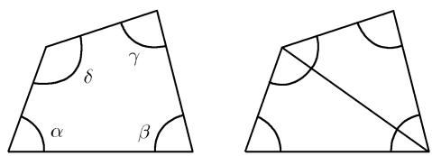

# 《数学指南——实用数学手册》0.1.2 量角

本页对应 [[entities/数学指南-实用数学手册]] 第 0.1 节"初等数学中的基本公式"下的 0.1.2 小节"量角"，是 [[concepts/初等几何公式]] 合并参考页的分节来源之一。

## 内容概要

本小节介绍角的度量，涵盖四个主题：

1. **度数**：以度为单位的常用角，90° 称为直角；正角与负角（图 0.1）。
2. **天文学中的更小单位**：角分（′）与角秒（″）；例 1 介绍恒星视差（图 0.2、表 0.2）与秒差距。
3. **弧度**：弧度定义与角度—弧度换算公式（图 0.3、表 0.3），并给出全书约定。
4. **多边形内角和**：三角形、四边形与 n 边形的内角和（图 0.4—0.6）。

## 度数与六十进制渊源

4000 多年前，幼发拉底河和底格里斯河流域的古苏美尔地区使用了一种以 60 为基底的数系。关于这种重要的使用方法，可以追溯到度量时间和角时所使用的 12、24、60 和 360（详见 [[concepts/六十进制]]）。

图 0.1 给出了几个以度为度量单位的最常用角，其中 90° 称为直角；图中同时标注了换算关系 1′ = 1°/60、1″ = 1°/3600，以及正角（逆时针）与负角（顺时针，如 −90°、−45°）的度量方式。

## 例 1（天文学）：视差

日面位于天空大约 30′（半度）的位置。因为地球和太阳的运动，恒星在天空中的位置不断变化。每年最大变化的一半称为**视差**，它等于角 α，即当日地距离最大时，恒星与二者的夹角（图 0.2）。

表 0.2 视差与距离（原书数据，照录）：

| 恒星 | 视差 | 距离 |
| --- | --- | --- |
| 毗邻星（最近的恒星） | 0.765″ | 4.2 光年 |
| 天狼星（最亮的恒星） | 0.371″ | 8.8 光年 |

一角秒的视差相当于 3.26 光年的距离（3.1·10^13 km），这个距离也称为**秒差距**。详见 [[concepts/视差与秒差距]]。

## 弧度

α° 的角对应弧度：

$$\alpha = 2\pi\left(\frac{\alpha^\circ}{360^\circ}\right)$$

其中 α 是单位圆上 α° 角对应的弧长（图 0.3）。

表 0.3 角度与弧度（原书数据，照录）：

| 角度 | 1° | 45° | 60° | 90° | 120° | 135° | 180° | 270° | 360° |
| --- | --- | --- | --- | --- | --- | --- | --- | --- | --- |
| 弧度 | π/180 | π/4 | π/3 | π/2 | 2π/3 | 3π/4 | π | 3π/2 | 2π |

角分、角秒与弧度的换算：

$$1' = \frac{\pi}{10800} = 0.000291, \qquad 1'' = \frac{\pi}{648000} = 0.000005.$$

**约定**：如非特殊说明，本书所有角都为弧度制。这一约定贯穿全书，后续涉及角的公式（如 [[concepts/多边形内角和]] 的 (n−2)π、[[concepts/n维球的体积与表面积]] 中的角度参数等）均以弧度给出。

## 多边形内角和

- 三角形：α + β + γ = π（图 0.4）。
- 四边形：因为四边形可以分解成两个三角形，所以各角之和一定为 2π，即 α + β + γ + δ = 2π（图 0.5）。
- n 边形：内角和 = (n − 2)π。

例 2：五边形（和六边形）的内角和为 3π（和 4π）（图 0.6）。详见 [[concepts/多边形内角和]]。

## 图像清单

- 图 0.1 正角和负角：`media/10-数学指南实用数学手册--6-012-量角--1f3wlef/001-b58a88621e4928d9f7bcde412d3f86da5ffcab7596dc1a033510e0fdafea275f.jpg`
- 图 0.2 恒星视差测量原理（固定的恒星—太阳—地球构成的视差角 α）：`media/10-数学指南实用数学手册--6-012-量角--1f3wlef/002-af6469492cbaa6247d11ea25c0417f31d472ee1cfe049e4b754c16ce8955afff.jpg`
- 图 0.3（单位圆弧长示意；原图像未能加载确认内容）：`media/10-数学指南实用数学手册--6-012-量角--1f3wlef/003-bc0715549af10a7a4f86749a842b9c60782b20d1e5dc759750e4cade2159f705.jpg`
- 图 0.4 三角形中的各个角（α、β、γ）：`media/10-数学指南实用数学手册--6-012-量角--1f3wlef/004-9086104a62c25631608a77609b8e9d984ce51271beb580ef371b5080dab8c939.jpg`
- 图 0.5 四边形中的各个角：`media/10-数学指南实用数学手册--6-012-量角--1f3wlef/005-ad921fd4e56ca9738c0a8885586978721c2b7255b7478d2a9052f5284a437c7e.jpg`
- 图 0.6(a) 五边形：`media/10-数学指南实用数学手册--6-012-量角--1f3wlef/006-3bc7eac3626d8d337ad6d2af930b7715268d0fd6e2ac09190e742cbbef1a121d.jpg`
- 图 0.6(b) 六边形（示意图中为含一个内凹优角的不规则六边形）：`media/10-数学指南实用数学手册--6-012-量角--1f3wlef/007-7e31d6b2c28a9d625a75be7890f65e6a2f23d19e1481b6dd95fb0604fed27ba7.jpg`

## 相关页面

- [[concepts/角度制与弧度制]] — 度、角分、角秒与弧度的定义与换算
- [[concepts/六十进制]] — 古苏美尔 60 进制与 12/24/60/360 的历史渊源
- [[concepts/视差与秒差距]] — 例 1 天文概念的展开
- [[concepts/多边形内角和]] — 内角和公式的展开
- [[concepts/行星运动的数学描述]] — 同属天文背景的相关页面
- [[entities/数学指南-实用数学手册]] — 所属手册
- [[concepts/初等几何公式]] — 0.1 节合并参考页

<!-- llm-wiki:embedded-images -->
## Embedded Images

### Document

<!-- llm-wiki:embedded-images -->
