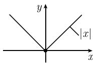

# 《数学指南——实用数学手册》1.4.1 导数

本页汇总《数学指南——实用数学手册》1.4 节（一个实变量函数的微分法）下第一个子节 **1.4.1 导数** 的正文内容。该节给出实变量实值函数在一点处导数的定义、几何解释、莱布尼茨符号、与连续性的关系、高阶导数、基本求导法则与莱布尼茨积法则，末尾引入函数空间 $C[a,b]$、$C^k[a,b]$ 及 $C_p^k$ 型函数。

## 1. 导数的定义

考虑一个实变量 $x$ 的实值函数 $y = f(x)$，它定义在点 $p$ 的一个邻域内。$f$ 在点 $p$ 处的导数 $f'(p)$ 定义为**有限**极限：

$$
f'(p) = \lim_{h \to 0} \frac{f(p+h) - f(p)}{h}.
$$

要点：函数须定义在点 $p$ 的邻域内，且所取的极限必须是有限极限——「有限」二字是定义的组成部分。详见 [[导数]] 与 [[差商]]。

## 2. 几何解释与切线方程

数 $\frac{f(p+h)-f(p)}{h}$ 是图 1.30(a) 中割线的斜率。当 $h \to 0$ 时，割线直观上趋向于切线。因此有定义：

$$
f'(p) \text{ 是 } f \text{ 的图形在点 } (p, f(p)) \text{ 处的切线的斜率}.
$$

此时对应的切线方程为

$$
y = f'(p)(x-p) + f(p).
$$

详见 [[切线与切线方程]]。

## 3. 例 1

对函数 $f(x) := x^2$，有

$$
f'(p) = \lim_{h \to 0} \frac{(p+h)^2 - p^2}{h} = \lim_{h \to 0} \frac{2ph + h^2}{h} = \lim_{h \to 0} (2p + h) = 2p.
$$

## 4. 重要导数表（引用）

> 重要导数表 见 0.8.1.

该表在源文档中出现两次（正文一处、例 2 末尾一处），但 **0.8.1 节尚未入库**，故建立占位实体 [[表081重要导数表]] 与查询 [[141节引用081节重要导数表尚未入库]]。图 1.30 的 (a)(b) 两幅插图用于说明割线—切线过渡，见 [[141节图130与131未能加载]]。

## 5. 莱布尼茨符号

令 $y = f(x)$。$f'(p)$ 也可以记作

$$
f'(p) = \frac{\mathrm{d}f}{\mathrm{d}x}(p) \quad \text{或} \quad f'(p) = \frac{\mathrm{d}y}{\mathrm{d}x}(p).
$$

如果令 $\Delta f := f(x) - f(p)$，$\Delta x := x - p$，$\Delta y = \Delta f$，那么有

$$
\frac{\mathrm{d}f}{\mathrm{d}x}(p) = \lim_{\Delta x \to 0} \frac{\Delta f}{\Delta x} = \lim_{\Delta x \to 0} \frac{\Delta y}{\Delta x}.
$$

这套符号是 G. W. 莱布尼茨（Gottfried Wilhelm Leibniz, 1646—1716）引进的，事实证明极其方便，许多重要的求导运算法则就是通过这些符号推导来的。源文档将此称为「精心挑选的数学符号的性质」。详见 [[莱布尼茨符号]] 与 [[莱布尼茨]]。

## 6. 连续性和可微性的关系

如果 $f$ 在点 $p$ 处可导（即 $f$ 在点 $p$ 处的导数存在），那么 $f$ 在点 $p$ 处也是连续的。相反的结论不成立：函数 $f(x) := |x|$ 在点 $x = 0$ 处连续，但是不可导（虽然它在所有其他点处是可微的），理由是该函数的图像在 $x = 0$ 处没有切线（图 1.31）。

源文档只作断言并给出反例，未给出「可导 ⇒ 连续」的证明。详见 [[可导性与连续性]] 与 [[绝对值函数在零点连续但不可导]]。

## 7. 高阶导数

如果令 $g(x) := f'(x)$，那么由定义，

$$
f''(p) := g'(p).
$$

也可记作 $f^{(2)}(p)$，或用莱布尼茨的符号：

$$
f''(p) = \frac{\mathrm{d}^2 f}{\mathrm{d}x^2}(p).
$$

类似地定义 $f^{(n)}(p),\ n = 2, 3, \cdots$。

例 2：当 $f(x) := x^2$ 时，

$$
f'(x) = 2x, \quad f''(x) = 2, \quad f'''(x) = 0, \quad f^{(n)}(x) = 0,\ n = 4, 5, \dots
$$

（见 0.8.1）。

## 8. 基本法则

假设 $f, g$ 在点 $x$ 处可导，$\alpha, \beta$ 为实数，那么

$$
(\alpha f + \beta g)'(x) = \alpha f'(x) + \beta g'(x)
$$

$$
(fg)'(x) = f'(x) g(x) + f(x) g(x)
$$

$$
\left(\frac{f}{g}\right)'(x) = \frac{f'(x) g(x) - f(x) g'(x)}{g(x)^2} \quad (\text{除法法则}).
$$

在除法法则里，当然一定假设 $g(x) \neq 0$。源文档中积法则右端的第二项写作 $f(x)g(x)$，缺少撇号，疑为转写讹误，见查询 [[141节积法则右端缺少g的撇号]]。

> 例子可见 0.8.2.

0.8.2 节（求导例子）尚未入库，见查询 [[141节引用082节求导例子尚未入库]]。

## 9. 莱布尼茨积法则

如果 $f, g$ 在点 $x$ 处是 $n$ 阶可导的，那么对于 $n = 1, 2, \cdots$，有

$$
(fg)^{(n)}(x) = \sum_{k=\infty}^{n} \binom{n}{k} f_{(x)}^{(n-k)} g^{(k)}(x).
$$

源文档中求和下限写作 $k = \infty$、$f$ 的下标记作 $f_{(x)}$，两处均疑为转写讹误，见查询 [[141节莱布尼茨积法则求和上下限疑误]]。该求导法则类似于二项式公式（见 0.1.10.3）。特别是当 $n = 2$ 时，有

$$
(fg)''(x) = f''(x) g(x) + 2 f'(x) g'(x) + f(x) g''(x).
$$

例 3：考虑函数 $h(x) := x \cdot \sin x$。若令 $f(x) := x,\ g(x) := \sin x$，那么 $f'(x) = 1,\ f''(x) = 0$，且 $g'(x) = \cos x,\ g''(x) = -\sin x$。因此

$$
h''(x) = 2\cos x - x\sin x.
$$

详见 [[莱布尼茨积法则]] 与 [[例3验证莱布尼茨积法则n等于2]]。

## 10. 函数空间与光滑性分层

### $C[a,b]$ 类函数

令 $[a,b]$ 是一个紧区间。把所有连续函数 $f: [a,b] \to \mathbb{R}$ 的空间记作 $C[a,b]$。而且令

$$
\|f\| := \max_{a \leqslant x \leqslant b} |f(x)|.
$$

### $C^k[a,b]$ 类函数

这类函数由在开区间 $[a,b[$ 上有连续导数 $f', f'', \cdots, f^{(k)}$ 的所有函数 $f \in C[a,b]$ 组成，而每个导数都可以延拓为 $[a,b]$ 上的连续函数。定义

$$
\|f\|_k := \sum_{j=0}^{k} \max_{a \leqslant x \leqslant b} |f^{(j)}(x)|.
$$

### $C_p^k$ 型

称定义在点 $p$ 的一个邻域内的函数是 $C_p^k$ 型的，如果在点 $p$ 的一个开邻域内，$f$ 有 $k$ 阶连续导数。

注：源文档此处原文写作「是 $C_k^k$ 型的」，与标题「$C^k$ 型」不一致，疑为转写讹误，详见查询 [[141节Cpk型标记疑为转写讹误]]。

详见 [[连续函数空间与最大范数]] 与 [[k阶连续可导函数类]]。

## 11. 插图

源文档含三张插图：图 1.30(a)(b)（割线与切线，$f$ 的图形在 $p$ 处）与图 1.31（$|x|$ 在 $x=0$ 处无切线）。三张图在本次入库中均未能成功加载，见查询 [[141节图130与131未能加载]]。

## 关联页面

- 上游：[[sources/10-数学指南实用数学手册--14-14-一个实变量函数的微分法--1b14tgz]]（1.4 节，仅存子节目录）
- 引用但未入库：[[表081重要导数表]]、[[141节引用081节重要导数表尚未入库]]、[[141节引用082节求导例子尚未入库]]
- 相关基础：[[导数]]、[[差商]]、[[切线与切线方程]]、[[可导性与连续性]]、[[高阶导数]]
- 相关法则：[[求导基本法则]]、[[莱布尼茨积法则]]、[[莱布尼茨符号]]
- 相关人物：[[莱布尼茨]]

<!-- llm-wiki:embedded-images -->
## Embedded Images

### Document

<!-- llm-wiki:embedded-images -->
