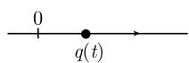
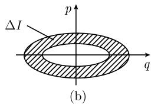

# 《数学指南——实用数学手册》5.1.4 应用

本节是 5.1「单变量函数的变分法」的应用部分，把 [[欧拉-拉格朗日方程]] 用于一维力学，并沿「一维运动 → 谐振子 → 作用变量 → 量子化」的路线，展示经典力学向早期量子论的过渡。上半篇（(i)–(iii)）处理一般的一维运动，下半篇（(iv)–(viii)）以谐振子为模型给出牛顿运动定律、相空间哈密顿流、作用变量与作用角变量，以及玻尔-索末菲、爱因斯坦、海森伯三代量子化步骤。

## 一维运动

考虑质量为 $m$ 的粒子沿 $q$ 轴的一维运动 $q = q(t)$（图 5.9）。若 $U = U(q)$ 为势能，则拉格朗日函数是

$$
L = \text{动能} - \text{势能} = \frac{m q'^2}{2} - U(q).
$$

从稳态作用原理

$$
\begin{array}{c}
\int_{t_0}^{t_1} L(q(t), q'(t), t)\,\mathrm{d}x \stackrel{!}{=} \text{稳态}, \\
q(t_0) = a, \quad q(t_1) = b
\end{array}
$$

导出欧拉-拉格朗日微分方程 $(L_{q'})' - L_q = -U'(q)$，即

$$
\boxed{m q'' = -U'(q).}\tag{5.31}
$$

这也就是在力 $F(q) = -U'(q)$ 作用下的牛顿运动定律。

令

$$
p := L_{q'}(q, q'), \quad E := q' p - L,
$$

那么 $p = mq'$ 是经典的矩量（质量 × 速度）。

### (i) 能量守恒

量

$$
E = \frac{1}{2} m q'^2 + U(q)
$$

与经典的能量相同（动能加势能）。根据 (5.8)，$E$ 是一守恒量（第一积分），即沿着每一个运动（(5.31) 的解）有

$$
\frac{1}{2} m q(t)'^2 + U(q(t)) = \text{常数}.
$$

### (ii) 勒让德变换

哈密顿函数 $H = H(q, p)$ 作为拉格朗日函数的勒让德变换出现：

$$
H(q, p) := q' p - L,
$$

因此

$$
H(q, p) := \frac{p^2}{2m} + U(q).
$$

这一表达式与能量 $E$ 相同。

### (iii) 典范方程

$$
\boxed{p' = -H_q, \quad q' = H_p.}
$$

这些方程对应于 $q' = p/m$ 和牛顿运动定律 $mq'' = -U(q)$ 两个方程。

## 应用于谐振子

谐振子是力学系统中最简单的非平凡的数学模型。然而，从这个简单的数学模型可以洞察深邃的物理含义。例如，谐振子的量子化导致爱因斯坦的光子理论，从而推出辐射的普朗克定律，这对于理解宇宙的起源和寿命是基础性的（见 [213]，第 IV 卷）。

所考虑的一维运动具有如下性质：

- (a) 假定系统关于平衡态仅有小偏离；
- (b) 在平衡点处没有作用力；
- (c) 势能是正的。

把势能展开成泰勒级数得到

$$
U(q) = U(0) + U'(0) q + \frac{U''(0)}{2} q^2 + \dots
$$

于是假设 (b) 隐含 $0 = F(0) = -U'(0)$。由于常数 $U(0)$ 与力不相关（因为 $F(1) = -U'(q)$），从而也与运动方程 $mq'' = F$ 不相关，故不失一般性可设 $U(0) = 0$。这样就导出谐振子势能的公式

$$
U(q) = \frac{k q^2}{2},
$$

其中 $k := U''(0) > 0$。

### (iv) 牛顿运动定律

从 (5.31) 得到关系

$$
\boxed{
\begin{array}{l}
q'' + \omega^2 q = 0, \\
q(0) = q_0\ (\text{初始位置}), \quad q'(0) = q_1\ (\text{初始速度}),
\end{array}
}
$$

其中 $\omega = \sqrt{k/m}$。该方程的唯一解是

$$
q(t) = q_0 \cos \omega t + \frac{q_1}{\omega} \sin \omega t.
$$

### (v) 相空间中的哈密顿流

哈密顿函数（能量函数）是

$$
H(q, p) = \frac{p^2}{2m} + \frac{k q^2}{2}.
$$

由此可知典范方程 $p' = -H_q,\ q' = H_p$ 取形式

$$
p' = -k q, \quad q' = \frac{p}{m}.
$$

相应的解曲线

$$
\begin{array}{rl}
q(t) &= q_0 \cos \omega t + \frac{p_0}{m} \sin \omega t, \\
p(t) &= -q_0 m \omega \sin \omega t + p_0 \cos \omega t
\end{array}
$$

描述 $(q,p)$ 相空间中哈密顿流的轨线（$p_0 := q_1/m$）。能量守恒导致

$$
\frac{p(t)^2}{2m} + \frac{\omega^2 m q(t)^2}{2} = E,
$$

即轨线是椭圆，其大小随能量增加而增大（图 5.10(a)）。

### (vi) 作用变量 $I$ 和作用角变量 $\varphi$

定义

$$
I := \frac{1}{2\pi}\ ((q, p)\ \text{相空间中能量}\ E\ \text{处椭圆的面积}).
$$

于是

$$
I = \frac{E}{\omega}.
$$

因此哈密顿函数由 $H = \dfrac{\omega I}{2\pi}$ 给出。新的变量 $I =$ 常数和 $\varphi := \omega t$ 满足新的哈密顿方程组

$$
\varphi' = H_I, \quad I' = -H_\varphi.
$$

### (vii) 玻尔-索末菲量子化（1913）

根据 (5.29)，$(q, p)$ 相空间中面积元由长度为 $h$ 的晶格组成。如果考虑能量 $E_1$ 和 $E_2$ 处（$E_2 > E_1$）的两根轨线，那么对于相应的两椭圆之间曲面区域，得到

$$
2\pi I_2 - 2\pi I_1 = h
$$

（图 5.10(b)）。若令 $\Delta E = E_2 - E_1$，则得到方程

$$
\boxed{\Delta E = \hbar \omega.}
$$

这就是普朗克于 1900 年提出的著名的量子假设。

爱因斯坦在 1905 年提出假设：光由称作光子的量子组成。对于频率为 $\nu$ 和角频率 $\omega = 2\pi\nu$ 的光，根据爱因斯坦，光子的能量是

$$
\varepsilon = \hbar \omega.
$$

爱因斯坦因光量子理论于 1921 年获得诺贝尔物理奖（值得注意的是他并没有因相对论而获得诺贝尔奖）。

### (viii) 海森伯量子化准则（1924）

海森伯根据他的方法计算了量子化的谐振子各个精确的能级，得到

$$
\boxed{E = \hbar \omega \Big(n + \frac{1}{2}\Big), \qquad n = 0, 1, 2, \dots}\tag{5.32}
$$

我们已经在 1.13.2.12 看到如何从薛定谔方程导出 (5.32)。

有意思的是，基态 $n = 0$ 对应于非零能量 $E = \frac{1}{2}\hbar\omega$。实际上，这一事实在量子理论中具有基本的重要性。它意味着量子场的基态具有无穷能量。这又引起粒子从基态到激发态的自发跃迁，从而解释（可能发生的）黑洞的崩解。

## 图像

- 图 5.9 一维中的运动（`media/10-数学指南实用数学手册--6-514-应用--1l553y5/001-6cdfadc61c37ce8627005745d9e1db384972fdc8cf4a7d61cbec7c6ea73093a1.jpg`）
- 图 5.10 相空间中的哈密顿流：(a) 椭圆轨线（`media/10-数学指南实用数学手册--6-514-应用--1l553y5/002-7507406f1a03f13c3efd3716503f94e911cb30d4946c1f348de80ceb264247a1.jpg`）、(b) 面积元晶格（`media/10-数学指南实用数学手册--6-514-应用--1l553y5/003-a21857a61687f089c682aeb69364817bfe8c184b7e8ea8d7c21d286c2d3e4e2a.jpg`）；两幅子图在 OCR 阶段均未能加载，仅在正文位置留有图注。

## 与本 wiki 其他条目的关系

- 应用的理论基础见 [[欧拉-拉格朗日方程]]、[[拉格朗日函数]]、[[一阶变分与二阶变分]] 与 [[变分法]]。
- (5.8) 的守恒律背景见 [[511节三条守恒律与广义矩量]] 与 [[findings/511节诺特定理与对称性守恒律]]。
- (ii) 与 (iii) 属于 [[带约束变分问题与拉格朗日乘子]] 之外的哈密顿形式体系，参见 [[哈密顿方程]]。
- 本节与 [[511节主定理与欧拉-拉格朗日方程]]、[[511节曲线族与一阶变分为零]] 同属 5.1 节的递进结构。

## 待处理的文本问题

见 [[queries/514节哈密顿函数omegaI除2pi是否讹误]]、[[queries/514节玻尔佐末菲与F1记号讹误]]、[[queries/514节作用变量定义中回路积分缺失]]、[[queries/514节图510两子图未能加载]]、[[queries/514节参考文献213第IV卷与前向引用113212未落地]]。

<!-- llm-wiki:embedded-images -->
## Embedded Images

### Document

<!-- llm-wiki:embedded-images -->
