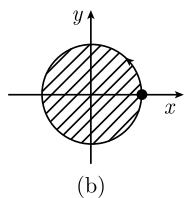

# 《数学指南——实用数学手册》5.1.7 应用

本页是《数学指南——实用数学手册》第 5.1 节「单变量函数的变分法」下属 5.1.7 小节「应用」的源文档摘要。该小节接续 5.1.6「带约束问题和拉格朗日乘子」，给出**四个经典应用**，逐一演示如何把几何或力学问题表述为带（积分或隐）约束的变分问题，再用[[concepts/修正拉格朗日函数]]与[[concepts/修正欧拉-拉格朗日方程]]求解。

主体是**教科书式演绎**：由已建立的一般理论（5.1.5 的充分条件与 5.1.6 的乘子方法）出发，经标准欧拉-拉格朗日方程求解，所得结论（圆周围出最大面积、悬链线、测地线的主法向性质、圆周摆方程）均为经典结果。

## 一、狄多女王的等周问题

**传说背景**：迦太基（Carthago）建城之初，狄多（黛朵）女王仅被允许获得一张公牛皮所能界定的土地。她把牛皮剪成薄条，围成一个圆周。

**定理**：在所有长度为 $l$ 所围成的二维区域 $D$ 中，**圆周所围的面积最大**。

为启发式说明，转化为极小化问题：

$$
- \int_D \mathrm{d}x\,\mathrm{d}y \stackrel{!}{=} \min \quad (\text{负面积}),\qquad \int_{\partial D}\mathrm{d}s = l \quad (\text{界线的长度}).
$$

边界曲线取形式 $x=x(t),\,y=y(t),\,t_0\leqslant t\leqslant t_1$，其外法向单位向量的分量为

$$
n_1 = \frac{y'(t)}{\sqrt{x'(t)^2+y'(t)^2}},\qquad n_2 = \frac{x'(t)}{\sqrt{x'(t)^2+y'(t)^2}}.
$$

分部积分得到恒等式

$$
2\int_D \mathrm{d}x\,\mathrm{d}y = \int_D\left(\frac{\partial x}{\partial x}+\frac{\partial y}{\partial y}\right)\mathrm{d}x\,\mathrm{d}y = \int_{\partial D}(x n_1 + y n_2)\,\mathrm{d}s.
$$

重新表述后的新问题：

$$
\begin{array}{l}
\int_{t_0}^{t_1}(-y'(t)x(t)+x'(t)y(t))\,\mathrm{d}t \stackrel{!}{=} \min,\\
x(t_0)=x(t_1)=R,\qquad y(t_0)=y(t_1)=0,\\
\int_{t_0}^{t_1}\sqrt{x'(t)^2+y'(t)^2}\,\mathrm{d}t = l.
\end{array}
$$

其中 $R$ 是一实参数。对修正的拉格朗日函数

$$
\mathcal{L} := -y'x + x'y + \lambda\sqrt{x'^2+y'^2},
$$

得到欧拉-拉格朗日方程

$$
\frac{\mathrm{d}}{\mathrm{d}t}\mathcal{L}_{x'} - \mathcal{L}_{x} = 0,\qquad \frac{\mathrm{d}}{\mathrm{d}t}\mathcal{L}_{y'} - \mathcal{L}_{y} = 0,
$$

即

$$
2y' + \lambda\frac{\mathrm{d}}{\mathrm{d}x}\frac{x'}{\sqrt{x'^2+y'^2}} = 0,\qquad
-2x' + \lambda\frac{\mathrm{d}}{\mathrm{d}x}\frac{y'}{\sqrt{x'^2+y'^2}} = 0.
$$

于是当 $\lambda = -2$ 时，得到解 $x = R\cos t,\ y = R\sin t$，其中 $l = 2\pi R$。

**术语约定**：按照[[entities/雅各布-伯努利]]（Jakob Bernoulli, 1655—1705），称**带积分约束的变分问题**为**等周问题**。

## 二、悬索问题

寻找一根长度为 $l$ 的悬索在重力作用下的形状 $y = y(x)$，悬索在两点 $(-a,0)$ 与 $(a,0)$ 固定（图 5.14）。

**解答**：最小势能原理给出变分问题

$$
\begin{array}{c}
\int_{-a}^{a}\rho g\,y(x)\sqrt{1+y'(x)^2}\,\mathrm{d}x \stackrel{!}{=} \min,\\
y(-a)=y(a)=0,\\
\int_{-a}^{a}\sqrt{1+y'(x)^2}\,\mathrm{d}x = l.
\end{array}
$$

其中 $\rho$ 是悬索的密度常数，$g$ 是重力加速度常数。为简化公式令 $\lambda g = 1$。修正的拉格朗日函数为

$$
\mathcal{L} := (y+\lambda)\sqrt{1+y'^2},
$$

其中实数 $\lambda$ 为拉格朗日乘子。根据 (5.18)，由相应的欧拉-拉格朗日方程得到关系式

$$
y'\mathcal{L}_{y'} - \mathcal{L} = \text{常数}.
$$

经计算推出 $\dfrac{y+\lambda}{\sqrt{1+y'^2}} = c$，从而得到**解族**

$$
y = c\cosh\left(\frac{x}{c}+b\right) - \lambda.
$$

这些就是**悬链线**。常数 $b,\ c$ 和 $\lambda$ 从边界条件和约束条件得出。

## 三、测地线

在由 $M(x,y,z)=0$ 给出的曲面上，寻找点 $A(x_0,y_0,z_0)$ 与 $B(x_1,y_1,z_1)$ 之间的最短路径 $x=x(t),\,y=y(t),\,z=z(t),\,t_0\leqslant t\leqslant t_1$（图 5.15）。

**解答**：变分问题是

$$
\begin{array}{l}
\int_{t_0}^{t_1}\sqrt{x'(t)^2+y'(t)^2+z'(t)^2}\,\mathrm{d}t \stackrel{!}{=} \min,\\
x(t_0)=x_0,\ y(t_0)=y_0,\ z(t_0)=z_0,\\
x(t_1)=x_1,\ y(t_1)=y_1,\ z(t_1)=z_1,\\
M(x,y,z)=0 \quad (\text{约束}).
\end{array}
$$

对于修正的拉格朗日函数 $\mathcal{L} := \sqrt{x^2+y^2+z^2} + \lambda M(x,y,z)$，其欧拉-拉格朗日方程为

$$
\frac{\mathrm{d}}{\mathrm{d}t}\mathcal{L}_{x'} - \mathcal{L}_{x} = 0,\quad
\frac{\mathrm{d}}{\mathrm{d}t}\mathcal{L}_{y'} - \mathcal{L}_{y} = 0,\quad
\frac{\mathrm{d}}{\mathrm{d}t}\mathcal{L}_{z'} - \mathcal{L}_{z} = 0,
$$

在以弧长 $s$ 作为参数进行变量替换后就变成

$$
\boldsymbol{r}''(s) = \mu(s)\left(\operatorname{grad}M\right)\left(\boldsymbol{r}(s)\right).
$$

**几何意义**：曲线 $\boldsymbol{r}=\boldsymbol{r}(s)$ 的**主法向量**或者平行于曲面的法向量 $N$，或者与其反平行。

## 四、圆周摆及其约束

设 $x=x(t),\,y=y(t)$ 是长为 $l$、质量为 $m$ 的圆周摆的轨线（图 5.16）。将稳态作用原理用于拉格朗日函数

$$
L = \text{动能} - \text{势能} = \frac{1}{2}m\left(x'^2+y'^2\right) - mgy,
$$

即得到变分问题

$$
\begin{array}{l}
\int_{t_0}^{t_1} L\left(x(t),x'(t),y(t),y'(t),t\right)\mathrm{d}t \stackrel{!}{=} \text{平稳},\\
x(t_0)=x_0,\ y(t_0)=y_0,\ x(t_1)=x_1,\ y(t_1)=y_1,\\
x(t)^2+y(t)^2-l^2 = 0 \quad (\text{约束}).
\end{array}
$$

对于带实参数 $\lambda$ 的修正的拉格朗日函数 $\mathcal{L} := L - \lambda\left(x^2+y^2-l^2\right)$，得到欧拉-拉格朗日方程

$$
\frac{\mathrm{d}}{\mathrm{d}t}\mathcal{L}_{x'} - \mathcal{L}_{x} = 0,\qquad \frac{\mathrm{d}}{\mathrm{d}t}\mathcal{L}_{y'} - \mathcal{L}_{y} = 0.
$$

上式化成

$$
m x'' = -2\lambda x,\qquad m y'' = -mg - 2\lambda y.
$$

若使用方向向量 $\boldsymbol{r} = x\boldsymbol{i} + y\boldsymbol{j}$，则得到圆周摆运动方程

$$
m\boldsymbol{r}'' = g\boldsymbol{j} - 2\lambda\boldsymbol{r}.
$$

这里 $-g\boldsymbol{j}$ 对应于重力，$-2\lambda\boldsymbol{r}$ 则是摆沿圆周运动相反方向作用的附加力。

## 图片资源

| 序号 | 文件 | 说明 |
|------|------|------|
| 001 | `media/10-数学指南实用数学手册--6-517-应用--16qab30/001-d177a802bf2fdca67aa068732b0b6163f4e59e6f662c8bd19a17f13d034e978b.jpg` | 图 5.13(a)，等周问题的边界曲线与法向量 |
| 002 | `media/10-数学指南实用数学手册--6-517-应用--16qab30/002-f41cd7c625686a7db9dd09fb0d3368f64fc59640bdaf3c4bce51314f8334c771.jpg` | 图 5.13 的第二幅子图，未能加载 |
| 003 | `media/10-数学指南实用数学手册--6-517-应用--16qab30/003-20fd0dcafd2078be82b267ef410397835771063fc0fc092b0e1e198fc2a763f3.jpg` | 图 5.14，悬索问题：区间 $[-a,a]$ 上的曲线形状 |
| 004 | `media/10-数学指南实用数学手册--6-517-应用--16qab30/004-755c2bad9c85e7fa58c3fe719a694ef697e4e4804179314857408d31640a8623.jpg` | 图 5.15，测地线的变分问题，未能加载 |
| 005 | `media/10-数学指南实用数学手册--6-517-应用--16qab30/005-3965d93ad3d00a685cf6a70b0b1e4126d74407a3420b4c95fb132e6bfd76bc90.jpg` | 图 5.16，圆周摆，未能加载 |

## 关键概念索引

- 中心术语：[[concepts/等周问题]]、[[concepts/悬链线]]、[[concepts/测地线]]
- 建模原理：[[concepts/最小势能原理]]、[[concepts/稳态作用原理]]
- 求解工具（承自 5.1.6）：[[concepts/修正拉格朗日函数]]、[[concepts/修正欧拉-拉格朗日方程]]、[[concepts/拉格朗日乘子]]、[[concepts/积分约束]]、[[concepts/隐约束]]
- 相关人物：[[entities/狄多女王]]、[[entities/雅各布-伯努利]]

## 相关发现

- [[findings/517节等周问题与圆周最大面积]]
- [[findings/517节悬索问题与悬链线]]
- [[findings/517节测地线与主法向量平行曲面法向量]]
- [[findings/517节圆周摆与运动方程]]

## 待澄清记号问题

- [[concepts/欧拉-拉格朗日方程]]
- [[concepts/修正拉格朗日函数]]
- [[queries/517节圆周摆运动方程重力项缺少质量因子m]]
- [[queries/517节图513至516未能加载与悬链线脚注缺失]]

<!-- llm-wiki:embedded-images -->
## Embedded Images

### Document

<!-- llm-wiki:embedded-images -->
