# 《数学指南——实用数学手册》1.1 初等分析

本页是手册第 1 章（分析）开篇小节 **1.1「初等分析」** 的入库摘要。与既有 wiki 中大量来自第 0 章（公式与表，如 0.9 积分表、0.2 双曲函数、0.5.3 球函数、0.4.6 统计表）的条目不同，本小节属于分析部分的引言性内容，覆盖实数、复数、复数在振荡上的应用、等式运算与不等式运算五大板块。

章首题词为康德（I. Kant, 1724—1804）的「没有直觉的概念是空洞的，没有概念的直觉是盲目的」。

## 内容结构

| 节号 | 标题 | 主题 |
|------|------|------|
| 1.1.1 | 实数 | 实数直线、自然数与整数、有理数、十进制小数、二进制数、区间 |
| 1.1.1.1 | 自然数和整数 | 乘法规则 (1.1)、除法规则 (1.2) |
| 1.1.1.2 | 有理数 | 约分与扩分、分数四则运算、负分数、常用数集符号、幂 |
| 1.1.1.3 | 十进制小数 | 位值表示、无穷不等式组 (1.4)、舍入规则、高斯括号 |
| 1.1.1.4 | 二进制数 | 二进制展开、其他数系（六十进制、二十进制、罗马数字） |
| 1.1.1.5 | 区间 | 紧区间、开区间、半开区间、无限区间 |
| 1.1.2 | 复数 | 邦贝利与欧拉的引入、欧拉公式 (1.7)、笛卡儿表示 |
| 1.1.2.1 | 绝对值 | 绝对值 (1.9 前)、距离、三角不等式 (1.9)、极坐标表示 |
| 1.1.2.2 | 复数运算的几何表示 | 加法、乘法（伸缩旋转）、除法、三种反射 |
| 1.1.2.3 | 算术法则 | 结合/交换/分配律、正负号法则、分数算术、共轭与实部虚部 |
| 1.1.2.4 | 复数的根 | 方程 xⁿ = a 的 n 个根、单位根 |
| 1.1.3 | 在振荡上的应用 | 周期函数、正弦振动、正弦式波 (1.10)、复函数表示 |
| 1.1.4 | 对等式的运算 | 等式运算法则、两个等式的运算、解方程的两步范式 |
| 1.1.5 | 对不等式的运算 | 不等式运算法则、两个不等式的运算、线性与二次不等式 |

## 关键公式（原文保留）

整数乘除的符号法则：

```latex
\begin{array}{r l}
& \text{“正数乘以正数} = \text{负数乘以负数} = \text{正数”}, \\
& \text{“正数乘以负数} = \text{负数乘以正数} = \text{负数”}.
\end{array}\tag{1.1}

\begin{array}{r l}
& \text{“正数除以正数} = \text{负数除以负数} = \text{正数”}, \\
& \text{“正数除以负数} = \text{负数除以正数} = \text{负数”}.
\end{array}\tag{1.2}
```

分数加法的「十字相乘法」：

```latex
\frac{a}{b} + \frac{c}{d} = \frac{ad + bc}{bd}.
```

十进制小数的唯一刻画（无穷不等式组）：

```latex
\begin{array}{c}
2.4 \leqslant x < 2.4 + 10^{-1}, \\
2.43 \leqslant x < 2.43 + 10^{-2}, \\
2.435 \leqslant x < 2.435 + 10^{-3}, \\
\dots\dots
\end{array}\tag{1.4}
```

幂的定义（a ≠ 0）：

```latex
\begin{array}{c}
a^{0} := 1, \quad a^{1} := a, \quad a^{2} := a \cdot a, \quad a^{3} := a \cdot a \cdot a, \quad \dots, \\
a^{-1} := \frac{1}{a}, \quad a^{-2} := \frac{1}{a^{2}}, \quad a^{-3} := \frac{1}{a^{3}}, \quad \dots.
\end{array}
```

复数与欧拉公式：

```latex
\mathrm{i}^{2} = -1.\tag{1.6}

\mathrm{e}^{x + \mathrm{i}y} = \mathrm{e}^{x}(\cos y + \mathrm{i} \cdot \sin y).\tag{1.7}

(x + \mathrm{i}y)(x - \mathrm{i}y) = x^{2} + y^{2}\tag{1.8}
```

绝对值、距离与三角不等式：

```latex
|z| := \sqrt{x^{2} + y^{2}}, \quad z = x + \mathrm{i}y

\left| |z| - |w| \right| \leqslant |z \pm w| \leqslant |z| + |w|.\tag{1.9}
```

极坐标表示与辐角：

```latex
z = r(\cos \varphi + \mathrm{i} \cdot \sin \varphi) = r \mathrm{e}^{\mathrm{i}\varphi},
\quad -\pi < \varphi \leqslant \pi, \quad r = |z|, \quad \arg z := \varphi,
\quad \psi = \varphi + 2\pi k.
```

复数的 n 个根：

```latex
x = \sqrt[n]{|a|}\left(\cos\left(\frac{2\pi k + \varphi}{n}\right) + \mathrm{i} \cdot \sin\left(\frac{2\pi k + \varphi}{n}\right)\right),
\quad k = 0, 1, \dots, n - 1.
```

正弦式波与波相速度：

```latex
y(x, t) = A \cdot \sin(\omega t + \alpha - kx)\tag{1.10}

\lambda := 2\pi / k, \quad c := \frac{\omega}{k}, \quad Y(x, t) := C \cdot \mathrm{e}^{\mathrm{i}(\omega t - kx)}, \quad C = A \mathrm{e}^{\mathrm{i}\alpha}
```

解方程的两步范式（例 1）：

```latex
2x + 3 = 7\tag{1.11}
```

线性方程组与解：

```latex
\left\{ \begin{array}{l} ax + by = \alpha, \\ cx + dy = \beta \end{array} \right.\tag{1.12}

x = \frac{\alpha d - \beta b}{ad - bc}, \quad y = \frac{a\beta - c\alpha}{ad - bc}.\tag{1.13}
```

二次方程与解：

```latex
x^{2} + 2bx + c = 0\tag{1.14}

x = -b \pm \sqrt{b^{2} - c}.\tag{1.15}
```

线性不等式与二次不等式：

```latex
ax - b \geqslant 0.\tag{1.16}

ax^{2} + 2bx + c \geqslant 0, \quad D := b^{2} - ac.\tag{1.17}
```

## 记号与约定

- 数集符号：ℕ（自然数集）、ℤ（整数集）、ℚ（有理数集）、ℝ（实数集）、ℂ（复数集）。
- 区间用左开右闭的欧洲惯例书写：`]a, b[` 表示开区间，`[a, b[` 为右半开区间，`]a, b]` 为左半开区间，`ℝ = ]−∞, ∞[`。
- 高斯括号 `[a]` 表示 a 的整数部分，即满足 g ≤ a 的最大整数 g，例如 [−2.5] = −3。
- 虚数单位记作 i；共轭记作 z̄；辐角主值记作 arg z。

## 图像

本节配图包括图 1.2（实数直线）、图 1.3（实数直线上的分数）、图 1.4（区间）、图 1.5（复数的图示）、图 1.6（两个复数之间距离）、图 1.7（极坐标）、图 1.8（复数的加法）、图 1.9（共轭及逆）、图 1.10（单位根）、图 1.11、图 1.12（波函数/振动）。入库图像位于 `media/10-数学指南实用数学手册--7-11-初等分析--1gphwdf/` 下，其中多张图像在采集时未能加载（详见 [[queries/11节图像未能加载]]）。

## 关联页面

- 实数侧：[[concepts/实数直线]]、[[concepts/有理数]]、[[concepts/无理数]]、[[concepts/十进制小数]]、[[concepts/实数的舍入规则]]、[[concepts/高斯括号]]、[[concepts/二进制数]]、[[concepts/区间]]
- 复数侧：[[concepts/虚数单位i]]、[[concepts/欧拉公式]]、[[concepts/共轭复数]]、[[concepts/复数的绝对值与距离]]、[[concepts/三角不等式]]、[[concepts/复数的极坐标表示]]、[[concepts/复数的n次根]]、[[concepts/单位根]]、[[concepts/复数运算的几何表示]]
- 振荡：[[concepts/正弦式波]]
- 运算：[[concepts/对等式的运算]]、[[concepts/解方程的两步范式]]、[[concepts/对不等式的运算]]
- 人物：[[entities/康德]]、[[entities/邦贝利]]、[[entities/欧拉]]、[[entities/笛卡儿]]、[[entities/高斯]]

## 与既有 wiki 的关系

本小节是第 1 章分析的开篇，与既有以第 0 章（公式与表）为主的条目构成互补：

- [[concepts/欧拉公式]] 与既有 [[concepts/双曲函数与三角函数的关系]]、[[concepts/双曲棣莫弗公式]] 同属「指数—三角函数」桥梁，但 1.1 给出的 (1.7) 是复指数形式。
- 本节使用的区间记号与 0.9 积分表所用的记号体系不同，交叉引用时需注意。
- 本节正文提到的外部节号（1.2.2 实数的严格定义、4.2.1 √2 无理性的经典证明、4.2.6.2、0.1.11 重要不等式）均尚未入库。

## 待解问题

- [[queries/11节实数严格定义与122节依赖]]
- [[queries/11节牛顿字谜残句位置错位]]
- [[queries/两个等式除法法则右端写作bd的转写疑误]]
- [[queries/二次不等式判别式D等于b方减ac与标准形式的差异]]
- [[queries/0111节重要不等式尚未入库]]
- [[queries/11节图像未能加载]]

<!-- llm-wiki:embedded-images -->
## Embedded Images

### Document

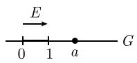
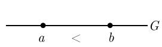
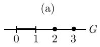
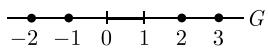
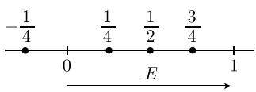
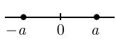


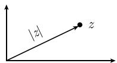
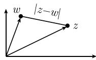


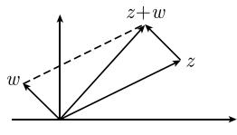


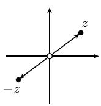

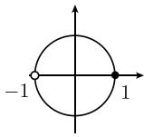
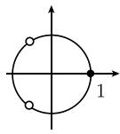


<!-- llm-wiki:embedded-images -->
