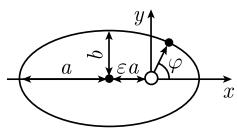
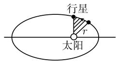

# 《数学指南——实用数学手册》1.12.5 应用

本页是《数学指南——实用数学手册》第 1.12.5 节「应用」的结构化记录。该节用两个物理模型演示常微分方程理论的用法：1.12.5.1 处理地球引力场中火箭的径向运动并求出对地球的逃逸速度；1.12.5.2 处理天体力学中的二体问题，把它约化为一体问题，并由此证明开普勒（Kepler, 1571—1630）的三条运动定律。

## 1.12.5.1 对地球的逃逸速度

火箭在地球引力场中的径向运动 $r = r(t)$ 由牛顿运动定律给出：

```text
m r'' = - G M m / r²,   r(0) = R,   r'(0) = v          (1.289)
```

其中 R 是地球半径，m 是火箭的质量，M 是地球的质量，G 是引力常数。

由能量守恒定律 (1.264) 得

```text
r'² = 2 G M / r + 常数,
```

计入初始条件后为

```text
r'² = 2 G M / r + ( v² - 2 G M / R ).
```

逃逸的判据是对所有时刻 $t$ 都有 $r'(t) > 0$（图 1.138）。v 的最小可能值由方程 $v^{2} - 2GM/R = 0$ 得到：

```text
v = √(2 G M / R) = 11.2 km·s⁻¹
```

这就是所求的对地球的逃逸速度。与此起始速度对应的运动由

```text
r(t) = ( R^{3/2} + (3/2) √(2 G M) t )^{2/3}
```

给出。

注意：质量 m 在方程两端被消去，故逃逸速度与火箭质量无关。

## 1.12.5.2 二体问题

### 牛顿运动定律

对分别具有质量 $m_1$ 与 $m_2$、总质量 $m = m_1 + m_2$ 的两个天体，研究运动 $\boldsymbol{x}_1 = \boldsymbol{x}_1(t)$ 与 $\boldsymbol{x}_2 = \boldsymbol{x}_2(t)$。例如 $m_1$ 可为太阳质量，$m_2$ 可为某一行星的质量（图 1.139）。

```text
m₁ x₁'' = F,   m₂ x₂'' = -F,
x_j(0) = x_{j0},   x_j'(0) = v_j,   j = 1, 2            (1.290)
```

其中牛顿引力为

```text
F = G m₁ m₂ (x₂ - x₁) / |x₂ - x₁|³
```

(1.290) 中力 F 与 −F 成对出现，相应于牛顿定律「作用力 = 反作用力」。

### 质心运动的分离

对系统的质心

```text
y := (1/m)( m₁ x₁ + m₂ x₂ )
```

以及总动量 $P = m y'$，从 (1.290) 得到总动量守恒

```text
P' = 0,
```

即 $m y'' = 0$，其解为

```text
y(t) = y(0) + t y'(0).
```

因而质心以常速度沿一直线运动。显式地：

```text
y(0)  = (1/m)( m₁ x₁₀ + m₂ x₂₀ ),
y'(0) = (1/m)( m₁ v₁ + m₂ v₂ ).
```

对关于质心的相对运动

```text
y_j := x_j - y
```

有运动方程

```text
m₁ y₁'' = F,   m₂ y₂'' = -F,   m₁ y₁ + m₂ y₂ = 0.
```

当系统由太阳及一个行星组成时，其质心 y 位于太阳的内部。

### 两个天体关于其中另一个的相对运动

对

```text
x := x₂ - x₁,
```

从 $x = y_2 - y_1$ 得到运动定律

```text
m₂ x'' = - G m m₂ x / |x|³,
x(0) = x₂₀ - x₁₀,   x'(0) = v₂ - v₁                    (1.291)
```

这是质量为 $m_2$ 的物体在质量为 m 的物体的引力场中的一体问题。

若已知 (1.291) 的解，则通过

```text
x₁(t) = y(t) - (m₂/m) x(t),   x₂(t) = y(t) - (m₁/m) x(t)
```

可得到原运动方程 (1.290) 的一个解。（原书此处 x₂(t) 一项的符号存疑，见 [[1125节反解公式x2符号疑义]]。）

### 守恒律

从 (1.291) 即得能量与角动量守恒律：

```text
(m₂/2) x'(t)² + U(x(t)) = 常数 = E                     (1.292)
m₂ x(t) × x'(t) = 常数 = N                              (1.293)
```

其中（参阅 1.9.6）

```text
U(x) = - G m m₂ / |x|,
E = (m₂/2) x'(0)² + U(x(0)),
N = m₂ x(0) × x'(0).
```

选取初始条件使 $N \neq 0$。

### 平面运动

由角动量守恒 (1.293) 得，对所有时刻 $t$ 有 $\boldsymbol{x}(t) \cdot \boldsymbol{N} = 0$。因此运动被限制于垂直于向量 $\boldsymbol{N}$ 的平面内。选取 z 轴沿向量 $\boldsymbol{N}$ 方向的笛卡儿坐标系 $(x, y, z)$，则 $\boldsymbol{x}(t)$ 位于 $(x, y)$ 平面中：

```text
x(t) = x(t) i + y(t) j.
```

### 极坐标（图 1.140）

取极坐标

```text
x = r cos φ,   y = r sin φ,
```

并引入单位向量

```text
e_r  :=  cos φ i + sin φ j,
e_φ  := -sin φ i + cos φ j.
```

运动由 $\varphi = \varphi(t)$、$r = r(t)$ 给出；选取 x 轴使 $\varphi(0) = 0$。对时间求导得

```text
e_r' = (-sin φ i + cos φ j) φ' = φ' e_φ.
```

由轨道方程

```text
x(t) = r(t) e_r(t)
```

得 $x' = r' e_r + r \varphi' e_\varphi$。由于 $e_r \cdot e_\varphi = 0$，有 $x'^2 = (r')^2 + r^2 (\varphi')^2$。于是从 (1.292) 得到方程组

```text
m₂ ( r'² + r² φ'² - 2 G m / r ) = 2 E,
m₂ r² φ' = |N|.                                         (1.294)
```

### 轨道方程

定理： (1.294) 的解是

```text
r = p / (1 + ε cos φ)                                   (1.295)
```

此时时间 $t$ 的运动由

```text
t = ( m₂ / |N| ) ∫₀^φ r(φ)² dφ                          (1.296)
```

给出，其中的诸常数为

```text
p := N² / (α m₂),   ε := √(1 + 2 E N² / (m₂ α²)),   α := G m m₂   (1.297)
```

证明：这由直接求微商容易得到验证。脚注 1) 指出：利用 $\mathrm{d}\varphi/\mathrm{d}r = \varphi'(t)/r'(t) = F(t)$，通过分离变量法积分此方程即导致公式 (1.295)；函数 $F(t)$ 从 (1.294) 中第一个方程推导而得；此外从 (1.294) 中第二个方程即得 (1.296)。在 1.13.1.5 中将利用雅可比（C. G. J. Jacobi, 1804—1850）漂亮的方法来计算这个解。

讨论 $0 \leqslant \varepsilon < 1$ 的情形。

### 开普勒第一定律

行星沿着椭圆轨道运行，太阳位于椭圆的焦点之一的位置（图 1.141）。

证明：在笛卡儿坐标 x、y 中，轨道方程 (1.295) 归为方程

```text
( x + ε a )² / a² + y² / b² = 1.
```

这里有 $a := p/(1 - \varepsilon^{2})$ 和 $b := p/\sqrt{1 - \varepsilon^{2}}$。太阳位于椭圆的焦点 $(0, 0)$。

### 开普勒第二定律

在相等的时间中，行星的轨道扫过相等的面积。

证明：在时间区间 $[s, t]$ 中，面积

```text
(1/2) ∫_s^t r² φ' dt = (t - s) |N| / (2 m₂)              (1.298)
```

被扫过。

### 开普勒第三定律

对于所有行星而言，周期 T 的平方与长半轴 a 的 3 次方之比是一个常数。

证明：椭圆轨道所围成的面积为 $\pi a b$。在 (1.298) 中令 $t = T$ 和 $s = 0$，得到

```text
(1/2) π a b = T |N| / (2 m₂).
```

从 $a = p/(1 - \varepsilon^2)$ 和 (1.297) 得到

```text
T² / a³ = 4 π² / ( G (m₁ + m₂) ).                        (1.299)
```

因为太阳的质量 $m_1$ 比行星的质量 $m_2$ 大得多，在初级近似时在 (1.299) 中不妨忽略 $m_2$。

### 历史评注

本节所考虑的说明了开普勒第三定律只是一个近似。开普勒从对行星的大量观察数据的研究中得出了这个定律。他凭经验得到的定律，和以后由牛顿所发现的数学推导，是当时数学和物理学的伟大成就。

## 图表

- 图 1.138：火箭自地球表面（距地心距离 R 处）发射离去的情形，用于说明逃逸条件 $r'(t) > 0$。
- 图 1.139：二体问题的位置矢量关系图，从原点 O 指向太阳的矢量 $x_1$、指向行星的矢量 $x_2$，以及 $x = x_2 - x_1$。
- 图 1.140：极坐标图（图像扫描未能加载，无法辨识其细节）。
- 图 1.141：(a) 椭圆几何参数示意图，标注 a、b、εa、r、φ；(b) 行星轨道与向径扫过的阴影扇形，示意开普勒第二定律。

## 相关条目

- 概念：[[二体问题]]、[[一体问题]]、[[逃逸速度]]、[[开普勒定律]]、[[圆锥曲线轨道]]、[[质心分离]]、[[极坐标单位向量]]、[[面积速度]]
- 人物：[[开普勒]]、[[牛顿]]、[[雅可比]]
- 已有条目：[[守恒律]]、[[势能]]、[[N体问题]]、[[太阳系质心沿直线常速运动]]

## 待核问题

- [[1125节图1140无法辨识]]
- [[1125节引用能量守恒1264未入库]]
- [[1125节脚注指向11315尚未入库]]
- [[1125节反解公式x2符号疑义]]

<!-- llm-wiki:embedded-images -->
## Embedded Images

### Document




<!-- llm-wiki:embedded-images -->
