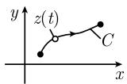
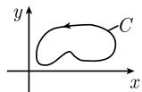
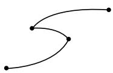
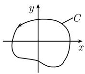
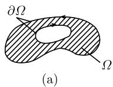
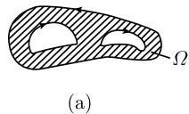
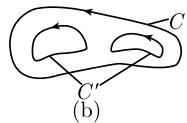

# 《数学指南——实用数学手册》1.14.4 积分

## 概述

本节是《数学指南——实用数学手册》1.14 复变函数中关于**积分**的部分，系统给出复变函数论中最核心的积分性质：单连通区域上的围道积分 $\int_C f(z)\,\mathrm{d}z$ 与积分路径无关，即**柯西积分定理**。围绕这一主线，本节依次定义了复平面中的曲线、曲线积分（复积分）与周线积分，给出三角不等式估计与方向反转公式，随后陈述柯西（1825）与莫雷拉（1886）的主定理及其推论，并通过例 1–例 3 说明单连通假设的必要性（$k=-1$ 的例外）与微积分基本定理在复情形下的形式。

在路径层面，本节引入了 **$C^1$ 同伦路径**与 **$C^1$ 同调路径**两种等价刻画（定理 1 与定理 2），指出全纯函数的积分在 $C^1$ 同伦或 $C^1$ 同调变形下保持不变。最后给出**柯西积分公式（1831）**及其高阶导数公式，并指出单变量复值函数论已包含代数拓扑中同伦理论与同调理论的萌芽，由 [[庞加莱]] 于 19 世纪末创建。

## 曲线与曲线积分的定义

复平面 $\mathbb{C}$ 中的曲线 $C$ 由函数给出：

$$
z = z(t), \quad a \leqslant t \leqslant b \tag{1.454}
$$

其中 $-\infty < a < b < +\infty$。令 $z := x + iy$，则对应 $\mathbb{R}^2$ 中的实曲线

$$
x = x(t), \quad y = y(t), \quad a \leqslant t \leqslant b .
$$

若 $x = x(t)$、$y = y(t)$ 在 $[a,b]$ 上都是 $C^1$ 型的，则称曲线 $C$ 是 $C^1$ 型的。

**若尔当曲线**：如果在 $[a,b]$ 上映射 $A: t \mapsto z(t)$ 是一个同胚，则称曲线 $C$ 是若尔当曲线。若 $z(a) = z(b)$，则 $C$ 是闭曲线；若尔当闭曲线是复平面 $\mathbb{C}$ 中圆周 $\{z \in \mathbb{C} : |z| = 1\}$ 的同胚象。若尔当曲线形态规则，即没有自相交。

**曲线积分的定义**：如果函数 $f: U \subseteq \mathbb{C} \to \mathbb{C}$ 在开集 $U$ 上连续，且 $C: z = z(t),\ a \leqslant t \leqslant b$ 是 $C^1$ 类曲线，则定义

$$
\int_{C} f(z)\,\mathrm{d}z := \int_{a}^{b} f(z(t))\, z'(t)\,\mathrm{d}t .
$$

这个定义与定向曲线 $C$ 的参数化无关。如果曲线 $C$ 是闭的，则称为周线积分。

**三角不等式**：

$$
\left| \int_{C} f\,\mathrm{d}z \right| \leqslant (C\ \text{的长度}) \sup_{z \in C} |f(z)| .
$$

**方向的变化**：如果用 $-C$ 表示由 $C$ 所得到的与 $C$ 方向相反的曲线，则有

$$
\int_{-C} f\,\mathrm{d}z = -\int_{C} f\,\mathrm{d}z .
$$

## 柯西（1825）和莫雷拉（1886）的主定理

**主定理**：单连通域 $U$ 上的连续函数 $f: U \subseteq \mathbb{C} \to \mathbb{C}$ 是全纯的，当且仅当积分 $\int_C f\,\mathrm{d}z$ 与 $U$ 中的积分路径无关。

**例 1**：在图 1.170(a) 中有 $\int_C f\,\mathrm{d}z = \int_{C'} f\,\mathrm{d}z$。单连通域的基本概念在 1.3.2.4 引入，直观地说，单连通域没有洞。

**推论**：在单连通区域 $U$ 上，连续函数 $f: U \subseteq \mathbb{C} \to \mathbb{C}$ 是全纯的，如果对 $U$ 中的所有 $C^1$ 型若尔当闭曲线 $C$ 有

$$
\int_{C} f\,\mathrm{d}z = 0 . \tag{1.455}
$$

**例 2**：如果 $C$ 是包围原点的 $C^1$ 型若尔当闭曲线（如圆周），而且在数学意义上有正定向（即逆时针），那么

$$
\int_{C} z^{k}\,\mathrm{d}z = \left\{
\begin{array}{cl}
0, & k = 0, 1, 2, \dots , \\
2\pi \mathrm{i}, & k = -1, \\
0, & k = -2, -3, \dots .
\end{array}
\right. \tag{1.456}
$$

若 $k = 0,1,2,\cdots$，则 $f(z) := z^k$ 在 $C$ 中是全纯的，由 (1.455) 即得 (1.456)。对于 $k=-1$，$f(z) := z^{-1}$ 在非单连通区域 $\mathbb{C} - \{0\}$ 上是全纯的，但在 $C$ 内不是全纯的，因而有

$$
\int_{C} \frac{\mathrm{d}z}{z} = 2\pi \mathrm{i},
$$

这表明不能减弱 (1.455) 式中 $U$ 为单连通域这一假设（图 1.170(c)）。

## 微积分基本定理与原函数

令 $C$ 表示 $U$ 中起点为 $z_0$、终点为 $z$ 的 $C^1$ 型曲线。

**微积分基本定理**：给定区域 $U$ 上的一个连续函数 $f: U \subseteq \mathbb{C} \to \mathbb{C}$，并令 $F$ 是 $f$ 在 $U$ 上的一个原函数，即 $F' = f$，则

$$
\int_{C} f\,\mathrm{d}z = F(z) - F(z_0) .
$$

$f$ 在 $U$ 上的两个原函数相差一个常数。

**例 3**：

$$
\int_{C} e^{z}\,\mathrm{d}z = e^{z} - e^{z_0} .
$$

**推论**：如果函数 $f: U \subseteq \mathbb{C} \to \mathbb{C}$ 是在单连通域 $U$ 中全纯的，则函数

$$
F(z) := \int_{z_0}^{z} f(\zeta)\,\mathrm{d}\zeta
$$

是 $f$ 在 $U$ 上的一个原函数。

## $C^1$ 同伦路径与 $C^1$ 同调路径

全纯函数的积分的基本（拓扑）性质是：变成 $C^1$ 同伦路径或 $C^1$ 同调路径后积分不变。

**$C^1$ 同伦路径**：给定复平面 $\mathbb{C}$ 中的区域 $U$。两条 $C^1$ 曲线 $C$ 与 $C'$ 称为 $C^1$ 同伦曲线，如果满足：

1. $C$ 和 $C'$ 有相同的起点和终点；
2. $C$ 可以可微地形变为 $C'$（图 1.170(a)）。

**定理 1**：如果 $f: U \subseteq \mathbb{C} \to \mathbb{C}$ 在区域 $U$ 上是全纯的，并且曲线 $C$ 和 $C'$ 是 $C^1$ 同伦的，则

$$
\int_{C} f\,\mathrm{d}z = \int_{C'} f\,\mathrm{d}z . \tag{1.457}
$$

**$C^1$ 同调路径**：区域 $U$ 中两条 $C^1$ 曲线 $C$ 与 $C'$ 称为 $C^1$ 同调曲线，如果它们的边界不同，即存在区域 $\Omega$，其闭包包含在 $U$ 中，使得

$$
C = C' + \partial \Omega .
$$

边界曲线 $\partial \Omega$ 用这样的方式来定向，使得区域 $\Omega$ 在边界曲线的左边（图 1.171(a)）。在这个情形记作 $C \sim C'$。

**例 4**：图 1.171 中区域 $\Omega$ 的边界曲线 $\partial\Omega$ 由两条曲线 $C$ 和 $-C'$ 组成，换言之 $\partial\Omega = C - C'$，因而 $C = C' + \partial\Omega$。用类似的方法即得图 1.172 中 $C \sim C'$。

**定理 2**：方程 (1.457) 对 $C^1$ 同调路径 $C$ 和 $C'$ 也成立。

## 柯西积分公式（1831）

令 $U$ 是复平面中的区域，它包含圆盘 $\Omega := \{z \in \mathbb{C} : |z - a| < r\}$ 及其（数学上正定向）边界曲线 $C$。如果函数 $F: U \to \mathbb{C}$ 是全纯的，则对所有 $z \in \Omega$ 有

$$
f(z) = \frac{1}{2\pi \mathrm{i}} \int_{C} \frac{f(\zeta)}{\zeta - z}\,\mathrm{d}\zeta
$$

以及

$$
f^{(n)}(z) = \frac{n!}{2\pi \mathrm{i}} \int_{C} \frac{f(\zeta)}{(\zeta - z)^{n+1}}\,\mathrm{d}\zeta, \quad n = 1, 2, \dots .
$$

如果 $\Omega$ 的边界曲线 $C$ 是（数学上正定向）$C^1$ 若尔当闭曲线，那么上述结果仍然成立。此外，要求 $\Omega$ 和 $C$ 都在 $U$ 中（参看图 1.173）。

## 历史与延伸

单变量复值函数论包含了代数拓扑的同伦理论及同调理论的萌芽，它是由庞加莱于 19 世纪末创建的。有关代数拓扑更详细的内容见参考文献 [212]。

## 图片

- 图 1.169：复平面中的曲线（(a) 曲线 $C$，(b) 反向曲线 $-C$，(c) 带自相交的曲线）——见 `media/10-数学指南实用数学手册--7-1144-积分--z052eq/001-a7e88edd1fa5d09ecf0c574ea3fa742db26dfc65d7015d6dec16bc04769a91f6.jpg` 等。
- 图 1.170：周线积分的性质（(a) 同伦路径，(b) 同调路径，(c) 非单连通的反例）。
- 图 1.171、1.172：同调路径示意。
- 图 1.173：柯西积分公式中要求 $\Omega$ 与 $C$ 都在 $U$ 中的几何关系。

## 关联

- 主定理与推论对应页面：[[柯西-莫雷拉定理]]、[[复积分路径无关性]]
- 拓扑刻画：[[C1同伦与同调路径]]
- 结论工具：[[柯西积分公式]]、[[复微积分基本定理]]、[[原函数]]
- 与既有页面衔接：[[围道积分]]、[[复变函数]]、[[解析延拓]]、[[留数计算]]
- 人物：[[柯西]]、[[莫雷拉]]、[[若尔当]]、[[庞加莱]]

<!-- llm-wiki:embedded-images -->
## Embedded Images

### Document

<!-- llm-wiki:embedded-images -->

## Related
- [[sources/10-数学指南实用数学手册--14-11412-对调和函数的应用--xj3rdz]]
