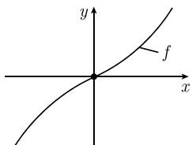

# 《数学指南——实用数学手册》1.5.7 逆映射

## 概述

本文是《数学指南——实用数学手册》第 1.5 节「[[多元实变函数]]的导数」下的第 1.5.7 小节。它从拓扑层面到局部层面、再到整体层面，逐步铺开「映射何时可逆」这一问题：

1. **1.5.7.1 同胚**——纯粹拓扑层面的可逆性：双射加上双向连续。
2. **1.5.7.2 局部微分同胚**——光滑层面的局部可逆性，核心条件为 $\det f'(p) \neq 0$，即逆映射定理的局部形式。
3. **1.5.7.3 整体微分同胚**——整体可逆性的充分判据，即[[整体微分同胚的阿达马定理]]。
4. **1.5.7.4 解的一般形态**——去掉 $\det f' \neq 0$ 的处处要求、只保留无穷远处增长条件时，方程 $f(x) = y$ 的解「通常」至多有限个。

本节与已入库的 1.5.6 [[隐函数定理]]（含[[隐函数定理-方程组版本]]）是同一主题的两面：局部微分同胚定理即逆映射定理，而隐函数定理是其在良态条件下的等价表述。

本节两张插图（图 1.50、图 1.51）均已成功加载。

## 1.5.7.1 同胚

**定义** 令 $X$ 和 $Y$ 是[[度量空间]]（比如 $\mathbb{R}^N$ 的子集）。映射 $f: X \to Y$ 称为**同胚**，如果 $f$ 是双射的，且 $f$ 与 $f^{-1}$ 连续（见 4.3.3）。

**同胚定理** 紧集上的连续双射 $f: X \to Y$ 是一个同胚。

该定理推广了紧区间上的实值整体逆函数定理（见 1.4.4.2）。

## 1.5.7.2 局部微分同胚

**定义** 令 $X$ 和 $Y$ 是 $\mathbb{R}^N$ 的非空开集，$N \geqslant 1$。映射 $f: X \to Y$ 称为 $C^k$ 类微分同胚，如果 $f$ 是双射的，且 $f$ 和 $f^{-1}$ 都是 $C^k$ 类的。

**关于局部微分同胚的主要定理** 令 $1 \leqslant k \leqslant \infty$。假设映射 $f: M \subseteq \mathbb{R}^N \to \mathbb{R}^N$ 在 $p$ 的一个开邻域 $V(p)$ 内上是 $C^k$ 类的，且

$$
\boxed{\det f'(p) \neq 0,}
$$

那么 $f$ 在点 $p$ 处是局部 $C^k$ 类微分同胚。$^{1)}$

1) 这意味着，$f$ 是从某一恰当选取的开邻域 $U(p)$ 到开邻域 $U(f(p))$ 的 $C^k$ 类微分同胚。

**例** 考虑映射

$$
\boxed{u = g(x, y), \quad v = h(x, y),}\tag{1.78}
$$

并且假设 $u_0 := g(x_0, y_0), v_0 := h(x_0, y_0)$。函数 $g$ 和 $h$ 都假定是在点 $(x_0, y_0)$ 的一个邻域内的 $C^k$ 类函数，$1 \leqslant k \leqslant \infty$，并假设

$$
\boxed{\begin{array}{cc} \left| \begin{array}{cc} g_u(x_0, y_0) & g_v(x_0, y_0) \\ h_u(x_0, y_0) & h_v(x_0, y_0) \end{array} \right| \neq 0. \end{array}}
$$

那么映射 (1.78) 在点 $(x_0, y_0)$ 处是局部 $C^k$ 类微分同胚。

这意味着，如图 1.50 描绘的 (1.78) 中的映射可以在点 $(u_0, v_0)$ 的一个邻域中被逆转，且逆映射

$$
x = x(u, v), \qquad y = y(u, v)
$$

在 $(u_0, v_0)$ 的一个邻域内是光滑的，即，$x, y$ 是 $C^k$ 类的。

## 1.5.7.3 整体微分同胚

**整体微分同胚的阿达马（Hadamard）定理** 令 $1 \leqslant k \leqslant \infty$。假设 $C^k$ 类映射 $f: \mathbb{R}^N \to \mathbb{R}^N$ 满足两个条件：

$$
\left.\begin{array}{l}{\underset{|x| \rightarrow \infty}{\lim} |f(\boldsymbol{x})| = +\infty}\\{\det f'(\boldsymbol{x}) \neq 0}\end{array}\right\} \text{对所有的} \boldsymbol{x} \in \mathbb{R}^N,\tag{1.79}
$$

则 $f$ 是 $C^k$ 类的微分同胚。$^{1)}$

**例** 令 $N = 1$。对函数 $f(x) := \sinh x$，$f'(x) = \cosh x > 0$ 蕴涵 (1.79) 成立。因此 $f: \mathbb{R} \to \mathbb{R}$ 是 $C^\infty$ 类微分同胚（图 1.51）。

## 1.5.7.4 解的一般形态

**定理** 令 $f: \mathbb{R}^N \to \mathbb{R}^N$ 是 $C^1$ 类函数，使得 $\lim_{|\boldsymbol{x}| \to \infty} |f(\boldsymbol{x})| = \infty$，那么存在一个稠密 $^{2)}$ 开集 $D \subseteq \mathbb{R}^N$，使得方程

$$
\boxed{f(\boldsymbol{x}) = y, \quad \boldsymbol{x} \in \mathbb{R}^N}\tag{1.80}
$$

对于每个 $y \in D$，有至多有限个解。

可以简化结论为：通常存在有限个解。更精确地说，有如下显然的情况。

**(i) 扰动。** 如果给定一个值 $y_0 \in \mathbb{R}^N$，那么在 $y_0$ 的每个邻域内存在一个点 $y \in \mathbb{R}^N$，对于这个 $y$，方程 (1.80) 至多有有限个解；换句话说，通过轻轻扰动 $y_0$，可以得到具有好性质的解。

**(ii) 稳定性。** 如果对某一点 $\boldsymbol{y}_1 \in D$，方程 (1.80) 有至多有限个解，那么存在一个邻域 $U(\boldsymbol{y}_1)$，对于所有的 $\boldsymbol{y} \in U(\boldsymbol{y}_1)$，(1.80) 只有有限个解。

## 本文依赖的概念与相邻章节

- 定理中的 $f'(p)$ 记号来自[[弗雷歇导数]]体系（[[弗雷歇]]）；[[雅可比矩阵]]与[[雅可比行列式]]给出其具体矩阵形式。
- $C^k$ 类要求在开邻域内成立，涉及[[局部Ck类]]。
- 「紧集上的连续双射」涉及[[紧集与相对紧集]]与[[度量空间]]；开邻域则涉及[[邻域]]。
- 同胚定理自陈推广了 1.4.4.2「紧区间上的实值整体逆函数定理」；该节正文尚未入库。
- 同胚定义中「连续」的出处为 4.3.3（连续性章节），该节尚未入库。
- 局部微分同胚定理与[[隐函数定理]]互为等价表述。

## 转写与录入状态提示

- 1.5.7.3 的脚注 1) 与 1.5.7.4 中「稠密」处的脚注 2) 正文均未出现在源文档中。
- 1.5.7.2 例题中雅可比行列式写作 $g_u, g_v, h_u, h_v$，但 $g, h$ 的自变量为 $(x, y)$，疑为 $g_x, g_y, h_x, h_y$ 的转写讹误。
- 本节两张插图（图 1.50、图 1.51）均已正常加载。

<!-- llm-wiki:embedded-images -->
## Embedded Images

### Document

<!-- llm-wiki:embedded-images -->
