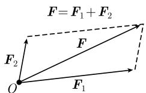
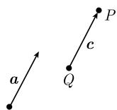
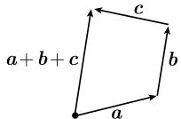
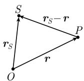
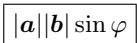
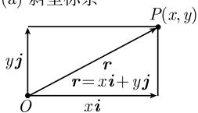
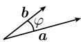

# 《数学指南——实用数学手册》1.8 向量代数

本页是《数学指南——实用数学手册》第 1.8 节「向量代数」的入库摘要。该节从物理量出发引入标量与（移动）向量，进而建立向量空间 $V(O)$ 的公理体系，讨论线性组合、线性无关、基与坐标，随后给出标量积、向量积、三重积及其在笛卡儿坐标系与一般坐标系下的分量表示，最后列出对偶基、反变坐标与共变坐标。全节不含证明，仅陈述结果；末尾指出向量代数在几何学中的应用见 3.3 节。

## 一、标量、向量与仿射向量

- 值为实数的量称为**标量**（如质量、电荷、温度、功、能量、势）。
- 给一个标量加上方向就是**移动向量**（如速度、加速度、力、电场或磁场力）。
- 在物理学中，向量的**基（起点）**十分重要，它导出（基）向量的概念；如果与起点无关，那么就是**仿射向量**。
- 给定点 $O$，从 $O$ 开始的向量 $F$ 是起点在点 $O$ 的箭头（图 1.81）。箭头长度记作 $|F|$。若 $P$ 是箭头终点，也记作 $F = \overrightarrow{OP}$。
- 向量 $0 := \overrightarrow{OO}$ 称为在点 $O$ 处的**零向量**；单位长度的向量称为**单位向量**。
- 物理解释：可以把 $F$ 看成作用在点 $O$ 上的一个力。

### 1.8.1 向量的线性组合

向量乘以标量的定义（图 1.81）：令 $F$ 是起点为点 $O$ 的一个向量，$\alpha$ 是实数。

(i) $-F$ 是基为点 $O$ 的向量，与 $F$ 有相同长度，方向与 $F$ 相反。

(ii) 当 $\alpha > 0$ 时，$\alpha F$ 仍是以点 $O$ 为基的向量，与 $F$ 同方向，长度等于 $\alpha |F|$。

(iii) 当 $\alpha < 0$ 时，令 $\alpha F := |\alpha|(-F)$；当 $\alpha = 0$ 时，令 $\alpha F := 0$。

向量加法的定义：令 $F_1$ 和 $F_2$ 为两个向量，基都在点 $O$，定义和

```latex
F_1 + F_2
```

为以点 $O$ 为基的向量，它是如图 1.82 所示由 $F_1$ 和 $F_2$ 构成的平行四边形的对角线。

物理解释：如果 $F_1$ 和 $F_2$ 是作用在点 $O$ 的两个力，那么 $F_1 + F_2$ 为作用在点 $O$ 的合力（**力的平行四边形法则**）。

两个向量 $a, b$ 的减法定义为 $b - a := b + (-a)$，并有 $a + (b - a) = b$（图 1.83）。

**基本定律**（公式 1.156）：令 $a, b, c$ 是以点 $O$ 为基的向量，$\alpha, \beta$ 为实数，那么

```latex
a + b = b + a,  (a + b) + c = a + (b + c),
α(βa) = (αβ)a,  (α + β)a = αa + βa,  α(a + b) = αa + αb.   (1.156)
```

称 $\alpha a + \beta b$ 为向量 $a, b$ 的**线性组合**。而且有（公式 1.157）

```latex
|a| = 0 当且仅当 a = 0;
|αa| = |α||a|;
||a| − |b|| ≤ |a ± b| ≤ |a| + |b|.    (1.157)
```

用记号 $V(O)$ 表示基在点 $O$ 的所有向量的集合。用现代数学语言来说，(1.156) 的意思是 $V(O)$ 是一个实向量空间（参看 2.3.2）。方程 (1.157) 蕴涵着 $V(O)$ 是**赋范向量空间**（参看 [212]）。距离函数

```latex
d(a, b) := |b − a|    (1.158)
```

赋予 $V(O)$ **度量空间**的结构。这里 $|b - a|$ 是向量 $b, a$ 的终点之间的距离（图 1.83）。

**线性无关**：$V(O)$ 中的向量 $F_1, \cdots, F_r$ 称为线性无关的，如果由方程

```latex
α_1 F_1 + ⋯ + α_r F_r = 0
```

可推出 $\alpha_1 = \cdots = \alpha_r = 0$，其中 $\alpha_1, \cdots, \alpha_r$ 为实数。

例：

(i) $V(O)$ 中两个非零向量线性无关，当且仅当它们不位于同一条直线上，即不共线。

(ii) $V(O)$ 中三个非零向量线性无关，当且仅当它们不在同一平面上，即不共面。

### 1.8.2 坐标系

$V(O)$ 中线性无关向量的最大个数是 3，因此线性空间 $V(O)$ 的**维数是 3**。

**基**：如果 $e_1, e_2, e_3$ 是 $V(O)$ 中三个线性无关的向量，那么 $V(O)$ 中的任意向量 $r$ 可以唯一表示成

```latex
r = x_1 e_1 + x_2 e_2 + x_3 e_3.
```

实数 $x_1, x_2, x_3$ 称为 $r$ 关于基 $e_1, e_2, e_3$ 的**分量**，同时也是 $r$ 的终点 $P$ 的坐标（图 1.84）。

**笛卡儿坐标系**由三个单位长度的向量 $i, j, k$ 给出，它们相互垂直并符合右手法则（如同右手的拇指、食指与中指的关系一样定向）。那么 $V(O)$ 中的每个向量 $r$ 有唯一表示

```latex
r = x i + y j + z k,
```

其中 $x, y, z$ 称为 $r$ 的终点 $P$ 的**笛卡儿坐标**（图 1.85）。平面中相应的情况见图 1.86（(a) 斜坐标系，(b) 笛卡儿坐标系）。

**自由向量**：起点在同一点或不同点的两个向量 $a$ 和 $c$ 称为**等价的**，如果它们有相同的方向和长度，记作 $a \sim c$（图 1.87）。用 $[a]$ 表示向量 $a$ 的等价类，即所有等价于 $a$ 的向量 $c$ 的集合。等价类 $[a]$ 的所有元素称为 $a$ 的**代表**。每个这样的等价类 $[a]$ 称为一个**自由向量**。

几何解释：自由向量 $[a]$ 表示空间中的**平移**。每个代表 $c = \overrightarrow{QP}$ 表明，在平移作用下点 $Q$ 映为 $P$（图 1.87）。

自由向量的和定义为

```latex
[a] + [b] := [a + b].
```

它表示自由向量以分量方式相加，并且这个运算与代表的选取无关。类似地定义 $\alpha[a] := [\alpha a]$。

约定：为简化记号，把 $a \sim c$ 记作 $a = c$，把 $[a] + [b]$（相应地 $\alpha[a]$）记作 $a + b$（相应地 $\alpha a$）。下文中不再说到自由向量，而总是论及向量。

例：平移两个向量 $a, b$ 使它们有共同的基点，然后由平行四边形法则相加，就得到两个向量的和 $a + b$（图 1.88）；同样可得 $a + b + c$（图 1.89）。

**太阳的引力**：如果太阳在空间一点 $S$ 处的质量为 $M$，并且在点 $P$ 处存在质量为 $m$ 的一个行星，那么太阳作用在这个行星上的引力是

```latex
F(P) = G m M (r_cm − r) / |r_cm − r|^3    (1.159)
```

其中 $r := \overrightarrow{OP}$，$r_{cm} := \overrightarrow{OS}$，$G$ 表示引力常量（图 1.90）。

### 1.8.3 向量的乘法

**标量积的定义**：两个向量 $a, b$ 的标量积，记作 $ab$，定义为数

```latex
ab := |a| |b| cos φ,
```

其中 $\varphi$ 是两个向量 $a, b$ 之间的夹角，它如此选取，以使 $0 \leqslant \varphi \leqslant \pi$（图 1.91）。

**正交性**：两个向量 $a, b$ 称为正交的$^{1)}$，如果

```latex
ab = 0.
```

如果 $a \neq 0$ 且 $b \neq 0$，那么当且仅当 $\varphi = \pi/2$ 时这个条件成立。约定零向量 $0$ 垂直于所有向量。

**向量积的定义**：两个向量 $a, b$ 的向量积，记作 $a \times b$，定义为长为

```latex
|a| |b| sin φ
```

的一个向量（这个量即为由向量 $a, b$ 生成的平行四边形的面积，参看图 1.92），它垂直于 $a$ 也垂直于 $b$，并且三个向量 $a, b, a \times b$ 以这个次序形成一个右手系，如果 $a \neq 0, b \neq 0$。

法则：对任意向量 $a, b, c$ 及任意实数 $\alpha$，有

| 标量积 | 向量积 |
|---|---|
| $ab = ba$ | $a \times b = -(b \times a)$ |
| $\alpha(ab) = (\alpha a)b$ | $\alpha(a \times b) = (\alpha a) \times b$ |
| $a(b + c) = ab + ac$ | $a \times (b + c) = (a \times b) + (a \times c)$ |
| $a^2 := aa = |a|^2$ | $a \times a = 0$ |

而且，向量积有如下性质：

(i) $a \times b = 0$，当且仅当 $a, b$ 有一个为零向量，或 $a, b$ 平行或反平行。

(ii) $a \times b = 0$，当且仅当 $a, b$ 线性相关。

(iii) 向量积不满足交换律，即当 $a \times b \neq 0$ 时，$a \times b \neq b \times a$。

**几个向量的乘积**

展开法则：

```latex
a × (b × c) = b(ac) − c(ab).
```

拉格朗日（Lagrange）等式：

```latex
(a × b)(c × d) = (ac)(bd) − (bc)(ad).
```

**三重积**定义为

```latex
(abc) := (a × b)c.
```

$a, b, c$ 置换后，三重积 $(abc)$ 要乘以置换的符号，即

```latex
(abc) = (bca) = (cab) = −(acb) = −(bac) = −(acb).
```

（原书此处末项疑为 $-(cba)$，见 [[queries/18节三重积置换公式末项是否重复讹误]]。）

从几何上来说，三重积 $(abc)$ 是由 $a, b, c$ 张成的平行六面体的体积（图 1.93）。而且有

```latex
(abc)(efg) =
| a e  a f  a g |
| b e  b f  b g |
| c e  c f  c g |
```

三个向量 $a, b, c$ 是线性无关的，当且仅当满足下面两个条件之一：

(a) $(abc) \neq 0$。

(b) 格拉姆行列式

```latex
| a a  a b  a c |
| b a  b b  b c |  ≠ 0
| c a  c b  c c |
```

**笛卡儿坐标系下的表示**：用笛卡儿坐标表示向量为

```latex
a = a_1 i + a_2 j + a_3 k,  b = b_1 i + b_2 j + b_3 k,  c = c_1 i + c_2 j + c_3 k,
```

则上述乘积可表示为

```latex
a b = a_1 b_1 + a_2 b_2 + a_3 b_3,

a × b =
| i    j    k   |
| a_1  a_2  a_3 |
| b_1  b_2  b_3 |
= (a_2 b_3 − a_3 b_2) i + (a_3 b_1 − a_1 b_3) j + (a_1 b_2 − a_2 b_1) k,

(a b c) =
| a_1  a_2  a_3 |
| b_1  b_2  b_3 |
| c_1  c_2  c_3 |
```

**一般坐标系下的表示**：设 $e_1, e_2, e_3$ 是任意线性无关向量，那么称下面三个向量构成的集合为基 $e_1, e_2, e_3$ 的**对偶基**：

```latex
e^1 := (e_2 × e_3) / (e_1 e_2 e_3),
e^2 := (e_3 × e_1) / (e_1 e_2 e_3),
e^3 := (e_1 × e_2) / (e_1 e_2 e_3).
```

每个向量 $a$ 有唯一分解式：

```latex
a = a^1 e_1 + a^2 e_2 + a^3 e_3   及   a = a_1 e^1 + a_2 e^2 + a_3 e^3.
```

称 $a^1, a^2, a^3$ 为 $a$ 的**反变坐标**，$a_1, a_2, a_3$ 为 $a$ 的**共变坐标**，则有

```latex
a b = a_1 b^1 + a_2 b^2 + a_3 b^3,

a × b = (e_1 e_2 e_3) | e^1  e^2  e^3 |
                      | a^1  a^2  a^3 |
                      | b^1  b^2  b^3 |

(a b c) = (e_1 e_2 e_3) | a^1  a^2  a^3 |
                        | b^1  b^2  b^3 |
                        | c^1  c^2  c^3 |
```

在笛卡儿坐标系中，有

```latex
i = e_1 = e^1,  j = e_2 = e^2,  k = e_3 = e^3,  a_j = a^j,  j = 1, 2, 3.
```

特别地，在这个情形反变坐标与共变坐标相等。

**向量代数在几何学中的应用**见 3.3。

## 二、本节的插图

- 图 1.81 向量的相等、反向与数乘：
- 图 1.82 向量加法的平行四边形法则：
- 图 1.87 等价向量与平移：
- 图 1.88 向量的和与差：
- 图 1.89 三向量求和：
- 图 1.90 太阳引力中的向量差 $r_{cm} - r$：
- 图 1.91 标量积定义式：
- 图 1.92 向量积的模 $|a||b|\sin\varphi$ 与平行四边形：、
- 图 1.93 三重积与平行六面体：

其余插图（编号 003—009、011、016）内容无法辨识，见 [[queries/18节多张插图无法辨识]]。

## 三、关联页面

- 基础对象：[[标量与向量]]、[[仿射向量与自由向量]]
- 结构：[[向量空间VO]]、[[基与分量]]、[[笛卡儿坐标系]]
- 乘法：[[标量积]]、[[向量积]]、[[三重积]]、[[拉格朗日等式]]、[[格拉姆行列式]]
- 一般坐标系：[[对偶基]]、[[反变坐标与共变坐标]]
- 应用：[[太阳引力公式]]

<!-- llm-wiki:embedded-images -->
## Embedded Images

### Document








<!-- llm-wiki:embedded-images -->
