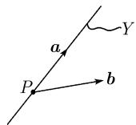
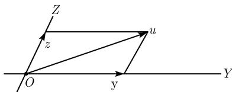

# 《数学指南——实用数学手册》2.3 线性代数

本页是《数学指南——实用数学手册》第 2 章「代数学」下 2.3 节「线性代数」的入库摘要。该节由 2.3.1—2.3.5 五个小节构成（含 2.3.3.1—2.3.3.4 与 2.3.4.1—2.3.4.4），系统整理了线性性的基本思想、线性空间、线性算子、线性空间的计算以及线性代数中的对偶性。

## 小节结构

- 2.3.1 基本思想：线性性、叠加原理、线性化原理，以及线性代数在泛函分析、量子系统、代数拓扑中的角色；线性代数的起源（[[默比乌斯]]、[[格拉斯曼]]）。
- 2.3.2 线性空间：[[线性空间]]的定义与六条公理、[[线性无关性]]、[[线性空间的维数]]、[[基-线性空间]]、[[基定理]]、[[施泰尼茨基交换定理]]、[[子空间]]、[[维数定理]]、[[余维数]]。
- 2.3.3 线性算子：[[线性算子]]的定义与[[线性空间同构]]、[[线性算子的运算]]、[[线性算子方程]]、[[核与象]]、[[满射判别法与单射判别法]]、[[秩与指标-线性算子]]、[[阿蒂亚-辛格指标定理]]、[[正合序列]]、[[相伴矩阵与基变换]]、[[线性算子的迹与行列式]]。
- 2.3.4 线性空间的计算：[[笛卡儿积-线性空间]]、[[商空间]]与[[线性流形]]、[[直和]]、[[线性包]]与[[外直和与分次]]、[[秩定理-线性算子]]、[[不变子空间与基本分解定理]]。
- 2.3.5 对偶性：[[线性泛函]]、[[对偶空间]]、[[对偶算子]]、乘积法则。

## 关键定义与公式

线性算子的定义条件：

```text
L(αf + βg) = αLf + βLg
```

线性组合与子空间判据：

```text
αu + βv,   u, v ∈ X, α, β ∈ K
αu + βv ∈ Y  (子空间 Y)
```

线性无关性：当且仅当

```text
α₁u₁ + … + αₙuₙ = 0  ⇒  α₁ = … = αₙ = 0
```

基的分解与坐标：

```text
u = α₁b₁ + … + αₙbₙ,   α₁, …, αₙ ∈ K
```

维数定理与余维数：

```text
dim(Y + Z) + dim(Y ∩ Z) = dim Y + dim Z
codim Y = dim X − dim Y   (dim X < ∞)
```

线性算子方程与核象：

```text
Au = v   (2.50)
Ker(A) := {u ∈ X | Au = 0},   Im(A) := {Au | u ∈ X}
```

秩与指标：

```text
rank(A) := dim Im(A)
ind(A) := dim Ker(A) − codim Im(A)
ind(A) = dim X − dim Y,   dim Ker(A) = dim X − rank(A)
```

与线性算子相伴的矩阵与基变换：

```text
Ab_k = Σ_{j=1}^m a_{jk} c_j,   k = 1, …, n
𝒜 = (a_{jk}),   𝒜𝒰 = 𝒱
𝒰 = 𝒯𝒰′,   𝒱 = 𝒮𝒱′,   𝒜′ = 𝒮⁻¹𝒜𝒯
相似变换（X = Y 且 b_j = c_j）：𝒜′ = 𝒯⁻¹𝒜𝒯
```

线性算子的迹与行列式：

```text
tr A := tr(a_{jk}),   det A := det(a_{jk})
det(AB) = (det A)(det B)
tr(AB) = tr(BA),   tr I_X = dim X
```

维数公式与结构定理：

```text
dim(X × Y) = dim X + dim Y
dim X/Y = dim X − dim Y
(Y + Z)/Z ≅ Y/(Y ∩ Z)
X/Y ≅ (X/Z)/(Z/Y)   (Y ⊆ Z ⊆ X)
X = Y ⊕ Z,   dim(Y ⊕ Z) = dim Y + dim Z
```

秩定理与基本分解定理：

```text
codim Ker(A) = dim Im(A) = rank(A)
X = X₁ ⊕ X₂ ⊕ … ⊕ X_k
```

对偶性：

```text
(A*v*)(u) := v*(Au),   A* : Y* → X*
(AB)* = B*A*
X* ≅ X,   X** ≅ X（典范）
```

## 配图

- 图 2.1（子空间与线性组合的几何示意）：media/10-数学指南实用数学手册--7-23-线性代数--py3buf/001-fef09ef6afe714d39fe72ddf84587ffb79eb69283342a20a9bd593b93802c825.jpg
- 图 2.2 商空间：media/10-数学指南实用数学手册--7-23-线性代数--py3buf/002-09325d57ed06ce565f8aa341966ca4823e5c4f3cd98738b4ad1dbb348d83a5ae.jpg
- 图 2.3 直和分解：media/10-数学指南实用数学手册--7-23-线性代数--py3buf/003-46fd41946f818771737a49e096b88c6ee3b9e481b4881c292f5df2c74014190e.jpg

## 与其他小节的关系

2.3 节持续引用本书其他小节：2.2.3.1（线性算子函数的定义）、2.4（多线性代数）、2.4.3.1（张量积）、2.5.3（域上的线性空间）、第 3 章（有限维几何）、4.3.5.1（等价关系）、以及参考文献 [212]（泛函分析、泛函空间、量子系统与代数拓扑的背景）。相关的矩阵、行列式、线性方程组内容分别见 [[矩阵]]、[[行列式]]、[[线性方程组]] 等页面。

## 相关页面

- [[线性代数]]
- [[线性性思想]]
- [[线性化原理]]
- [[线性空间]]
- [[线性算子]]
- [[对偶空间]]

<!-- llm-wiki:embedded-images -->
## Embedded Images

### Document




<!-- llm-wiki:embedded-images -->
