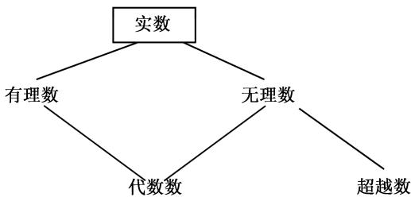

# 《数学指南——实用数学手册》2.7.6 超越数

本页是《数学指南——实用数学手册》第 2.7 节「数论」下第 2.7.6 小节**「超越数」**的源摘要。该小节承接 2.7.5「用有理数及连分数逼近无理数」，沿「实数分类 → 无理性判别 → 逼近阶 → 超越性定理谱系」的线索展开，是同一教材章节中从逼近论过渡到超越数论的枢纽。

## 小节定位

- 上游：[[sources/10-数学指南实用数学手册--5-27-数论--1iohudm]]（2.7 数论总论）、[[sources/10-数学指南实用数学手册--8-273-素数分布--l09ih2]]（2.7.3 素数分布）、[[sources/10-数学指南实用数学手册--8-274-加性分解--1blsy04]]（2.7.4 加性分解）、[[sources/10-数学指南实用数学手册--17-275-用有理数及连分数逼近无理数--h1pad3]]（2.7.5 连分数逼近）。
- 本节主题：代数数与超越数的定义与分类、无理性判别法则、逼近阶与刘维尔/罗特逼近定理、e 与 π 的超越性以及林德曼-魏尔斯特拉斯定理、盖尔范德-施奈德定理与希尔伯特第 7 问题。

## 一、实数的分类与代数数

实数若为形如

$$
c_{1} x + c_{0} = 0
$$

的方程之解（$c_{0}$ 与 $c_{1} \neq 0$ 为整数），则称为有理数。原文指出[[毕达哥拉斯]]（约公元前 500 年）已经知道 $\sqrt{2}$ 不是有理数。

实数或复数若为形如

$$
c_{n} x^{n} + c_{n-1} x^{n-1} + \dots + c_{1} x + c_{0} = 0, \quad n \geqslant 1 \tag{2.85}
$$

的方程之解（其中所有 $c_{j}$ 为整数且 $c_{n} \neq 0$），则称为**代数数**。代数数 $\alpha$ 所满足的多项式的最低次数称为该数的**次数**；2 次代数数也称为**二次数**。

原文说明，代数数的较深刻研究属于**代数数论**，其基本组成是理想论、伽罗瓦理论及 $p$ 进数理论（分别对应本维基的 [[concepts/理想数]]、[[concepts/伽罗瓦理论]] 相关页面与 [[concepts/代数数域]]）。

图 2.7 给出了实数按「有理数/无理数」与「代数数/超越数」两种方式的交叉分类：

## 二、无理性判别法则

实数 $\alpha$ 是无理数，当且仅当满足下列条件之一：

1. (i) $\alpha$ 的连分数是无限的。
2. (ii) $\alpha$ 的十进表示是非周期的。
3. (iii)（**高斯定理**）数 $\alpha$ 是没有整数解的整系数代数方程

$$
x^{n} + c_{n-1} x^{n-1} + \dots + c_{1} x + c_{0} = 0, \quad n \geqslant 2
$$

的解。

其他的判别法见 2.7.5.3 给出的[[狄利克雷]]丢番图逼近定理（见 [[concepts/狄利克雷算术级数定理]] 与 2.7.5 源页面）。

**例 1**：数 $\sqrt{2}$ 是代数方程

$$
x^{2} - 2 = 0
$$

的解，因而是（二次）代数数。因为该方程显然没有整数解，所以按高斯定理 $\sqrt{2}$ 是无理数。

## 三、超越数与欧拉-拉格朗日定理

不是代数数的实数或复数称为**超越数**。原文指出，超越数的存在性由[[刘维尔]]于 1844 年借助其逼近定理首先证明（见下文例 3）。

**欧拉-拉格朗日定理**：一个实数是二次代数数，当且仅当它有周期连分数。

**例 2**：$\sqrt{2},\sqrt{3}$ 及 $\sqrt{5}$ 的连分数是周期的（见表 2.7）。

## 四、康托尔的超越数存在性定理（1872）

[[康托尔]]创立的集合论的一个惊人成功是，与刘维尔不同，他能给出超越数存在性的完全初等的证明。他证明了：

1. (i) 代数数的集合是可数的。
2. (ii) 实数的集合是不可数的。

因此存在很多超越数。原文进一步指出：若取任意一个实数的紧区间，则超越数含在该区间中的概率是 1；在这种意义下，几乎所有实数是超越数。

## 五、逼近阶与刘维尔、罗特逼近定理

**逼近阶**的定义：一个无理数 $\alpha$ 以实数 $k > 0$ 为其逼近阶，如果不等式

$$
\left| \alpha - \frac{p}{q} \right| < \frac{1}{q^{k}}
$$

被无穷多个有理数 $p/q\ (q>0)$ 满足。特别地，由此可推知存在有理数的无穷序列 $(P_{n}/Q_{n})$ 使

$$
\left| \alpha - \frac{P_{n}}{Q_{n}} \right| < \frac{1}{Q_{n}^{\kappa}} \quad \text{及} \quad Q_{n} \geqslant n, \quad \text{对所有 } n = 1, 2, \dots
$$

**定理**：每个无理数的逼近阶至少为 2。

**刘维尔逼近定理（1844）**：$n \geqslant 1$ 次代数数的逼近阶至多为 $n$。

**例 3**：数

$$
\frac{1}{10^{1!}} + \frac{1}{10^{2!}} + \frac{1}{10^{3!}} + \dots
$$

有任意高的逼近阶，因此这个数必定是超越数。这样，刘维尔能够证明超越数的存在性。

**罗特逼近定理（1955）**（原文含未落地的脚注标记「^1)」）：无理数的最大逼近阶是 2。

原文的通俗解释是：代数数只能很差地被有理数逼近，而超越数可以用有理数有效地逼近。

## 六、e 与 π 的超越性

- **[[埃尔米特]]定理（1873）**：数 $\mathrm{e}$ 是超越数。
- **[[林德曼]]定理（1882）**：数 $\pi$ 是超越数。

原文指出，这两个著名定理都是下列结果的特殊情形（参看例 4）。

**林德曼-魏尔斯特拉斯定理（1882）**：若 $\alpha_{1},\cdots,\alpha_{n}$ 是两两互异的复代数数，则由

$$
\beta_{1} \mathrm{e}^{\alpha_{1}} + \dots + \beta_{n} \mathrm{e}^{\alpha_{n}} = 0
$$

可推出至少有一个复系数 $\beta_{j}$ 是超越数，或者是平凡情形，亦即 $\beta_{k}=0$ 对所有 $k$。

**推论**：如果复数 $z \neq 0$ 是代数数，那么复数

$$
\boxed{\mathrm{e}^{z} \text{ 是超越数}.}
$$

**证**：令 $\alpha_{1}:=0$ 及 $\alpha_{2}:=z$。依照林德曼-魏尔斯特拉斯定理，由此非平凡关系

$$
(\mathrm{e}^{z}) \mathrm{e}^{0} + (-1) \mathrm{e}^{z} = 0
$$

可推出系数 $\mathrm{e}^{z}$ 是超越数。

**例 4**：

- (i) 取代数数 $z = 1$，可得命题：$\mathrm{e}$ 是超越数。
- (ii) 对于 $z = 2\pi \mathrm{i}$，数 $\mathrm{e}^{z} = 1$ 不是超越数，因此 $2\pi \mathrm{i}$ 不可能是代数数，于是 $\pi$ 不可能是代数数，从而是超越数。

## 七、盖尔范德-施奈德定理（1934）

复数

$$
\boxed{\alpha,\ \beta,\ \alpha^{\beta}}
$$

中至少有一个超越数，如果我们排除平凡情形（亦即 $\alpha = 0$ 或 $\ln \alpha = 0$ 或 $\beta =$ 有理数）。

这个著名定理给出[[希尔伯特]]第 7 问题（于 1900 年提出，见 [[concepts/希尔伯特1900问题]]）的解。

**例 5**：数

$$
2^{\sqrt{5}}
$$

是超越数，因为序列 $2, \sqrt{5}, 2^{\sqrt{5}}$ 中只有最后一个数才可能是超越数。原文指出，这类命题早就被[[欧拉]]猜测是成立的。

**例 6**：$\mathrm{e}^{\pi}$ 是超越数。

**证**：有 $\mathrm{e}^{\pi} = \mathrm{i}^{-2\mathrm{i}}$；三个数 $\mathrm{i},\ -2\mathrm{i}$ 及 $\mathrm{i}^{-2\mathrm{i}}$ 中只有最后一个数才可能是超越数。

## 关键实体索引

- [[毕达哥拉斯]] —— 最早知道 $\sqrt{2}$ 非有理数。
- [[刘维尔]] —— 1844 年逼近定理，首证超越数存在性。
- [[康托尔]] —— 1872 年以集合论给出超越数存在性的初等证明。
- [[罗特]] —— 1955 年逼近定理，无理数最大逼近阶为 2。
- [[埃尔米特]] —— 1873 年证明 $\mathrm{e}$ 超越。
- [[魏尔斯特拉斯]] —— 与林德曼合名定理。
- [[盖尔范德]]、[[施奈德]] —— 1934 年定理，解决希尔伯特第 7 问题。
- [[林德曼]]、[[欧拉]]、[[拉格朗日]]、[[高斯]]、[[狄利克雷]]、[[希尔伯特]] —— 已在维基中，本节作为交叉引用出现。

## 关键概念索引

- [[代数数]]、[[超越数]] —— 本节的分类基石。
- [[无理性判别法则]]、[[高斯定理-无理性判别]] —— 无理性判别工具。
- [[欧拉-拉格朗日定理]] —— 周期连分数 ↔ 二次代数数。
- [[康托尔超越数存在性定理]] —— 可数性/不可数性论证。
- [[逼近阶]]、[[刘维尔逼近定理]]、[[罗特逼近定理]] —— 逼近论主线。
- [[埃尔米特定理]]、[[林德曼定理]]、[[林德曼-魏尔斯特拉斯定理]]、[[盖尔范德-施奈德定理]] —— 超越性定理谱系。

## 相关发现

- [[findings/例1平方根2是二次代数数及无理性判别]]
- [[findings/例2平方根235的周期连分数]]
- [[findings/逼近阶定义与无理数逼近阶下界]]
- [[findings/例3刘维尔超越数构造]]
- [[findings/康托尔代数数可数与实数不可数论证]]
- [[findings/林德曼-魏尔斯特拉斯定理与推论及例4]]
- [[findings/盖尔范德-施奈德定理与例5例6]]

## 存疑

- 罗特逼近定理处的脚注标记「^1)」在源文中未落地，见 [[queries/276节罗特逼近定理脚注标记未落地]]。
- 本节「高斯定理」（无理性判别）与既有 [[concepts/高斯定理-正多边形作图]] 同名不同义，需注意区分。

## Related
- [[超越数]]
- [[代数数]]
- [[逼近阶]]
- [[林德曼-魏尔斯特拉斯定理]]
- [[盖尔范德-施奈德定理]]

<!-- llm-wiki:embedded-images -->
## Embedded Images

### Document

<!-- llm-wiki:embedded-images -->
