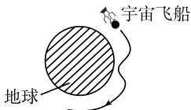

# 《数学指南——实用数学手册》5.3 控制问题

## 本节主旨

控制理论（Кибернетика/Control Theory 意义上的调节与控制）研究的是：通过适当选取**控制量**（或称控制），开发用于**最优化过程**的数学工具。5.3 节开篇即以一张对照表确立了本节的结构性论点：现代控制理论诞生于 1950—1960 年期间，它在**两个方向**上推广了经典的变分法。

```txt
哈密顿力学                                 控制理论
作用泛函 S 的哈密顿-雅可比微分方程   →   贝尔曼动态最优化
能量函数 H 的哈密顿典范方程         →   庞特里亚金极大值原理
```

这一对照表本身没有独立证明，但由紧随其后的 5.3.1（贝尔曼动态最优化）与 5.3.3（庞特里亚金极大值原理）两套主定理各自支撑。与已录入的 [[concepts/哈密顿方程]]、[[entities/哈密顿]] 构成直接的前向关联。

## 四个动机性例子

源文在进入理论前给出四个工程背景例，用以说明控制问题的典型形态。

- **例 1（月球返回舱再入）**：宇宙飞船从月球返回时，必须控制其进入大气层的轨道，以尽量减少热护罩上的热量。这无法试验，NASA 只能使用模型方程作数值模拟；计算对控制参数的微小变化极为敏感，返回舱的进入窗口很小，错过窗口则返回舱会熔化或被弹回宇宙。图 5.22 表示其轨道：与直觉相反，返回舱先下降到相当深的大气层，然后直到进入稳定的圆轨道才调整姿态作最后降落。该问题在参考文献 [213] 第 III 卷 48.10 节中应用庞特里亚金极大值原理进行了讨论（见本节脚注 1)）。
- **例 2（火箭发射）**：火箭的发射应使用最少量的燃料达到预定姿态，该问题在 [212] 中有研究。
- **例 3（月球登陆车）**：控制登陆尽可能平稳，并要使用最少量的燃料。
- **例 4（火星飞船）**：飞向火星的宇宙飞船的飞行要求使用最少量的燃料，计算机仿真计算轨道时要考虑其他行星的重力影响。

## 5.3.1 贝尔曼动态最优化

**基本问题**：极小化问题

$$
\boxed {F (\boldsymbol {z} (t _ {1}), t _ {1}) \stackrel {!} {=} \min.}\tag{5.62}
$$

约束条件（按原文保留）：

```txt
(i)   状态 z 的控制方程（函数 u 称为控制）：
      z'(t) = f(z(t), u(t), t).
(ii)  状态的初始条件：
      z(t0) = a.
(iii) 状态的末时刻条件：
      t1 ∈ T,  z(t1) ∈ Z.
(iv)  控制的约束：
      u(t) ∈ U,  在 [t0, t1] 上.
```

参数 $t$ 对应于时间。未知量是末时刻 $t_1$ 以及

$$
\boxed {\text {轨线} \boldsymbol {z} = \boldsymbol {z} (t) \text {和最优控制} \boldsymbol {u} = \boldsymbol {u} (t).}
$$

记号：$z = (z_1,\dots,z_N)$，$u = (u_1,\dots,u_M)$；初始时刻 $t_0$ 随初始状态给定，$\mathcal{T}$ 为时间区间，$\mathcal{Z}\subset\mathbb{R}^N$，$\mathcal{U}\subset\mathbb{R}^M$。

**容许对**：一对函数 $z = z(t),\ u(t),\ t_0\le t\le t_1$ 称为容许的，是指这些函数除有限个跳跃点外都连续，并且满足上述约束 (i) 到 (iv)。所有容许对组成的集合记作 $Z(t_0,a)$。

**贝尔曼作用函数 S**：

$$
\boxed {S (t _ {0}, \boldsymbol {a}) := \inf _ {(\boldsymbol {u}, \boldsymbol {z}) \in Z (t _ {0}, a)} F (\boldsymbol {z} (t _ {1}), t _ {1}),}
$$

即在所有容许对上取下确界；随后让初始条件 $(t_0,\boldsymbol{a})$ 变化，研究函数 $S$。

**主定理（必要条件）**：设 $(z^*,u^*)$ 是控制问题 (5.62) 的解，那么以下三个条件满足：

- (i) 函数 $S = S(\boldsymbol{z}(t),t)$ 对于所有容许对 $(\boldsymbol{z},\boldsymbol{u})$ 在时间区间 $[t_0,t_1]$ 上是严格下降的；
- (ii) 函数 $S = S(z^*(t),t)$ 在 $[t_0,t_1^*]$ 上取常值；
- (iii) 有 $S(\boldsymbol{b},t_1) = F(\boldsymbol{b},t_1)\ \forall \boldsymbol{b}\in\mathcal{Z},\ t_1\in\mathcal{T}$。

**推论（充分条件）**：如果函数 $S$ 与容许对 $(z^*,u^*)$ 一起满足上述 (i) 到 (iii)，那么 $(z^*,u^*)$ 是控制问题 (5.62) 的解。

**哈密顿-雅可比-贝尔曼方程**：假定作用函数 $S$ 充分光滑，对每一个容许对 $(z,u)$ 有不等式

$$
\boxed {S _ {t} (\boldsymbol {z} (t), t) + S _ {\boldsymbol {z}} (\boldsymbol {z} (t), t) f (\boldsymbol {z} (t), \boldsymbol {u} (t), t) \geqslant 0, \quad \forall t \in [ t _ {0}, t _ {1} ].}\tag{5.63}
$$

对于控制问题 (5.62) 的解，(5.63) 中的不等式是一个等式。

## 5.3.2 应用：带二次成本函数的线性控制问题

$$
\boxed { \begin{array}{c} \int_ {t _ {0}} ^ {t _ {1}} (x (t) ^ {2} + u (t) ^ {2}) \mathrm{d} t \stackrel {!} {=} \min, \\ \hline x ^ {\prime} (t) = A x (t) + B u (t), \quad x (t _ {0}) = a, \end{array} }\tag{5.64}
$$

(5.65)

式中 $A$ 和 $B$ 是实数。（源文中 (5.64) 与 (5.65) 的编号排版并列于同一组方框标记之下，见疑点记录。）

**定理**：设 $w$ 是里卡蒂微分方程

$$
w ^ {\prime} (t) = - 2 A w (t) + B ^ {2} w (t) ^ {2} - 1, \quad \forall t \in [ t _ {0}, t _ {1} ]
$$

满足 $w(t_1)=0$ 的解。那么为了得到控制问题的解 $x = x(t)$，只需求解微分方程

$$
x ^ {\prime} (t) = A x (t) + B (- w (t) B x (t)), \quad x (t _ {0}) = a.\tag{5.66}
$$

最优控制由下式给出：

$$
u (t) = - w (t) B x (t).\tag{5.67}
$$

**反馈控制**：方程 (5.67) 刻画了状态 $x(t)$ 和最优控制 $u(t)$（反馈控制）之间的耦合。这样的最优控制在工程中可用这种方式非常有效地设计出来，并且在生物系统中也常会遇到。方程 (5.66) 是通过将 (5.67) 耦合到控制方程 (5.65) 得到的。

**证明（三步，按原文保留）**：

第一步（问题的转化）：引入新函数 $y(\cdot)$：

$$
y ^ {\prime} (t) = x (t) ^ {2} + u (t) ^ {2}, \quad y (t _ {0}) = 0.
$$

将 $y$ 作为变量得到等价的问题

$$
\begin{array}{l} y (t _ {1}) \stackrel {!} {=} \min, \\ y ^ {\prime} (t) = x (t) ^ {2} + u (t) ^ {2}, \quad y (t _ {0}) = 0, \\ x ^ {\prime} (t) = A x (t) + B u (t), \quad x (t _ {0}) = a. \end{array}
$$

此外令 $z := (x,y)$。

第二步：对于贝尔曼作用函数 $S$，使用

$$
S (x, y, t) := w (t) x ^ {2} + y.
$$

第三步：验证 5.3.1 中推论的假设。

- (i) 如果 $w = w(t)$ 是里卡蒂方程的解，并且 $x = x(t),\ u = u(t)$ 满足控制方程 (5.65)，那么

$$
\begin{array}{r l} \frac {\mathrm{d} S (x (t) , y (t) , t)}{\mathrm{d} t} & = w ^ {\prime} (t) x (t) ^ {2} + 2 w (t) x (t) x ^ {\prime} (t) + y ^ {\prime} (t) \\ & = (u (t) + w (t) B x (t)) ^ {2} \geqslant 0. \end{array}
$$

于是函数 $S = S(x(t),y(t),t)$ 相对于时间 $t$ 是下降的。

- (ii) 如果耦合条件 (5.67) 满足，那么在 (i) 中有等式，即 $S(x(t),y(t),t) = $ 常数。
- (iii) 从 $w(t_1)=0$ 得到 $S(x(t_1),y(t_1),t_1) = y(t_1)$。

## 5.3.3 庞特里亚金极大值原理

**控制问题**：极小化问题

$$
\boxed {\int_ {t _ {0}} ^ {t _ {1}} L (\boldsymbol {q} (t), \boldsymbol {u} (t), t) \mathrm{d} t \stackrel {!} {=} \min.}\tag{5.68}
$$

约束条件（按原文保留）：

```txt
(i)   轨线 q 的控制方程：
      q'(t) = f(q(t), u(t), t).
(ii)  轨线 q 的初始条件：
      q(t0) = a.
(iii) 轨线在末时刻 t1 的条件：
      h(q(t1), t1) = 0.
(iv)  对于控制的约束：
      u(t) ∈ U,  ∀t ∈ [t0, t1].
```

注：必须考虑所有可能的有穷区间 $[t_0,t_1]$。假定控制 $u(t)$ 除有穷个间断点外连续；假定轨线连续，并且除有穷个点外相对于 $t$ 一阶可导。记
$q=(q_1,\dots,q_N)$，$u=(u_1,\dots,u_M)$，$f=(f_1,\dots,f_N)$，$h=(h_1,\dots,h_N)$。给定量是初始时刻 $t_0$、初始位置 $\boldsymbol{a}\in\mathbb{R}^N$ 和控制集 $\mathcal{U}\subset\mathbb{R}^M$；假定 $L,\boldsymbol{f},\boldsymbol{h}$ 属于 $C^1$。

**广义哈密顿函数**：

$$
\mathscr {H} (\boldsymbol {q}, \boldsymbol {u}, \boldsymbol {p}, t, \lambda) := \sum_ {j = 1} ^ {N} p _ {j} f _ {j} (\boldsymbol {q}, \boldsymbol {u}, t) - \lambda L (\boldsymbol {q}, \boldsymbol {u}, t).
$$

**主定理**：如果 $\boldsymbol{q},\boldsymbol{u},t_1$ 构成控制问题 (5.68) 的一个解，那么存在数 $\lambda = 1$ 或 $\lambda = 0$，向量 $\alpha\in\mathbb{R}^N$ 和 $[t_0,t_1]$ 上的连续函数 $p_j = p_j(t)$，使得如下条件满足：

(a) 庞特里亚金极大值原理：

$$
\boxed {\mathcal {H} (\boldsymbol {q} (t), \boldsymbol {u} (t), \boldsymbol {p} (t), t, \lambda) = \max _ {\boldsymbol {w} \in \mathcal {U}} \mathcal {H} (\boldsymbol {q} (t), \boldsymbol {w}, \boldsymbol {p} (t), t, \lambda).}
$$

(b) 广义典范方程（脚注 1)）：

$$
p _ {j} ^ {\prime} = \mathcal {H} _ {q _ {j}}, \quad q _ {j} ^ {\prime} = \mathcal {H} _ {p _ {j}}, \quad j = 1, \dots , N.
$$

脚注 1) 给出的含义为

$$
p _ {j} ^ {\prime} (t) = - \frac {\partial \mathcal {H}}{\partial q _ {j}} (Q), \quad q _ {j} ^ {\prime} (t) = \frac {\partial \mathcal {H}}{\partial p _ {j}} (Q),
$$

其中 $Q := (\boldsymbol{q}(t), \boldsymbol{u}(t), \boldsymbol{p}(t), \lambda)$。

(c) 末时刻 $t_1$ 的条件（脚注 1)）：

$$
\boldsymbol {p} (t _ {1}) = - h _ {q} (\boldsymbol {q} (t _ {1}), t _ {1}) \boldsymbol {\alpha}.
$$

式中或者 $\lambda = 1$，或者 $\lambda = 0$，并且 $\alpha\neq 0$。如果 $h\equiv 0$，那么 $\lambda = 1$。

**推论**：如果在右端的连续点上令

$$
\boldsymbol {p} _ {0} (t) := \mathscr {H} (\boldsymbol {q} (t), \boldsymbol {u} (t), \boldsymbol {p} (t), t, \lambda),
$$

那么 $p_0$ 可以扩展成整个 $[t_0,t_1]$ 上的连续函数。此外（脚注 2)）

$$
\boldsymbol {p} _ {0} ^ {\prime} = \mathcal {H} _ {t},\tag{5.69}
$$

和

$$
\boldsymbol {p} _ {0} (t _ {1}) = h _ {t} (q (t _ {1}), t _ {1}) \boldsymbol {\alpha}.
$$

方程 (a)、(b) 和 (5.69) 在最优控制 $u = u(t)$ 连续的所有时刻 $t\in[t_0,t_1]$ 处都连续。

## 5.3.4 应用：理想化机动车的最优控制

质量为 $m$ 的车辆 $W$ 在初始时刻 $t_0 = 0$ 在点 $x=-b$ 处静止。车辆在沿 $x$ 轴的发动机力 $u = u(t)$ 作用下开始运动。要寻找运动 $x = x(t)$，使车辆 $W$ 在尽可能短的时间 $t_1$ 内达到点 $x=b$ 并处于静止状态（图 5.23）。发动机功率满足约束 $|u|\le 1$。

问题的数学提法（按原文保留）：

$$
\boxed { \begin{array}{l} \int_ {t _ {0}} ^ {t _ {1}} \mathrm{d} t \stackrel {!} {=} \min, \quad x ^ {\prime \prime} (t) = u (t), \quad | u | \leqslant 1, \\ x (0) = - b, \quad x ^ {\prime} (0) = 0, \quad x (t _ {1}) = - b, \quad x ^ {\prime} (t _ {1}) = 0. \end{array} }
$$

**砰砰控制**：最优控制使车辆在运动中最大加速紧跟着最大减速——前半路程让发动机开足马力 $u=1$ 直到 $x=0$，然后用 $u=-1$ 减速。

**用庞特里亚金极大值原理的证明**：令 $q_1 := x,\ q_2 := x'$，于是有

$$
\begin{array}{l} \int_ {t _ {0}} ^ {t _ {1}} \mathrm{d} t \stackrel {!} {=} \min, \quad | u (t) | \leqslant 1, \\ q _ {1} ^ {\prime} = q _ {2}, \quad q _ {2} ^ {\prime} = u, \\ q _ {1} (0) = - b, \quad q _ {2} (0) = 0, \quad q _ {1} (t _ {1}) - b = 0, \quad q _ {2} (t _ {1}) = 0. \end{array}
$$

根据 5.3.3，广义哈密顿函数是

$$
\mathcal {H} := p _ {1} q _ {2} + p _ {2} u - \lambda .
$$

设 $q=q(t)$ 和 $u=u(t)$ 是其一个解，令 $p_0(t) := p_1(t)q_2(t) + p_2(t)u(t) - \lambda$，则从 5.3.3 可得

```txt
(i)   p0(t) = max_{|w| ≤ 1} (p1(t) q2(t) + p2(t) w − λ).
(ii)  p1'(t) = −H_{q1} = 0,  p1(t1) = −α1.
(iii) p2'(t) = −H_{q2} = −p1(t),  p2(t1) = −α2.
(iv)  p0'(t) = H_t = 0,  p0(t1) = 0.
```

从 (ii) 到 (iv) 得到 $p_0(t)=0,\ p_1(t)=-\alpha_1,\ p_2(t)=\alpha_1(t-t_1)-\alpha_2$。

- **第一种情形**：设 $\alpha_1=\alpha_2=0$，那么 $\lambda=1$。这与 (i) 矛盾，因为 $p_0(t)=p_1(t)=p_2(t)=0$，从而这种情形被排除。
- **第二种情形**：$\alpha_1^2+\alpha_2^2\ne 0$。于是 $p_2\ne 0$，并且从 (i) 可知 $p_2(t)u(t) = \max_{|w|\le 1} p_2(t)w$。由此可见

$$
u (t) = 1, \text {若} p _ {2} (t) > 0; \qquad u (t) = - 1, \text {若} p _ {2} (t) <   0.
$$

由于 $p_2$ 是线性函数，它至多只能改变一次正负号。设符号改变发生在时刻 $t_*$；由于在 $t_1$ 必须减速，故

$$
u (t) = 1, \text {若} 0 \leqslant t <   t _ {*}; \quad u (t) = - 1, \text {若} t _ {*} <   t \leqslant t _ {1}.
$$

从运动方程 $x''(t)=u(t)$ 得到

$$
x (t) = \left\{ \begin{array}{l l} \frac {1}{2} t ^ {2} - b, & 0 \leqslant t <   t _ {*}, \\ - \frac {1}{2} (t - t _ {1}) ^ {2} + b, & t _ {*} <   t \leqslant t _ {1}. \end{array} \right.
$$

在加速变成减速的时刻 $t_*$，位置和速度必须重合，因此 $x'(t_*)=t_*=t_1-t_*$，即 $t_* = t_1/2$。最后从 $x(t_*) = \frac{t_1^2}{8} - b = -\frac{t_1^2}{8} + b$ 看出 $x(t_*)=0$：小车在加速变成减速的时刻 $t_*$ 必须位于 $x=0$。

## 图像

- 图 5.22（月球返回舱再入轨道）与对应的图像文件：`media/10-数学指南实用数学手册--7-53-控制问题--1pfm980/001-e0b8f347ecd92ea859644b095d9664b823599de4aec57a690ae7b02d80c24737.jpg`
- 图 5.23（水平数轴，刻度 $-b$、$0$、$b$，$W$ 位于 $-b$ 并向右运动）：`media/10-数学指南实用数学手册--7-53-控制问题--1pfm980/002-07a0bc0745974bf8bc2f6844c7ef6753c0095e7a1979df5f8660510d1ba2778b.jpg`

## 关联页面

- 理论基础与前序内容：[[concepts/变分法]]、[[concepts/拉格朗日函数]]、[[concepts/哈密顿方程]]、[[entities/哈密顿]]
- 本节衍生概念：[[concepts/控制理论]]、[[concepts/贝尔曼作用函数]]、[[concepts/哈密顿-雅可比-贝尔曼方程]]、[[concepts/里卡蒂微分方程]]、[[concepts/反馈控制]]、[[concepts/庞特里亚金极大值原理]]、[[concepts/广义哈密顿函数]]、[[concepts/砰砰控制]]
- 相关人物：[[entities/贝尔曼]]、[[entities/庞特里亚金]]、[[entities/里卡蒂]]

<!-- llm-wiki:embedded-images -->
## Embedded Images

### Document



<!-- llm-wiki:embedded-images -->
