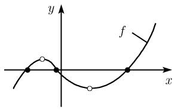

# 《数学指南——实用数学手册》0.2.14 多项式

## 概述

本节是《数学指南——实用数学手册》0.2 节「初等函数及其图示」中关于多项式的定义与性质条目，编号 0.2.14。它是纯定义—性质型内容：给出 n 次实多项式的定义式 (0.43)，随后依次列出光滑性、在无穷远点的性状、零点、全局极值、局部极值、拐点六组结论，并以图 0.36 的 (a)(b)(c) 三幅示意图配合说明。

全节**没有出现任何人名、机构、产品、数据集或工具**，因此本来源的实体层为空，价值集中在概念与 finding 层。所有结论的主语都是「(0.43) 定义的 n 次实多项式 $f(x)$ 及其图像」，不存在归属于其他数学对象的断言。

## 定义（0.43）

n 次（实）多项式是如下形式的函数：

```latex
\boxed{y = a_{n}x^{n} + a_{n-1}x^{n-1} + \dots + a_{1}x + a_{0},} \tag{0.43}
```

其中，$n$ 为任意非负整数 $0,1,2,\cdots$，所有系数 $a_k$ 均为实数，且 $a_n \neq 0$。

## 光滑性

对任意一点 $x \in \mathbb{R}$，(0.43) 中的函数 $y = f(x)$ 连续且无限可微，其一阶导数是：

```latex
f'(x) = n a_n x^{n-1} + (n-1) a_{n-1} x^{n-2} + \dots + a_1.
```

## 在无穷远点的性状

当 $x \to \pm\infty$ 时，(0.43) 中的函数 $y = f(x)$ 的性状与函数 $y = ax^n$ 的相同。也就是说，当 $n \geqslant 1$ 时有（原文此处带脚注标记「1)」，脚注正文未收录于本节）：

```latex
\lim_{x \to +\infty} f(x) = \begin{cases} +\infty, & a_n > 0, \\ -\infty, & a_n < 0, \end{cases}
```

```latex
\lim_{x \to -\infty} f(x) = \begin{cases}
+\infty, & a_n > 0 \text{ 且 } n \text{ 为偶数，或 } a_n < 0 \text{ 且 } n \text{ 为奇数}, \\
-\infty, & a_n > 0 \text{ 且 } n \text{ 为奇数，或 } a_n < 0 \text{ 且 } n \text{ 为偶数}.
\end{cases}
```

## 零点

若 $n$ 为奇数，则 $y = f(x)$ 的图像与 $x$ 轴至少有一个交点（图 0.36(a)）。交点对应方程 $f(x) = 0$ 的解。

## 全局极值

若 $n$ 为偶数且 $a_n > 0$，则 $y = f(x)$ 存在全局极小值，即存在一点 $a$，满足对所有 $x \in \mathbb{R}$ 有 $f(a) \leqslant f(x)$（图 0.36(b)）。

若 $n$ 为偶数且 $a_n < 0$，则 $y = f(x)$ 存在一个全局极大值。

## 局部极值

令 $n \geqslant 2$，则函数 $y = f(x)$ 至多有 $n - 1$ 个局部极值，其中局部极小值和局部极大值交替出现。

## 拐点

令 $n \geqslant 3$，则 $y = f(x)$ 的图像至多有 $n - 2$ 个拐点（图 0.36(c)）。

## 图 0.36

原文以三幅图像说明多项式的局部性质；图像内容在本来源中未能加载，仅保留文件路径：




图注：图 0.36 多项式的局部性质，(a) 零点与局部极值，(b) 全局极小值，(c) 拐点。

## 证据强度与边界情形

- 全部结论均为手册式陈述，**无证明、无例题、无参考文献**。其可靠性属标准教科书级别：零点存在性依赖介值定理，局部极值个数依赖导数次数递减与 Rolle 定理，全局极值存在性依赖偶次首项在无穷远处的主导行为。
- 手册未说明的边角情形包括：$n = 0$ 时 (0.43) 退化为非零常数函数 $f(x) = a_0$，本节各条结论（局部极值、拐点、零点）在该情形下的适用性未作交代；无穷远性状处的脚注「1)」正文未收录；局部极值个数只给上界 $n-1$，未给出下界或奇偶性约束。
- 上述未说明之处已分别记录为待查条目，见 [[queries/多项式定义是否包含零次情形]]、[[queries/多项式局部极值个数的下界与奇偶性]]、[[queries/多项式无穷远性状处的脚注内容缺失]]。

## 与现有 wiki 的联系

- 无穷远点的性状判据（首项系数符号 × 次数奇偶）与 [[concepts/幂函数]] 及 [[findings/幂函数图像形状由指数奇偶性与系数符号决定]] 使用同一套判据；本节把它从单项式推广到多项式的极限层面。注意这是**对多项式的断言**，不可反向读作对幂函数性质的断言。
- 该判据为 [[queries/幂函数图像类似的含义能否形式化]] 提供了一个部分答案：手册把图像「类似」落实为 $x \to \pm\infty$ 时极限方向一致。
- 本节是 [[concepts/线性函数]]（$n \le 1$）与 [[concepts/二次函数]]（$n = 2$）的高次推广；后者已由 [[concepts/二次配方与顶点形式]] 与 [[concepts/二次判别式]] 覆盖 $n=2$ 的全局极值与零点细节。
- 局部极值与拐点结论依赖导数，可与 [[concepts/函数的单调性]] 对照阅读；同书 0.2.1 建立的 [[concepts/函数的变换]] 框架并未被本节使用。

## 相关条目

- [[多项式]]
- [[多项式的光滑性]]
- [[多项式在无穷远点的性状]]
- [[多项式的全局极值]]
- [[多项式的局部极值]]
- [[多项式的拐点]]

<!-- llm-wiki:embedded-images -->
## Embedded Images

### Document


<!-- llm-wiki:embedded-images -->
