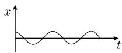
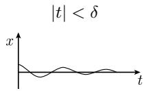
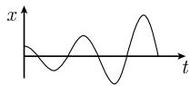
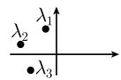
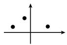

# 《数学指南——实用数学手册》1.12.7 稳定性

本页是对《数学指南——实用数学手册》1.12「常微分方程」大节第 1.12.7 小节「稳定性」的入库摘要，是该大节在 1.12.5（[[sources/10-数学指南实用数学手册--7-1125-应用--1c7d3n4]]）、1.12.6（[[sources/10-数学指南实用数学手册--16-1126-线性微分方程组和传播子--y0ckwc]]）之后的续篇。本节给出平衡点稳定性的严格定义、李雅普诺夫 1892 年的稳定性定理、劳斯－赫尔维茨判别准则，以及两个把高阶方程化归到该框架的例子。

## 问题设定：方程 (1.304) 与平衡点

考虑带扰动的线性微分方程

$$
\boxed{\begin{array}{c} \boldsymbol{x}' = \boldsymbol{A}\boldsymbol{x} + \boldsymbol{b}(\boldsymbol{x}, t), \\ \boldsymbol{x}(0) = \boldsymbol{a} \quad (\text{初始值}), \end{array}}\tag{1.304}
$$

其中 $\boldsymbol{x} = (x_1, \cdots, x_n)^{\mathrm{T}}$，$\boldsymbol{A}$ 是不依赖于时间的实 $n \times n$ 矩阵，$\boldsymbol{b} = (b_1, \cdots, b_n)^{\mathrm{T}}$ 的分量对原点的一个邻域中的所有 $\boldsymbol{x}$ 并对所有时刻 $t \geqslant 0$ 都是实 $C^1$ 函数。此外要求

$$
\boxed{\boldsymbol{b}(\mathbf{0}, t) \equiv \mathbf{0}.}
$$

由此 $\boldsymbol{x}(t) \equiv \mathbf{0}$ 是 (1.304) 的一个解，相应于系统的一个平衡点，书中简称「在 $x = 0$ 处有一个平衡点」。详见 [[findings/稳定性方程1304与平衡点条件]] 与 [[concepts/平衡点]]。

## 三个定义

- **定义 (i) 稳定性**（图 1.142(a)）：平衡点 $x = 0$ 是稳定的，当且仅当对每个 $\varepsilon > 0$，存在一个数 $\delta > 0$，使得满足初值条件 $|x(0)| < \delta$ 的解 $\boldsymbol{x} = \boldsymbol{x}(t)$ 对所有时刻 $t \geqslant 0$ 满足 $|\boldsymbol{x}(t)| < \varepsilon$。含义是：$x = 0$ 处平衡架构的充分小扰动，对所有 $t \geqslant 0$ 仍然是小扰动。
- **定义 (ii) 渐近稳定性**（图 1.142(b)）：平衡点 $x = 0$ 是渐近稳定的，当且仅当它稳定，此外存在数 $\delta_* > 0$，使得对满足 $|x(0)| < \delta_*$ 的每个解有 $\lim_{t \to \infty} \boldsymbol{x}(t) = \mathbf{0}$。含义是：$t = 0$ 时刻平衡架构的小扰动在充分长时间后回到其开始时的架构。
- **定义 (iii) 不稳定性**（图 1.142(c)）：平衡点 $x = 0$ 是不稳定的，当且仅当它不是稳定的。

这三个定义整合见 [[findings/稳定性三个定义]]、[[concepts/不稳定性]]；它们是对 1.12.1 节 [[concepts/稳定性]]（「稳定性与渐近稳定性」）的严格化。

## 李雅普诺夫稳定性定理（1892）

李雅普诺夫（A. M. Lyapunov, 1857—1918）关于稳定性的定理（1892）假设具有常系数的线性方程组 $x' = Ax$ 的扰动 $\boldsymbol{b}$ 充分地小，即满足**细小性准则**

$$
\lim_{|x| \to 0}\left(\sup_{t \geqslant 0} \frac{|b(x, t)|}{|x|}\right) = 0.\tag{1.305}
$$

在此假设下有：

1. 平衡点 $x = 0$ 是渐近稳定的，如果矩阵 $A$ 的所有本征值 $\lambda_1, \cdots, \lambda_m$ 位于左半平面中，即对所有 $j$，$\lambda_j$ 有负实部（图 1.143(a)）。
2. 平衡点 $x = 0$ 是不稳定的，如果 $A$ 的一个本征值位于右半平面中，即对某个 $j$ 有 $\operatorname{Re}\lambda_j > 0$（图 1.143(b)）。

如果算子 $A$ 的一个本征值在虚轴上（图 1.143(c)），书中只给出一句话：此时「中心流形方法必定适用」，未作展开。相关页面：[[concepts/李雅普诺夫稳定性定理]]、[[concepts/细小性准则]]、[[concepts/中心流形方法]]、[[findings/李雅普诺夫稳定性定理本征值判据]]、[[findings/本征值虚轴与中心流形方法]]。本征值本身的背景见 [[concepts/本征值问题]]。

## 劳斯－赫尔维茨准则

为了对控制论中的复杂问题有效地应用李雅普诺夫的稳定性判据，需要在不显式计算本征值的情形下，对方程 $\operatorname{det}(\boldsymbol{A} - \lambda \boldsymbol{I}) = 0$ 的零点是否全在左半平面中有一个判别准则。这个由麦克斯韦于 1868 年提出的问题，在 1875 年被英国物理学家劳斯（书中拼作 Louth）所解决，也独立地被德国数学家赫尔维茨于 1895 年所解决。

**劳斯－赫尔维茨准则**：首项系数 $a_n > 0$ 的实系数多项式

$$
\boxed{a_n \lambda^n + a_{n-1}\lambda^{n-1} + \dots + a_1 \lambda + a_0 = 0}
$$

的所有零点位于左半平面中，当且仅当所有行列式（当 $m > n$ 时令 $a_m = 0$）

$$
a_1, \quad
\left| \begin{array}{cc} a_1 & a_0 \\ a_3 & a_2 \end{array} \right|, \quad
\left| \begin{array}{ccc} a_1 & a_0 & 0 \\ a_3 & a_2 & a_1 \\ a_5 & a_4 & a_3 \end{array} \right|, \quad \dots, \quad
\left| \begin{array}{cccccc} a_1 & a_0 & 0 & 0 & \ldots & 0 \\ a_3 & a_2 & a_1 & 0 & \ldots & 0 \\ \vdots & \vdots & \vdots & \vdots & & \vdots \\ a_{2n-1} & a_{2n-2} & a_{2n-3} & a_{2n-4} & \dots & a_n \end{array} \right|
$$

都是正的。

相关页面：[[concepts/劳斯-赫尔维茨准则]]、[[concepts/赫尔维茨行列式]]、[[findings/劳斯赫尔维茨准则行列式判据]]、[[entities/劳斯]]、[[entities/赫尔维茨]]、[[entities/麦克斯韦]]。

## 应用

对微分方程

$$
a_n x^{(n)} + a_{n-1}x^{(n-1)} + \dots + a_1 x' + a_0 x = b(x, t)
$$

当 $b(0, t) \equiv 0$ 时，其平衡点 $x = 0$ 是渐近稳定的，如果细小性准则 (1.305) 和劳斯－赫尔维茨准则都被满足。见 [[findings/高阶方程平衡点稳定性应用]]。

### 例 1

微分方程

$$
x'' + 2x' + x = x^n, \quad n = 1, 2, \dots
$$

的平衡点是渐近稳定的。

证明：有

$$
a_1 = 2 > 0, \quad
\left| \begin{array}{cc} a_1 & a_0 \\ a_3 & a_2 \end{array} \right|
= \left| \begin{array}{cc} 2 & 1 \\ 0 & 1 \end{array} \right| = 2 > 0.
$$

见 [[findings/例1方程渐近稳定性]]。

### 推广

为了考察微分方程 $y' = f(y, t)$ 任一解 $y_*$ 的稳定性，令 $y = y_* + x$。这导致一个具有平衡点 $x = 0$ 的微分方程 $x' = g(x, t)$。由定义，这个点的稳定性等价于 $y_*$ 的稳定性。见 [[findings/任一解稳定性的平移化归]]。

### 例 2

微分方程

$$
y'' + 2y' + y - 1 - (y - 1)^n = 0, \quad n = 2, 3, \dots
$$

的解 $y(t) \equiv 1$ 是渐近稳定的。

证明：如果令 $y = x + 1$，那么 $x$ 就满足例 1 中的微分方程，因而 $x = 0$ 是渐近稳定的。见 [[findings/例2平移化为例1]]。

## 插图

本节共含 6 幅插图，均随 1.12.7 节正文出现：

- `media/10-数学指南实用数学手册--8-1127-稳定性--znnkza/001-9a7fdbdc3d8ec32fb3f8b131104d8d3d8b37645d8a6cf269b3b0b7a15bbe3a4d.jpg` — 图 1.142(a)「稳定的」。
- `media/10-数学指南实用数学手册--8-1127-稳定性--znnkza/002-dffe1d4470623fc6096193de8139556bc137635df2061576305cb17064f47034.jpg` — 图 1.142(b)「渐近稳定的」；图中顶部标注被读作「$|t| < \delta$」，下方为 $x$–$t$ 坐标系中振幅逐渐衰减的振荡曲线。
- `media/10-数学指南实用数学手册--8-1127-稳定性--znnkza/003-7179060486f85c898d225cfda125552419caa200c676c6b8dd06940f302e3f3d.jpg` — 图 1.142(c)「不稳定的」。
- `media/10-数学指南实用数学手册--8-1127-稳定性--znnkza/004-9f0d15d734f1ebc8ded4862e60f05465419493d9cf9e0e79a34c4e7a604975a6.jpg` — 图 1.143(a)「渐近稳定的」；复平面上标出 $\lambda_1, \lambda_2, \lambda_3$ 的位置。
- `media/10-数学指南实用数学手册--8-1127-稳定性--znnkza/005-54371c81bf4afc2254a4854534b696365e6030a743c255dba2797a1aad92f44a.jpg` — 图 1.143(b)「不稳定的」。
- `media/10-数学指南实用数学手册--8-1127-稳定性--znnkza/006-07656be85a69e4a39a1f0bd1470a62797c777c904d1045c342dbb5e9e00c3154.jpg` — 图 1.143(c)「临界的」；坐标轴上三个实心点。

其中 001、003、005 三幅图的视觉细节无法读取，004 与 006 的描述来自图像读取结果，002 的标注存在疑点，详见下节。

## 已知转录与 OCR 问题

- 定义 (i) 的正文在「使得从」之后直接接图片，再接下句「即得 (1.304) 存在一个唯一的解」；中间的初值条件 $|\boldsymbol{x}(0)| < \delta$ 疑因插图而缺失。见 [[queries/1127节定义i转录残缺初值条件缺失]]。
- 图 1.142(b) 顶部标注被读作「$|t| < \delta$」，按上下文应为 $|x(0)| < \delta$。见 [[queries/1127节图1142b顶部标注t是否应为x0]]。
- 文中将劳斯的姓名拼作「Louth」，而通行拼写为 Routh。见 [[queries/1127节劳斯姓名拼写Louth是否为Routh]]。
- 定义 (i) 之后有一个脚注标记 $^{1)}$（对应「本征值」），脚注正文未出现在源文档中。见 [[queries/1127节脚注本征值内容未录]]。
- 「中心流形方法必定适用」一句未给出定义、出处或展开。见 [[queries/1127节中心流形方法未展开]]。
- 麦克斯韦 1868、劳斯 1875、赫尔维茨 1895 三处原始文献均未在本节列出。见 [[queries/1127节三处原始文献未列]]。
- 图 1.142(a)(c) 与图 1.143(b) 无法辨识。见 [[queries/1127节图1142与1143多数无法辨识]]。

## 关联页面

- 上一节：[[sources/10-数学指南实用数学手册--16-1126-线性微分方程组和传播子--y0ckwc]]
- 同节早期：[[sources/10-数学指南实用数学手册--11-1121-引导性的例子--2uo3hb]]、[[sources/10-数学指南实用数学手册--7-1125-应用--1c7d3n4]]
- 大节入口：[[sources/10-数学指南实用数学手册--9-112-常微分方程--6ft4l9]]
- 概念：[[concepts/常微分方程]]、[[concepts/稳定性]]、[[concepts/平衡态]]、[[concepts/本征值问题]]、[[concepts/麦克斯韦方程]]、[[concepts/适定性]]

<!-- llm-wiki:embedded-images -->
## Embedded Images

### Document

<!-- llm-wiki:embedded-images -->
