# 《数学指南——实用数学手册》1.3 函数的极限

本节是手册第 1 章「分析」中承接 1.2（实数）与 1.4（微分与积分）的一节，先用**序列式定义**建立单实变量函数的极限与连续性，再以**度量空间**为框架把极限与连续推广到多变量函数。全节分为三个子节。

## 章节结构

- **1.3.1 一个实变量的函数**：极限（1.3.1.1）、连续函数（1.3.1.2）、洛必达法则（1.3.1.3）、函数的数量级（1.3.1.4）。
- **1.3.2 度量空间和点集**：距离的概念和收敛（1.3.2.1）、特殊的集合（1.3.2.2）、紧性（1.3.2.3）、连通性（1.3.2.4）、例子（1.3.2.5）。
- **1.3.3 多变量函数**：极限（1.3.3.1）、连续性（1.3.3.2）。

## 关键定义（原文要点）

函数极限的序列式定义（1.3.1.1）：

```
lim_{x→a} f(x) = b
⟺ 对 f 定义域里每个序列 (x_n)（其中每个 x_n ≠ a），有
   lim_{n→∞} x_n = a  蕴涵  lim_{n→∞} f(x_n) = b
```

单侧极限：只考虑满足 x_n > a 的序列便得到右极限 lim_{x→a+0} f(x)，只考虑 x_n < a 则得到左极限 lim_{x→a−0} f(x)（a ∈ ℝ）。

函数极限的运算（因为极限概念由数列极限给出）：

```
lim_{x→a} (f(x) + g(x)) = lim_{x→a} f(x) + lim_{x→a} g(x)
lim_{x→a} f(x) g(x)    = lim_{x→a} f(x) · lim_{x→a} g(x)
lim_{x→a} f(x)/h(x)    = lim_{x→a} f(x) / lim_{x→a} h(x)
```

需额外假设右端极限都存在、有限，且最后一个表达式中 lim_{x→a} h(x) ≠ 0。

连续性的邻域定义与 ε-δ 定义（1.3.1.2）：

```
x ∈ U(a) 且 x ∈ M  蕴涵  f(x) ∈ U(f(a))
∀ε > 0 ∃δ > 0 : |f(x) − f(a)| < ε 对所有满足 |x − a| < δ 的 x ∈ M
```

极限判别法：f 在点 a 处连续，当且仅当 lim_{x→a} f(x) = f(a)。

洛必达法则（1.28）：

```
lim_{x→a} f(x)/g(x) = lim_{x→a} f'(x)/g'(x)                (1.28)
(i)  存在极限 lim_{x→a} f(x) = lim_{x→a} g(x) = b，
     其中 b = 0 或 b = ±∞，而 −∞ ⩽ a ⩽ ∞
(ii) 存在邻域 U(a)，使对所有 x ∈ U(a) 且 x ≠ a，f'(x)、g'(x) 存在
(iii) 对所有 x ∈ U(a) 且 x ≠ a，有 g'(x) ≠ 0
(iv) 式 (1.28) 右边的极限存在
```

数量级记号（1.3.1.4）：

```
f(x) ≅ g(x), x→a      ⟺  lim_{x→a} f(x)/g(x) = 1
f(x) = O(g(x)), x→a   ⟺  ∃ 邻域 U(a)、实数 K：|f(x)/g(x)| ⩽ K 对所有 x ∈ U(a), x ≠ a   (1.29*)
f(x) = o(g(x)), x→a   ⟺  lim_{x→a} f(x)/g(x) = 0
```

度量空间三公理（1.3.2.1）：

```
(i)   d(x, y) = 0 当且仅当 x = y
(ii)  d(x, y) = d(y, x)（对称性）
(iii) d(x, z) ⩽ d(x, y) + d(y, z)（三角不等式）
```

ℝ^N 上的距离与范数：

```
d(x, y) := sqrt( Σ_{j=1..N} (ξ_j − η_j)^2 ),   |x − y| := d(x, y)
|x| := sqrt( Σ_{j=1..N} ξ_j^2 )   （欧几里得范数）
lim_{n→∞} x_n = x  ⟺  lim_{n→∞} ξ_{jn} = ξ_j,  j = 1,…,N
```

集合结构定理（1.3.2.2）：

```
(i)   int M 是包含在 M 中的最大开集
(ii)  M̄ 是包含 M 的最小闭集
(iii) X = int M ∪ ext M ∪ ∂M（三个互不相交集合之并）
```

紧性的序列刻画与 ℝ^N 情形（1.3.2.3）：

```
(i)   M 闭     ⟺ M 中每个收敛序列的极限属于 M
(ii)  M 相对紧 ⟺ M 中每个序列有收敛子序列
(iii) M 紧     ⟺ M 中每个序列有收敛子序列，且其极限属于 M

ℝ^N 中：(i) M 紧 ⟺ (ii) M 有界闭 ⟺ (iii) 序列刻画
          (a) M 相对紧 ⟺ (b) M 有界 ⟺ (c) 序列刻画
```

## 主要定理

- [[魏尔斯特拉斯定理]]：闭区间上的连续函数取到极小值与极大值。
- [[波尔查诺零点定理]]：f(a) f(b) ⩽ 0 时方程 f(x) = 0 在 [a, b] 内有解；1.3.3.2 推广到弧连通定义域。
- [[中值定理-介值定理]]：连续函数取到最小值与最大值之间的一切值；推广形式为「象 f(M) 是区间」。
- [[波尔查诺-魏尔斯特拉斯定理]]：ℝ^N 的每个「无界无限集」有一个聚点（原文措辞，见转写疑点）。
- 不变性原理：连续映射把紧集映成紧集、把弧连通集映成弧连通集。
- 连续性判据：f 连续 ⟺ 开集的逆象是开的。
- 单位圆紧化的动机：ℝ 相对于经典距离无界因而不紧，而 ℝ ∪ {±∞} 有界紧，这是能统一处理有限极限与无限极限的更深层次原因。

## 例子

- 例 1/2/3（1.3.1.1）：lim_{x→a} x = a；lim_{x→a} x² = a²；分段函数在 a 处右极限 1、左极限 −1（图 1.19）。
- 例 1–6（1.3.1.3）：lim_{x→0} sin x / x = 1；lim_{x→+∞} ln x / x = 0；lim_{x→+∞} e^x / x = +∞；lim_{x→+0} x ln x = 0；lim_{x→+∞}(e^x − x) = +∞；lim_{x→+∞} x^{1/x} = 1。
- 例 1–4（1.3.1.4）：sin x ≅ x (x→0)；3x² + 1 = O(x²) (x→+∞)；x^n = o(x) (x→0)；x^n = o(e^x) (x→+∞)。
- 例 1–3（1.3.2.5）：[a, b] 是 ℝ 中的紧集；]a, b[ 是有界开集；ℝ 的子集弧连通 ⟺ 它是区间；每个实数是 ℚ 的聚点；半开区间既非开集也非闭集但相对紧；开圆盘 M 与其闭包 M̄、边界 ∂M 的各种性质（图 1.29）。

## 图像

本节共引用 19 张插图（图 1.19–1.29），其中仅少数可正常读取，多数未能加载，详见 [[queries/13节插图多数未能加载]]。

## 相关页面

- 概念：[[函数极限]]、[[单侧极限]]、[[连续函数]]、[[洛必达法则]]、[[不定式]]、[[函数的数量级]]、[[度量空间]]、[[欧几里得范数]]、[[邻域]]、[[开集与闭集]]、[[边界与闭包]]、[[聚点]]、[[紧集与相对紧集]]、[[弧连通与单连通]]、[[单位圆紧化实数集]]、[[多变量函数的极限与连续性]]
- 人物：[[魏尔斯特拉斯]]、[[波尔查诺]]、[[洛必达]]、[[兰道]]
- 与既有页面的接口：[[三角不等式]]（度量公理 (iii)）、[[区间]]（ℝ 的弧连通子集）、[[实数直线]]（单位圆紧化的原型）
- 疑点：[[queries/13节公式转写疑误汇总]]、[[queries/波尔查诺-魏尔斯特拉斯定理表述疑为有界无限集]]、[[queries/13节引用14节导数与微分尚未入库]]、[[queries/13节参考文献212尚未识别]]

<!-- llm-wiki:embedded-images -->
## Embedded Images

### Document

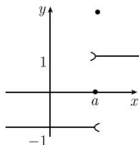
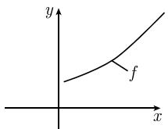
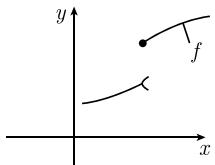
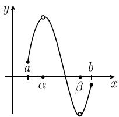
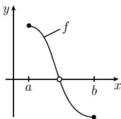
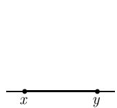

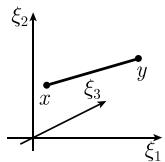
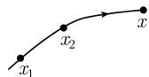


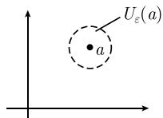
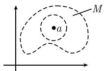
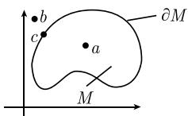


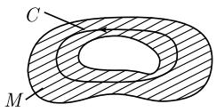
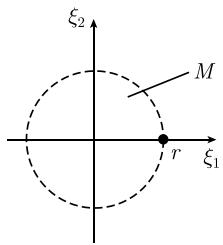

<!-- llm-wiki:embedded-images -->
