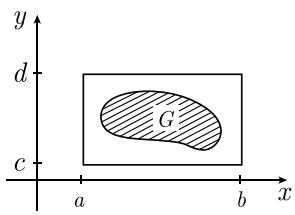
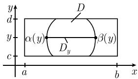
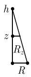
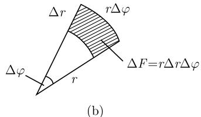
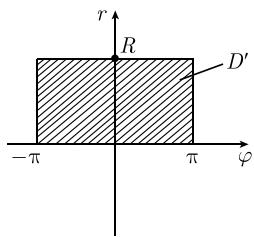
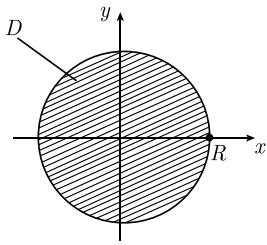
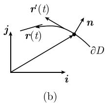

# 《数学指南——实用数学手册》1.7.1 基本思想

## 定位

本页是第 1.7 节「多实变量函数的积分」的开篇小节，标题即「基本思想」。原文开宗明义地声明：

> 下面启发式的思考将在后面的 1.7.2 中被严格证明。

因此本小节的功能**不是证明，而是动机与总纲**：它先把二维/多维积分的定义、把二重积分化归为一维积分的机制、以及各种积分定理之间的统一关系以启发式方式铺陈出来，随后交由 1.7.2 及后续小节做严格处理。它与已入库的 [[多实变量函数的积分]]、[[卡瓦列里原理-富比尼定理]]、[[累次积分]]、[[高斯-斯托克斯定理]] 等页面同属 1.7 节。

## 内容主线

本小节沿一条清晰的线索推进，共七段，参见既有页面 [[积分理论四个关键词]]：

1. **矩形上的质量与二重积分（1.126）**
2. **累次积分（富比尼定理，1.127）**，附例 1（矩形面积）与例 2（$\int_R 2xy\,\mathrm{d}x\mathrm{d}y$）
3. **有界区域上的积分（1.128）** 与 **卡瓦列里原理（1.129）**，附例 3（圆锥体积）
4. **代换规则与嘉当微分学（1.130）—（1.132）**，附例 4（圆面积）
5. **微积分基本定理与嘉当微分学（1.133）**，附例 5（平面上的高斯定理，1.134—1.135）
6. **应用到分部积分（1.136）**，由平面高斯定理反推二维分部积分公式
7. **无界区域上的积分**（例 6）与 **无界函数的积分**（例 7）

## 一、矩形上的二重积分与质量

设 $-\infty < a < b < \infty$，$-\infty < c < d < \infty$，矩形 $R := \{(x,y): a \leqslant x \leqslant b,\ c \leqslant y \leqslant d\}$，面密度为 $\varrho$。取分割

$$
\Delta x := \frac{b-a}{n}, \quad \Delta y := \frac{d-c}{n}, \quad n = 1, 2, \dots
$$

$$
x_j := a + j\Delta x, \quad y_k := c + k\Delta y, \quad j, k = 0, \dots, n.
$$

小矩形质量近似为 $\Delta m = \varrho(x_j, y_k)\Delta x \Delta y$，于是定义为极限：

$$
\int_{R} \varrho(x,y)\,\mathrm{d}x\,\mathrm{d}y := \lim_{n\to\infty} \sum_{j,k=1}^{\infty} \varrho(x_j, y_k)\Delta x \Delta y \tag{1.126}
$$

原文注释指出该讨论「可以完全类似地推广到高维的情形。在高维情形，用 $n$ 维立方体代替矩形，其中 $n$ 是区域的维数」（图 1.61(b)）。

## 二、累次积分（富比尼定理）

$$
\int_{R} \varrho(x,y)\,\mathrm{d}x\,\mathrm{d}y
= \int_{c}^{d} \left(\int_{a}^{b} \varrho(x,y)\,\mathrm{d}x\right)\mathrm{d}y
= \int_{a}^{b} \left(\int_{c}^{d} \varrho(x,y)\,\mathrm{d}y\right)\mathrm{d}y \tag{1.127}
$$

原文评价：「把 $R$ 上的积分计算归结为两个一维积分的计算，这有重大的实际意义。」（脚注 1）

**脚注 1（启发式论证）** 当 $n \to \infty$ 时对有限和交换累加次序：

$$
\sum_{j,k=1}^{n} \varrho \Delta x \Delta y
= \sum_{k=1}^{n}\left(\sum_{j=1}^{n} \varrho \Delta x\right)\Delta y
= \sum_{j-1}^{n}\left(\sum_{k=1}^{n} \varrho \Delta y\right)\Delta x,
$$

即得公式 (1.127)，其中（更确切一点）$\varrho$ 被写为 $\varrho(x_j, y_k)$。

**例 1**

$$
\int_{R} \mathrm{d}x\,\mathrm{d}y = \int_{c}^{d}\left(\int_{a}^{b}\mathrm{d}x\right)\mathrm{d}y = \int_{c}^{d}(b-a)\,\mathrm{d}y = (b-a)(d-c),
$$

即矩形 $R$ 的面积。

**例 2** 由

$$
\int_{a}^{b} 2xy\,\mathrm{d}x = 2y\int_{a}^{b} x\,\mathrm{d}x = yx^{2}\big|_{a}^{b} = y(b^{2}-a^{2})
$$

得

$$
\int_{R} 2xy\,\mathrm{d}x\,\mathrm{d}y = \int_{c}^{d}\left(\int_{a}^{b} 2xy\,\mathrm{d}x\right)\mathrm{d}y = \int_{c}^{d} y(b^{2}-a^{2})\,\mathrm{d}y = \frac{1}{2}(d^{2}-c^{2})(b^{2}-a^{2}).
$$

## 三、有界区域上的积分与卡瓦列里原理

取包含 $D$ 的矩形 $R$，以零延拓定义区域上的积分：

$$
\int_{D} \varrho(x,y)\,\mathrm{d}x\,\mathrm{d}y := \int_{R} \varrho_{*}(x,y)\,\mathrm{d}x\,\mathrm{d}y, \tag{1.128}
$$

$$
\varrho_{*}(x,y) := \begin{cases} \varrho(x,y), & (x,y) \in D \\ 0, & D\ \text{外} \end{cases}
$$

**脚注 1（物理解释）** 如果 $\varrho$ 也取负值，那么可以把 $\varrho$ 看作表面电荷密度，把 $\int_{D}\varrho(x,y)\,\mathrm{d}x\,\mathrm{d}y$ 解释成区域 $D$ 中的总电荷。当 $\varrho \equiv 1$ 时，积分 $\int_{D}\mathrm{d}x\,\mathrm{d}y$ 就是区域 $D$ 的面积。

**卡瓦列里原理** 对固定 $y$，$\varrho_{*}(x,y)$ 在 $[\alpha(y), \beta(y)]$ 上等于 $\varrho(x,y)$、区间外等于 $0$，故

$$
\int_{D} \varrho(x,y)\,\mathrm{d}x\,\mathrm{d}y = \int_{c}^{d}\left(\int_{\alpha(y)}^{\beta(y)} \varrho(x,y)\,\mathrm{d}x\right)\mathrm{d}y,
$$

简写为

$$
\int_{D} \varrho(x,y)\,\mathrm{d}x\,\mathrm{d}y = \int_{c}^{d}\left(\int_{D_y} \varrho(x,y)\,\mathrm{d}x\right)\mathrm{d}y, \tag{1.129}
$$

其中 $D_y$ 是 $D$ 的 $y$ 截面：

$$
D_y = \{x \in \mathbb{R} \mid (x,y) \in D\}.
$$

原文强调公式 (1.129) 不依赖于区域 $D$ 的特殊形式（图 1.62、图 1.63(a)）。

**脚注 2** 引进 $D$ 的 $x$ 截面 $D_x := \{y \in \mathbb{R} \mid (x,y) \in D\}$，则类似地有

$$
\int_{D} \rho(x,y)\,\mathrm{d}x\,\mathrm{d}y = \int_{a}^{b}\left(\int_{D_x}\rho(x,y)\,\mathrm{d}y\right)\mathrm{d}x
$$

（图 1.63(b)）。

**历史定位** 原文指出 (1.129) 可推广到高维，它对应积分理论的一般原理，其最简形式由伽利略的学生 B. 卡瓦列里（Bonaventura Cavalieri, 1598—1647）在牛顿和莱布尼茨之前发现，于 1653 年发表在其主要著作《连续不可分量的几何学》（原始转写为 *Geometria indivisibilius continuorum*）中。

**例 3（圆锥的体积）** 令 $D$ 是底面圆半径 $R$、高 $h$ 的圆锥，则

$$
V = \frac{1}{3}\pi R^{2} h.
$$

推导：$V = \int_{D}\mathrm{d}x\,\mathrm{d}y\,\mathrm{d}z = \int_{0}^{h}\left(\int_{D_z}\mathrm{d}x\,\mathrm{d}y\right)\mathrm{d}z$；$z$ 截面是半径 $R_z$ 的圆盘，$\int_{D_z}\mathrm{d}x\,\mathrm{d}y = \pi R_z^{2}$；由相似关系 $R_z/R = (h-z)/h$ 得

$$
V = \int_{0}^{h} \frac{\pi R^{2}}{h^{2}}(h-z)^{2}\,\mathrm{d}z = -\frac{\pi R^{2}}{3h^{2}}(h-z)^{3}\Big|_{0}^{h} = \frac{1}{3}\pi R^{2} h.
$$

## 四、代换规则与嘉当微分学

考虑映射（图 1.65）

$$
x = x(u,v), \quad y = y(u,v), \tag{1.130}
$$

把 $(u,v)$ 平面上的区域 $D'$ 映到 $(x,y)$ 平面上的区域 $D$。记 $\int_{D}\varrho(x,y)\,\mathrm{d}x\,\mathrm{d}y = \int_{D}\omega$，其中 $\omega = \varrho\,\mathrm{d}x \wedge \mathrm{d}y$。利用变换 (1.130) 得

$$
\omega = \varrho \frac{\partial(x,y)}{\partial(u,v)}\,\mathrm{d}u \wedge \mathrm{d}v
$$

（参看 1.5.10.4 中的例 10）。由此得到代换基本公式：

$$
\int_{D} \varrho(x,y)\,\mathrm{d}x\,\mathrm{d}y = \int_{D'} \varrho(x(u,v), y(u,v)) \frac{\partial(x,y)}{\partial(u,v)} \,\mathrm{d}u\,\mathrm{d}v, \tag{1.131}
$$

原文称「这可以严格证明」，并必须假定（脚注 1）

$$
\frac{\partial(x,y)}{\partial(u,v)}(u,v) > 0, \quad \text{对所有} (u,v) \in D'.
$$

脚注 1 补充：允许 $\frac{\partial(x,y)}{\partial(u,v)}$ 在有限多个点处为零。

**应用到极坐标** 变量变换 $x = r\cos\varphi$，$y = r\sin\varphi$，$-\pi < \varphi \leqslant \pi$，得

$$
\int_{D}\varrho(x,y)\,\mathrm{d}x\,\mathrm{d}y = \int_{D'}\varrho\, r\,\mathrm{d}r\,\mathrm{d}\varphi, \tag{1.132}
$$

因为

$$
\frac{\partial(x,y)}{\partial(r,\varphi)} = \begin{vmatrix} x_r & x_\varphi \\ y_r & y_\varphi \end{vmatrix} = \begin{vmatrix} \cos\varphi & -r\sin\varphi \\ \sin\varphi & r\cos\varphi \end{vmatrix} = r(\cos^{2}\varphi + \sin^{2}\varphi) = r.
$$

脚注 1 给出 (1.132) 的直观动机：把区域 $D$ 分割成很多小片 $\Delta F = r\Delta r\Delta\varphi$，对和 $\sum \varrho \Delta F = \sum \varrho r \Delta r \Delta \varphi$ 取极限 $\Delta F \to 0$（图 1.66(b)）。

**例 4（圆周内部的面积）** 令 $D$ 是由半径为 $R$ 的圆围成的区域，则

$$
A = \int_{D}\mathrm{d}x\,\mathrm{d}y = \int_{D'} r\,\mathrm{d}r\,\mathrm{d}\varphi = \int_{0}^{R}\left(\int_{-\pi}^{\pi} r\,\mathrm{d}\varphi\right)\mathrm{d}r = 2\pi\int_{0}^{R} r\,\mathrm{d}r = \pi R^{2}.
$$

## 五、微积分基本定理与嘉当微分学

一维的牛顿-莱布尼茨基本定理 $\int_{a}^{b} F'(x)\,\mathrm{d}x = F\big|_{a}^{b}$ 可记作

$$
\int_{D} \mathrm{d}\omega = \int_{\partial D} \omega, \tag{1.133}
$$

其中 $\omega = F$，$D = ]a,b[$，且 $\mathrm{d}\omega = \mathrm{d}F = F'(x)\mathrm{d}x$。

原文指出 (1.133) 对任意维的区域、曲线和曲面都成立，「这显示了嘉当微分学的优美」（参看 1.7.6）。由于 (1.133) 把域论（向量分析）的高斯经典定理和斯托克斯经典定理作为特例包含进来，故称之为**高斯-斯托克斯定理**（或更简单地称为斯托克斯定理）。

**例 5（平面上的高斯定理）** 令 $D$ 为平面区域，边界 $\partial D$ 有参数表示 $x = x(t)$，$y = y(t)$，$\alpha \leqslant t \leqslant \beta$，且在数学意义下正定向（图 1.68）。取一次微分式 $\omega = a\,\mathrm{d}x + b\,\mathrm{d}y$，则 $\mathrm{d}\omega = (b_x - a_y)\,\mathrm{d}x \wedge \mathrm{d}y$（参看 1.5.10.4 的例 5），于是 (1.133) 成为

$$
\int_{D}(b_x - a_y)\,\mathrm{d}x \wedge \mathrm{d}y = \int_{\partial D} a\,\mathrm{d}x + b\,\mathrm{d}y. \tag{1.134}
$$

计算规则：左端把 $\mathrm{d}x \wedge \mathrm{d}y$ 换成 $\mathrm{d}x\,\mathrm{d}y$（该规则对任意维区域有效）；右端把 $\omega$ 与 $\partial D$ 的参数表示联系，得 $\omega = \left(a\frac{\mathrm{d}x}{\mathrm{d}t} + b\frac{\mathrm{d}y}{\mathrm{d}t}\right)\mathrm{d}t$ 及 $\int_{\partial D}\omega = \int_{\alpha}^{\beta}(ax' + by')\,\mathrm{d}t$。用经典记号写 (1.134) 即

$$
\int_{D}(b_x - a_y)\,\mathrm{d}x\,\mathrm{d}y = \int_{\alpha}^{\beta}(ax' + by')\,\mathrm{d}t. \tag{1.135}
$$

脚注 1 给出带自变量的更精确形式：

$$
\int_{D}(b_x(x,y) - a_y(x,y))\,\mathrm{d}x\,\mathrm{d}y = \int_{\alpha}^{\beta}\left(a(x(t),y(t))x'(t) + b(x(t),y(t))y'(t)\right)\mathrm{d}t.
$$

原文称「这就是平面上的高斯定理」。

## 六、应用到分部积分

$$
\begin{array}{l}
\int_{D} u_x v\,\mathrm{d}x\,\mathrm{d}y = \int_{\partial D} u v n_x\,\mathrm{d}s - \int_{D} u v_x\,\mathrm{d}x\,\mathrm{d}y, \\
\int_{D} u_y v\,\mathrm{d}x\,\mathrm{d}y = \int_{\partial D} u v n_y\,\mathrm{d}s - \int_{D} u v_y\,\mathrm{d}x\,\mathrm{d}y.
\end{array} \tag{1.136}
$$

这里 $n = n_x \boldsymbol{i} + n_y \boldsymbol{j}$ 为边界点处的外法向量，$s$ 表示（假定足够光滑的）边界曲线的弧长。公式 (1.136) 推广了一维公式

$$
\int_{\alpha}^{\beta} u' v\,\mathrm{d}x = uv\big|_{\alpha}^{\beta} - \int_{\alpha}^{\beta} u v'\,\mathrm{d}x.
$$

**由 (1.135) 推 (1.136) 的论证** 把沿 $\partial D$ 的参数 $t$ 看成时间：$\boldsymbol{r}(t) = x(t)\boldsymbol{i} + y(t)\boldsymbol{j}$，$\boldsymbol{r}'(t) = x'(t)\boldsymbol{i} + y'(t)\boldsymbol{j}$。对 $N = y'(t)\boldsymbol{i} - x'(t)\boldsymbol{j}$，有 $\boldsymbol{r}'(t)\cdot N = x'(t)y'(t) - y'(t)x'(t) = 0$，故 $N$ 垂直于切向量且指向 $D$ 的外部（图 1.68(a)），相应的单位向量为

$$
\boldsymbol{n} = \frac{N}{|N|} = \frac{y'(t)\boldsymbol{i} - x'(t)\boldsymbol{j}}{\sqrt{x'(t)^{2} + y'(t)^{2}}} = n_x \boldsymbol{i} + n_y \boldsymbol{j}.
$$

又 $\frac{\mathrm{d}s}{\mathrm{d}t} = \sqrt{x'(t)^{2} + y'(t)^{2}}$（参看 1.6.9），故 $n_x \frac{\mathrm{d}s}{\mathrm{d}t} = y'(t)$。令 $b := uv$ 且 $a \equiv 0$，由 (1.135) 得

$$
\int_{D}(uv)_x\,\mathrm{d}x\,\mathrm{d}y = \int_{\alpha}^{\beta} uv\, y'\,\mathrm{d}t = \int_{\alpha}^{\beta} uv\, n_x \frac{\mathrm{d}s}{\mathrm{d}t}\,\mathrm{d}t = \int_{\partial D} uv\, n_x\,\mathrm{d}s,
$$

再用乘积法则 $(uv)_x = u_x v + u v_x$ 即得 (1.136) 第一式；令 $a := uv$ 同理得第二式。

## 七、无界区域与无界函数上的积分

**无界区域**：和一维情形一样，用有界区域近似无界区域 $D$，再取极限：

$$
\int_{D} f\,\mathrm{d}x\,\mathrm{d}y = \lim_{n\to\infty} \int_{D_n} f\,\mathrm{d}x\,\mathrm{d}y,
$$

其中 $D_1 \subseteq D_2 \subseteq \cdots$，且 $D = \bigcup_{n=1}^{\infty} D_n$。

**例 6** 令 $r := \sqrt{x^{2}+y^{2}}$，$D := \{(x,y) \in \mathbb{R}^{2} \mid 1 < r < \infty\}$，用圆环 $D_n = \{(x,y) \mid 1 < r < n\}$ 逼近（图 1.69(a)）。当 $\alpha > 2$ 时

$$
\int_{D} \frac{\mathrm{d}x\,\mathrm{d}y}{r^{\alpha}} = \lim_{n\to\infty}\int_{D_n}\frac{\mathrm{d}x\,\mathrm{d}y}{r^{\alpha}} = \frac{2\pi}{\alpha - 2}.
$$

由极坐标：

$$
\int_{D_n}\frac{\mathrm{d}x\,\mathrm{d}y}{r^{\alpha}} = \int_{r=1}^{n}\left(\int_{\varphi=0}^{2\pi}\frac{r\,\mathrm{d}r\,\mathrm{d}\varphi}{r^{\alpha}}\right) = 2\pi\int_{1}^{n} r^{1-\alpha}\,\mathrm{d}r = 2\pi\frac{r^{2-\alpha}}{2-\alpha}\Bigg|_{1}^{n} = \frac{2\pi}{\alpha-2}\left(1 - \frac{1}{n^{\alpha-2}}\right).
$$

**无界函数**：用函数在其中有界的区域逼近区域 $D$。

**例 7** 令 $D := \{(x,y) \in \mathbb{R}^{2} \mid r \leqslant R\}$ 是半径为 $R$ 的圆盘内部，用圆环（图 1.69(b)）

$$
D_{\varepsilon} := D \setminus U_{\varepsilon}(0),
$$

逼近，其中 $U_{\varepsilon}(0) := \{(x,y) \in \mathbb{R}^{2} \mid r < \varepsilon\}$。当 $0 < \alpha < 2$ 时

$$
\int_{D}\frac{\mathrm{d}x\,\mathrm{d}y}{r^{\alpha}} = \lim_{\varepsilon\to 0}\int_{D_{\varepsilon}}\frac{\mathrm{d}x\,\mathrm{d}y}{r^{\alpha}} = \frac{2\pi R^{2-\alpha}}{2 - \alpha}.
$$

由极坐标：

$$
\int_{D_{\varepsilon}}\frac{\mathrm{d}x\,\mathrm{d}y}{r^{\alpha}} = \int_{r=\varepsilon}^{R}\left(\int_{\varphi=0}^{2\pi}\frac{r\,\mathrm{d}r\,\mathrm{d}\varphi}{r^{\alpha}}\right) = 2\pi\int_{\varepsilon}^{R} r^{1-\alpha}\,\mathrm{d}r = \frac{2\pi}{2-\alpha}\left(R^{2-\alpha} - \varepsilon^{2-\varepsilon}\right).
$$

（末项 $\varepsilon^{2-\varepsilon}$ 的上标疑为转写讹误，参见 {{待核实}} 小节。）

## 附图

- 图 1.61 量的计算：(a) 矩形分割；(b) 高维立方体分割。图片 `media/10-数学指南实用数学手册--8-171-基本思想--14h73zm/001-1ded3f47533f9d7ac388420c3fcad131b830bc4bba874a1f2965aa356ca1eee6.jpg`
- 图 1.62 一个 $y$ 截面：`media/10-数学指南实用数学手册--8-171-基本思想--14h73zm/003-5b1b4142956c688c854314031e72c978dd11ec559d72027f5a2a291c59440f98.jpg`
- 图 1.64 圆锥的 $z$ 截面 $D_z$ 与相似关系：`media/10-数学指南实用数学手册--8-171-基本思想--14h73zm/006-6077183148ca575d73e29edece29552ed232b73ffc66cc11a6f2d492584ab7f0.jpg`
- 图 1.66(b) 极坐标面积微元 $\Delta F = r\Delta r\Delta\varphi$：`media/10-数学指南实用数学手册--8-171-基本思想--14h73zm/010-cfd21b5813392f3d8c1e34b6db16a7b7fbc4af234fbc08a72d741ff5772bef13.jpg`
- 图 1.67(a) 半径 $R$ 的圆盘区域 $D$：`media/10-数学指南实用数学手册--8-171-基本思想--14h73zm/012-256127faa54be8fa4563b432ac5747024516fcbe0818a190806e00d989f38d1d.jpg`
- 图 1.68(b) 边界 $\partial D$ 上某点处的 $n$ 标架：`media/10-数学指南实用数学手册--8-171-基本思想--14h73zm/014-ce15c923437e7585720d4160fc7008e04b681e3ad9d25717feab1b5d8c86d8e0.jpg`
- 图 1.69 求无界区域上的积分 (a) 与无界函数的积分 (b)：`media/10-数学指南实用数学手册--8-171-基本思想--14h73zm/015-b49a4daab54b623182f45ce4229aed9205eb17bbe4e91aff63f6d227bdcc9d1b.jpg`、`media/10-数学指南实用数学手册--8-171-基本思想--14h73zm/016-a33c0dcdb994ec5f33d9004d4c655379360a88badc29208b1b76fc31b5fba5da.jpg`

其余插图（编号 002、004、005、007、008、009、011、013）在入库时未能加载或内容类型不受支持，图注与细节待补，参见 [[171节公式与文字转写疑误汇总]] 与相关查询。

## 待核实

- 公式 (1.127) 右端第二式外层微分符号、脚注 1 的求和指标、例 7 中 $\varepsilon$ 的上标等疑点，汇总于 [[171节公式与文字转写疑误汇总]]。
- 本小节声明 1.7.2 将给出严格证明，该节尚未入库，见 [[171节引用172节严格证明尚未入库]]。
- 第 5 段「微积分基本定理和嘉当微分学」引用的 1.7.6 节尚未入库，见 [[171节引用176节尚未入库]]。
- 代换规则的推导引用 1.5.10.4 的例 5 与例 10，其具体内容未在本 wiki 中记录，见 [[171节引用15104节例5与例10尚未入库]]。

## 相关页面

- [[多实变量函数的积分]]、[[二重积分]]、[[卡瓦列里原理-富比尼定理]]、[[累次积分]]
- [[面密度与积分延拓]]、[[多变量积分代换公式]]、[[极坐标下的二重积分]]
- [[高斯-斯托克斯定理]]、[[平面上的高斯定理]]、[[高维分部积分公式]]
- [[无界区域上的二重积分]]、[[无界函数的二重积分]]
- [[卡瓦列里]]、[[富比尼]]、[[嘉当]]、[[高斯]]、[[斯托克斯]]、[[莱布尼茨]]、[[伽利略]]

<!-- llm-wiki:embedded-images -->
## Embedded Images

### Document

<!-- llm-wiki:embedded-images -->
