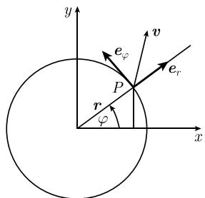
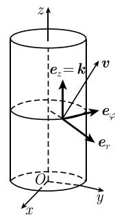
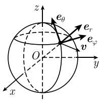

# 《数学指南——实用数学手册》1.7.9 曲线坐标

## 概述

本节（手册第 179 页起）题为「曲线坐标」（krummlinige Koordinaten），用**极坐标、柱面坐标、球面坐标**三个具体坐标系的例子，把 [[曲线坐标下的参数曲面]]、[[度量张量]]、[[第一基本形式]]、[[体积形式]]、[[曲面面积元]] 等一系列抽象概念落成可直接计算的公式，并以表 1.2 汇总。

全节为「公式—验证」式推导，**不含具名人物、机构、文献引用或实验数据**，与相邻的 1.7.6 节（出现高斯、斯托克斯、德拉姆）和 1.7.7 节（出现黎曼）形成对比：1.7.9 是纯工具性的坐标实例节。

开篇约定：用 $\boldsymbol i,\boldsymbol j,\boldsymbol k$ 表示笛卡儿坐标系 $(x,y,z)$ 中沿坐标轴方向的单位向量，并令

$$
\boldsymbol r = x\boldsymbol i + y\boldsymbol j + z\boldsymbol k
$$

（原文在此处标注引用图 1.70(a)，该图属本节之前的子节）。

## 1.7.9.1 极坐标

坐标变换（图 1.76）：

$$
\boxed{x = r\cos\varphi,\quad y = r\sin\varphi,\quad -\pi < \varphi \leqslant \pi,\quad r \geqslant 0.}
$$

点 $P$ 处的自然基向量 $\boldsymbol e_r, \boldsymbol e_\varphi$（即坐标切向量）：

$$
\boldsymbol e_r = \boldsymbol r_r = x_r\boldsymbol i + y_r\boldsymbol j = \cos\varphi\,\boldsymbol i + \sin\varphi\,\boldsymbol j,
$$

$$
\boldsymbol e_\varphi = \boldsymbol r_\varphi = x_\varphi\boldsymbol i + y_\varphi\boldsymbol j = -r\sin\varphi\,\boldsymbol i + r\cos\varphi\,\boldsymbol j.
$$

要点：$\boldsymbol e_r$ 是单位向量，而 $\boldsymbol e_\varphi$ 的长度为 $r$，**不是**单位向量。全节所用的是坐标切向量构成的**自然基**，而非归一化的正交单位标架。

## 1.7.9.2 柱面坐标

坐标变换：

$$
\boxed{x = r\cos\varphi,\quad y = r\sin\varphi,\quad z = z,\quad -\pi < \varphi \leqslant \pi,\quad r \geqslant 0.}
$$

点 $P$ 处的自然基向量 $\boldsymbol e_r,\boldsymbol e_\varphi,\boldsymbol e_z$：

$$
\begin{array}{l}
\boldsymbol e_r = \boldsymbol r_r = x_r\boldsymbol i + y_r\boldsymbol j = \cos\varphi\,\boldsymbol i + \sin\varphi\,\boldsymbol j,\\
\boldsymbol e_\varphi = \boldsymbol r_\varphi = x_\varphi\boldsymbol i + y_\varphi\boldsymbol j = -r\sin\varphi\,\boldsymbol i + r\cos\varphi\,\boldsymbol j,\\
\boldsymbol e_z = \boldsymbol r_z = \boldsymbol k.
\end{array}
$$

### 坐标线

(i) $r = $ 变量，$\varphi = $ 常数，$z = $ 常数：垂直于 $z$ 轴的射线。

(ii) $\varphi = $ 变量，$r = $ 常数，$z = $ 常数：由 $r = $ 常数确定的柱面上的大圆。

(iii) $z = $ 变量，$r = $ 常数，$\varphi = $ 常数：平行于 $z$ 轴的直线。

过每个不是原点的点 $P$，恰有三条坐标线，它们的切向量为 $\boldsymbol e_r,\boldsymbol e_\varphi,\boldsymbol e_z$，且**两两垂直**（图 1.77）。

### 向量分解与自然分量

$$
\boldsymbol v = v_1\boldsymbol e_r + v_2\boldsymbol e_\varphi + v_3\boldsymbol e_z.
$$

称 $v_1, v_2, v_3$ 为柱面坐标下向量 $\boldsymbol v$ 在点 $P$ 处的**自然分量**。

### 弧长元素、体积形式与体积积分

$$
\mathrm ds^2 = \mathrm dr^2 + r^2\mathrm d\varphi^2 + \mathrm dz^2.
$$

$$
\mu := r\,\mathrm dr \wedge \mathrm d\varphi \wedge \mathrm dz = \mathrm dx \wedge \mathrm dy \wedge \mathrm dz.
$$

$$
\boxed{\int \varrho\,\mu = \int \varrho\, r\,\mathrm dr\,\mathrm d\varphi\,\mathrm dz = \int \varrho\,\mathrm dx\,\mathrm dy\,\mathrm dz.}
$$

原文明确指出：**这个公式对应着代换法则**。

### 半径固定的圆柱面

对给定半径 $r = $ 常数的圆柱面，弧长公式退化为

$$
\mathrm ds^2 = r^2\mathrm d\varphi^2 + \mathrm dz^2,
$$

体积形式为 $\mu = r\,\mathrm d\varphi \wedge \mathrm dz$，面积积分为

$$
\boxed{\int \varrho\,\mathrm dF = \int \varrho\,\mu = \int \varrho\, r\,\mathrm d\varphi\,\mathrm dz.}
$$

例：半径为 $r$、高为 $h$ 的圆柱面的曲面面积（不含上、下底）为

$$
\int_{z=0}^{h}\left(\int_{\varphi=-\pi}^{\pi} r\,\mathrm d\varphi\right)\mathrm dz = 2\pi r h.
$$

## 1.7.9.3 球面坐标

坐标变换：

$$
\boxed{x = r\cos\varphi\cos\theta,\quad y = r\sin\varphi\cos\theta,\quad z = r\sin\theta,}
$$

其中 $-\pi < \varphi \leqslant \pi$，$-\frac{\pi}{2} \leqslant \theta \leqslant \frac{\pi}{2}$，$r \geqslant 0$。

点 $P$ 处的自然基向量 $\boldsymbol e_\varphi,\boldsymbol e_\theta,\boldsymbol e_r$：

$$
\boldsymbol e_\varphi = \boldsymbol r_\varphi = -r\sin\varphi\cos\theta\,\boldsymbol i + r\cos\varphi\cos\theta\,\boldsymbol j,
$$

$$
\boldsymbol e_\theta = \boldsymbol r_\theta = -r\cos\varphi\sin\theta\,\boldsymbol i - r\sin\varphi\sin\theta\,\boldsymbol j + r\cos\theta\,\boldsymbol k,
$$

$$
\boldsymbol e_r = \boldsymbol r_r = \cos\varphi\cos\theta\,\boldsymbol i + \sin\varphi\cos\theta\,\boldsymbol j + \sin\theta\,\boldsymbol k.
$$

$r = $ 常数的曲面是中心在原点、半径为 $r$ 的球面，记作 $S_r$。

### 坐标线

(i) $\varphi = $ 变量，$r = $ 常数，$\theta = $ 常数：纬度为 $\theta$ 的 $S_r$ 上的大圆。

(ii) $\theta = $ 变量，$r = $ 常数，$\varphi = $ 常数：经度为 $\varphi$ 的 $S_r$ 上的大圆的一半。

(iii) $r = $ 变量，$\varphi = $ 常数，$\theta = $ 常数：从原点向外射出的射线。

过每个不是原点的点 $P$，恰有三条坐标线；它们有两两垂直的切向量 $\boldsymbol e_\varphi,\boldsymbol e_\theta,\boldsymbol e_r$（图 1.78）。

### 向量分解与自然分量

$$
\boldsymbol V = v_1\boldsymbol e_\varphi + v_2\boldsymbol e_\theta + v_3\boldsymbol e_r.
$$

称 $v_1, v_2, v_3$ 为向量 $\boldsymbol v$ 在球面坐标下点 $P$ 处的**自然分量**。

### 弧长元素、体积形式与体积积分

$$
\mathrm ds^2 = r^2\cos^2\theta\,\mathrm d\varphi^2 + r^2\mathrm d\theta^2 + \mathrm dr^2.
$$

$$
\mu := r^2\cos\theta\,\mathrm d\varphi \wedge \mathrm d\theta \wedge \mathrm dr = \mathrm dx \wedge \mathrm dy \wedge \mathrm dz.
$$

$$
\boxed{\int \rho\,\mu = \int \rho\, r^2\cos\theta\,\mathrm d\varphi\,\mathrm d\theta\,\mathrm dr = \int \rho\,\mathrm dx\,\mathrm dy\,\mathrm dz.}
$$

原文再次指出：**这个公式再次对应着代换法则**。

### 球面 $S_r$

在 $S_r$ 上弧长公式为

$$
\mathrm dS^2 = r^2\cos^2\theta\,\mathrm d\varphi^2 + r^2\mathrm d\theta^2,
$$

其中体积形式为 $\mu = r^2\cos\theta\,\mathrm d\varphi \wedge \mathrm d\theta$，曲面积分是

$$
\boxed{\int \rho\,\mathrm dF = \int \rho\,\mu = \int \rho\, r^2\cos\theta\,\mathrm d\varphi\,\mathrm d\theta.}
$$

（原文此行中间一处记作 $\int\rho u$，疑为 $\mu$ 的转写讹误，见 [[queries/179节球面曲面积分式中u是否应为mu]]。）

例：半径为 $r$ 的球面面积 $F$ 为

$$
F = \int_{\theta=-\frac{\pi}{2}}^{\frac{\pi}{2}}\int_{\varphi=-\pi}^{\pi} r^2\cos\theta\,\mathrm d\varphi\,\mathrm d\theta
= 2\pi r^2\int_{-\frac{\pi}{2}}^{\frac{\pi}{2}}\cos\theta\,\mathrm d\theta
= 4\pi r^2.
$$

## 表 1.2 曲线坐标

| | 极坐标 | 柱面坐标 | 球面坐标 |
|---|---|---|---|
| 弧长元素 $\mathrm ds^2$ | $\mathrm dr^2 + r^2\mathrm d\varphi^2$ | $\mathrm dr^2 + r^2\mathrm d\varphi^2 + \mathrm dz^2$ | $\mathrm dr^2 + r^2\mathrm d\theta^2 + r^2\cos^2\theta\,\mathrm d\varphi^2$ |
| 特殊体积元素 $v$ | （空） | $r\,\mathrm d\varphi\,\mathrm dz\,\mathrm dr$ | $r^2\cos\theta\,\mathrm d\varphi\,\mathrm d\theta\,\mathrm dr$ |
| 曲面元素 | $r\,\mathrm dr\,\mathrm d\varphi$（平面） | $r\,\mathrm d\varphi\,\mathrm dz$（半径为 $r$ 的圆柱面） | $r^2\cos\theta\,\mathrm d\varphi\,\mathrm d\theta$（半径为 $r$ 的球面） |

该表的单独页面见 [[表12曲线坐标]]。

## 插图

- 图 1.76 极坐标（本页首图，图像内容未能加载，无法确认细节）。
- 图 1.77 柱面坐标：直圆柱底面标出原点 $O$ 与 $x,y$ 轴，$z$ 轴沿柱轴（被柱体遮挡处用虚线）；柱面一点处画出 $\boldsymbol e_z = \boldsymbol k$、切向的 $\boldsymbol e_\varphi$、径向的 $\boldsymbol e_r$，另有斜向上的向量 $\boldsymbol v$。
- 图 1.78 球面坐标 (a)(b)：(a) 未能加载；(b) 亦未能加载。可见文中的一段描述涉及水平投影 $r\cos\theta$ 的几何关系，但归属图号存疑，见 [[queries/179节图176与图178图像无法辨识]]。

## 与已有页面的联系

- 本节把 [[曲线坐标下的参数曲面]] 的一般度量张量/第一基本形式具体化：极坐标、柱面坐标、球面坐标中 $\mathrm ds^2$ 的对角形式即度量张量的对角分量。
- 体积形式 $\mu$ 与 [[体积形式]] 页所定义的一般体积形式一致，本节给出三个坐标下的具体表达式。
- 圆柱面与球面上的退化形式对应 [[曲面面积元]]。
- 两处「对应着代换法则」的说明与 [[多变量积分代换公式]]、[[雅可比函数行列式]] 相互印证；柱面坐标的 $\mu$ 系数 $r$、球面坐标的 $\mu$ 系数 $r^2\cos\theta$ 正是相应 Jacobi 行列式的绝对值。
- 与 [[极坐标下的二重积分]] 及 [[极坐标面积元为r dr dphi]] 属同一坐标变换，但本节在三维（柱面、球面）语境下重新给出。

## 转写疑点

- 表 1.2 中「特殊体积元素 $v$」的记号 $v$ 疑应为 $\mu$。
- 球面曲面积分式中间一项 $\int \rho u$ 中的 $u$ 疑应为 $\mu$。
- 球面坐标向量分解式左端写作大写 $\boldsymbol V$，而正文称「向量 $\boldsymbol v$」。
- 本节开头引用图 1.70(a)，该图不属本节。

<!-- llm-wiki:embedded-images -->
## Embedded Images

### Document

<!-- llm-wiki:embedded-images -->
