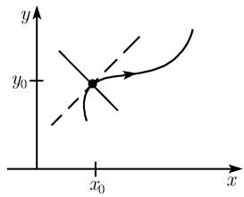
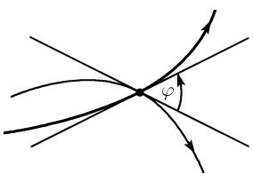
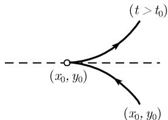
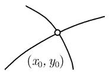
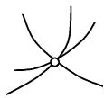
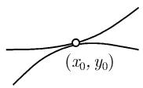

# 《数学指南——实用数学手册》3.6.1 平面曲线

本页是《数学指南——实用数学手册》3.6 节「微分几何学」中第 3.6.1 小节「平面曲线」的源文件摘要。该小节是一份紧凑的公式手册式材料：它以参数表示为出发点，依次给出弧长、切线、法线、曲率半径、曲率、曲率中心、拐点、极值点、两条曲线的交角，随后转入奇点（参数式与隐式两种定义、$D:=ac-b^2$ 判别、返回点/终点/切触点/三重点等形态）、突变理论的文献指向，以及渐近线的定义与三类判定。它承接上游页面 [[平面曲线]] 与 [[曲率]]，并为后续 [[空间曲线]] 的内容提供平面情形的对照。

## 参数表示与弧长

一条平面曲线以笛卡儿坐标 $(x,y)$ 的形如

$$
\boxed{x = x(t), \quad y = y(t), \quad a \leqslant t \leqslant b}\tag{3.22}
$$

的方程给出（图 3.42）。若把实参数 $t$ 解释为时间，则 (3.22) 描述了一个点的运动，其中这个点在时刻 $t$ 时的坐标为 $(x(t),y(t))$。

例 1：在 $t = x$ 的特殊情形我们得到了曲线方程 $y = y(x)$（一个函数在 $\mathbf{R}^2$ 中图像的方程）。

曲线的弧长为

$$
\boxed{s = \int_a^b \sqrt{x'(t)^2 + y'(t)^2}\,\mathrm{d}t.}
$$

## 切线与法线

在点 $(x_0,y_0)$ 的切线方程（图 3.42(a)）：

$$
\boxed{x = x_0 + (t-t_0)x_0', \quad y = y_0 + (t-t_0)y_0', \quad -\infty < t < \infty.}
$$

原文在此处说明「已令 $x_0' := x(t_0)$，$x_0' = x'(t_0)$，$y_0 := y(t_0)$，$y_0' = y'(t_0)$」；其中第一处记号存在重复，详见 [[361节切线方程处导数记号重复与正定向下表述疑似讹误]]。

曲线在点 $(x_0,y_0)$ 的法线的方程（图 3.42(b)）：

$$
\boxed{x = x_0 - (t-t_0)y_0', \quad y = y_0 + (t-t_0)x_0', \quad -\infty < t < \infty.}\tag{3.23}
$$

相关概念页：[[曲线的切线与法线]]。

## 曲率半径、曲率与曲率中心

曲率半径 $R$：若曲线在一点 $P(x_0,y_0)$ 的邻域中曲线 (3.22) 为 $C^2$ 类，则存在一个中心在 $M(\xi,\eta)$ 的半径为 $R$ 的唯一确定的圆，使得它与该曲线在点 $P$ 以二阶精度相重合（也称此圆与曲线有二阶切触，或者说此圆与曲线有一个二阶切触点），称 $R$ 为该曲线在点 $P$ 的曲率半径（图 3.43）。

曲率 $K$：它是数 $K$，其绝对值等于曲率半径 $R$ 的倒数：

$$
\boxed{|K| := \frac{1}{R}.}
$$

$K$ 在点 $P$ 的符号定义为正（分别地，负）是指该曲线位于点 $P$ 的切线之上（分别地，之下）（图 3.44）。对于曲线 (3.22) 有

$$
\boxed{K = \frac{x_0' y_0'' - y_0' x_0''}{(x_0'^2 + y_0'^2)^{3/2}},}
$$

其曲率中心 $M(\xi,\eta)$ 有

$$
\boxed{\xi = x_0 - \frac{y_0'(x_0'^2 + y_0'^2)}{x_0' y_0'' - y_0' x_0''}, \quad \eta = y_0 + \frac{x_0'(x_0'^2 + y_0'^2)}{x_0' y_0'' - y_0' x_0''}.}
$$

拐点：按定义，称一条曲线在点 $P$ 有一个拐点，如果 $K(P) = 0$ 且 $K$ 在点 $P$ 改变符号（图 3.44(c)）。

极值点：曲线上的一些点，在这些点上曲率 $K$ 取得其极大值或极小值，称它们为该曲线的极值点。

相关概念页：[[曲率半径]]、[[曲率中心]]、[[拐点与极值点]]。

## 两条曲线在交点的夹角

两条曲线 $x = x(t), y = y(t)$ 和 $X = X(t), Y = Y(t)$ 在它们交点的夹角 $\varphi$ 由下式确定：

$$
\boxed{\cos\varphi = \frac{x_0' X_0' + y_0' Y_0'}{\sqrt{x_0'^2 + y_0'^2}\,\sqrt{X_0'^2 + Y_0'^2}}, \quad 0 \leqslant \varphi < \pi,}
$$

这里的 $\varphi$ 是在该交点处切线间的夹角，并以数学的正方向进行度量，见图 3.45。值 $x_0, X_0$ 等为交点的坐标。（原文此处的表述见 [[361节切线方程处导数记号重复与正定向下表述疑似讹误]]。）

相关概念页：[[两曲线交角]]。

## 应用与两个公式表

例 2（圆）：圆心在原点 $(0,0)$、半径为 $R$ 的圆的方程为

$$
\boxed{x = R\cos t, \quad y = R\sin t, \quad 0 \leqslant t < 2\pi}
$$

（图 3.46）。点 $(0,0)$ 是曲率中心，而 $R$ 为曲率半径，它给出曲率 $K = 1/R$。由导数 $x'(t) = -R\sin t$ 与 $y'(t) = R\cos t$，得到了切线的参数方程

$$
x = x_0 - (t-t_0)y_0, \quad y = y_0 + (t-t_0)x_0, \quad -\infty < t < \infty.
$$

对于弧长 $s$，由 $\cos^2 t + \sin^2 t = 1$ 得到关系式 $s = \int_0^\varphi \sqrt{x'(t)^2 + y'(t)^2}\,\mathrm{d}t = R\varphi$。若将圆方程写为隐形式 $x^2 + y^2 = R^2$，则从表 3.8 中的 $F(x,y) = x^2 + y^2 - R^2$ 得到在点 $(x_0,y_0)$ 的切线方程 $x_0(x-x_0) + y_0(y-y_0) = 0$，即 $x_0x + y_0y = R^2$。在极坐标下该圆的方程为 $r = R$。

表 3.7 对显式表达曲线的公式（原文照录）：

| 曲线方程 | $y = y(x)$ 显形式 | $r = r(\varphi)$ 极坐标 |
|---|---|---|
| 弧长 | $s = \int_a^b \sqrt{1 + y'(x)^2}\,\mathrm{d}x$ | $\int_\alpha^\beta \sqrt{r^2 + r'^2}\,\mathrm{d}\varphi$ |
| 在点 $P(x_0,y_0)$ 的切线 | $y = x_0 + y_0'(x - x_0)$ | |
| 在点 $P(x_0,y_0)$ 的法向量 | $-y_0'(y - y_0) = x - x_0$ | |
| 在点 $P(x_0,y_0)$ 的曲率 $K$ | $\dfrac{y_0''}{(1 + y'^2)^{3/2}}$ | $\dfrac{r^2 + 2r'^2 - rr''}{(r^2 + r'^2)^{3/2}}$ |
| 曲率中心 | $\xi = x_0 - \dfrac{y_0'(1 + y_0'^2)}{y_0''}$；$\eta = y_0 + \dfrac{1 + y_0'^2}{y_0''}$ | $\xi = x_0 - \dfrac{(r^2 + r'^2)(x_0 + r'\sin\varphi)}{r^2 + 2r'^2 - rr''}$；$\eta = y_0 - \dfrac{(r^2 + r'^2)(y_0 - r'\cos\varphi)}{r^2 + 2r'^2 - rr''}$ |

表 3.8 对隐式表达曲线的公式（原文照录）：

| 隐式方程 | $F(x,y) = 0$ |
|---|---|
| 在点 $P(x_0,y_0)$ 的切线 | $F_x(P)(x - x_0) - F_y(P)(y - y_0) = 0$ |
| 在点 $P(x_0,y_0)$ 的法向量 | $F_x(P)(y - y_0) - F_y(P)(x - x_0) = 0$ |
| 在点 $P(x_0,y_0)$ 的曲率 $K$（$F_x := F_x(P)$，等） | $\dfrac{-F_y^2F_{xx} + 2F_xF_yF_{xy} - F_x^2F_{yy}}{(F_x^2 + F_y^2)^{3/2}}$ |
| 曲率中心 | $\xi = x_0 - \dfrac{F_x(F_x^2 + F_y^2)}{F_y^2F_{xx} - 2F_xF_yF_{xy} + F_x^2F_{yy}}$；$\eta = y_0 - \dfrac{F_y(F_x^2 + F_y^2)}{F_y^2F_{xx} - 2F_xF_yF_{xy} + F_x^2F_{yy}}$ |

对表格中若干条目符号的疑点记录于 [[361节表37与表38公式符号疑似讹误]]。

例 3（抛物线）：$y = \frac12 ax^2$，$a > 0$，根据表 3.7 在点 $x = 0$ 具有曲率 $K = a$。

例 4（拐点判定）：设 $y = x^3$，由表 3.7 有

$$
K = \frac{y''(x)}{(1 + y'(x)^2)^{3/2}} = \frac{6x}{(1 + 9x^4)^{3/2}}.
$$

在点 $x = 0$，$K$ 的符号改变，从而这是个拐点。

## 奇点

参数式定义：考虑曲线 $x = x(t), y = y(t)$。按定义，称点 $(x(t_0), y(t_0))$ 为该曲线的一个奇点，如果

$$
\boxed{x'(t_0) = y'(t_0) = 0.}
$$

在这样的一个点上切线不能确切定义。在一个奇点邻域中曲线的性态可利用 Taylor 级数

$$
\begin{array}{l}
x(t) = x(t_0) + \dfrac{(t-t_0)^2}{2}x''(t_0) + \dfrac{(t-t_0)^3}{6}x'''(t_0) + \dots,\\[4pt]
y(t) = y(t_0) + \dfrac{(t-t_0)^2}{2}y''(t_0) + \dfrac{(t-t_0)^3}{6}y'''(t_0) + \dots
\end{array}
$$

来研究。

例 5：对于 $x = x_0 + (t-t_0)^2 + \dots$，$y = y_0 + (t-t_0)^3 + \dots$，有一个返回点（图 3.47(a)）。若 $x = x_0 + (t-t_0)^2 + \dots$，$y = y_0 + (t-t_0)^2 + \dots$，则在点 $(x_0,y_0)$ 该曲线终结（图 3.47(b)）。

由隐式方程给出的曲线的奇点：若曲线由方程 $F(x,y) = 0$ 给出，满足 $F(x_0,y_0) = 0$，则按定义 $(x_0,y_0)$ 为一个奇点，当且仅当

$$
\boxed{F_x(x_0,y_0) = F_y(x_0,y_0) = 0.}
$$

这条曲线在 $(x_0,y_0)$ 的邻域中的性态仍利用 Taylor 展开

$$
F(x,y) = a(x-x_0)^2 + 2b(x-x_0)(y-y_0) + c(y-y_0)^2 + \dots\tag{3.24}
$$

进行研究。其中已令 $a := \frac12 F_{xx}(x_0,y_0)$，$b := F_{xy}(x_0,y_0)$，$c := \frac12 F_{yy}(x_0,y_0)$。另外，令 $D := ac - b^2$。

- 情形 1：$D > 0$。于是 $(x_0,y_0)$ 是个孤立点（图 3.48(a)）。
- 情形 2：$D < 0$。这时曲线在点 $(x_0,y_0)$ 有两个分支（图 3.48(b)）。

若 $D = 0$，则必须要考虑展开式 (3.24) 中的高阶项。例如可能出现下面的情形：切触点、返回点、终点、三重点或更一般的 $n$ 重点（参看图 3.47 和图 3.48）。

相关概念页：[[曲线奇点]]、[[泰勒展开]]、[[局部性态与整体性态]]。

## 突变理论

在突变理论中奇点的讨论可在 [212] 中找到。该文献编号在本 wiki 中尚无落地条目，见 [[文献212未落地]]；相关概念页 [[queries/突变理论]]。

## 渐近线

若当与原点的距离无限增大时一条曲线趋向于一条直线，则称此直线为该曲线的一条渐近线。

例 6：$x$ 轴和 $y$ 轴是由方程 $xy = 1$ 给出的双曲线的渐近线（图 3.49）。

设 $a \in \mathbf{R}$。考虑曲线 $x = x(t), y = y(t)$ 及当 $t$ 趋向 $t_0 + 0$ 时的极限。

- (i) 对于 $y(t) \to \pm\infty$，$x(t) \to a$，则直线 $x = a$ 是一条竖直渐近线。
- (ii) 对于 $x(t) \to \pm\infty$，$y(t) \to a$，则直线 $y = a$ 是一条水平渐近线。
- (iii) 假如 $x(t) \to \infty$，$y(t) \to \infty$，若两个极限

$$
m = \lim_{t \to t_0+0}\frac{y(t)}{x(t)} \quad\text{和}\quad c = \lim_{t \to t_0+0}\bigl(y(t) - mx(t)\bigr)
$$

存在，则直线 $y = mx + c$ 是一条渐近线。

我们可以类似地处理 $t \to t_0 - 0$ 和 $t \to \infty$ 的情形。

例 7：双曲线 $\dfrac{x^2}{a^2} - \dfrac{y^2}{b^2} = 1$ 具有参数化 $x = a\cosh t, y = b\sinh t$。两条直线 $y = \pm\dfrac{b}{a}x$ 为渐近线（图 3.50）。证明（例如）：

$$
\lim_{t \to +\infty}\frac{b\sinh t}{a\cosh t} = \frac{b}{a}, \qquad \lim_{t \to +\infty}(b\sinh t - b\cosh t) = 0.
$$

（原文证明第二个极限的括号位置存在疑点，见 [[361节例7渐近线证明括号位置疑似讹误]]。）

相关概念页：[[concepts/双曲线的标准方程与渐近线]]。

## 与其他页面的关系

- [[平面曲线]]：本小节是该概念的上游细化，补充参数表示、曲率公式组与奇点分类。
- [[曲率]]：本小节给出平面情形下曲率的显式公式、符号约定以及曲率中心的坐标。
- [[切线曲率挠率]]：平面曲线不存在挠率，本小节的切线与曲率构成该三要素在平面情形的退化对照。
- [[局部性态与整体性态]]：奇点邻域的 Taylor 分析是局部性态研究的典型范例。
- [[空间曲线]]：3.6.2 节是本小节在三维情形的推广。

## 已知疑点

- [[361节切线方程处导数记号重复与正定向下表述疑似讹误]]
- [[361节表37与表38公式符号疑似讹误]]
- [[361节例7渐近线证明括号位置疑似讹误]]
- [[文献212未落地]]

<!-- llm-wiki:embedded-images -->
## Embedded Images

### Document

<!-- llm-wiki:embedded-images -->
