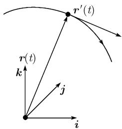
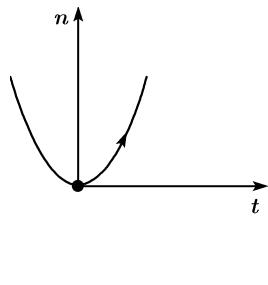
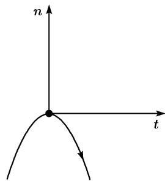
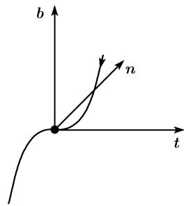
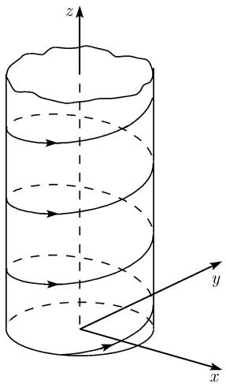

# 《数学指南——实用数学手册》3.6.2 空间曲线

本页是《数学指南——实用数学手册》第 8 章第 362 页「3.6.2 空间曲线」一节的抽取稿摘要，属于 3.6「微分几何学」的第二个子节，前承 [[平面曲线]]（3.6.1），后接 3.6.3「高斯的曲面局部理论」。

## 内容结构

本节按以下顺序展开：

1. **参数化与切线**——以径向量 $\boldsymbol{r}=\overrightarrow{OP}$ 定义空间曲线，给出切线方程与物理解释（速度、加速度）。
2. **3.6.2.1 曲率和挠率**——弧长、以弧长为参数的泰勒展开 (3.25)、单位切向量 $\boldsymbol{t}$、曲率 $k$、曲率半径 $R$、单位法向量 $\boldsymbol{n}$、副法向量 $\boldsymbol{b}$、挠率 $w$、伴随 3 标架与三平面、一般参数化公式 (3.26)、螺线实例。
3. **3.6.2.2 曲线论中的主定理**——Frenet 公式 (3.27) 与主定理（存在唯一性）及其构建过程。

## 参数化与切线

设 $x,y,z$ 为以 $\mathbf{i},\mathbf{j},\mathbf{k}$ 为基向量的笛卡儿坐标，点 $P$ 的径向量为 $\boldsymbol{r}=\overrightarrow{OP}$。空间曲线由方程

$$
\boxed{\boldsymbol{r}=\boldsymbol{r}(t),\quad a\leqslant t\leqslant b}
$$

给出，即 $x=x(t)$、$y=y(t)$、$z=z(t)$ 及 $a\leqslant t\leqslant b$。

在点 $\boldsymbol{r}_0:=\boldsymbol{r}(t_0)$ 的切线方程：

$$
\boxed{\boldsymbol{r}=\boldsymbol{r}_0+(t-t_0)\boldsymbol{r}'(t_0),\quad t\in\mathbb{R}.}
$$

**物理解释** 若 $t$ 代表时间，则空间曲线 $\boldsymbol{r}=\boldsymbol{r}(t)$ 描述了一个质点以在 $t$ 时的速度向量 $\boldsymbol{r}'(t)$ 及加速度 $\boldsymbol{r}''(t)$ 的运动（图 3.51）。

## 3.6.2.1 曲率和挠率

### 弧长

$$
\boxed{s:=\int_a^b|\boldsymbol{r}'(t)|\mathrm{d}t=\int_a^b\sqrt{x'(t)^2+y'(t)^2+z'(t)^2}\,\mathrm{d}t.}
$$

若以 $t_0$ 代替 $b$，则得到起点和曲线在时刻 $t_0$ 的点间的弧长。后文中把空间曲线 $\boldsymbol{r}(s)$ 看成是弧长 $s$ 的函数，并以 $\boldsymbol{r}'(s)$ 表示对 $s$ 的导数。

### 泰勒展开

$$
\boldsymbol{r}(s)=\boldsymbol{r}(s_0)+(s-s_0)\boldsymbol{r}'(s_0)+\frac{(s-s_0)^2}{2}\boldsymbol{r}''(s_0)+\frac{(s-s_0)^3}{6}\boldsymbol{r}'''(s_0)+\dots.\tag{3.25}
$$

下面的定义基于这个公式。

### 基本向量与标量定义（原文公式）

单位切向量：

$$
\boxed{\boldsymbol{t}:=\boldsymbol{r}'(s_0).}
$$

曲率：

$$
\boxed{k:=|\boldsymbol{r}''(s_0)|.}
$$

称数 $R:=1/k$ 为曲率半径。

单位法向量：

$$
\boxed{\boldsymbol{n}:=\frac{1}{k}\boldsymbol{r}''(s_0).}
$$

副法向量：

$$
\boxed{\boldsymbol{b}:=\boldsymbol{t}\times\boldsymbol{n}.}
$$

挠率：

$$
\boxed{w:=R\boldsymbol{b}\boldsymbol{r}'''(s_0).}
$$

> 注：源抽取稿中挠率一行写作 `w := R b r'''(s0)`，缺少 $\boldsymbol{b}$ 与 $\boldsymbol{r}'''(s_0)$ 之间的点乘符号；参见 [[362节挠率定义漏点乘与w0邻域方向表述疑似讹误]]。

### 几何解释

这三个向量 $\boldsymbol{t},\boldsymbol{n},\boldsymbol{b}$ 构成了曲线上点 $P$ 的所谓**伴随 3 标架**${}^{1)}$，是个两两正交的右手系的单位向量（图 3.53）。

(i) 曲线在点 $P_0$ 的**切触平面**由 $\boldsymbol{t}$ 和 $\boldsymbol{n}$ 张成。
(ii) 曲线在点 $P_0$ 的**法平面**由 $\boldsymbol{n}$ 和 $\boldsymbol{b}$ 张成。
(iii) 曲线在点 $P_0$ 的**从切平面**由 $\boldsymbol{t}$ 和 $\boldsymbol{b}$ 张成。

根据 (3.25) 知，曲线在点 $P_0$ 的切触平面中处于二阶（即具有二阶切触）（图 3.52）。

- 若对点 $P_0$ 有 $w=0$，则根据 (3.25) 该曲线在三阶上是条平面曲线。
- 若在点 $P_0$ 有 $w>0$（分别地，$w<0$），则曲线在 $P_0$ 点的邻域以 $\boldsymbol{b}$（分别地，$-\boldsymbol{b}$）方向移动（图 3.53）。

> 源文本原句为「则曲线在 $P_0$ 点的邻域以 b（分别地，-b）方向移动」，存在括号配对疑似讹误；另图 3.53 的图注为「拐点」，与文中对 $w$ 正负号邻域方向的说明并不完全对应。

### 一般的参数化

若曲线由 $\boldsymbol{r}=\boldsymbol{r}(t)$ 的形式给出，$t$ 为实参数，则有

$$
\begin{array}{l}
k^2=\dfrac{1}{R^2}=\dfrac{\boldsymbol{r}'^2\boldsymbol{r}''^2-(\boldsymbol{r}'\boldsymbol{r}'')^2}{(\boldsymbol{r}'^2)^3}\\[4pt]
\quad=\dfrac{(x'^2+y'^2+z'^2)(x''^2+y''^2+z''^2)-(x'x''+y'y''+z'z'')^2}{(x'^2+y'^2+z'^2)^3},
\end{array}
$$

$$
w=R^2\dfrac{(\boldsymbol{r}'\times\boldsymbol{r}'')\boldsymbol{r}'''}{(\boldsymbol{r}'^2)^3}
=R^2\dfrac{\begin{vmatrix}x'&y'&z'\\ x''&y''&z''\\ x'''&y'''&z'''\end{vmatrix}}{(x'^2+y'^2+z'^2)^3}.\tag{3.26}
$$

### 例：螺线

$$
\boxed{x=a\cos t,\quad y=a\sin t,\quad z=bt,\quad t\in\mathbb{R},}
$$

其中 $a>0$ 及 $b>0$（右手系，见图 3.54）；分别地 $b<0$（左手系）。有

$$
\boxed{k=\frac{1}{R}=\frac{a}{a^2+b^2},\quad w=\frac{b}{a^2+b^2}.}
$$

源文件所给证明：以弧长 $s$ 替代参数 $t$，

$$
s=\int_0^t\sqrt{\dot{x}^2+\dot{y}^2+\dot{z}^2}\,\mathrm{d}t=t\sqrt{a^2+b^2}.
$$

于是有

$$
x=a\cos\frac{s}{\sqrt{a^2+b^2}},\quad y=a\sin\frac{s}{a^2+b^2},\quad z=\frac{bs}{\sqrt{a^2+b^2}},
$$

$$
w=\left(\frac{a^2+b^2}{a}\right)^2\frac{\begin{vmatrix}-a\sin t&a\cos t&b\\ -a\cos t&-a\sin t&0\\ a\sin t&-a\cos t&0\end{vmatrix}}{\left[(-a\sin t)^2+(a\cos t)^2+b^2\right]^3}=\frac{b}{a^2+b^2}.
$$

这表明挠率也为常数。

> 源抽取稿中 $y$ 的表达式分母写作 $a^2+b^2$（缺平方根），与其他两个分量使用 $\sqrt{a^2+b^2}$ 不一致，疑似讹误；亦未见 $k$ 的直接证明过程。

## 3.6.2.2 曲线论中的主定理

### 费雷内公式

对于向量 $\boldsymbol{t},\boldsymbol{n},\boldsymbol{b}$ 关于弧长的导数有

$$
\boxed{\begin{array}{lll}\boldsymbol{t}'=k\boldsymbol{n},&\boldsymbol{n}'=-k\boldsymbol{t}+w\boldsymbol{b},&\boldsymbol{b}'=-w\boldsymbol{n}.\end{array}}\tag{3.27}
$$

### 主定理

若在区间 $a\leqslant s\leqslant b$ 中给出了两个连续函数

$$
k=k(s)\ \text{和}\ w=w(s)
$$

并且对所有 $s$ 有 $k(s)>0$，则在差一个全空间的变换下，恰好存在一条曲线段 $\boldsymbol{r}=\boldsymbol{r}(s),\ a\leqslant s\leqslant b$，它的弧长等于 $s$，并有曲率 $k$ 和挠率 $w$。

> 源抽取稿此处将「挠率 $w$」印作「模率 $w$」，疑似 OCR 讹误。

### 曲线的构建

(i) 方程 (3.27) 由 $\boldsymbol{t},\boldsymbol{n}$ 和 $\boldsymbol{b}$ 中每个的 3 个分量的 9 个微分方程的方程组组成。在规定了值 $\boldsymbol{t}(0)$、$\boldsymbol{n}(0)$ 和 $\boldsymbol{b}(0)$（这相当于描述了在点 $s=0$ 的伴随 3 标架）时，这些微分方程 (3.27) 的解是唯一确定的。

(ii) 若另外还规定了向量 $\boldsymbol{r}(0)$，则得到了

$$
\boldsymbol{r}(s)=\boldsymbol{r}(0)+\int_0^s\boldsymbol{t}(s)\,\mathrm{d}s.
$$

> 该积分式中被积函数的自变量与积分上限同名（$\boldsymbol{t}(s)$ 对 $\mathrm{d}s$），源抽取稿如此印出。

## 图像

本节共引用 6 张图片，全部处于「无法查看/未能加载」状态：

| 文件 | 关联图号 | 上下文推断 |
|---|---|---|
| `media/10-数学指南实用数学手册--8-362-空间曲线--1andhpj/001-732a526f9520948358c74364cf3429a4e47005073a616949995eec01bff98bed.jpg` | 图 3.51 | 空间曲线及切向量；位于公式前 |
| `.../002-7894e1fc8a5b6c6d778291dab0e444bea9f76df070d406d0bb3e0c138aaaa31a.jpg` | 图 3.52 (a) | 图注「(a) k > 0」 |
| `.../003-bb2df84c5622d1344e58fdbd2b2ab825c3a0f1d7c7e7b187e04bc9f3eae0b450.jpg` | 图 3.52 (b) | 图注「(b) k < 0」 |
| `.../004-2b0c9c4526ac0115e7f8200f6627ab843afeaa91859b78e25ee5b7c3316a56d6.jpg` | 图 3.53 (a) | 图注「(a) w > 0」；伴随标架示意（$\boldsymbol{b},\boldsymbol{n},\boldsymbol{t}$） |
| `.../005-5d30d02dcd74530ac7d30ba7872604366b2096381d3157d1e776409ad2e24665.jpg` | 图 3.53 (b) | 图注「(b) w < 0」；Frenet 活动标架示意 |
| `.../006-a09a4c6dd300cc54ece51150bf2e9c4445fb6e05e5fcfa076514929097354954.jpg` | 图 3.54 | 圆柱螺线示意 |

图像 OCR 描述指出图 3.53（a）与（b）为 Frenet 活动标架示意，而正文图注为「拐点」；图 3.52 图注为「极小和极大」，与正文讨论的 $k>0$/$k<0$ 对应关系需核对。

## 存疑点

1. 挠率定义式缺少点乘符号。
2. $w$ 正负号邻域方向语句的括号配对问题。
3. 螺线证明中 $y$ 分量分母缺少平方根。
4. 主定理处「模率」应为「挠率」。
5. 伴随标架处脚注标记 ${}^{1)}$ 未落地。
6. 「费雷内公式」人名与 wiki 既有 `[[entities/费雷内]]` 及 3.6 节总览中的 `[[entities/塞雷]]` 的关系——源文本未提及塞雷。
7. 图号与图注的对应关系（图 3.53 标为「拐点」而非伴随标架）。

<!-- llm-wiki:embedded-images -->
## Embedded Images

### Document

<!-- llm-wiki:embedded-images -->
