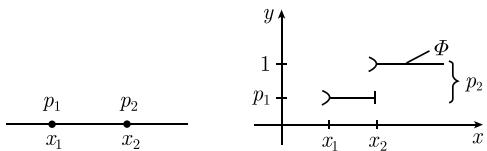
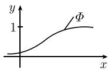
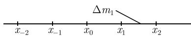

# 《数学指南——实用数学手册》6.2.2 随机变量

## 章节定位

本节紧接着 [[科尔莫戈罗夫公理化概率论]] 与 [[概率空间]] 的引入，正式定义随机变量这一"用于刻画具有随机性特征的观测量（如人的身高等）"的数学对象。全节的组织方式是把 6.2.1 节中已经出现的初等工具（均值、方差、分布函数）放到 [[概率空间]] $(E, \mathcal{S}, P)$ 的框架下重新表述，并以 [[斯蒂尔切斯积分]] 作为统一的计算工具。

本节由四个小节组成：

- 6.2.2.1 基本思想：有限结果集上的随机函数与均值、方差。
- 6.2.2.2 分布函数：随机变量的一般定义、分布函数的定义、两个定理与斯蒂尔切斯积分。
- 6.2.2.3 期望值（均值）：期望的测度论定义与运算法则。
- 6.2.2.4 方差与切比雪夫不等式：方差、标准差、切比雪夫不等式与矩。

## 6.2.2.1 基本思想

设 $E = \{e_1, \cdots, e_n\}$ 是有限个可能结果，结果 $e_1, \cdots, e_n$ 发生的概率分别为 $p_1, \cdots, p_n$。$E$ 上的一个随机函数

$$
\boxed{X: E \to \mathbb{R}}
$$

是一个将每个基本事件 $e_j$ 映射为一个实数 $X(e_j) := x_j$ 的函数。如果对 $X$ 进行一次测量，那么将以概率 $p_j$ 得到测量值 $x_j$。重要的量是均值 $\overline{X}$ 与标准差的平方 $(\Delta X)^2$：

$$
\boxed{\overline{X} := \sum_{j=1}^{n} x_j p_j, \quad (\Delta X)^2 := \overline{(X - \overline{X})^2} = \sum_{j=1}^{n} (x_j - \overline{X})^2 p_j.}
$$

标准差的平方称为方差，量 $\Delta X = \sqrt{(\Delta X)^2}$ 称为标准差。切比雪夫不等式的一个特殊情况解释了方差与标准差的重要性：$X$ 的任意一个测量值落入区间

$$
\left[\overline{X} - 4\Delta X, \overline{X} + 4\Delta X\right]\tag{6.13}
$$

的概率大于 0.93（见 6.2.2.4）。

### 卡西诺游戏例（表 6.5）

一个假想的卡西诺游戏允许玩家掷一粒骰子，并按照掷出的点数付钱给玩家；负数（或正数）是此卡西诺赢（或输）的钱数。原文表 6.5 如下：

| 玩家掷出的点数 | 1 | 2 | 3 | 4 | 5 | 6 |
| --- | --- | --- | --- | --- | --- | --- |
| 卡西诺支付的钱数/美元 | 1 | 2 | 3 | −4 | −5 | −6 |
| $x_j$ | $x_1$ | $x_2$ | $x_3$ | $x_4$ | $x_5$ | $x_6$ |

实际上，表 6.5 第二行的数值被直接记为 $x_j$（$x_1 = 1, \dots, x_6 = -6$）；原文在"卡西诺支付的钱数"处带有一个脚注标记，但该脚注正文在源文档中缺失。

假设这种卡西诺游戏每天要玩 10 000 次，问题是每天的平均收入。令 $e_i$ 表示事件"掷出 $i$ 点"，且 $X(e_j) :=$ 当玩家掷出 $j$ 点时卡西诺支付的钱数，则

$$
\overline{X} = \sum_{j=1}^{6} x_j p_j = (x_1 + \dots + x_6)\frac{1}{6} = -1.5 .
$$

即该游戏平均每天可挣 $1.5 \times 10000$ 美元 = 15000 美元；但由于标准差 $\Delta X = 3.6$ 非常之大，每天的收益会有巨大变化，这促使卡西诺老板开发更加有利可图的游戏。

**历史注**：17 世纪人们在机会游戏中认识到均值（期望）$\overline{X}$ 这一基本概念的重要性，其中 [[帕斯卡]]（Pascal, 1623—1662）与 [[费马]]（Fermat, 1601—1665）之间一组著名的通信起了非常重要的作用。

## 6.2.2.2 分布函数

**定义** 设 $(E, \mathcal{S}, P)$ 是以 $P$ 为概率测度的概率空间。$E$ 上的随机变量 $X$ 是一个函数，而且对于每个 $x \in \mathbb{R}$，集合

$$
A_x = \{e \in E : X(e) < x\}
$$

都是一个事件（原文此处带脚注标记，脚注正文缺失）。这样 $X$ 的分布函数

$$
\boxed{\Phi(x) := P(X < x)}
$$

就有明确定义，其中 $P(X < x)$ 代表 $P(A_x)$。

**策略**：将随机变量的全面研究简化为对分布函数的的研究。

**直观解释**：假设在实数轴上赋予一个总质量为 1 的质量分布，则 $\Phi(x)$ 的值是区间 $J := ]-\infty, x[$ 所包含的质量，也是 $X$ 的测量值落入区间 $J$ 的概率：

$$
\boxed{\Phi(x) \text{ 越大}, X \text{ 的测量值落入区间 } ]-\infty, x[ \text{ 的概率越大}.}
$$

- **例 1**：若点 $x_1$ 的质量 $p = 1$，则相应的分布函数如图 6.9 所示（图注原文为"具有单位质量的点 $p$"）。
- **例 2**：若点 $x_1$ 与 $x_2$ 分别有质量 $p_1$ 与 $p_2$，且 $p_1 + p_2 = 1$，则相应分布函数如图 6.10 所示。更明确地有

$$
\Phi(x) =
\begin{cases}
0, & x \leqslant x_1, \\
p_1, & x_1 < x \leqslant x_2, \\
p_1 + p_2 = 1, & x_2 < x.
\end{cases}
$$

- **例 3**：若 $\Phi: \mathbb{R} \to \mathbb{R}$ 连续可微，则其导函数

$$
\boxed{\varphi(x) := \Phi'(x)}
$$

是一个连续质量密度 $\varphi: \mathbb{R} \to \mathbb{R}$，且有

$$
\boxed{\Phi(x) = \int_{-\infty}^{x} \varphi(\xi)\,\mathrm{d}\xi, \quad x \in \mathbb{R}.}
$$

区间 $[a, b]$ 所包含的质量等于图 6.11 中阴影部分的面积。$\varphi$ 称为质量密度（或概率密度）。例如高斯正态分布的概率密度为（原文带一个脚注标记，脚注正文缺失）

$$
\boxed{\varphi(x) := \frac{1}{\sigma\sqrt{2\pi}}\mathrm{e}^{-(x-\mu)^2/2\sigma^2}.}
$$

**离散型与连续型随机变量**：若随机变量 $X$ 的分布函数只取有限多个值，称 $X$ 为离散型随机变量；若分布函数连续可微（如例 3），称 $X$ 为连续型随机变量。规定

$$
\Phi(x \pm 0) := \lim_{t \to x \pm 0} \Phi(t).
$$

**定理 1** 分布函数 $\Phi: \mathbb{R} \to \mathbb{R}$ 有如下性质：

(i) $\Phi$ 是单调增加函数，而且是左连续的，即对于所有的 $x \in \mathbb{R}$ 都有 $\Phi(x - 0) = \Phi(x)$。

(ii) $\lim_{x \to -\infty}\Phi(x) = 0,\quad \lim_{x \to +\infty}\Phi(x) = 1.$

**定理 2** 对于一切实数 $a, b$（$a < b$），有

(i) $P(a \leqslant x < b) = \Phi(b) - \Phi(a).$

(ii) $P(a \leqslant x \leqslant b) = \Phi(b + 0) - \Phi(a).$

(iii) $P(X = a) = \Phi(a + 0) - \Phi(a - 0).$

### 斯蒂尔切斯积分

对于随机变量的运算，斯蒂尔切斯积分

$$
S := \int_{-\infty}^{\infty} f(x)\,\mathrm{d}\Phi(x)
$$

是最基本也是最重要的工具（见 6.2.2.3）。该积分是关于实数轴上相应于 $\Phi$ 的质量密度所形成的测度的。直观地讲，近似有

$$
S = \sum_{j} f(x_j)\Delta m_j ,
$$

即先把实直线划分为质量为 $\Delta m_j$ 的小区间 $[x_j, x_{j+1}]$，构造乘积 $f(x_j)\Delta m_j$，在整个实直线上求和，最后通过无限缩小区间长度取极限（图 6.12）。因此

$$
\boxed{\int_{-\infty}^{\infty} \mathrm{d}\Phi = \mathbb{R} \text{ 上的总质量} = 1.}
$$

斯蒂尔切斯积分的严格定义可在参考文献 [212] 中找到。原文给出的计算结果"可以充分满足最实用的目的"。设 $f: \mathbb{R} \to \mathbb{R}$ 为给定连续函数：

(i) 若 $\Phi: \mathbb{R} \to \mathbb{R}$ 可微，则只要经典积分 $\int_{-\infty}^{\infty} f(x)\Phi'(x)\,\mathrm{d}x$ 收敛，就有

$$
\boxed{\int_{-\infty}^{\infty} f(x)\,\mathrm{d}\Phi = \int_{-\infty}^{\infty} f(x)\Phi'(x)\,\mathrm{d}x.}
$$

(ii) 若 $\Phi$ 只取有限多个值，则

$$
\boxed{\int_{-\infty}^{\infty} f(x)\,\mathrm{d}\Phi = \sum_{j=1}^{n} f(x_j)\left(\Phi(x_j + 0) - \Phi(x_j - 0)\right),}
$$

其中求和关于 $\Phi$ 的所有不连续点 $x_j$ 进行。

(iii) 若 $\Phi$ 只取可数个值，而且对于不连续点 $x_j$ 有关系式 $\lim_{n \to \infty} x_j = +\infty$，则只要 $\sum_{j=1}^{\infty} f(x_j)\left(\Phi(x_j + 0) - \Phi(x_j - 0)\right)$ 收敛，就有

$$
\boxed{\int_{-\infty}^{\infty} f(x)\,\mathrm{d}\Phi = \sum_{j=1}^{\infty} f(x_j)\left(\Phi(x_j + 0) - \Phi(x_j - 0)\right).}
$$

(iv) 若 $\Phi$ 除去有限多个不连续点 $x_1, \cdots, x_n$ 外可微，则只要积分 $\int_{-\infty}^{\infty} f(x)\Phi'(x)\,\mathrm{d}x$ 收敛，就有

$$
\boxed{\int_{-\infty}^{\infty} f(x)\,\mathrm{d}\Phi = \int_{-\infty}^{\infty} f(x)\Phi'(x)\,\mathrm{d}x + \sum_{j=1}^{n} f(x_j)\left(\Phi(x_j + 0) - \Phi(x_j - 0)\right).}
$$

## 6.2.2.3 期望值（均值）

期望值是随机变量最重要的数量特征；随机变量的所有其他重要数量特征（标准差、高阶矩、相关系数、协方差）都可以通过构造随机变量的适当函数并求其期望获得。

**定义** 设 $X: E \to \mathbb{R}$ 为一个随机变量，若积分 $\int_E X(e)\,\mathrm{d}P$ 存在，则 $X$ 的期望（均值）为

$$
\boxed{\overline{X} = \int_E X(e)\,\mathrm{d}P.}\tag{6.14}
$$

该积分应当作为一个抽象的测度论积分（见 [212]）来理解，但可以简化为关于 $X$ 的分布函数的斯蒂尔切斯积分：

$$
\boxed{\overline{X} = \int_{-\infty}^{\infty} x\,\mathrm{d}\Phi.}
$$

**直观意义**：期望 $\overline{X}$ 是对应于 $\Phi$ 的质量分布的质量中心。

关于期望运算的法则：

(i) **可加性**：若 $X$ 与 $Y$ 都是 $E$ 上的随机变量，则

$$
\overline{X + Y} = \overline{X} + \overline{Y}.
$$

(ii) **随机变量的函数**：设 $X: E \to \mathbb{R}$ 以 $\Phi$ 为分布函数。若 $F: \mathbb{R} \to \mathbb{R}$ 连续，则复合函数 $Z := F(X)$ 也是 $E$ 上的随机变量，而且只要积分 $\int_{-\infty}^{\infty} F(x)\,\mathrm{d}\Phi$ 收敛，就有

$$
\overline{Z} = \int_E F(X(e))\,\mathrm{d}P = \int_{-\infty}^{\infty} F(x)\,\mathrm{d}\Phi .
$$

## 6.2.2.4 方差与切比雪夫不等式

**定义** 若 $X: E \to \mathbb{R}$ 是一个随机变量，则 $X$ 的方差定义为

$$
\boxed{(\Delta X)^2 := \overline{(X - \overline{X})^2}.}
$$

若 $\Phi$ 是 $X$ 的分布函数，则只要 $\int_{-\infty}^{\infty} (x - \overline{X})^2\,\mathrm{d}\Phi$ 收敛，就有

$$
(\Delta X)^2 = \int_E (X(e) - \overline{X})^2\,\mathrm{d}P = \int_{-\infty}^{\infty} (x - \overline{X})^2\,\mathrm{d}\Phi .
$$

$X$ 的标准差定义为 $\Delta X := \sqrt{(\Delta X)^2}$。

- **例 1（连续型随机变量）**：若 $\Phi$ 在 $\mathbb{R}$ 上有连续导数 $\varphi = \Phi'$，则

$$
\boxed{\overline{X} = \int_{-\infty}^{\infty} x\varphi(x)\,\mathrm{d}x, \quad (\Delta X)^2 = \int_{-\infty}^{\infty} (x - \overline{X})^2\varphi(x)\,\mathrm{d}x.}
$$

- **例 2（离散型随机变量）**：若 $X$ 只取有限个值 $x_1, \cdots, x_n$，而且规定 $p_j := P(X = x_j)$，则

$$
\boxed{\overline{X} = \sum_{j=1}^{n} x_j p_j, \quad (\Delta X)^2 = \sum_{j=1}^{n} (x_j - \overline{X})^2 p_j.}
$$

**切比雪夫不等式** 若 $X: E \to \mathbb{R}$ 是随机变量且其标准差 $\Delta X < \infty$，则对任何实数 $\beta > 0$，都有

$$
\boxed{P(|X - \overline{X}| > \beta \Delta X) \leqslant \frac{1}{\beta^2}.}
$$

特别地，若 $\Delta X = 0$，则有 $P(X = \overline{X}) = 1$，即 $X$ 几乎必然只取其期望值。

**对置信区间的应用** 若选择 $0 < \alpha < 1$，则 $X$ 的观测值落入区间

$$
\left[\overline{X} - \frac{\Delta X}{\sqrt{\alpha}}, \overline{X} + \frac{\Delta X}{\sqrt{\alpha}}\right]
$$

的概率大于 $1 - \alpha$。

**例 3（$4\Delta X$ 准则）**：假设 $\alpha = 1/16$，则 $X$ 的所有观测值落入区间

$$
\boxed{[\overline{X} - 4\Delta X, \overline{X} + 4\Delta X]}
$$

的概率大于 0.93。

**随机变量的矩** $X$ 的 $k$ 次幂的期望

$$
\mu_k := \overline{X^k} \quad k = 0, 1, 2, \dots
$$

称为 $X$ 的 $k$ 阶矩。若 $\Phi$ 是 $X$ 的分布函数，则

$$
\mu_k = \int_E X^k\,\mathrm{d}P = \int_{-\infty}^{\infty} x^k\,\mathrm{d}\Phi .
$$

著名的"矩问题"：$X$ 的各阶矩的值能唯一确定其分布函数吗？在适当的假设下，这个问题的答案是肯定的（见 [212]）。

## 图表清单

| 图/表编号 | 内容 | 本地路径 | 加载状态 |
| --- | --- | --- | --- |
| 表 6.5 | 一场卡西诺牌戏中的输赢情况 | —（表格已在上文完整复制） | 正常 |
| 图 6.9 | 具有单位质量的点的分布函数 | media/10-数学指南实用数学手册--8-622-随机变量--1khykov/001-908fa99b9e36ca2f3ff626f43b2e2b12c7d41f494f8da2b0c4eb8f5bfc0a01df.jpg | 未能加载 |
| 图 6.10 | 两点分布 | media/10-数学指南实用数学手册--8-622-随机变量--1khykov/002-afc9a6c99e2290947090cfbbe60c5a396bb1a7668af7e31c11692691f3402b95.jpg | 正常 |
| 图 6.11 | 视概率密度和分布函数为质量函数（两幅） | media/10-数学指南实用数学手册--8-622-随机变量--1khykov/003-c243043cf29a89a9d03270a3c8f32227799c2951b7d699c8872353dea28d1f3f.jpg、media/10-数学指南实用数学手册--8-622-随机变量--1khykov/004-1ad29979d1614a1730030123a153622d2e8b133bcd654c08cc30ee1febaa3a76.jpg | 未能加载 |
| 图 6.12 | 斯蒂尔切斯积分的直观解释 | media/10-数学指南实用数学手册--8-622-随机变量--1khykov/005-152aec9a15cbe1dcf776c0b242aa970146ccb914ec1fea73585ed7861c1257ea.jpg | 未能加载 |

## 相关页面

- 概念：[[随机变量]]、[[分布函数]]、[[斯蒂尔切斯积分]]、[[期望值]]、[[方差与标准差]]、[[离散型与连续型随机变量]]、[[矩与矩问题]]
- 人物：[[帕斯卡]]、[[费马]]、[[斯蒂尔切斯]]
- 前序章节：[[科尔莫戈罗夫公理化概率论]]、[[概率空间]]、[[概率测度]]、[[事件域]]、[[测度论]]、[[均值与方差]]、[[概率密度与分布函数]]、[[高斯正态分布]]、[[切比雪夫不等式]]、[[置信区间]]
- 本节findings：[[6221节随机变量基本思想与卡西诺游戏例]]、[[6222节分布函数定义与两个定理]]、[[6222节斯蒂尔切斯积分与四种计算情形]]、[[6223节期望值定义与运算法则]]、[[6224节方差定义与切比雪夫不等式]]、[[6224节矩与矩问题]]
- 待查问题：[[622节图611与图612未能加载]]、[[622节参考文献212第三次出现条目信息缺失]]、[[622节定理2中x与X记号混用]]、[[622节三处脚注标记缺脚注正文]]

<!-- llm-wiki:embedded-images -->
## Embedded Images

### Document

<!-- llm-wiki:embedded-images -->
