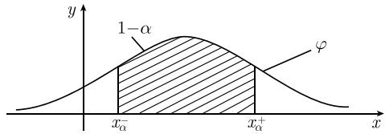

# 《数学指南——实用数学手册》6.3.1 基本思想

## 概要

本页是《数学指南——实用数学手册》第 6.3 节「数理统计」下子节 **6.3.1 基本思想** 的来源摘要。该子节属于综述性与定义性文字，不含实证数据，其作用是为 6.3 节的后续子节（6.3.2 及以后）铺垫基本记号与操作流程。

全节围绕四个层次展开：

1. **置信区间的形式定义**（以随机变量 X 与其分布函数 Φ 为载体），并给出连续概率密度情形与正态分布情形两个例子；
2. **变列（顺序统计量序列）**——n 次测量得到的实数序列 `x₁, …, xₙ`；
3. **数学随机样本**——随机向量 `(X₁, …, Xₙ)`，用于从数学上刻画重复测量的随机性；
4. **数理统计基本策略**——假设检验的五步操作流程，并推广到参数估计与两个变异序列的比较。

父级来源为 [[10-数学指南实用数学手册--7-63-数理统计--1kr178q]]（6.3 数理统计），本文件是其展开子节。

## 置信区间的形式定义

假设 Φ 是随机变量 X 的分布函数。如果

$$
P(x_{\alpha}^{-} \leqslant X \leqslant x_{\alpha}^{+}) = 1 - \alpha,
$$

则称 $[x_{\alpha}^{-}, x_{\alpha}^{+}]$ 为 X 的一个 α 置信区间。

来源给出的解释是：X 的测量值落在置信区间 $[x_{\alpha}^{-}, x_{\alpha}^{+}]$ 内的概率为 $1 - \alpha$。

该定义是本节全篇的出发点，也是后续假设检验判据（步骤 (iv)(v)）所依赖的对象。与已有页面 [[置信区间]] 的关系见下文「与已有页面的关联」。

## 例 1：连续概率密度情形

若 X 有连续概率密度 $\varphi$，则相应于置信区间 $[x_{\alpha}^{-}, x_{\alpha}^{+}]$ 的阴影部分的面积等于 $1 - \alpha$，即有

$$
\int_{x_{\alpha}^{-}}^{x_{\alpha}^{+}} \varphi(x) \mathrm{d}x = 1 - \alpha .
$$

来源中配图如下（该图**未能成功加载**，系统提示 `unsupported content type: image_url`，因此无法核验其内容）：

## 例 2：正态分布 N(μ, σ)

对于均值为 μ、标准差为 σ 的正态分布 $N(\mu, \sigma)$，置信区间 $[x_{\alpha}^{-}, x_{\alpha}^{+}]$ 由

$$
x_{\alpha}^{\pm} = \mu \pm \sigma z_{\alpha}
$$

给出。其中 $z_{\alpha}$ 的值可由等式

$$
\Phi_0(z_{\alpha}) = \frac{1 - \alpha}{2}
$$

并借助**表 0.34** 得到。来源原文称：特别地，对于 $\alpha = 0.01, 0.05$ 和 $0.1$，分别有 $z_{\alpha} = 1.6, 2.0$ 和 2.6。

该数值对应关系与常见正态分位点次序不符，见下文「疑点与待核查」及查询 [[631节z-alpha取值与残概率对应疑点]]。

## 变列（顺序统计量序列）

假设 X 是一个给定的随机变量。在实际情况下，人们通过一系列观察或试验对 X 进行 n 次测量，由此得到 n 个实数

$$
x_{1}, x_{2}, \dots, x_{n}
$$

作为 X 的测量值。上述序列称为一个**变列**或**顺序统计量序列**。关于变列，来源给出的基本假设是这些观测结果彼此独立，即每次得到的测量结果都不影响以后的测量。

详见 [[变列与顺序统计量序列]]。

## 数学随机样本

每次试验的测量结果不尽相同。为了从数学上描述这一事实，考虑随机向量

$$
(X_{1}, \dots, X_{n}),
$$

它的各个分量是相互独立的随机变量，而且所有分量 $X_{j}$ 都与 X 具有相同的分布函数。

详见 [[数学随机样本]]。

## 数理统计基本策略（五步）

来源给出的操作流程原文如下：

(i) **提出假设 (H)**：X 的分布函数 Φ 具有性质 ℰ。

(ii) **构造样本函数**

$$
Z = Z(X_{1}, \dots, X_{n}),
$$

并在假设 (H) 成立的条件下确定其分布函数 $\Phi_{Z}$。

(iii) 经过一系列测量得到测量值 $x_{1}, \cdots, x_{n}$ 之后，计算实数 $z := Z(x_{1}, \cdots, x_{n})$。称 z 为样本函数 Z 的一个**实现**。

(iv) 若 z 的值落在 Z 的 α 置信区间**之外**，则以出错概率 α **拒绝**假设 (H)。

(v) 若 z 的值落在 Z 的 α 置信区间**里**，则说观测结果与假设 (H) 不矛盾，因此**接受**假设 (H)。来源称这时犯错误的概率仍为 $\alpha^{*}$（原文带星号标记）。

例 3：假设 (H) 可以是「Φ 是正态分布函数」。

详见 [[数理统计基本策略]] 与 [[样本函数]]。

## 参数估计

如果分布函数 Φ 依赖于某些参数，那么我们希望知道这些参数的取值区间。来源指出一个典型例子可在 6.2.5.6 节中找到（对应已有页面 [[概率p的置信区间]] 及其来源 [[10-数学指南实用数学手册--19-625-应用于独立重复试验的伯努利模型--89e2y0]]）。

详见 [[参数估计]]。

## 两个变异序列的比较

若工作同时涉及两个随机变量 X 和 Y，则假设 (H) 可以是关于 X 和 Y 的分布函数的。此时样本函数的形式为

$$
Z = Z(X_{1}, \dots, X_{n}, Y_{1}, \dots, Y_{n}).
$$

由 X 和 Y 的一组测量值 $x_{1}, \cdots, x_{n}, y_{1}, \cdots, y_{n}$ 可确定该样本函数的一个实现 $z = Z(x_{1}, \cdots, x_{n}, y_{1}, \cdots, y_{n})$。这样基本策略中的步骤 (iv) 和 (v) 就简化为只考查一个样本函数 Z，并由此推断出结论。

详见 [[两个变异序列的比较]]。

## 与已有页面的关联

- [[置信区间]]：本节的置信区间**形式定义**（$P(x_{\alpha}^{-} \leqslant X \leqslant x_{\alpha}^{+}) = 1 - \alpha$）应视为该通用概念页在 6.3 语境下的正式表述；[[10-数学指南实用数学手册--9-61-基本的随机性--1r43h9a]]（6.1.4）与本文档给出的是同一记号体系的两次出现。
- [[假设检验与残概率]]：本节步骤 (iv)(v) 的「出错概率 α」与伯努利模型语境下的假设检验/残概率是同一误差刻画的两种表述，但**载体不同**（前者作用于样本函数 Z 的分布，后者作用于伯努利模型的频率统计量），不应互相替换。
- [[概率p的置信区间]]：来源明确把参数估计的典型例子指向 6.2.5.6 节，即该页。
- [[数理统计金箴]]（methodology）与 [[63节数理统计的学科界定与负责任的统计实践]]：本节五步策略是这两位上级论述的具体操作层。
- [[高斯正态分布]]：例 2 的 N(μ, σ)；[[分布函数]]：假设 (H) 的载体 Φ；[[随机变量]]：被估计/被检验的对象 X；[[随机向量]]：数学随机样本的载体形态。

## 疑点与待核查

1. **$z_{\alpha}$ 与 α 的对应次序**：来源给出 α = 0.01, 0.05, 0.1 分别对应 $z_{\alpha}$ = 1.6, 2.0, 2.6，与由本节自身给出的 $\Phi_0(z_{\alpha}) = (1-\alpha)/2$ 反解得到的次序不符（标准值约为 2.576, 1.96, 1.645）。见 [[631节z-alpha取值与残概率对应疑点]]。
2. **图号不一致**：正文称「图 1.16」，而图注为「图 6.16 正态分布」。见 [[631节图116与图616编号不一致]]。
3. **步骤 (v) 末尾的星号** $\alpha^{*}$：文中出现脚注式星号标记但未见脚注正文。见 [[631节步骤v中alpha星号脚注缺失]]。
4. **配图未能加载**：`media/10-数学指南实用数学手册--8-631-基本思想--10uy6mb/001-47eec541ada95687c656a409a2ec2a375b1e72fecbb3d81608e9e7fd43d5a165.jpg` 无法显示，无法核验其阴影面积是否与例 1 一致。
5. **表 0.34**：来源以「表 0.34」作为查 z_α 的依据，但本节未给出该表的任何数值或所在位置说明。

<!-- llm-wiki:embedded-images -->
## Embedded Images

### Document

<!-- llm-wiki:embedded-images -->
