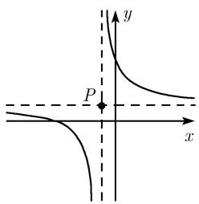
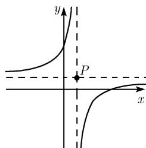
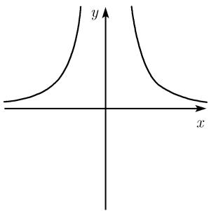
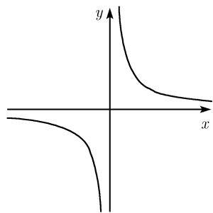
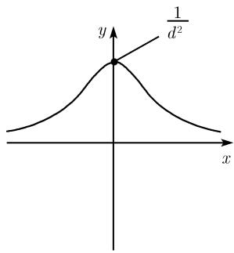
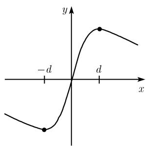

# 《数学指南——实用数学手册》0.2.15 有理函数

## 概述

本节是《数学指南——实用数学手册》0.2「初等函数及其图示」中紧接 0.2.14 多项式之后的一节，主题是**有理函数**（分子与分母皆为多项式的函数）。全节从最简分式 $y=b/x$ 出发，逐步过渡到线性分式函数、$n$ 次分母函数、二次分母函数，最后给出一般有理函数的定义与在无穷远点的性状。全节内容为教科书式的定义与推导，结论均属经典且充分建立的结果。

本节的关键关联对象是 [[concepts/多项式]]（本书 0.2.14），因为有理函数的分子与分母都是多项式。与本节结构平行的是 0.2.14 中的 [[concepts/多项式在无穷远点的性状]] 与 [[concepts/多项式的光滑性]]。

## 0.2.15.1 特殊有理函数

令 $b>0$ 为固定实数，函数

```latex
y = \frac{b}{x}, \quad x \in \mathbb{R},\ x \neq 0
```

表示以 $x$ 轴和 $y$ 轴为渐近线的等轴双曲线，其顶点为 $S_{\pm} = (\pm\sqrt{b}, \pm\sqrt{b})$（图 0.37）。其极限行为为

```latex
\lim_{x \to \pm\infty} \frac{b}{x} = 0, \qquad \lim_{x \to \pm 0} \frac{b}{x} = \pm\infty .
```

后一式表明 $x=0$ 是极点。

## 0.2.15.2 具有线性分子和分母的有理函数

令 $a,b,c,d$ 为已知实数，且 $c \neq 0$、$\Delta := ad - bc \neq 0$，则函数

```latex
y = \frac{ax+b}{cx+d}, \quad x \in \mathbb{R} \text{ 且 } x \neq -\frac{d}{c} \tag{0.44}
```

通过坐标变换

```latex
x = u - \frac{d}{c}, \qquad y = w + \frac{a}{c}
```

可以化简为

```latex
w = -\frac{\Delta}{c^{2} u}.
```

即一般方程 (0.44) 经简单坐标变换后化为标准形式 $y = -\dfrac{\Delta}{c^{2}x}$，该变换把点 $(0,0)$ 变为点 $P\left(-\dfrac{d}{c}, \dfrac{a}{c}\right)$（图 0.38，分 $\Delta<0$ 与 $\Delta>0$ 两情形）。

## 0.2.15.3 具有 $n$ 次分母的特殊有理函数

已知 $b>0$，$n=1,2,\cdots$，函数

```latex
y = \frac{b}{x^{n}}, \quad x \in \mathbb{R} \text{ 且 } x \neq 0
```

的图像随 $n$ 的奇偶而形状不同（图 0.39）：(a) $n$ 为偶数；(b) $n$ 为奇数。

## 0.2.15.4 具有二次分母的有理函数

### 特例 1

已知 $d>0$，函数

```latex
y = \frac{1}{x^{2}+d^{2}}, \quad x \in \mathbb{R}
```

与

```latex
y = \frac{x}{x^{2}+d^{2}}, \quad x \in \mathbb{R}
```

如图 0.40 所示。

### 特例 2

已知两实数 $x_{\pm}$ 且 $x_{-} < x_{+}$，则由

```latex
y = \frac{1}{(x-x_{+})(x-x_{-})} \tag{0.45}
```

给出的函数 $y=f(x)$ 可变形为

```latex
y = \frac{1}{x_{+}-x_{-}}\left(\frac{1}{x-x_{+}} - \frac{1}{x-x_{-}}\right).
```

这是**部分分式分解**的一个特例（参看 2.1.7）。并且

```latex
\lim_{x \to x_{+}\pm 0} f(x) = \pm\infty, \qquad \lim_{x \to x_{-}\pm 0} f(x) = \mp\infty, \qquad \lim_{x \to \pm\infty} f(x) = 0 .
```

因此函数的极点在 $x_{+}$ 与 $x_{-}$（图 0.41）。

### 特例 3（表观奇点）

函数

```latex
y = \frac{x-1}{x^{2}-1} \tag{0.46}
```

在 $x=1$ 处没有定义；但利用分解 $x^{2}-1 = (x-1)(x+1)$ 得

```latex
y = \frac{1}{x+1}, \quad x \in \mathbb{R},\ x \neq -1 .
```

此时称函数 (0.46) 在点 $x=1$ 处有一个**表观奇点**。

### 一般情况

已知实数 $a,b,c,d$ 且 $a^{2}+b^{2} \neq 0$，由

```latex
y = \frac{ax+b}{x^{2}+2cx+d} \tag{0.47}
```

定义的函数 $y=f(x)$ 的性状取决于判别式 $D := c^{2}-d$ 的符号，并且恒有

```latex
\lim_{x \to \pm\infty} f(x) = 0 .
```

按 $D$ 的符号分类：

**情形 1：$D>0$。**

```latex
x^{2}+2cx+d = (x-x_{+})(x-x_{-}), \qquad x_{\pm} = -c \pm \sqrt{D},
```

由此得到部分分式分解

```latex
f(x) = \frac{A}{x-x_{+}} + \frac{B}{x-x_{-}},
```

常数 $A,B$ 由极限求得：

```latex
A = \lim_{x \to x_{+}} (x-x_{+})f(x) = \frac{ax_{+}+b}{x_{+}-x_{-}}, \qquad
B = \lim_{x \to x_{-}} (x-x_{-})f(x) = \frac{ax_{-}+b}{x_{-}-x_{+}} .
```

此时 $f$ 的极点在 $x_{\pm}$。

**情形 2：$D=0$。** 此时 $x_{+}=x_{-}$，故

```latex
f(x) = \frac{ax+b}{(x-x_{+})^{2}},
```

并有

```latex
\lim_{x \to x_{+}\pm 0} f(x) =
\begin{cases}
+\infty, & ax_{+}+b > 0, \\
-\infty, & ax_{+}+b < 0,
\end{cases}
```

即点 $x_{+}$ 是极点。

**情形 3：$D<0$。** 此时对一切 $x \in \mathbb{R}$ 有 $x^{2}+2cx+d > 0$，因此对任意 $x \in \mathbb{R}$，(0.47) 中的函数 $y=f(x)$ 都连续且无穷可微，即 $f$ 光滑。

## 0.2.15.5 一般有理函数

（实）有理函数是形如

```latex
y = \frac{a_{n}x^{n} + \cdots + a_{1}x + a_{0}}{b_{m}x^{m} + \cdots + b_{1}x + b_{0}}
```

的函数 $y=f(x)$，其中分子和分母上都是多项式（参看 0.2.14）。

### 在无穷远点的性状

令 $c := a_{n}/b_{m}$，有

```latex
\lim_{x \to \pm\infty} f(x) = \lim_{x \to \pm\infty} c\,x^{n-m} .
```

由此讨论所有可能情况。

**情形 1：$c>0$。**

```latex
\lim_{x \to +\infty} f(x) =
\begin{cases}
c, & n = m, \\
+\infty, & n > m, \\
0, & n < m,
\end{cases}

\lim_{x \to -\infty} f(x) =
\begin{cases}
c, & n = m, \\
+\infty, & n > m \text{ 且 } n-m \text{ 为偶数}, \\
-\infty, & n > m \text{ 且 } n-m \text{ 为奇数}, \\
0, & n < m.
\end{cases}
```

**情形 2：$c<0$。** 此时必须用 $\mp\infty$ 代替 $\pm\infty$。

### 部分分式分解

由部分分式分解能够得到有理函数的清晰结构（参看 2.1.7）。

## 图像引用

本节引用图 0.37–0.41。其中图 0.39(a)(b) 为 $y=b/x^{n}$ 的奇偶两种形态，图 0.40 为二次分母特例 1 的两条曲线，图 0.41 为特例 2 的函数图像。

```text
media/10-数学指南实用数学手册--9-0215-有理函数--111cnov/001-7f490daa382819218d285ff87d1575029d2b723493fe2c5f2353bca8fa38b5b3.jpg
media/10-数学指南实用数学手册--9-0215-有理函数--111cnov/006-630624911333975512ac36676fb0f98bf45ab57961a56780e4d865289e84e586.jpg
media/10-数学指南实用数学手册--9-0215-有理函数--111cnov/008-0ddef20c1af90a716683cf6ce347262cf11eb9e461e96e5ef5d93ebe44aab121.jpg
```

多数图像在摄入时未能加载，无法核实其中的标注细节（图像内容以正文公式为准）。

## 与现有 Wiki 的联系

- 前置概念：[[concepts/多项式]]（0.2.14）。
- 平行结构：[[concepts/多项式在无穷远点的性状]]、[[concepts/多项式的光滑性]]、[[concepts/多项式的零点]]。
- 相关但对象不同：[[concepts/二次判别式]]、[[concepts/二次方程求根公式]]（本节的 $D:=c^{2}-d$ 针对有理函数分母，而非二次方程）。
- 几何对象：[[concepts/双曲线的标准方程与渐近线]]（本节特指 $y=b/x$ 的最简等轴双曲线）。
- 变换手段：[[concepts/函数的变换]]、[[concepts/函数图像的平移]]（0.2.15.2 的坐标平移化简）。

## 记录事项与张力

1. 字母 $c$ 在 0.2.15.2 中表示分式线性函数的分母系数，在 0.2.15.5 中又被用作首项系数比 $c:=a_{n}/b_{m}$；$d$ 在 (0.44) 与 $x^{2}+2cx+d$ 中角色亦不同。属教材内部记号复用。
2. 0.2.15.4 一般情况框出的 $\lim_{x\to\pm\infty}f(x)=0$ 与 0.2.15.5 的无穷远结论在 $n<m$ 特例上重叠，需区分适用范围。
3. 0.2.15.2 显式要求 $\Delta \neq 0$，未讨论 $\Delta=0$（此时函数退化为常数）的边界情形。
4. 「表观奇点」仅以 (0.46) 举例说明，源文未给出形式化定义。

<!-- llm-wiki:embedded-images -->
## Embedded Images

### Document









<!-- llm-wiki:embedded-images -->
