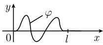

# 《数学指南——实用数学手册》1.12 常微分方程

## 概述

本节是《数学指南——实用数学手册》第 1.12 章「常微分方程」的**章节导论**。它不是定理性的正文，而由三类内容构成：

1. 一句引自 V. I. 阿诺尔德的定位式论断——微分方程是科学世界观的基础；
2. 两条**工具与文献的元信息**——Mathematica 软件包可数值求解并（在可能时）给出闭形式解；闭形式可解的常微分/偏微分方程相对完全的列表见经典著作 [113]；
3. 三个**定义**——光滑函数（C^∞ 类）、具有光滑边界的域、C_0^∞(Ω) 类函数。

本节未提出任何可证伪的数学命题，因此不产生 finding 层页面；其可保存的实体是定义本身，已分别归入概念页。

## 内容要点

### 微分方程的定位（引语）

> 微分方程是科学世界观的基础.
> —— V. I. 阿诺尔德

这属于观点引述，非数学命题，仅作本章题引。相关实体页见 [[entities/阿诺尔德v-i-arnold]]。

### Mathematica 软件包

原文表述：用 Mathematica 软件包解微分方程，该软件包能够数值地解微分方程，并且**当可能时**（wenn möglich）也能给出解的闭形式。

措辞含明确限定，且原文未给出版本号、具体命令或可复现示例。因此本条只应被理解为面向读者的工具提示，不能充当方法论证据。相关实体页见 [[mathematica]]。

### 闭形式解的文献指引

原文表述：已知其解可用闭形式表示的常微分方程和偏微分方程的一个相对完全的列表，可在关于此主题的经典著作中找到 $^{[113]}$。

本节没有复述列表中的任何一条具体方程，也没有给出 [113] 的书目细节——这是本手册多处共有的「指向性引用」模式。已建立追踪页 [[112节文献113未核实]]。

### 光滑性（定义）

一个函数称为**光滑的**，如果它属于 $C^\infty$ 函数类，即它是无穷多次可微的。见 [[光滑函数]]。

### 具有光滑边界的域（定义）

一个域 $\Omega \subset \mathbb{R}^N$ 称为**具有光滑边界的域**，如果其边界 $\partial \Omega$ 是光滑的，即：

- 域 $\Omega$ 局部地位于其边界 $\partial \Omega$ 的一侧；
- 边界 $\partial \Omega$ 局部地可以用一个光滑函数来描述（图 1.118(a)）。

具有光滑边界的域**没有角点**。见 [[具有光滑边界的域]]。

### C_0^∞(Ω) 类函数（定义）

用 $C_0^\infty (\Omega)$ 表示在 $\Omega$ 中光滑、并且其支集包含在 $\Omega$ 的一个紧子集中（即在一紧子集之外为零）的函数的类。见 [[C0∞类函数]]。

**例**：图 1.118(b) 中表示的函数属于类 $C_0^\infty(0, l)$。这个函数是光滑的，在区间 $[0, l]$ 外为零，在 $x = 0$ 和 $x = l$ 的邻域中也为零。

## 图 1.118 原始材料

图 1.118 由图 (a) 与图 (b) 两幅组成：

![图 1.118(b)：定义在区间 [0, l] 上的光滑函数 φ 的示意图](../media/10-数学指南实用数学手册--9-112-常微分方程--6ft4l9/002-5c2852144112df1d928e8bb83d23c81e7aa55e9a50f3297603712772e05e33cc.jpg)

对图 1.118(a)/(b) 的图像描述存在推断成分，已建立追踪页 [[112节图1118内容与图注存疑]]。

## 本节包含的小节（逐字转录原始链接与编号）

- [1.12.1 引导性的例子](<1.12.1 引导性的例子.md>)
- [1.12.2 基本概念](<1.12.2 基本概念.md>)
- [1.12.3 微分方程的分类](<1.12.3 微分方程的分类.md>)
- [1.12.4 初等解法](<1.12.4 初等解法.md>)
- [1.12.5 应用](<1.12.5 应用.md>)
- [1.12.6 线性微分方程组和传播子](<1.12.6 线性微分方程组和传播子.md>)
- [1.12.7 稳定性](<1.12.7 稳定性.md>)
- [1.12.8 边值问题和格林函数](<1.12.8 边值问题和格林函数.md>)
- [1.12.9 一般理论](<1.12.9 一般理论.md>)

## 与既有 wiki 内容的关联

- **几何前提的共性**：本节「具有光滑边界的域」正是 1.9 节（向量分析）系列中反复隐含使用的边界光滑性前提的正式定义。既有页面 [[容许区域]]、[[可缩区域]]、[[斯托克斯积分定理]]、[[向量分析的主要定理]] 都依赖边界/曲面光滑性假设，而在 1.9.7、1.9.8、1.9.9 的 query 中已多次记录「脚注关于边界或曲面光滑性的内容未录」。本节补上了这一长期缺环的定义。
- **C_0^∞ 与后续方法**：1.12.8「边值问题和格林函数」将直接使用 C_0^∞ 类函数与具有光滑边界的域，与既有的 [[势与势函数]]、[[体积位势]]、[[向量位势]] 构成同一手册体系内的应用层延续。
- **符号约定的连续性**：本节沿用 $\mathbb{R}^N$、$\Omega$、$\partial \Omega$ 等记号，与 1.9.x 各节一致，说明手册记号系统连续。

## 证据强度与限制

- 本节全部内容为定义与资料指引，**不构成实证结果**，故不建立 finding 页面。
- Mathematica 的「当可能时给出闭形式解」是能力主张，无版本号与具体命令，不可复现。
- 「闭形式解」在本节中未给精确定义，仅以引用 [113] 替代。
- 本节从 1.9 直接跳到 1.12，中间章节的入库状态不明，存在章节连续性缺口，见 [[110与111节尚未入库]]。

## 开放问题

- [[112节文献113未核实]]
- [[112节图1118内容与图注存疑]]
- [[110与111节尚未入库]]
- [[112节各子节尚未入库]]

<!-- llm-wiki:embedded-images -->
## Embedded Images

### Document

<!-- llm-wiki:embedded-images -->
