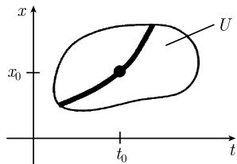

# 《数学指南——实用数学手册》1.12.9 一般理论

## 定位与结构

本节是《数学指南——实用数学手册》第 1.12 章「常微分方程」的收束小节，主题是常微分方程组的**一般理论**。它把此前各子节（[[concepts/常微分方程]]、[[concepts/初值问题]]、1.12.4 的整体唯一性、1.12.6 的线性方程组、1.12.7 的稳定性）中分散使用的存在性、唯一性、可微性与延拓性结论，集中陈述为一组以「最大解」为中心的定理、推论与引理。全节共八个小节：

| 小节 | 主题 |
|---|---|
| 1.12.9.1 | 整体存在性和唯一性定理（最大解） |
| 1.12.9.2 | 对于初值和参数的光滑（可微）依赖 |
| 1.12.9.3 | 幂级数和柯西定理 |
| 1.12.9.4 | 积分方程（格朗沃尔引理） |
| 1.12.9.5 | 微分不等式 |
| 1.12.9.6 | 解在有限时间的破裂 |
| 1.12.9.7 | 整体解的存在性 |
| 1.12.9.8 | 先验估计原理 |

除 1.12.9.3 的幂级数例与 1.12.9.5 的例题外，本节全部结论均以手册式陈述给出，**未附证明，也未列出文献出处**。

## 记号与前提

本节两次声明「仍用 (1.245) 中的相同记号」。式 (1.245) 属于 1.12.4 节，该节尚未入库，因此本节中诸如 $\boldsymbol{x}=(x_1,\cdots,x_n)$、$\boldsymbol{f}=(f_1,\cdots,f_n)$ 的向量化约定只能从上下文推断（参见 [[queries/1129节引用公式1245所在1124节未入库]]）。

## 1.12.9.1 整体存在性和唯一性定理

初值问题为式 (1.316)：

```text
x'(t) = f(t, x(t)),
x(t0) = x0   (初始值)
```

定理（C¹ 情形 → 唯一最大解）假设 $f:U\subset\mathbb{R}^{n+1}\to\mathbb{R}$ 在开集 $U$ 上是 $C^1$ 的，且点 $(x_0,t_0)$ 属于 $U$。那么初值问题 (1.316) 有唯一确定的最大解

```text
x = x(t)
```

即该解从 $U$ 的边界到边界被定义，因而无法在 $U$ 中再进一步地被延拓（图 1.144）。

推论（两个充分条件之一即可）：

- (i) $f$ 和 $f_x$ 在 $U$ 中连续；
- (ii) $f$ 在 $U$ 中连续，并且 $f$ 在 $U$ 中关于 $x$ 是**局部利普希茨连续**的（原书脚注 1)）。

## 1.12.9.2 对于初值和参数的光滑（可微）依赖

最大解记为式 (1.318)：

```text
x = X(t; x0, t0; p)
```

此处允许 (1.316) 的右端 $f$ 还依赖参数 $\boldsymbol{p}=(p_1,\cdots,p_m)$，$f=f(x,t,\boldsymbol{p})$，$\boldsymbol{p}$ 在 $\mathbb{R}^m$ 的一个开集 $P$ 中变动。

定理：如果 $f$ 在 $U\times P$ 中是 $C^k$ 的，$k\ge 1$，那么 (1.318) 中的 $X$ 关于最大解存在域中的所有变元 $(t,x_0,t_0,\boldsymbol{p})$ 也是 $C^k$ 的。

## 1.12.9.3 幂级数和柯西定理

柯西定理：如果 $f$ 是解析的（原书脚注 2)），那么 (1.316) 的最大解 $x=x(t)$ 也是解析的。$x=x(t)$ 的局部幂级数展开由**比较系数法**得到。

例：对初值问题 $x'=x$、$x(0)=1$，可得 $x'(0)=1$；类似地，对所有 $n$ 有 $x^{(n)}(0)=1$。由此得到解

```text
x(t) = x(0) + x'(0) t + x''(0) t²/2! + ...
     = 1 + t + t²/2! + ... = e^t.
```

注：对于复变量 $t,x_1,\cdots,x_n$ 和复值函数 $f_1,\cdots,f_n$，柯西定理仍然成立。

## 1.12.9.4 积分方程

对于未知函数 $x$，考虑积分不等式 (1.319)：

```text
x(t) ≤ α + ∫_0^t f(s) x(s) ds,   在 J 上,
```

其中原文写作「$T:=[0,T]$」（记号疑误，见 [[queries/1129节积分方程1319中符号T疑为J]]）。

格朗沃尔（T. H. Gronwall, 1877—1932）引理（1918）：假设函数 $x:J\to\mathbb{R}$ 连续，并且对于一个实数 $\alpha$ 和一个非负函数 $f:J\to\mathbb{R}$ 满足 (1.319)。那么有

```text
x(t) ≤ α e^{F(t)},   在 J 上,
```

其中 $F(t):=\int_0^t f(s)\,\mathrm{d}s$。原文把 (1.319) 称作「微分方程」（见 [[queries/1129节格朗沃尔引理称微分方程疑为积分不等式]]）。

## 1.12.9.5 微分不等式

考虑方程组 (1.320)：

```text
x'(t) ≤ f(x(t)),   在 J 上,
y'(t) = f(y(t)),   在 J 上,
x(0) ≤ y(0),
```

其中 $J:=[0,T]$，并且 $f$ 是 $C^1$ 型的严格单调增函数（原文此处 $f$ 的定义域写法残缺，见 [[queries/1129节微分不等式函数f定义域残缺]]）。

定理：如果 $x$ 和 $y$ 是满足 (1.320) 的 $C^1$ 函数，且在 $J$ 上 $x(t)\ge 0$，那么有

```text
x(t) ≤ y(t),   在 J 上.
```

推论：如果 $x$ 和 $y$ 满足

```text
x'(t) ≥ f(x(t)),   在 J 上,
y'(t) = f(y(t)),   在 J 上,
0 ≤ y(0) ≤ x(0),
```

并且在 $J$ 上 $x(t)\ge 0$，那么 $0\le y(t)\le x(t)$ 在 $J$ 上成立。

例：令 $x=x(t)$ 是微分方程 $x'(t)=F(x(t))$、$x(0)=0$ 的一个解，其中对所有 $x\in\mathbb{R}$ 有 $F(x)\ge 1+x^2$。那么

```text
x(t) ≥ tan t,   0 ≤ t ≤ π/2,
```

并且因而 $\lim_{t\to\pi/2-0}x(t)=+\infty$。证明：令 $f(y):=1+y^2$；对 $y(t):=\tan t$ 可得 $y'(t)=1+y^2$。现在从推论即得结论。

## 1.12.9.6 解在有限时间的破裂

考虑实的一阶组 (1.321)：

```text
x'(t) = f(x(t), t),
x(0) = x0,
```

其中 $\boldsymbol{x}=(x_1,\cdots,x_n)$、$\boldsymbol{f}=(f_1,\cdots,f_n)$，并令 $\langle x|y\rangle=\sum_{j=1}^{n}x_j y_j$。假设：

- (A1) 函数 $f$ 是 $C^1$ 型的（原文值域写作 $f:\mathbb{R}^{n+1}\to\mathbb{R}$，见 [[queries/1129节破裂定理f值域符号疑为R的n次幂]]）；
- (A2) 对所有 $(\boldsymbol{x},t)\in\mathbb{R}^{n+1}$ 有 $\langle\boldsymbol{f}(\boldsymbol{x},t)|\boldsymbol{x}\rangle\ge 0$；
- (A3) 存在常数 $b>0$ 和 $\beta>2$，使得对所有满足 $|\boldsymbol{x}|\ge|\boldsymbol{x}_0|>0$ 的 $(\boldsymbol{x},t)\in\mathbb{R}^{n+1}$ 有 $\langle\boldsymbol{f}(\boldsymbol{x},t)|\boldsymbol{x}\rangle\ge b|\boldsymbol{x}|^\beta$。

定理：存在一个数 $T>0$，使得 $\lim_{t\to T-0}|\boldsymbol{x}(t)|=\infty$，即解在有限时间破裂。

## 1.12.9.7 整体解的存在性

解的破裂归因于 (A3) 中 $f$ 快于线性增长。如果增长至多是线性的，情形就完全不同：

- (A4) 存在正常数 $c$ 和 $d$，使得 $|\boldsymbol{f}(\boldsymbol{x},t)|\le c|\boldsymbol{x}|+d$，对所有 $(\boldsymbol{x},t)\in\mathbb{R}^{n+1}$。

定理：如果假设 (A1) 和 (A4) 被满足，那么初值问题 (1.321) 有唯一一个对所有时刻 $t$ 都存在的解。

## 1.12.9.8 先验估计原理

- (A5) 如果初值问题 (1.321) 在一个开区间 $]t_0-T,t_0+T[$ 上有解存在，那么有式 (1.322)：

```text
|x(t)| ≤ C,
```

其中常数 $C$ 可能依赖于 $T$。

定理：在假设 (A1) 和 (A5) 之下，初值问题 (1.321) 有唯一一个对所有时刻 $t$ 都存在的解。

注：称像 (1.322) 那样的估计为**先验估计**。上述定理是下述数学中一般原理（原书脚注 1)）的一个特殊情形：

> 先验估计保证了解的存在性。

例：初值问题 $x'=\sin x$、$x(0)=x_0$ 对每个 $x_0\in\mathbb{R}$ 有唯一一个对所有时刻存在的解。证明：如果 $x=x(t)$ 是 $[-T,T]$ 上的一个解，那么

```text
x(t) = x0 + ∫_{-T}^{T} sin x(t) dt.
```

因为对所有 $x$ 有 $|\sin x|\le 1$，就得到下述先验估计：

```text
|x(t)| ≤ |x0| + ∫_{-T}^{T} dt = |x0| + 2T.
```

为了得到这样的先验估计，可以利用微分不等式。

## 配图

图 1.144 展示平面直角坐标系（纵轴 $x$、横轴 $t$）中一个不规则区域 $U$，以及区域内部经过点 $(t_0,x_0)$ 的一条加粗积分曲线，示意最大解从 $U$ 的边界到边界被定义。



## 与既有 wiki 内容的关联

- 本节 1.12.9.6 的「有限时间破裂」与既有概念 [[concepts/有限时间爆炸]] 主题重叠，术语需对齐（见 REVIEW）。
- 本节 1.12.9.1 的最大解存在唯一性，与既有概念 [[concepts/整体唯一性定理]]（1.12.4.2）主题相关，但后者所在子节尚未入库。
- 1.12.9.5 的例题给出 $x(t)\ge\tan t$ 的破裂下界，可与 [[findings/有限时间爆炸解tant]]（1.12.1 节的 $N(t)=\tan t$）对照。

## 未决问题

- [[queries/1129节积分方程1319中符号T疑为J]]
- [[queries/1129节格朗沃尔引理称微分方程疑为积分不等式]]
- [[queries/1129节引用公式1245所在1124节未入库]]
- [[queries/1129节脚注1与2内容未转录]]
- [[queries/1129节破裂定理f值域符号疑为R的n次幂]]
- [[queries/1129节微分不等式函数f定义域残缺]]

<!-- llm-wiki:embedded-images -->
## Embedded Images

### Document


<!-- llm-wiki:embedded-images -->
