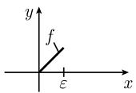
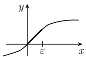

# 《数学指南——实用数学手册》1.14.1 基本思想

本节是《数学指南——实用数学手册》第 1.14 节「复变函数」的第一个子节，标题下另附小标题「分析中的局部-整体原理」。它不引入新的技术工具，而是给出复变函数论整体的组织原则：为什么复解析函数比实可微函数「严格」得多。

## 三条基本事实

作者称复变函数论的优美「是以下面 3 个基本事实为基础的」：

```
(i)  开集上的每个可微复值函数都能局部地展开成幂级数，即，它是解析的。
(ii) 单连通区域中的解析函数的围道积分与积分路径无关。
(iii)在一个点的某个邻域内解析的局部给定的每个函数，可以唯一扩充成整体
     解析的函数，如果把黎曼面的概念用作扩张的定义域。因此有
```

由 (iii) 得到核心结论：

$$
\text{一个解析函数的局部行为唯一决定了它的整体行为.}\tag{1.451}
$$

作者随即给出对照命题：「一般地，实值函数不具备这种严格行为。」

三条事实与 (1.451) 在原文中均以断言形式给出，**无证明**，属教科书式陈述；本文本身不构成新的经验证据。

## 例 1：实可微延拓不唯一，复解析扩张唯一

可以用无数种方式把 $x \in [0, \varepsilon]$ 时的实值函数 $f(x) := x$ 延拓成可微函数（图 1.167）。看作复值函数时这个函数的唯一扩张是解析函数

$$
f(z) = z, \qquad z \in \mathbb{C}.\tag{1.452}
$$

## 例 2：存在不能解析延拓的可微实函数

图 1.167(b)、(c) 中描述的可微函数不能延拓成复数域上的解析函数。原文给出的理由是：「这是因为它们局部地与函数 (1.452) 一样，但是整体上不一样。」

## 物理应用：S 矩阵与色散关系

原理 (1.451) 在物理中十分重要。如果知道一个物理量是解析的，那么只需要知道它在一个小的开集中的表现，就能理解（或至少确定）它的整体行为。原文举出的例子：**S 矩阵**的元素就是这种情形，S 矩阵描述了现代粒子加速器中基本粒子的散射；由此事实就得到了所谓的**色散关系**。

这一物理应用在原文中是单句断言，**无推导、无引用**，属提示性联系而非论证。需注意归属边界：三条事实与 (1.451) 是关于解析函数／复变函数论整体的主张；(1.452) 特指函数 $f(z) = z$；S 矩阵与色散关系是物理学对象，不应与复变函数论的普遍结论混为一谈。

## 图 1.167

图 1.167 标题为「平面上的非解析函数」，含三幅子图：



(a) 定义在小区间 $[0, \varepsilon)$ 上的函数 $f$。


(b) 图像数据未能加载，无法辨识内容。



(c) 一条 S 形单调递增曲线。

## 在本书语境中的位置

- 本节是 1.14「复变函数」的开篇子节，见 [[sources/10-数学指南实用数学手册--8-114-复变函数--r0uuej]]。
- 直接调用 [[concepts/收敛圆]]、[[concepts/围道积分]]、[[concepts/解析延拓]]、[[concepts/黎曼面]]。
- 与 1.13 系（偏微分方程）形成方法学对照：1.13.5 的 [[concepts/柯西-柯瓦列夫斯卡娅定理]] 走「解析数据 ⇒ 解析解」路线，本节给出解析性在复变函数中「局部决定整体」的另一面。

## 待核与存疑

1. 标题句中「局部-整体原理 $^{2)}$」带脚注标记，但脚注文本未转录，可能给出该命名的来源或限定条件。
2. 图 1.167(b) 图像数据未能加载，例 2 两个反例的判别依据依赖该图，证据链在此处断裂。
3. 例 2 把实可微函数说成「局部地与函数 (1.452) 一样」，严格讲并不成立（(1.452) 是复解析函数，实函数只能与 $z \mapsto z$ 的实限制一致），该句更像直观描述而非精确陈述。
4. 事实 (ii) 的条件依赖（单连通 + 解析）在原文已给出，但未点明其等价于闭围道积分为零（Cauchy 积分定理）的完整形式。

<!-- llm-wiki:embedded-images -->
## Embedded Images

### Document


<!-- llm-wiki:embedded-images -->
