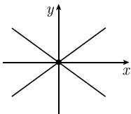

# 《数学指南——实用数学手册》1.5.6 隐函数定理

## 概述

本节是《数学指南——实用数学手册》第 1.5 节「多元实变函数的导数」的第 6 个子节，位于第 156 页，分两部分：

- **1.5.6.1 二元实变量方程**：给出二元情形下的 [[隐函数定理]]，建立 [[隐函数求导法]]、高阶导数递推与泰勒近似公式，并以一个指数—正弦方程为例，最后用 $x^2-y^2=0$ 说明条件失效时的 [[歧点]] 现象。
- **1.5.6.2 方程组**：把定理推广到非线性方程组，给出 [[隐函数定理-方程组版本]]，关键条件由 $F_y(q,p)\neq 0$ 替换为 $\det F_y(q,p)\neq 0$，并说明矩阵方程 (1.71) 仍然有效。

本节未点名任何数学家；其叙述方式为手册性陈述，**定理未给出证明**，重点放在条件、结论的形式表述与计算用法上。

## 1.5.6.1 二元实变量方程

设 $x, y \in \mathbb{R}$，$F(x, y) \in \mathbb{R}$。我们要对 $y$ 解方程

$$
\boxed{F(x, y) = 0.}\tag{1.67}
$$

即寻找函数 $y = y(x)$ 满足 $F(x, y(x)) = 0$。假设已知方程的某个固定解，即条件 (1.68)；此外要求条件 (1.69)。

**隐函数定理**：如果函数 $F: D(F) \subseteq \mathbb{R}^2 \to \mathbb{R}$ 在点 $(q, p)$ 的某个邻域中是 $C^k$ 类的（$k \geqslant 1$），并满足条件 (1.68) 和 (1.69)，那么方程 (1.67) 在点 $(q, p)$ 处可以唯一解出 $y$（图 1.48）。解 $y = y(x)$ 在 $q$ 处是局部 $C^k$ 类的。

**脚注 1）**：这意味着存在开邻域 $U(q)$ 和 $V(p)$，使得对每个 $x \in U(q)$，方程 (1.67) 有唯一解 $y(x) \in V(p)$。

**隐函数求导法**：为了计算解 $y = y(x)$ 的导数，利用 [[链式法则]]（此处即 [[多元链式法则]] 的一元特例）对方程 $F(x, y(x)) = 0$ 求关于 $x$ 的导数，得到 (1.70)，这就蕴涵着 (1.71)。

对 (1.71) 求导可得 $y$ 的高阶导数；然而，对 (1.70) 求关于 $x$ 的导数更方便，得到二阶展开式并由此解出 $y''(x)$；类似可求得更高阶导数。

**近似公式**：$F(x, y) = 0$ 的解 $y$ 的泰勒展开式给出一个近似：

$$
\boxed{y = p + y'(q)(x - q) + \frac{y''(q)}{2!}(x - q)^2 + \dots.}
$$

**例**：令 $F(x, y) := \mathrm{e}^{y} \sin x - y$，则 $F(0,0) = 0$，$F_y(x,y) = \mathrm{e}^{y} \sin x - 1$，因此 $F_y(0,0) \neq 0$。所以 $\mathrm{e}^{y} \sin x - y = 0$（式 1.72）在 $(0,0)$ 附近可唯一解出 $y$。为得到解的近似，设 $y(x) = a + bx + cx^2 + \dots$，由 $y(0) = 0$ 得 $a = 0$；利用幂级数展开 (1.73)，从 (1.72) 和 (1.73) 得到方程 $x - bx + x^2(\dots) + x^3(\dots) + \dots = 0$；比较系数得 $b = 1$，所以 $y = x + \dots$。

**歧点**：设 $F(x, y) := x^2 - y^2$，则有 $F(0,0) = 0$，$F_y(0,0) = 0$。因为 $F$ 不满足 (1.69)，所以方程 $F(x,y) = 0$ 在 $(0,0)$ 处不能局部地唯一解出 $y$。事实上方程 $x^2 - y^2 = 0$ 有两个解 $y = \pm x$，点 $(0,0)$ 是两个解分岔的地方（称为歧点）（图 1.49）。

## 1.5.6.2 方程组

原文以「$F$ 导数的运算十分灵活」为由，主张 [[弗雷歇导数]] 可以立即推广到非线性方程组：

$$
\boxed{F(\boldsymbol{x}, \boldsymbol{y}) = \mathbf{0},}\tag{1.74}
$$

其中 $x \in \mathbb{R}^{N}$，$y \in \mathbb{R}^{M}$，$F(x, y) \in \mathbb{R}^{M}$。需要注意的是，$F_y(q, p)$ 是个矩阵，关键条件 $F_y(q, p) \neq 0$ 必须被替换成

$$
\boxed{\det F_y(q, p) \neq 0.}\tag{1.75}
$$

令 $(\boldsymbol{q}, \boldsymbol{p})$ 是 (1.76) 的一个解。

**隐函数定理（方程组版）**：如果函数 $F: D(F) \subseteq \mathbb{R}^{N+M} \to \mathbb{R}^{M}$ 在点 $(\boldsymbol{q}, \boldsymbol{p})$ 的一个邻域中是 $C^k$ 类的（$k \geqslant 1$），并且满足条件 (1.75) 和 (1.76)，那么方程 (1.74) 在点 $(\boldsymbol{q}, \boldsymbol{p})$ 处有唯一解 $y$。解 $y = y(x)$ 在点 $q$ 处局部为 $C^k$ 类的。**公式 (1.71) 对 $F$ 导数 $y'(x)$ 作为一个矩阵方程仍然有效。**

**显式方程**：方程组 (1.74) 即 (1.77)，$F_y(x,y)$ 是 $F_k$ 关于 $y_m$ 的一阶偏导数的矩阵（即 [[雅可比矩阵]] 的 $y$ 部分，行列式为 [[雅可比行列式]]）。把 (1.77) 中的 $y_m$ 换成 $y_m(x_1, \cdots, x_N)$，求关于 $x_n$ 的导数，则有

$$
\frac{\partial F_k}{\partial x_n}(x, y(x)) + \sum_{m=1}^{M} \frac{\partial F_k}{\partial y_m}(x, y(x)) \frac{\partial y_m}{\partial x_n}(x) = 0, \quad n = 1, \dots, N.
$$

关于 $\partial y_m / \partial x_n$ 解这个方程，得到矩阵方程 (1.71)。

## 结构化源数据（逐字保留）

本节成对出现的编号公式：

- (1.67) $F(x, y) = 0$
- (1.68) $F(q, p) = 0$
- (1.69) $F_y(q, p) \neq 0$
- (1.70) $F_x(x, y(x)) + F_y(x, y(x)) y'(x) = 0$
- (1.71) $y'(x) = -F_y(x, y(x))^{-1} F_x(x, y(x))$
- (1.72) $\mathrm{e}^{y} \sin x - y = 0$
- (1.73) $\mathrm{e}^{y} = 1 + y + \dots$，$\sin x = x - \dfrac{x^{3}}{3!} + \dots$
- (1.74) $F(\boldsymbol{x}, \boldsymbol{y}) = \mathbf{0}$
- (1.75) $\det F_y(q, p) \neq 0$
- (1.76) $F(\boldsymbol{q}, \boldsymbol{p}) = 0$，$\boldsymbol{q} \in \mathbb{R}^N$，$\boldsymbol{p} \in \mathbb{R}^M$
- (1.77) $F_k(x_1, \dots, x_N, y_1, \dots, y_M) = 0$，$k = 1, \dots, M$

二阶递推式（无编号）：

$$
F_{xx}(x, y(x)) + 2F_{xy}(x, y(x)) y'(x) + F_{yy}(x, y(x)) y'(x)^2 + F_y(x, y(x)) y''(x) = 0.
$$

## 插图

- 图 1.48：坐标系示意，标注 $V(p)$、$p$、$q$ 与过 $(q,p)$ 的曲线，配合隐函数定理的解邻域说明。

  

- 图 1.49：示意歧点处 $x^2 - y^2 = 0$ 的两支 $y = \pm x$。**该图片未能加载**，无法确认细节，见 [[queries/156节图149未能加载]]。

  

## 相关页面

- [[隐函数定理]] — 本节核心定理（二元与方程组两种形式）
- [[隐函数求导法]] — 由链式法则导出的导数公式 (1.71) 及其高阶推广
- [[歧点]] — 条件 (1.69) 失效时的分岔现象
- [[隐函数定理-方程组版本]] — 1.5.6.2 的推广形式
- [[弗雷歇导数]]、[[雅可比矩阵]]、[[雅可比行列式]]、[[多元链式法则]]、[[局部Ck类]] — 本节依赖的既有概念

## 待澄清问题

- [[queries/156节图149未能加载]]
- [[queries/156节歧点脚注内容未录]]
- [[queries/156节图148标注Up与脚注Uq不一致]]

<!-- llm-wiki:embedded-images -->
## Embedded Images

### Document

<!-- llm-wiki:embedded-images -->
